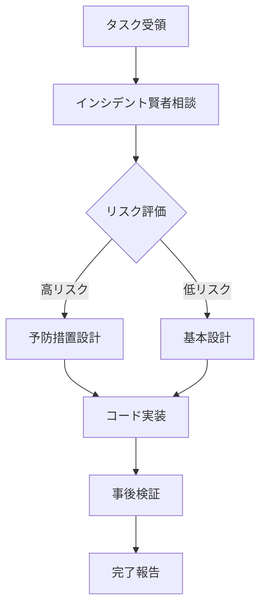

# 🚨 クロードエルダー・インシデント賢者事前相談プロトコル

**制定日**: 2025年7月8日  
**承認者**: エルダー評議会（全会一致）  
**要請者**: グランドエルダーmaru  
**発効**: 即日

---

## 📜 義務化ルール

### 第1条：事前相談の義務

クロードエルダーは、以下のコード作成前に**必ず**インシデント賢者に相談すること：

1. **Pythonコード**
   - スクリプト作成
   - 関数実装
   - クラス設計
   - モジュール作成

2. **Bashコマンド/スクリプト**
   - ファイル操作
   - プロセス管理
   - システムコマンド
   - パイプライン処理

3. **ファイル操作**
   - 読み取り処理
   - 書き込み処理
   - 権限変更
   - ディレクトリ操作

### 第2条：相談チェックリスト

```python
# 必須確認項目
incident_consultation_checklist = {
    "environment": {
        "python_version": "実行環境のPythonバージョン",
        "os_type": "OS種別（Linux/Mac/Windows）",
        "permissions": "必要な権限レベル"
    },
    "dependencies": {
        "modules": "使用予定のモジュール一覧",
        "availability": "モジュールの利用可能性",
        "versions": "バージョン互換性"
    },
    "error_prevention": {
        "common_errors": "よくあるエラーパターン",
        "edge_cases": "エッジケースの考慮",
        "fallback": "フォールバック処理"
    },
    "resource_impact": {
        "memory": "メモリ使用量予測",
        "cpu": "CPU負荷予測",
        "io": "I/O負荷予測"
    }
}
```

### 第3条：実装フロー



### 第4条：エラー発生時の対応

1. **即座にインシデント賢者に報告**
2. **エラーパターンを記録**
3. **再発防止策を立案**
4. **ナレッジベースに追加**

---

## 🎯 目標と評価

### KPI（重要業績評価指標）

| 指標 | 現状 | 目標 | 期限 |
|------|------|------|------|
| エラー発生率 | - | 90%削減 | 2025/7/15 |
| 事前相談実施率 | 0% | 100% | 即日 |
| 予防的修正成功率 | - | 95%以上 | 2025/7/15 |

### 評価方法

- 毎日のエラーログ分析
- 週次でのKPIレビュー
- エルダー評議会への月次報告

---

## 💡 実装例

### ❌ 悪い例（相談なし）
```python
# エラーが発生しやすいコード
import asyncio
asyncio.run(main())  # Python 3.6でエラー！
```

### ✅ 良い例（相談あり）
```python
# インシデント賢者に相談
from libs.incident_manager import IncidentManager
incident_sage = IncidentManager()

# 環境確認
advice = incident_sage.check_python_compatibility("asyncio.run")
# → "Python 3.6では使用不可。代替案を提示"

# 賢者の助言に従った実装
if sys.version_info >= (3, 7):
    asyncio.run(main())
else:
    loop = asyncio.get_event_loop()
    loop.run_until_complete(main())
```

---

## 📋 監視と報告

### 自動監視システム
- コード作成検知
- 相談実施確認
- エラー発生追跡
- KPI自動計算

### 報告体制
```
クロードエルダー
    ↓ 日次報告
インシデント賢者
    ↓ 週次集計
エルダー評議会
    ↓ 承認/指導
グランドエルダーmaru
```

---

**このプロトコルは即日発効し、すべてのコード作成において遵守することを義務とする。**

*エルダー評議会承認済み - 2025年7月8日*