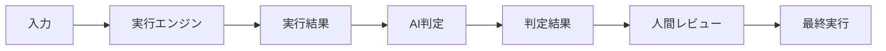

## 🎯 概要
<!-- AIが判定者として機能する新機能の概要を記述 -->

## 🧠 AI役割定義

### 判定範囲
<!-- このAIが判定する具体的な内容 -->
- [ ] 判定対象:
- [ ] 判定基準:
- [ ] 出力形式:

### 実行との分離
<!-- 実行部分をどのように分離するか -->
- [ ] 実行エンジン:
- [ ] データフロー:
- [ ] 責任境界:

## 📋 実装チェックリスト

### Pre-Implementation
- [ ] AIの役割は「判定」に限定されているか？
- [ ] One AI, One Decision 原則に従っているか？
- [ ] 実行部分は別システムに分離されているか？

### Implementation
- [ ] Execute & Judge パターンを適用
- [ ] 判定理由の説明機能を実装
- [ ] エラーハンドリングを実装
- [ ] 判定の一貫性を保証

### Post-Implementation
- [ ] 人間のレビュープロセスを組み込み
- [ ] フィードバックループを実装
- [ ] 判定履歴の記録機能を実装
- [ ] テストカバレッジ 90%以上

## 🏗️ 設計詳細

### クラス構成
```python
# 実行エンジン（確定的）
class ExecutionEngine:
    pass

# AI判定者
class JudgmentAI:
    pass

# 統合コントローラー
class Controller:
    pass
```

### 判定フロー


## 📊 品質基準

### 必須メトリクス
- [ ] 判定精度: >= 90%
- [ ] 判定一貫性: >= 95%
- [ ] 説明可能性: >= 80%
- [ ] レスポンス時間: < 1000ms

### 推奨メトリクス
- [ ] 人間との合意率: >= 85%
- [ ] フィードバック反映率: >= 70%
- [ ] 学習による改善率: 月次5%以上

## 🚨 アンチパターン回避

### 確認事項
- [ ] AIに直接的な実行権限を与えていないか？
- [ ] 判定理由がブラックボックスになっていないか？
- [ ] 人間の介入なしに重要な決定をしていないか？
- [ ] フィードバックなしの自律動作をしていないか？

## 📚 参考資料

- [AI意思決定者パラダイム](../../docs/philosophy/AI_DECISION_MAKER_PARADIGM.md)
- [AI実装ガイドライン](../../docs/guides/AI_IMPLEMENTATION_GUIDELINES.md)
- [Issue #309 実装例](../../docs/issues/issue-309-philosophy-update.md)

## 🔄 フィードバックループ設計

### 学習メカニズム
<!-- どのようにフィードバックから学習するか -->

### データ収集
<!-- どのようなデータを収集するか -->

### 改善サイクル
<!-- どのような頻度で改善するか -->

---

**注意**: このテンプレートはAI意思決定者パラダイムに基づいています。  
AIは判定者であり、実行者ではありません。