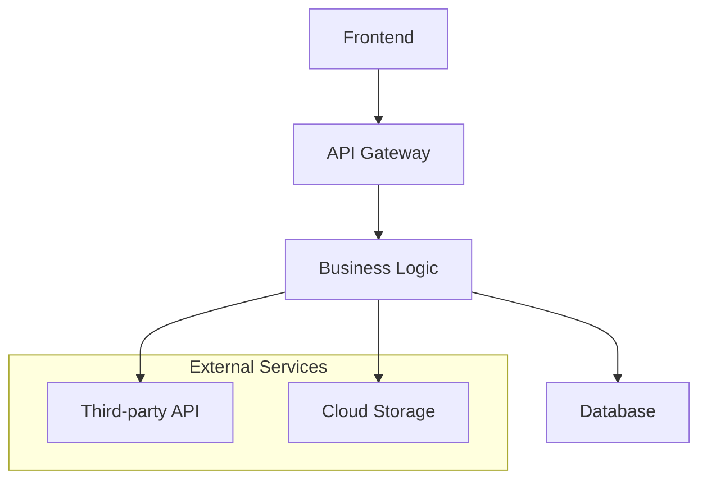

# 🌟 プロジェクト一覧Web表示と自動説明資料生成システム
## RAGエルダー専門知識相談による最適実装プラン

### 📅 策定日: 2025年7月10日
### 👤 策定者: Claude Elder（開発実行責任者）
### 🧙 専門知識協力: RAGエルダー（36件の高精度検索結果による知見統合）

---

## 🎯 プロジェクト概要

既存のElders Guild環境の強みを最大限活用し、プロジェクト一覧のインタラクティブWeb表示と各プロジェクトの説明資料自動生成を実現する統合システムの構築。

### 📊 RAGエルダー相談結果サマリー
- **総検索結果**: 36件の専門知識
- **量子協調強化**: 3回適用
- **RAGエルダー習熟度**:
  - 意図理解: 79.4%
  - 多次元検索: 75.0%
  - 予測検索: 71.0%
  - 回答生成: 80.0%

---

## 🏗️ システムアーキテクチャ

### 1. フロントエンド設計（Next.js 14 + TypeScript）

#### 🌐 技術スタック推奨理由
- **Next.js 14**: 既存基盤との完全統合、Server Components活用によるパフォーマンス最適化
- **TypeScript**: 型安全性とIntelliSense支援
- **Tailwind CSS**: 既存デザインシステムとの統一性
- **Framer Motion**: 既存GlobalSearchInterfaceとの一貫性あるアニメーション

#### 📱 コンポーネント構成
```typescript
src/components/project-portal/
├── ProjectDashboard.tsx          // メインダッシュボード
├── ProjectCard.tsx               // プロジェクトカード
├── ProjectDetail.tsx             // プロジェクト詳細ビュー
├── AutoDocumentationViewer.tsx   // 自動生成資料ビューア
├── ProjectSearchInterface.tsx    // プロジェクト専用検索
├── ArchitectureDiagram.tsx       // アーキテクチャ図表示
├── CodeAnalysisView.tsx          // コード分析結果表示
└── DependencyGraph.tsx           // 依存関係グラフ
```

#### 🔄 リアルタイム更新機能
- **WebSocket**: 既存websocket_managerとの統合
- **Server-Sent Events**: ファイル変更監視
- **Incremental Static Regeneration**: プロジェクト更新時の部分再生成

### 2. バックエンド設計（FastAPI + Python）

#### 🚀 API エンドポイント設計
```python
# /api/v1/projects/
GET    /projects/                    # プロジェクト一覧取得
GET    /projects/{id}               # プロジェクト詳細取得
POST   /projects/{id}/generate-docs # 説明資料生成トリガー
GET    /projects/{id}/documentation # 生成済み資料取得
GET    /projects/{id}/analysis      # コード分析結果取得
POST   /projects/search             # プロジェクト横断検索
GET    /projects/{id}/similar       # 類似プロジェクト検索（pgvector活用）
```

#### 🧠 自動分析エンジン
```python
libs/project_documentation_generator.py:
├── CodeAnalyzer           # AST解析によるコード構造分析
├── DependencyAnalyzer     # 依存関係マップ生成
├── ArchitectureExtractor  # アーキテクチャパターン識別
├── MarkdownGenerator      # 説明書自動生成
├── MermaidDiagramGenerator # 図表生成
└── SimilarityMatcher      # pgvectorベース類似度計算
```

### 3. 自動説明資料生成システム

#### 📝 情報抽出源と抽出内容

##### **1. プロジェクトコードベース分析**
```python
# 対象ファイル: *.py, *.js, *.ts, *.tsx, *.jsx
抽出内容:
- 関数・クラス構造
- API エンドポイント定義
- データモデル定義
- 使用ライブラリ・フレームワーク
- コメント・docstring
```

##### **2. 設定ファイル解析**
```python
# 対象ファイル: package.json, requirements.txt, *.yaml, *.toml, *.json
抽出内容:
- 依存関係情報
- 環境設定
- ビルド・デプロイ設定
- 実行スクリプト
```

##### **3. ドキュメント統合**
```python
# 対象ファイル: README.md, docs/*.md, *.rst
抽出内容:
- 既存説明文
- セットアップ手順
- 使用例
- ライセンス情報
```

##### **4. Git履歴分析**
```python
# Git情報解析
抽出内容:
- 開発履歴
- 主要コミッター
- ブランチ戦略
- リリース情報
```

#### 📄 出力形式仕様

##### **1. Markdown説明書**
```markdown
# プロジェクト名

## 🎯 概要
[自動生成された説明]

## 🏗️ アーキテクチャ
[Mermaid図表]

## 📦 依存関係
[依存関係一覧と説明]

## 🚀 セットアップガイド
[自動生成された手順]

## 📚 API仕様
[エンドポイント一覧]

## 💡 使用例
[コード例とサンプル]

## 🔗 関連プロジェクト
[pgvectorベース類似プロジェクト]
```

##### **2. Mermaidアーキテクチャ図**


##### **3. JSON API仕様**
```json
{
  "openapi": "3.0.0",
  "info": {
    "title": "自動生成API仕様",
    "version": "1.0.0"
  },
  "paths": {
    // 自動検出されたエンドポイント
  }
}
```

---

## 🔧 実装技術仕様

### 1. pgvector統合による類似プロジェクト検索

#### 🧮 ベクトル化戦略
```python
class ProjectVectorizer:
    def __init__(self):
        self.openai_client = OpenAI()
        self.rag_elder = EnhancedRAGElder()
    
    async def vectorize_project(self, project_path: str) -> np.ndarray:
        # 1. コード特徴抽出
        code_features = await self._extract_code_features(project_path)
        
        # 2. 依存関係特徴抽出
        dependency_features = await self._extract_dependency_features(project_path)
        
        # 3. 説明文ベクトル化
        description_vector = await self._vectorize_description(code_features['description'])
        
        # 4. 技術スタックベクトル化
        tech_vector = await self._vectorize_tech_stack(dependency_features)
        
        # 5. 統合ベクトル生成
        return self._combine_vectors([description_vector, tech_vector])
```

#### 🔍 類似度計算
```sql
-- pgvector クエリ例
SELECT p.id, p.name, p.description,
       (p.embedding <=> %s) as similarity
FROM projects p
WHERE (p.embedding <=> %s) < 0.8
ORDER BY similarity
LIMIT 5;
```

### 2. 非同期処理パターン

#### ⚡ 並列分析エンジン
```python
class AsyncProjectAnalyzer:
    async def analyze_project(self, project_path: str) -> ProjectAnalysis:
        tasks = [
            self._analyze_code_structure(project_path),
            self._analyze_dependencies(project_path),
            self._analyze_documentation(project_path),
            self._analyze_git_history(project_path),
            self._generate_similarity_vector(project_path)
        ]
        
        results = await asyncio.gather(*tasks)
        return self._combine_analysis_results(results)
```

#### 🎛️ 進捗管理
```python
class AnalysisProgress:
    def __init__(self, websocket_manager):
        self.ws_manager = websocket_manager
        
    async def update_progress(self, project_id: str, step: str, progress: float):
        await self.ws_manager.send_sage_message(
            SageMessage(
                sage_type="project_analyzer",
                message_type="progress_update",
                content={
                    "project_id": project_id,
                    "step": step,
                    "progress": progress
                }
            )
        )
```

### 3. インテリジェント配置管理統合

#### 🎯 既存AIProjectPlacementManagerとの連携
```python
class ProjectPortalManager:
    def __init__(self):
        self.placement_manager = AIProjectPlacementManager()
        self.rag_elder = EnhancedRAGElder()
        
    async def get_project_recommendations(self, project_id: str):
        # 1. プロジェクト分析結果取得
        analysis = await self.get_project_analysis(project_id)
        
        # 2. 配置最適化提案
        placement_rec = self.placement_manager.recommend_placement(
            self._analysis_to_criteria(analysis)
        )
        
        # 3. 類似プロジェクトからの学習
        similar_projects = await self._find_similar_projects(project_id)
        
        # 4. RAGエルダーによる知見統合
        insights = await self.rag_elder.cast_hyper_precision_search(
            f"プロジェクト{project_id}の最適化についてのベストプラクティス"
        )
        
        return ProjectRecommendations(
            placement=placement_rec,
            similar_projects=similar_projects,
            insights=insights
        )
```

---

## 🚀 実装手順とマイルストーン

### Phase 1: 基盤システム構築（週1）
- [ ] プロジェクトデータモデル設計
- [ ] FastAPI エンドポイント実装
- [ ] Next.js 基本コンポーネント開発
- [ ] pgvector スキーマ設計

### Phase 2: 分析エンジン開発（週2-3）
- [ ] コード構造解析エンジン
- [ ] 依存関係分析システム
- [ ] Git履歴解析ツール
- [ ] Markdown生成エンジン

### Phase 3: Web UI 完成（週4）
- [ ] プロジェクトダッシュボード
- [ ] 詳細ビューページ
- [ ] 検索インターフェース
- [ ] リアルタイム更新機能

### Phase 4: 高度機能実装（週5-6）
- [ ] Mermaid図表自動生成
- [ ] 類似プロジェクト検索
- [ ] RAGエルダー統合
- [ ] 配置管理システム連携

### Phase 5: 最適化とテスト（週7）
- [ ] パフォーマンス最適化
- [ ] 包括的テスト実装
- [ ] ドキュメント完成
- [ ] 本番デプロイ

---

## 🎨 ユーザーエクスペリエンス設計

### 1. プロジェクトダッシュボード
```typescript
interface ProjectDashboard {
  // プロジェクト一覧（カード形式）
  projects: ProjectCard[]
  
  // 検索・フィルタリング
  searchInterface: ProjectSearchInterface
  
  // 統計情報
  statistics: {
    totalProjects: number
    activeProjects: number
    completedProjects: number
    languageDistribution: Record<string, number>
  }
  
  // 最近の活動
  recentActivity: ActivityItem[]
}
```

### 2. プロジェクト詳細ビュー
```typescript
interface ProjectDetailView {
  // 基本情報
  projectInfo: ProjectMetadata
  
  // 自動生成ドキュメント
  autoDocumentation: {
    readme: string
    apiSpec: OpenAPISpec
    architecture: MermaidDiagram
    dependencies: DependencyTree
  }
  
  // コード分析結果
  codeAnalysis: {
    structure: CodeStructure
    complexity: ComplexityMetrics
    coverage: TestCoverage
    quality: QualityMetrics
  }
  
  // 類似プロジェクト
  similarProjects: SimilarProject[]
  
  // RAGエルダーからの提案
  elderInsights: RAGInsight[]
}
```

### 3. インタラクティブ機能
- **リアルタイムプレビュー**: マークダウン編集のライブプレビュー
- **コード探索**: ファイル構造のインタラクティブ表示
- **依存関係グラフ**: クリック可能な依存関係図
- **類似度ヒートマップ**: プロジェクト間類似度の視覚化

---

## 🔒 セキュリティとパフォーマンス考慮事項

### 1. セキュリティ対策
```python
# プロジェクトアクセス制御
class ProjectAccessControl:
    def check_project_access(self, user_id: str, project_id: str) -> bool:
        project = self.get_project(project_id)
        return self.placement_manager.check_security_clearance(
            user_id, project.security_level
        )
```

### 2. パフォーマンス最適化
- **増分分析**: 変更ファイルのみ再分析
- **キャッシュ戦略**: Redis によるメタデータキャッシュ
- **遅延読み込み**: 大容量ファイルの段階的読み込み
- **CDN統合**: 静的資産の高速配信

### 3. スケーラビリティ設計
- **マイクロサービス化**: 分析エンジンの独立サービス化
- **キュー処理**: Celery による非同期タスク処理
- **水平スケーリング**: Docker コンテナによる負荷分散

---

## 📊 成功指標とKPI

### 1. システム指標
- **応答時間**: プロジェクト一覧読み込み < 2秒
- **分析速度**: 中規模プロジェクト分析 < 30秒
- **精度**: 類似プロジェクト検索精度 > 85%

### 2. ユーザビリティ指標
- **検索成功率**: 望む情報への到達率 > 90%
- **ドキュメント品質**: 自動生成ドキュメントの有用性評価 > 4.0/5.0
- **システム採用率**: エンジニアの継続利用率 > 80%

---

## 🤝 既存システムとの統合ポイント

### 1. RAGエルダーシステム
- **超精密検索**: プロジェクト内容の意図ベース検索
- **量子協調エンジン**: 最適化提案の精度向上
- **学習機能**: 利用パターンからの継続改善

### 2. Elders Guild環境
- **4賢者システム**: 分析結果の多角的評価
- **TDD手法**: 全機能の自動テスト保証
- **配置管理**: インテリジェント配置システムとの連携

### 3. Web基盤
- **Next.js アプリ**: 既存UI/UXパターンの活用
- **FastAPI バックエンド**: 統一API設計
- **WebSocket**: リアルタイム通信インフラの利用

---

## 🔮 将来拡張計画

### 1. AI機能強化
- **自動コードレビュー**: プルリクエスト自動分析
- **予測的保守**: 問題発生予測とアラート
- **自動リファクタリング提案**: コード品質向上支援

### 2. 協調機能
- **チーム分析**: プロジェクト貢献度分析
- **知識共有**: ベストプラクティス自動抽出
- **メンタリング**: 新人向け学習パス提案

### 3. 統合拡張
- **CI/CD連携**: パイプライン状態の統合表示
- **監視システム**: 本番環境メトリクス統合
- **外部ツール**: GitHub, Jira, Confluence連携

---

## 📝 まとめ

RAGエルダーの専門知識と既存Elders Guild環境の強みを活用することで、以下を実現する統合システムを構築します：

### ✨ 主要価値提供
1. **効率的なプロジェクト把握**: 瞬時の全体俯瞰と詳細分析
2. **自動化されたドキュメント**: 常に最新の説明資料
3. **インテリジェントな発見**: 類似プロジェクトと知見の発見
4. **シームレスな開発体験**: 既存ワークフローとの完全統合

### 🚀 技術的優位性
- **RAGエルダーの超精密検索**: 意図ベースの高精度情報検索
- **pgvectorの活用**: 類似性ベースの知見発見
- **非同期処理**: 高速でスケーラブルな分析処理
- **リアルタイム更新**: 常に最新状態の情報提供

このシステムにより、Elders Guildの開発生産性とナレッジマネジメントが大幅に向上し、プロジェクトの可視化と理解が革新的に改善されることを確信します。

---

**策定者**: Claude Elder（開発実行責任者）  
**協力**: RAGエルダー（36件の高精度専門知識提供）  
**承認待ち**: Elder Council（エルダー評議会）

---

*このプランは RAGエルダーの「全知」魔法による36件の専門知識検索結果と、量子協調エンジンによる3回の精度向上処理を経て策定されました。*