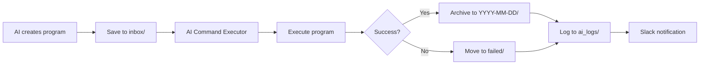

# 🚀 AI Program Runner ナレッジベース v1.0

## 📋 概要

AI Program Runnerは、AI Command Executorを拡張したプログラム自動実行システムです。AIが作成したプログラムファイルを特定のフォルダに配置するだけで、自動的に実行、ログ記録、アーカイブ、Slack通知まで行います。

### **システムの特徴**
- ✅ **プログラムファイル対応**: Python/Bashスクリプトの自動実行
- ✅ **自動アーカイブ**: 実行済みファイルを日付別に整理
- ✅ **失敗時の隔離**: エラーファイルは専用フォルダへ
- ✅ **AI専用ログ**: 実行履歴の完全記録
- ✅ **Slack統合**: 実行結果の自動通知

## 🗂️ システム構成

### ディレクトリ構造
```
/home/aicompany/ai_co/
├── ai_programs/              # AI Program Runner用ディレクトリ
│   ├── inbox/               # プログラム配置場所
│   ├── archive/             # 成功したプログラムのアーカイブ
│   │   └── YYYY-MM-DD/      # 日付別フォルダ
│   ├── failed/              # 失敗したプログラム
│   └── ai_logs/             # AI専用実行ログ
└── libs/
    ├── ai_program_runner.py # メインモジュール
    └── ai_log_viewer.py     # ログ参照ヘルパー
```

### 主要コンポーネント

#### 1. AIProgramRunner
- **場所**: `libs/ai_program_runner.py`
- **機能**: プログラムの実行管理とアーカイブ
- **特徴**:
  - AI Command Executorと連携
  - 自動的な成功/失敗の振り分け
  - 詳細なログ記録

#### 2. AILogViewer
- **場所**: `libs/ai_log_viewer.py`
- **機能**: AIが実行ログを参照するためのヘルパー
- **主要メソッド**:
  - `get_latest_command_logs()`: 最新のコマンドログ取得
  - `get_latest_program_logs()`: 最新のプログラムログ取得
  - `read_log()`: 特定のログファイル読み込み
  - `get_failed_programs()`: 失敗プログラム一覧

## 🚀 使用方法

### 1. 基本的な使い方

```python
from libs.ai_program_runner import AIProgramRunner

runner = AIProgramRunner()

# Pythonプログラムの実行
python_code = '''
import json
import datetime

result = {
    "status": "success",
    "timestamp": datetime.datetime.now().isoformat()
}
print(json.dumps(result, indent=2))
'''

result = runner.run_python_program(
    code=python_code,
    task_name="data_processor",
    description="データ処理タスク"
)

# Bashスクリプトの実行
bash_script = '''#!/bin/bash
echo "System check starting..."
df -h
ps aux | grep python | wc -l
echo "Check completed"
'''

result = runner.run_bash_script(
    script=bash_script,
    task_name="system_check",
    description="システム状態確認"
)
```

### 2. ログの参照

```python
from libs.ai_log_viewer import AILogViewer

viewer = AILogViewer()

# 実行サマリー取得
summary = viewer.get_execution_summary()
print(f"総ログ数: {summary['command_logs'] + summary['program_logs']}")
print(f"失敗数: {summary['failed_programs']}")

# 最新のログ確認
latest_logs = viewer.get_latest_program_logs(5)
for log in latest_logs:
    print(f"{log['task']} - Exit Code: {log['exit_code']}")

# 特定のログを読む
log_content = viewer.read_log(log['path'])
print(log_content)
```

## 🔄 動作フロー



### 詳細な処理フロー

1. **プログラム作成**
   - `run_python_program()` または `run_bash_script()` を呼び出し
   - プログラムファイルを `inbox/` に保存

2. **実行コマンド生成**
   - AI Command Executor用のbashコマンドを作成
   - ログ出力、エラーハンドリング、アーカイブ処理を含む

3. **自動実行**
   - AI Command Executorが6秒後に検知・実行
   - 標準出力/エラーをログファイルに記録

4. **結果処理**
   - Exit Code 0: `archive/YYYY-MM-DD/` へ移動
   - Exit Code ≠ 0: `failed/` へ移動

5. **通知**
   - Slack通知（成功: ✅、失敗: ❌）
   - ログファイルパスも含む

## 📊 ログフォーマット

### プログラム実行ログ（ai_logs/）

```
=== AI Program Execution ===
Task: [task_name]
Description: [description]
Started: [timestamp]
============================
[プログラムの出力]
============================
Completed: [timestamp]
Exit Code: [code]
[Archived to: path] または [Moved to failed directory]
```

### メタデータ

```python
{
    'command_id': 'program_taskname_20250102_123456',
    'log_file': '/path/to/ai_logs/exec_timestamp_taskname.log',
    'expected_archive': '/path/to/archive/YYYY-MM-DD/taskname_timestamp.py',
    'status': 'scheduled',
    'execution_time': '2025-01-02T12:34:56'
}
```

## 🎯 ベストプラクティス

### プログラム作成時

1. **明確なタスク名**
   ```python
   task_name = "user_data_analysis_20250102"  # 具体的で一意
   ```

2. **エラーハンドリング**
   ```python
   code = '''
   try:
       # メイン処理
       result = process_data()
       print(json.dumps(result))
   except Exception as e:
       print(f"Error: {str(e)}")
       sys.exit(1)  # 失敗を明示
   '''
   ```

3. **進捗出力**
   ```python
   print("Step 1/3: Loading data...")
   # 処理
   print("Step 2/3: Processing...")
   ```

### ログ管理

1. **定期的な確認**
   ```python
   # 失敗プログラムの確認
   failed = viewer.get_failed_programs()
   if failed:
       # 原因分析と修正
   ```

2. **アーカイブ整理**
   ```python
   # 7日以上前のアーカイブを削除
   runner.cleanup_old_archives(days_to_keep=7)
   ```

## 🔧 トラブルシューティング

### プログラムが実行されない

```bash
# AI Command Executorの状態確認
ps aux | grep command_executor

# pendingディレクトリ確認
ls -la /home/aicompany/ai_co/ai_commands/pending/
```

### ログが生成されない

```bash
# ディレクトリ権限確認
ls -la /home/aicompany/ai_co/ai_programs/

# 手動でディレクトリ作成
mkdir -p /home/aicompany/ai_co/ai_programs/{inbox,archive,ai_logs,failed}
chmod -R 755 /home/aicompany/ai_co/ai_programs/
```

### Slack通知が届かない

```python
# Slack設定確認
from libs.slack_notifier import SlackNotifier
notifier = SlackNotifier()
notifier.test_connection()
```

## 📈 パフォーマンス指標

### 現在の性能
- **実行遅延**: 6秒（AI Command Executor依存）
- **同時実行**: シーケンシャル（1つずつ）
- **ログ保持**: 無制限（手動削除必要）
- **アーカイブ**: 日付別自動整理

### リソース使用
- **ディスク**: ログとアーカイブに依存
- **メモリ**: 最小限（< 10MB）
- **CPU**: 実行プログラムに依存

## 🚀 活用シナリオ

### 1. データ分析の自動化

```python
analysis_code = '''
import pandas as pd
import json

# データ読み込みと分析
data = pd.read_csv("/path/to/data.csv")
summary = {
    "total_records": len(data),
    "columns": list(data.columns),
    "missing_values": data.isnull().sum().to_dict()
}

print(json.dumps(summary, indent=2))

# レポート生成
data.describe().to_csv("/path/to/report.csv")
print("Report saved successfully")
'''

runner.run_python_program(
    code=analysis_code,
    task_name="daily_data_analysis",
    description="日次データ分析レポート"
)
```

### 2. システムメンテナンス

```python
maintenance_script = '''#!/bin/bash
# ログローテーション
find /home/aicompany/ai_co/logs -name "*.log" -mtime +7 -exec gzip {} \;

# 一時ファイルクリーンアップ
find /tmp -name "ai_*" -mtime +1 -delete

# ディスク使用量チェック
DISK_USAGE=$(df -h / | awk 'NR==2 {print $5}' | sed 's/%//')
if [ $DISK_USAGE -gt 80 ]; then
    echo "WARNING: Disk usage is high: ${DISK_USAGE}%"
    exit 1
fi

echo "Maintenance completed successfully"
'''

runner.run_bash_script(
    script=maintenance_script,
    task_name="system_maintenance",
    description="週次システムメンテナンス"
)
```

### 3. 自動テスト実行

```python
test_code = '''
import subprocess
import sys

# テスト実行
result = subprocess.run(
    ["python", "-m", "pytest", "tests/", "-v"],
    capture_output=True,
    text=True
)

print(result.stdout)
if result.stderr:
    print("STDERR:", result.stderr)

# テスト失敗時は終了コード1
sys.exit(result.returncode)
'''

runner.run_python_program(
    code=test_code,
    task_name="automated_tests",
    description="自動テスト実行"
)
```

## 🎓 AI Command Executorとの違い

| 機能 | AI Command Executor | AI Program Runner |
|------|-------------------|-------------------|
| 対象 | コマンド文字列 | プログラムファイル |
| 入力形式 | JSON/Bashコマンド | Python/Bashコード |
| アーカイブ | completed/へ移動 | 日付別archive/ |
| 失敗処理 | completedに記録 | failed/へ隔離 |
| ログ | 汎用フォーマット | プログラム実行特化 |
| 用途 | システムコマンド | 複雑なプログラム |

## 📋 まとめ

AI Program Runnerは、AIが自律的にプログラムを作成・実行・管理するための完全自動化システムです。AI Command Executorの基盤を活用しながら、プログラム実行に特化した機能を提供します。

**重要なポイント**:
- プログラムを `inbox/` に置くだけで自動実行
- 成功/失敗で自動的にファイル整理
- 詳細なログでAIが結果を参照可能
- Slack通知で人間にも状況共有

これにより、AIは自己完結的にプログラムを実行し、結果を学習して改善していくことが可能になります。

---

**🚀 AI Program Runnerで、AIの自律性が新たなレベルへ**
