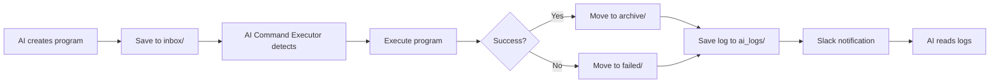

# 🤖 AI Program Runner & Log Viewer ナレッジベース v1.0

## 📋 概要

AI Program RunnerとAI Log Viewerは、AIが自律的にプログラムを実行し、その結果を確認できるシステムです。AI Command Executorを拡張し、より高度な自動実行環境を提供します。

### **システムの特徴**
- ✅ **プログラム自動実行**: Pythonスクリプト、Bashスクリプトを自動実行
- ✅ **自動アーカイブ**: 成功/失敗に応じてファイルを自動整理
- ✅ **ログ参照**: AIが実行結果を直接確認可能
- ✅ **Slack通知**: 実行結果を自動通知

## 🗂️ システム構成

### ディレクトリ構造
```
/home/aicompany/ai_co/
├── ai_programs/              # プログラム管理ディレクトリ
│   ├── inbox/               # 実行待ちプログラム（AIが配置）
│   ├── archive/             # 実行成功したプログラムのアーカイブ
│   │   └── YYYY-MM-DD/      # 日付別に整理
│   ├── failed/              # 実行失敗したプログラム
│   └── ai_logs/             # AI専用実行ログ
├── libs/
│   ├── ai_program_runner.py # プログラム実行ヘルパー
│   └── ai_log_viewer.py     # ログ参照ヘルパー
└── ai_commands/
    └── logs/                # AI Command Executorのログ
```

### 主要コンポーネント

#### 1. AIProgramRunner
- **場所**: `libs/ai_program_runner.py`
- **機能**: プログラムの自動実行とアーカイブ
- **特徴**: 
  - AI Command Executorと統合
  - 成功/失敗の自動振り分け
  - Slack通知

#### 2. AILogViewer
- **場所**: `libs/ai_log_viewer.py`
- **機能**: 実行ログの参照と分析
- **特徴**:
  - 最新ログの取得
  - Exit Codeの確認
  - 失敗プログラムの一覧

## 🚀 使用方法

### 1. プログラムの実行

```python
from libs.ai_program_runner import AIProgramRunner

runner = AIProgramRunner()

# Pythonプログラムの実行
python_code = '''
import json
import datetime

result = {
    "task": "data_analysis",
    "timestamp": datetime.datetime.now().isoformat(),
    "status": "completed"
}

print(json.dumps(result, indent=2))
'''

result = runner.run_python_program(
    code=python_code,
    task_name="data_analysis",
    description="データ分析タスク"
)

# Bashスクリプトの実行
bash_script = '''#!/bin/bash
echo "System Check Starting..."
ps aux | grep worker | wc -l
df -h
echo "Check Complete"
'''

result = runner.run_bash_script(
    script=bash_script,
    task_name="system_check",
    description="システム状態確認"
)
```

### 2. ログの確認

```python
from libs.ai_log_viewer import AILogViewer

viewer = AILogViewer()

# 実行サマリー
summary = viewer.get_execution_summary()
print(f"総ログ数: {summary['command_logs'] + summary['program_logs']}")
print(f"失敗数: {summary['failed_programs']}")

# 最新ログの確認
latest_logs = viewer.get_latest_program_logs(5)
for log in latest_logs:
    print(f"{log['task']} - Exit: {log['exit_code']}")

# 特定のログを読む
log_content = viewer.read_log(log['path'])
print(log_content)

# 失敗プログラムの確認
failed = viewer.get_failed_programs()
for prog in failed:
    print(f"Failed: {prog['name']}")
```

## 🔄 動作フロー



### 詳細な処理フロー

1. **プログラム作成**
   - AIが `AIProgramRunner` でプログラムを作成
   - `inbox/` ディレクトリに保存

2. **自動実行**
   - AI Command Executorが6秒後に検知・実行
   - 標準出力/エラーをキャプチャ

3. **結果処理**
   - Exit Code 0: `archive/YYYY-MM-DD/` へ移動
   - Exit Code ≠ 0: `failed/` へ移動

4. **ログ記録**
   - 実行詳細を `ai_logs/` に保存
   - タイムスタンプ付きファイル名

5. **通知**
   - Slackに成功/失敗を通知
   - 絵文字で視覚的に区別

6. **ログ参照**
   - AIが `AILogViewer` でログを確認
   - 次のアクションを決定

## 📊 ログフォーマット

### AI Program Runner ログ（ai_logs/）

```
=== AI Program Execution ===
Task: [タスク名]
Description: [説明]
Started: [開始時刻]
============================
[プログラムの出力]
============================
Completed: [完了時刻]
Exit Code: [終了コード]
[Archived to: パス] または [Moved to failed directory]
```

### AI Command Executor ログ（ai_commands/logs/）

```
=== Command Execution Log ===
Command: [コマンド名]
Started: [開始時刻]
Working Directory: /home/aicompany/ai_co
==================================================

Exit Code: [終了コード]
Duration: [実行時間] seconds

=== STDOUT ===
[標準出力]

=== STDERR ===
[標準エラー出力]

==================================================
Completed: [完了時刻]
```

## 🛡️ エラーハンドリング

### 一般的なエラーと対処

1. **SyntaxError（Python）**
   - 自動的に `failed/` へ移動
   - エラー詳細がログに記録
   - AIがログを読んで修正版を作成可能

2. **実行権限エラー（Bash）**
   - 自動的に実行権限を付与（chmod +x）
   - 再実行は不要

3. **依存関係エラー**
   - importエラーはログに記録
   - AIが必要なライブラリを特定

4. **タイムアウト**
   - 現在は無制限（今後の改善点）

## 🎯 ベストプラクティス

### プログラム作成時

1. **明確なタスク名**
   ```python
   # Good
   task_name = "user_data_analysis_20250102"
   
   # Bad
   task_name = "test"
   ```

2. **エラーハンドリング**
   ```python
   try:
       # メイン処理
       result = process_data()
       print(json.dumps(result))
   except Exception as e:
       print(f"Error: {str(e)}")
       sys.exit(1)  # 失敗を明示
   ```

3. **進捗出力**
   ```python
   print("Step 1/3: Loading data...")
   # 処理
   print("Step 2/3: Processing...")
   # 処理
   print("Step 3/3: Saving results...")
   ```

### ログ確認時

1. **定期的な確認**
   ```python
   # 1時間ごとに実行サマリーを確認
   summary = viewer.get_execution_summary()
   if summary['failed_programs'] > 0:
       # 失敗プログラムの分析
   ```

2. **パターン認識**
   ```python
   # 同じエラーが繰り返される場合
   common_errors = analyze_error_patterns(failed_logs)
   ```

## 🔧 トラブルシューティング

### プログラムが実行されない

```bash
# AI Command Executorの状態確認
ps aux | grep command_executor

# ログ確認
ls -la /home/aicompany/ai_co/ai_programs/inbox/

# 手動実行テスト
cd /home/aicompany/ai_co
source venv/bin/activate
python3 libs/ai_program_runner.py
```

### ログが生成されない

```bash
# ディレクトリ権限確認
ls -la /home/aicompany/ai_co/ai_programs/ai_logs/

# ディレクトリ作成
mkdir -p /home/aicompany/ai_co/ai_programs/ai_logs
chmod 755 /home/aicompany/ai_co/ai_programs/ai_logs
```

### Slack通知が届かない

```python
# 通知設定確認
from libs.slack_notifier import SlackNotifier
notifier = SlackNotifier()
notifier.send_message("Test message")
```

## 📈 パフォーマンス指標

### 現在の性能
- **実行遅延**: 平均6-8秒（AI Command Executor依存）
- **並列実行**: なし（シーケンシャル）
- **ログ保持**: 無制限（要改善）
- **成功率**: タスク依存

### リソース使用
- **CPU**: プログラム依存
- **メモリ**: プログラム依存 + 約20MB（システム）
- **ディスクI/O**: ログ書き込み時のみ

## 🚀 今後の拡張案

### Phase 1: 基本改善
- [ ] 実行タイムアウト設定
- [ ] ログローテーション
- [ ] 並列実行サポート
- [ ] 実行前検証

### Phase 2: 高度な機能
- [ ] 依存関係管理
- [ ] 条件付き実行
- [ ] 実行スケジューリング
- [ ] リソース制限

### Phase 3: 統合機能
- [ ] Jupyter Notebook実行
- [ ] Docker コンテナ実行
- [ ] リモート実行
- [ ] 実行結果の可視化

## 🎓 活用例

### データ分析パイプライン

```python
# 毎日のデータ分析
analysis_code = '''
import pandas as pd
import json
from datetime import datetime

# データ読み込み
data = pd.read_csv('/home/aicompany/ai_co/data/daily_metrics.csv')

# 分析
summary = {
    'date': datetime.now().strftime('%Y-%m-%d'),
    'total_records': len(data),
    'average_value': data['value'].mean(),
    'max_value': data['value'].max()
}

# 結果保存
with open('/home/aicompany/ai_co/data/analysis_result.json', 'w') as f:
    json.dump(summary, f, indent=2)

print(json.dumps(summary, indent=2))
'''

runner.run_python_program(
    code=analysis_code,
    task_name=f"daily_analysis_{datetime.now().strftime('%Y%m%d')}",
    description="日次データ分析"
)
```

### システムモニタリング

```python
# システム監視スクリプト
monitor_script = '''#!/bin/bash
THRESHOLD=80

CPU_USAGE=$(top -bn1 | grep "Cpu(s)" | awk '{print $2}' | cut -d'%' -f1)
MEM_USAGE=$(free | grep Mem | awk '{print ($3/$2) * 100.0}')

echo "CPU Usage: $CPU_USAGE%"
echo "Memory Usage: $MEM_USAGE%"

if (( $(echo "$CPU_USAGE > $THRESHOLD" | bc -l) )); then
    echo "WARNING: High CPU usage detected!"
    exit 1
fi

if (( $(echo "$MEM_USAGE > $THRESHOLD" | bc -l) )); then
    echo "WARNING: High memory usage detected!"
    exit 1
fi

echo "System status: OK"
'''

runner.run_bash_script(
    script=monitor_script,
    task_name="system_monitor",
    description="システムリソース監視"
)
```

---

**🤖 AI Program RunnerとAI Log Viewerにより、AIの自律性が大幅に向上しました**