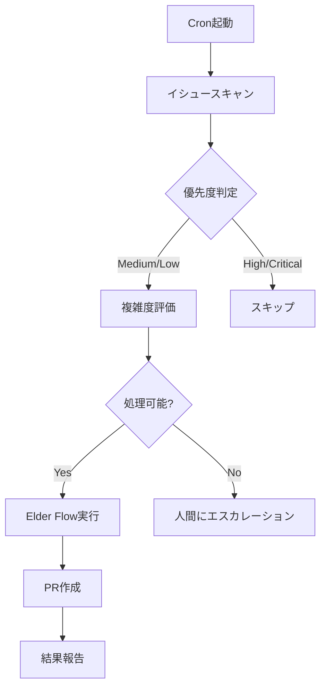

# 🔧 イシュー自動処理システム実装設計書
**エルダーズギルド技術仕様書**

## 📐 アーキテクチャ設計

### 1. **クラス構成**

```python
# libs/integrations/github/auto_issue_processor.py

class AutoIssueProcessor(EldersServiceLegacy):
    """
    GitHubイシュー自動処理システム
    優先度Medium/Lowのイシューを自動的にElder Flowで処理
    """
    
    def __init__(self):
        super().__init__()
        self.issue_manager = EldersIssueManager()
        self.elder_flow = ElderFlowEngine()
        self.task_sage = TaskSage()
        self.incident_sage = IncidentSage()
        
    async def process_request(self, request: Dict[str, Any]):
        """イシュー自動処理のメインエントリーポイント"""
        
    async def scan_processable_issues(self) -> List[Issue]:
        """処理可能なイシューをスキャン"""
        
    async def evaluate_issue_complexity(self, issue: Issue) -> Dict:
        """イシューの複雑度を評価"""
        
    async def execute_auto_processing(self, issue: Issue) -> Dict:
        """Elder Flowを使用してイシューを自動処理"""
```

### 2. **処理フロー詳細**



### 3. **複雑度評価基準**

```python
class ComplexityEvaluator:
    """イシューの複雑度を評価"""
    
    COMPLEXITY_FACTORS = {
        'file_count': {          # 影響ファイル数
            'low': (1, 3),
            'medium': (4, 10),
            'high': (11, None)
        },
        'code_lines': {          # 推定コード行数
            'low': (1, 50),
            'medium': (51, 200),
            'high': (201, None)
        },
        'dependencies': {        # 依存関係数
            'low': (0, 2),
            'medium': (3, 5),
            'high': (6, None)
        },
        'test_coverage': {       # 必要テスト数
            'low': (1, 5),
            'medium': (6, 15),
            'high': (16, None)
        }
    }
    
    async def evaluate(self, issue: Issue) -> ComplexityScore:
        """複雑度スコアを計算"""
```

## 🛡️ セーフティ機能実装

### 1. **処理制限メカニズム**

```python
class ProcessingLimiter:
    """処理制限を管理"""
    
    MAX_ISSUES_PER_HOUR = 3
    MAX_CONCURRENT = 1
    COOLDOWN_PERIOD = 300  # 5分
    
    async def can_process(self) -> bool:
        """処理可能かチェック"""
        
    async def record_processing(self, issue_id: int):
        """処理記録を保存"""
```

### 2. **品質ゲート実装**

```python
class QualityGate:
    """Iron Will基準での品質保証"""
    
    IRON_WILL_THRESHOLD = 95.0
    
    async def validate_implementation(self, pr_data: Dict) -> bool:
        """実装の品質を検証"""
        checks = [
            self.check_test_coverage(),
            self.check_code_quality(),
            self.check_security_scan(),
            self.check_performance_impact()
        ]
        return all(checks)
```

### 3. **ロールバック機能**

```python
class RollbackManager:
    """問題発生時の自動ロールバック"""
    
    async def create_checkpoint(self, issue_id: int):
        """処理前のチェックポイント作成"""
        
    async def rollback_if_needed(self, issue_id: int, error: Exception):
        """必要に応じてロールバック実行"""
```

## 📊 処理可能なイシューパターン

### ✅ 自動処理可能
1. **バグ修正（単純）**
   - タイポ修正
   - 明確なエラー修正
   - 単一ファイルの修正

2. **ドキュメント更新**
   - README更新
   - コメント追加
   - ドキュメント誤字修正

3. **小規模リファクタリング**
   - 変数名変更
   - 関数抽出
   - インポート整理

4. **テスト追加**
   - 単体テスト追加
   - 既存コードのカバレッジ向上

### ❌ 自動処理不可
1. **アーキテクチャ変更**
2. **API仕様変更**
3. **セキュリティ関連**
4. **パフォーマンスクリティカル**
5. **外部サービス連携**

## 🔄 統合ポイント

### 1. **Elder Flow統合**

```python
async def execute_with_elder_flow(self, issue: Issue):
    """Elder Flowを使用した実行"""
    
    # Elder Flowリクエスト構築
    flow_request = {
        'task_name': f"Auto-fix Issue #{issue.number}",
        'priority': issue.priority,
        'phases': {
            'sage_council': True,      # 4賢者会議
            'servant_execution': True,  # 実装
            'quality_gate': True,      # 品質チェック
            'git_automation': True     # PR作成
        },
        'context': {
            'issue_number': issue.number,
            'issue_title': issue.title,
            'issue_body': issue.body,
            'labels': [l.name for l in issue.labels]
        }
    }
    
    result = await self.elder_flow.execute_flow(flow_request)
    return result
```

### 2. **4賢者協調**

```python
async def consult_four_sages(self, issue: Issue):
    """4賢者への相談"""
    
    # ナレッジ賢者: 過去の類似事例検索
    knowledge = await self.knowledge_sage.search_similar_issues(issue)
    
    # タスク賢者: 実行計画立案
    plan = await self.task_sage.create_execution_plan(issue)
    
    # インシデント賢者: リスク評価
    risks = await self.incident_sage.evaluate_risks(issue)
    
    # RAG賢者: 最適解探索
    solution = await self.rag_sage.find_optimal_solution(issue)
    
    return {
        'knowledge': knowledge,
        'plan': plan,
        'risks': risks,
        'solution': solution
    }
```

## 📈 メトリクス収集

```python
class AutoProcessingMetrics:
    """処理メトリクスの収集"""
    
    metrics = {
        'total_processed': 0,
        'success_rate': 0.0,
        'average_time': 0.0,
        'quality_score': 0.0,
        'rollback_count': 0
    }
    
    async def record_success(self, issue_id: int, duration: float):
        """成功記録"""
        
    async def record_failure(self, issue_id: int, error: Exception):
        """失敗記録"""
```

## 🚀 実装スケジュール

### Day 1: 基本実装
- [ ] `AutoIssueProcessor`クラス実装
- [ ] 複雑度評価ロジック
- [ ] 処理制限メカニズム

### Day 2: Elder Flow統合
- [ ] Elder Flow接続実装
- [ ] 4賢者協調機能
- [ ] 品質ゲート実装

### Day 3: セーフティ機能
- [ ] ロールバック機能
- [ ] エラーハンドリング
- [ ] 通知システム

### Day 4: テスト・デプロイ
- [ ] 単体テスト作成
- [ ] 統合テスト
- [ ] cronジョブ設定

---
**技術責任者**: クロードエルダー  
**レビュー者**: 4賢者評議会  
**作成日**: 2025/01/19  
**最終更新**: 2025/01/19