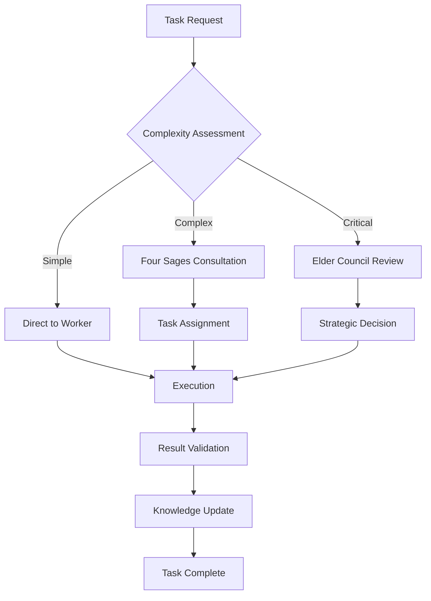

# 🏛️ Elders Guild Complete Operation Manual
# Elders Guild 完全運用マニュアル

**Version 1.0.0 | Last Updated: 2025-07-10**
**Elder Council Approved Document**

---

## 📋 Table of Contents | 目次

1. [System Overview | システム概要](#system-overview--システム概要)
2. [Elder Tree Design Philosophy | Elder Tree の設計思想](#elder-tree-design-philosophy--elder-tree-の設計思想)
3. [Four Sages Roles and Responsibilities | Four Sages の役割と責任](#four-sages-roles-and-responsibilities--four-sages-の役割と責任)
4. [Hierarchy Structure | 階層構造](#hierarchy-structure--階層構造)
5. [32 Workers Function List | 32ワーカーの機能一覧](#32-workers-function-list--32ワーカーの機能一覧)
6. [Operation Procedures | 運用手順](#operation-procedures--運用手順)
7. [Emergency Response | 緊急対応](#emergency-response--緊急対応)
8. [Maintenance Guide | メンテナンスガイド](#maintenance-guide--メンテナンスガイド)

---

## System Overview | システム概要

### 🌟 What is Elders Guild System?

The Elders Guild System is a hierarchical AI orchestration platform that manages complex AI operations through a structured command chain inspired by fantasy guild systems. It provides:

- **Hierarchical Command Structure**: Clear authority levels from Grand Elder to Servants
- **Four Sages Specialization**: Expert systems for Knowledge, Task, Incident, and RAG operations
- **Elder Tree Integration**: Unified communication and decision-making framework
- **32 Specialized Workers**: Comprehensive coverage of all AI operations

### 🎯 Core Principles

1. **Hierarchy and Order**: Every action flows through the proper chain of command
2. **Specialization**: Each component has a specific role and expertise
3. **Collaboration**: Components work together through structured protocols
4. **Resilience**: Multiple layers of fallback and recovery mechanisms
5. **Wisdom Preservation**: All knowledge is captured and shared

---

## Elder Tree Design Philosophy | Elder Tree の設計思想

### 🌳 The Elder Tree Concept

The Elder Tree represents the central nervous system of our AI infrastructure, where:

```
                    🌟 Grand Elder maru
                           |
                    🤖 Claude Elder
                           |
                    🧙‍♂️ Four Sages
                    /    |    |    \
            Knowledge  Task  Incident  RAG
                    \    |    |    /
                     🏛️ Elder Council
                           |
                    🧝‍♂️ Servants (Workers)
```

### 📐 Design Principles

#### 1. **Hierarchical Communication**
- Messages flow up and down the tree
- Each level filters and processes relevant information
- Critical issues escalate automatically

#### 2. **Distributed Intelligence**
- Each node has autonomous decision-making capabilities
- Collective wisdom emerges from interaction
- No single point of failure

#### 3. **Adaptive Learning**
- The tree grows and adapts based on experience
- New patterns are incorporated into the structure
- Continuous optimization of pathways

#### 4. **Resilient Architecture**
- Multiple redundant pathways
- Automatic failover mechanisms
- Self-healing capabilities

---

## Four Sages Roles and Responsibilities | Four Sages の役割と責任

### 📚 Knowledge Sage | ナレッジ賢者

**Primary Role**: Guardian of all system knowledge and learning

**Responsibilities**:
- Knowledge base management and curation
- Pattern recognition and storage
- Documentation generation and maintenance
- Learning optimization strategies
- Cross-system knowledge sharing

**Key Integrations**:
- RAG systems for knowledge retrieval
- Documentation workers for content generation
- Learning systems for pattern extraction

### 📋 Task Sage | タスク賢者

**Primary Role**: Master of task orchestration and workflow optimization

**Responsibilities**:
- Task prioritization and scheduling
- Resource allocation optimization
- Workflow design and improvement
- Performance monitoring
- Bottleneck identification

**Key Integrations**:
- PM workers for project management
- Task workers for execution
- Result workers for outcome tracking

### 🚨 Incident Sage | インシデント賢者

**Primary Role**: Guardian of system stability and security

**Responsibilities**:
- Real-time monitoring and alerting
- Incident detection and classification
- Emergency response coordination
- Security threat assessment
- Recovery planning and execution

**Key Integrations**:
- Error intelligence systems
- Monitoring infrastructure
- Emergency response protocols
- Incident Knights deployment

### 🔍 RAG Sage | RAG賢者

**Primary Role**: Master of information retrieval and context enhancement

**Responsibilities**:
- Semantic search optimization
- Context relevance scoring
- Vector database management
- Query understanding and expansion
- Information synthesis

**Key Integrations**:
- Vector databases (PostgreSQL/pgvector)
- Search infrastructure
- Context enhancement systems
- Knowledge graphs

---

## Hierarchy Structure | 階層構造

### 🏛️ Complete Hierarchy Map

```yaml
Elders Guild Hierarchy:
  Grand Elder (maru):
    - Ultimate authority
    - Strategic vision
    - Final arbitration
    - System-wide decisions

  Claude Elder:
    - Operational leadership
    - Development oversight
    - Daily decision making
    - Worker coordination

  Four Sages:
    Knowledge Sage:
      - Learning strategies
      - Knowledge curation
      - Documentation standards

    Task Sage:
      - Workflow optimization
      - Resource management
      - Performance tuning

    Incident Sage:
      - Security protocols
      - Emergency response
      - System monitoring

    RAG Sage:
      - Search optimization
      - Context enhancement
      - Information retrieval

  Elder Council:
    - Collective decision making
    - Conflict resolution
    - Policy establishment
    - Quality assurance

  Servants (Workers):
    - Task execution
    - Specialized operations
    - Report generation
    - System maintenance
```

### 🔐 Permission Matrix

| Operation | Grand Elder | Claude Elder | Sages | Council | Servants |
|-----------|-------------|--------------|-------|---------|----------|
| System Configuration | ✅ | ✅ | ❌ | ❌ | ❌ |
| Emergency Shutdown | ✅ | ❌ | ❌ | ❌ | ❌ |
| Worker Management | ✅ | ✅ | ⚠️ | ❌ | ❌ |
| Task Execution | ✅ | ✅ | ✅ | ✅ | ✅ |
| Knowledge Updates | ✅ | ✅ | ✅ | ⚠️ | ❌ |
| Incident Response | ✅ | ✅ | ✅ | ⚠️ | ❌ |
| Report Generation | ✅ | ✅ | ✅ | ✅ | ⚠️ |

**Legend**: ✅ Full Permission | ⚠️ Limited Permission | ❌ No Permission

---

## 32 Workers Function List | 32ワーカーの機能一覧

### 🔧 Core Workers (Essential Operations)

1. **🔐 Authentication Worker**
   - User authentication and authorization
   - Session management
   - MFA handling
   - Elder role verification

2. **📋 Task Worker**
   - General task execution
   - Code generation
   - File operations
   - Command execution

3. **📊 PM Worker**
   - Project management
   - Task coordination
   - Progress tracking
   - Resource allocation

4. **📈 Result Worker**
   - Result compilation
   - Report generation
   - Metric collection
   - Status updates

5. **💬 Slack Integration Workers**
   - Slack Polling Worker: Message monitoring
   - Slack PM Worker: Project updates
   - Slack Monitor Worker: Channel surveillance

### 🚀 Advanced Workers (Specialized Functions)

6. **🏛️ Elder Council Worker**
   - Council meeting coordination
   - Decision aggregation
   - Voting management
   - Minutes generation

7. **📋 Audit Worker**
   - Security auditing
   - Compliance checking
   - Activity logging
   - Forensic analysis

8. **🚨 Error Intelligence Worker**
   - Error pattern recognition
   - Root cause analysis
   - Solution suggestion
   - Prevention strategies

9. **🔍 RAG Wizards Worker**
   - Advanced search operations
   - Context enhancement
   - Semantic analysis
   - Knowledge synthesis

### 📚 Knowledge Workers

10. **📖 Documentation Worker**
    - Auto-documentation
    - API doc generation
    - User guide creation
    - Knowledge base updates

11. **🧠 Knowledge Scheduler Worker**
    - Learning scheduling
    - Knowledge refresh
    - Pattern updates
    - Insight generation

12. **🎓 Test Generator Worker**
    - Automated test creation
    - Coverage analysis
    - Test optimization
    - Quality assurance

### 🛠️ Utility Workers

13. **🔄 Async PM Worker**
    - Asynchronous project management
    - Long-running task coordination
    - Queue management

14. **📊 Async Result Worker**
    - Asynchronous result processing
    - Batch operations
    - Performance optimization

15. **🏥 Health Check Worker**
    - System health monitoring
    - Performance metrics
    - Resource usage tracking
    - Anomaly detection

16. **🛡️ Executor Watchdog**
    - Process monitoring
    - Deadlock detection
    - Resource protection
    - Recovery automation

### 🎨 Specialized Domain Workers

17. **🖼️ Image Pipeline Worker**
    - Image processing
    - Vision AI integration
    - Media handling
    - Thumbnail generation

18. **📧 Email Notification Worker**
    - Email dispatch
    - Template management
    - Notification scheduling
    - Delivery tracking

19. **💭 Dialog Task Worker**
    - Conversational AI
    - Context management
    - Response generation
    - Dialog flow control

20. **📝 Todo Worker**
    - Task list management
    - Priority handling
    - Deadline tracking
    - Progress monitoring

### 🔬 Development Workers

21. **🔍 Code Review Workers** (Set of 3)
    - Code Review PM Worker
    - Code Review Task Worker
    - Code Review Result Worker

22. **🧪 Test Management Workers**
    - Test Manager Worker
    - Test Worker
    - Large Test Worker

23. **🎯 Command Executor Worker**
    - Command parsing
    - Execution orchestration
    - Permission checking
    - Result formatting

### 🧙‍♂️ Intelligence Workers

24. **🧠 Intelligent PM Worker**
    - AI-driven project optimization
    - Predictive scheduling
    - Risk assessment
    - Resource prediction

25. **🔮 Enhanced Task Worker**
    - Advanced task processing
    - Multi-modal handling
    - Complex workflow support

26. **⚡ Async Enhanced Task Worker**
    - High-performance async operations
    - Parallel processing
    - Stream handling

### 🏰 Elder Integration Workers

27-32. **Elder-Enhanced Variants**
    - Elder Enhanced PM Worker
    - Elder Enhanced Task Worker
    - Elder Result Worker
    - Elder Async PM Worker
    - Elder Async Result Worker
    - Elder Slack Polling Worker

Each elder-enhanced variant includes:
- Direct Elder Tree integration
- Hierarchical permission checking
- Automatic escalation protocols
- Enhanced audit trails

---

## Operation Procedures | 運用手順

### 🚀 System Startup Sequence

```bash
# 1. Initialize Elder Tree
./ai-elder-start

# 2. Verify Four Sages Status
python3 scripts/check_elder_harmony.py

# 3. Start Core Workers
docker-compose up -d

# 4. Verify System Health
ai-health --full-check
```

### 📊 Daily Operations

#### Morning Checklist
1. Review overnight incidents
2. Check Four Sages health status
3. Verify worker availability
4. Review pending Elder Council decisions
5. Check knowledge base updates

#### Continuous Monitoring
```python
# Monitor Elder Tree status
from libs.elder_tree_performance_monitor import ElderTreeMonitor

monitor = ElderTreeMonitor()
status = monitor.get_comprehensive_status()
```

#### Evening Procedures
1. Generate daily reports
2. Archive completed tasks
3. Update knowledge base
4. Plan next day priorities
5. Set overnight monitoring alerts

### 🔄 Task Workflow



---

## Emergency Response | 緊急対応

### 🚨 Emergency Levels

#### Level 1: System-Wide Failure
- **Trigger**: Complete system outage
- **Response**: Grand Elder activation
- **Protocol**: EMERGENCY_RESPONSE_MASTER_MANUAL.md

#### Level 2: Critical Service Failure
- **Trigger**: Core worker failure
- **Response**: Claude Elder coordination
- **Protocol**: Automatic failover activation

#### Level 3: Performance Degradation
- **Trigger**: >50% performance drop
- **Response**: Four Sages optimization
- **Protocol**: Load balancing and scaling

#### Level 4: Security Incident
- **Trigger**: Unauthorized access attempt
- **Response**: Incident Sage lockdown
- **Protocol**: Security isolation and investigation

### 🛠️ Recovery Procedures

```python
# Emergency Recovery Script
from emergency_protocols.EMERGENCY_RESPONSE_SYSTEM import EmergencyCoordinator

coordinator = EmergencyCoordinator()
coordinator.assess_situation()
coordinator.execute_recovery_plan()
coordinator.verify_restoration()
```

---

## Maintenance Guide | メンテナンスガイド

### 📅 Scheduled Maintenance

#### Daily Tasks
- Log rotation and archival
- Performance metric collection
- Knowledge base synchronization
- Worker health checks

#### Weekly Tasks
- Security audit review
- Performance optimization
- Knowledge pattern analysis
- Elder Council report generation

#### Monthly Tasks
- Full system backup
- Security key rotation
- Worker configuration review
- Knowledge base reorganization

### 🔧 Maintenance Commands

```bash
# Backup Elder Tree state
ai-backup --full --include-knowledge

# Optimize Four Sages performance
python3 scripts/optimize_four_sages.py

# Clean up old logs
ai-clean --logs --older-than 30d

# Update worker configurations
ai-deploy-config --update-all
```

### 📊 Performance Tuning

```yaml
# config/performance.yaml
elder_tree:
  message_queue_size: 10000
  processing_threads: 16
  cache_size: 4GB

four_sages:
  knowledge:
    index_refresh_interval: 300s
    cache_ttl: 3600s
  task:
    queue_depth: 1000
    worker_pool_size: 20
  incident:
    alert_threshold: 0.8
    response_time: 100ms
  rag:
    vector_cache: 8GB
    similarity_threshold: 0.85
```

---

## 📚 Appendices

### A. Configuration Files
- `/config/elder_rules.json` - Elder hierarchy rules
- `/config/worker_config.json` - Worker configurations
- `/config/four_sages_config.yaml` - Four Sages settings

### B. Log Locations
- `/logs/elder_tree/` - Elder Tree communication logs
- `/logs/four_sages/` - Four Sages decision logs
- `/logs/workers/` - Individual worker logs

### C. Monitoring Dashboards
- http://localhost:3000/elder-tree - Elder Tree status
- http://localhost:3000/four-sages - Four Sages monitoring
- http://localhost:3000/workers - Worker performance

### D. Support Contacts
- **System Issues**: claude-elder@ai-company.com
- **Security Incidents**: incident-sage@ai-company.com
- **Knowledge Queries**: knowledge-sage@ai-company.com
- **Emergency**: grand-elder-maru@ai-company.com

---

## 🎯 Quick Reference Card

### Essential Commands
```bash
# System Control
ai-elder-start          # Start Elder system
ai-elder-stop           # Stop Elder system
ai-health              # Check system health
ai-status              # View current status

# Worker Management
ai-workers             # List all workers
ai-worker-restart <id> # Restart specific worker
ai-worker-scale <id> <count> # Scale worker instances

# Knowledge Operations
ai-knowledge update    # Update knowledge base
ai-knowledge search    # Search knowledge
ai-rag enhance        # Enhance RAG capabilities

# Emergency
ai-emergency --assess  # Assess situation
ai-emergency --recover # Execute recovery
```

---

**Document Version**: 1.0.0
**Last Updated**: 2025-07-10
**Approved by**: Elder Council
**Next Review**: 2025-08-10

**🏛️ Elders Guild - Wisdom Through Hierarchy**
