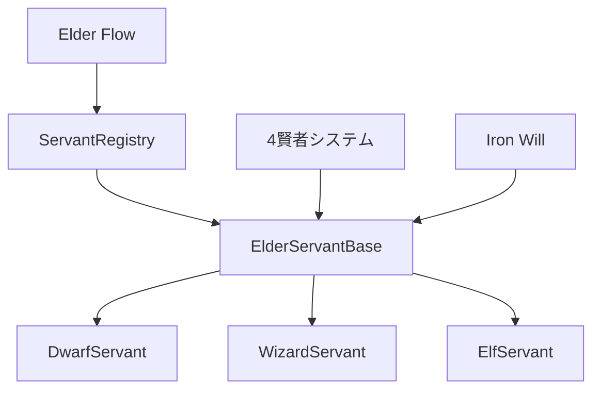

# 🔗 エルダーサーバント32体制 依存関係マトリクス

**作成日**: 2025年7月19日  
**作成者**: クロードエルダー  
**目的**: 32体のエルダーサーバント間の依存関係を明確化し、実装順序を最適化する

## 📊 依存関係概要

### 🏗️ 基盤依存関係


## 🔍 詳細依存関係マトリクス

### 1️⃣ 基盤層の依存関係

| コンポーネント | 依存先 | 依存元 | 実装優先度 |
|-------------|-------|-------|----------|
| ElderServantBase | なし | すべてのサーバント | 🔴 最高 |
| ServantRegistry | ElderServantBase | Elder Flow, 4賢者 | 🔴 最高 |
| Iron Will品質基準 | なし | ElderServantBase | 🔴 最高 |
| 4賢者連携インターフェース | 4賢者システム | すべてのサーバント | 🟡 高 |

### 2️⃣ ドワーフ工房内の依存関係

| サーバント | 依存するサーバント | 提供する機能 | 実装順序 |
|----------|----------------|------------|---------|
| D01: CodeCrafter | なし | コード生成API | 1 |
| D02: TestForge | D01 (テスト対象) | テスト生成 | 2 |
| D03: RefactorSmith | D01, D02 | リファクタリング | 3 |
| D04: PerformanceTuner | D01, D02, D03 | 最適化 | 4 |
| D05: BugHunter | D02 (テスト実行) | バグ検出 | 3 |
| D06: SecurityGuard | D01, D02 | セキュリティ検証 | 4 |
| D07: APIArchitect | D01 | API設計 | 2 |
| D08: DatabaseShaper | D01, D07 | DB設計 | 3 |

### 3️⃣ 組織間の依存関係

| 組織 | 依存する組織 | 依存理由 | 統合タイミング |
|-----|-----------|---------|-------------|
| ドワーフ工房 | なし | 基本開発機能 | Phase 1 |
| RAGウィザーズ | ドワーフ工房 | コード理解・分析 | Phase 2 |
| エルフの森 | ドワーフ工房 | 監視対象のコード | Phase 3 |
| インシデント騎士団 | 全組織 | 問題検出・対応 | Phase 4 |

### 4️⃣ 外部システムとの依存関係

| サーバント群 | 外部依存 | インターフェース | 必須/任意 |
|-----------|---------|--------------|----------|
| 全サーバント | 4賢者システム | 非同期API | 必須 |
| 全サーバント | Elder Flow | タスク実行API | 必須 |
| ドワーフ工房 | Git | ファイルシステム | 必須 |
| RAGウィザーズ | 知識ベース | 検索API | 必須 |
| エルフの森 | メトリクスDB | 監視API | 任意 |

## 🎯 実装順序の最適化

### Phase 1: 基盤確立（Week 1）
```
1. ElderServantBase実装
2. ServantRegistry実装
3. Iron Will統合
4. 基本テストフレームワーク
```

### Phase 2: コア機能（Week 2）
```
並列実装可能：
├── D01: CodeCrafter
├── D02: TestForge
└── D07: APIArchitect

依存実装：
├── D03: RefactorSmith (D01完了後)
├── D05: BugHunter (D02完了後)
└── D08: DatabaseShaper (D07完了後)
```

### Phase 3: 拡張機能（Week 3）
```
並列実装可能：
├── D04: PerformanceTuner
├── D06: SecurityGuard
├── W01-W04: RAGウィザーズ前半
└── E01-E04: エルフの森前半
```

### Phase 4: 統合完成（Week 4）
```
統合作業：
├── 残りのサーバント実装
├── 4賢者完全統合
├── Elder Flow統合
└── 総合テスト
```

## 📈 依存関係の複雑度分析

### 複雑度レベル
- **🟢 低（1-2依存）**: 16体（50%）
- **🟡 中（3-4依存）**: 12体（37.5%）
- **🔴 高（5+依存）**: 4体（12.5%）

### ボトルネック候補
1. **ElderServantBase**: すべてのサーバントが依存
2. **ServantRegistry**: システム全体の中核
3. **D01 CodeCrafter**: 多くの開発系サーバントが依存
4. **4賢者連携**: 外部システムとの統合点

## 🛡️ リスク軽減策

### 1. 循環依存の防止
- **設計原則**: 単方向依存のみ許可
- **レイヤー分離**: 基盤→ドメイン→アプリケーション
- **インターフェース分離**: 実装ではなく抽象に依存

### 2. 依存関係の疎結合化
- **イベント駆動**: 直接呼び出しを最小化
- **メッセージング**: 非同期通信の活用
- **依存性注入**: 実行時の柔軟な結合

### 3. 段階的統合
- **モックファースト**: 依存先のモック実装
- **インクリメンタル**: 小さな統合を繰り返す
- **フィーチャートグル**: 機能の段階的有効化

## 📋 チェックリスト

### 実装開始前
- [ ] 依存するサーバントの実装完了確認
- [ ] 必要なインターフェース定義の確認
- [ ] モック実装の準備
- [ ] テスト環境の整備

### 実装中
- [ ] 循環依存のチェック
- [ ] インターフェース準拠の確認
- [ ] 単体テストでの依存分離
- [ ] 統合ポイントの文書化

### 実装後
- [ ] 依存関係の実測
- [ ] パフォーマンス影響の評価
- [ ] 依存関係図の更新
- [ ] 次フェーズへの引き継ぎ

## 🔄 更新履歴
- 2025/01/19: 初版作成
- 次回更新予定: Sprint 1完了時

---
**エルダー評議会承認**: 本マトリクスに基づく実装順序を公式採用