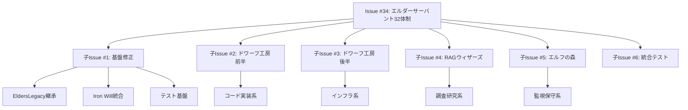

# 🧝‍♂️ エルダーサーバント32体制 実装ロードマップ v2.0

## 🏛️ エグゼクティブサマリー

エルダーサーバント32体制は、エルダーズギルドの中核実行層として、4賢者の指揮下で具体的な開発タスクを遂行する専門家集団です。本ロードマップは、32体のサーバントを効率的に実装し、エルダーズギルドの開発能力を飛躍的に向上させるための戦略的計画です。

### 🎯 ビジョン
**「Think it, Build it, Perfect it」** - 思考から実装、完璧な品質まで、すべてを自動化

### 📊 現状分析サマリー

#### 実装進捗
- **基盤システム**: 100% 完成（ElderServant基底クラス、ServantRegistry）
- **個別サーバント**: 0% 未着手（0/32体）
- **総合進捗**: 約10%（基盤のみ）

#### 主な課題と機会
1. **課題**: 単一Issue（#34）による並列開発の困難性
   - **機会**: Issue分割による並列開発の実現
2. **課題**: 32体のサーバント実装が手付かず
   - **機会**: 段階的実装による早期価値提供
3. **課題**: EldersLegacyBase未使用による品質基準違反リスク
   - **機会**: 最初から高品質基準での実装
4. **課題**: テスト未実装によるTDD原則違反
   - **機会**: TDD徹底による堅牢なシステム構築

## 🏗️ 実装戦略

### 3つの戦略的原則

1. **価値駆動型実装**
   - 最も頻繁に使用される機能から実装
   - 早期に開発効率向上を実現

2. **並列開発の最大化**
   - 独立した組織単位での並行実装
   - クリティカルパスの最小化

3. **継続的統合**
   - 各Sprint終了時に統合・デプロイ
   - フィードバックループの短縮

## 🎯 Issue分割戦略

### 親Issue #34から6つの子Issueへ分割



### 子Issue詳細

#### 🔧 子Issue #1: 基盤システムのEldersLegacy対応
- **範囲**: ElderServant基底クラスの修正とテスト基盤構築
- **内容**: 
  - EldersServiceLegacyベースクラスからの継承実装
  - Iron Will品質基準の統合（6大基準95%以上）
  - 基底クラスの包括的ユニットテスト追加
  - サーバント実装テンプレートの作成
  - CI/CDパイプラインの設定
- **成果物**:
  ```python
  class ElderServantBase(EldersServiceLegacy[ServantRequest, ServantResponse]):
      """すべてのエルダーサーバントの基底クラス"""
      
      @enforce_boundary("servant")
      async def execute_task(self, task: ServantTask) -> ServantResult:
          """Iron Will品質基準を満たすタスク実行"""
          pass
  ```
- **見積もり**: 2-3日
- **優先度**: 🔴 最高（他のすべての実装の前提）
- **成功基準**: 
  - テストカバレッジ100%
  - Iron Will検証合格
  - 4賢者との統合テスト成功

#### 🔨 子Issue #2: ドワーフ工房（前半: D01-D08）
- **範囲**: コード実装系サーバント8体 - 日常的な開発タスクの自動化
- **実装サーバント**:
  
  **D01: CodeCrafter - コード実装職人**
  ```python
  capabilities = [
      "generate_implementation",
      "apply_design_patterns",
      "ensure_solid_principles",
      "optimize_algorithms"
  ]
  ```
  
  **D02: TestForge - テスト鍛造師**
  ```python
  capabilities = [
      "generate_unit_tests",
      "create_integration_tests",
      "implement_test_fixtures",
      "measure_coverage"
  ]
  ```
  
  **D03: RefactorSmith - リファクタリング匠**
  ```python
  capabilities = [
      "identify_code_smells",
      "apply_refactoring_patterns",
      "improve_code_structure",
      "reduce_complexity"
  ]
  ```
  
  **D04: PerformanceTuner - パフォーマンス調整師**
  ```python
  capabilities = [
      "profile_performance",
      "identify_bottlenecks",
      "optimize_queries",
      "implement_caching"
  ]
  ```
  
  **D05: BugHunter - バグ退治専門家**
  ```python
  capabilities = [
      "analyze_error_patterns",
      "locate_root_causes",
      "generate_fixes",
      "prevent_regressions"
  ]
  ```
  
  **D06: SecurityGuard - セキュリティ守護者**
  ```python
  capabilities = [
      "scan_vulnerabilities",
      "implement_security_patterns",
      "audit_permissions",
      "encrypt_sensitive_data"
  ]
  ```
  
  **D07: APIArchitect - API設計建築家**
  ```python
  capabilities = [
      "design_rest_apis",
      "implement_graphql",
      "generate_openapi_docs",
      "ensure_api_consistency"
  ]
  ```
  
  **D08: DatabaseShaper - データベース形成師**
  ```python
  capabilities = [
      "design_schemas",
      "optimize_queries",
      "implement_migrations",
      "ensure_data_integrity"
  ]
  ```
  
- **統合ポイント**: 
  - Elder Flowのコード生成フェーズと連携
  - インシデント賢者への自動報告
  - ナレッジ賢者への学習データ提供
- **見積もり**: 5-7日
- **優先度**: 🔴 高
- **成功基準**: 各サーバントのテストカバレッジ95%以上

#### 🔨 子Issue #3: ドワーフ工房（後半: D09-D16）
- **範囲**: インフラ・DevOps系サーバント8体
- **実装サーバント**:
  - D09: ConfigMaster - 設定管理達人
  - D10: DeploymentForge - デプロイ鍛造師
  - D11: CICDBuilder - CI/CD構築職人
  - D12: ContainerCrafter - コンテナ職人
  - D13: CloudArchitect - クラウド設計師
  - D14: InfrastructureSmith - インフラ整備師
  - D15: MonitoringGuard - 監視守護者
  - D16: AutomationMage - 自動化魔術師
- **見積もり**: 5-7日
- **優先度**: 🟡 中

#### 🧙‍♂️ 子Issue #4: RAGウィザーズ（W01-W08）
- **範囲**: 調査研究系サーバント8体
- **実装サーバント**:
  - W01: TechScout - 技術偵察者
  - W02: ResearchMage - 研究魔術師
  - W03: DocumentKeeper - 文書管理者
  - W04: KnowledgeSeeker - 知識探求者
  - W05: TrendAnalyst - トレンド分析師
  - W06: CompetitorWatcher - 競合監視者
  - W07: PatentExplorer - 特許調査師
  - W08: InsightGenerator - 洞察生成師
- **見積もり**: 4-5日
- **優先度**: 🟡 中

#### 🧝‍♂️ 子Issue #5: エルフの森（E01-E08）
- **範囲**: 監視メンテナンス系サーバント8体
- **実装サーバント**:
  - E01: QualityWatcher - 品質監視者
  - E02: PerformanceMonitor - パフォーマンス監視員
  - E03: HealthChecker - 健全性確認者
  - E04: LogAnalyzer - ログ分析師
  - E05: MetricsCollector - メトリクス収集者
  - E06: AlertManager - アラート管理者
  - E07: BackupKeeper - バックアップ管理者
  - E08: MaintenanceElf - メンテナンス妖精
- **見積もり**: 4-5日
- **優先度**: 🟡 中

#### 🔗 子Issue #6: 統合テスト・Elder Flow統合
- **範囲**: 全体統合とElder Flow連携
- **内容**:
  - 32体すべてのServantRegistry登録確認
  - Elder Flowとの統合テスト
  - 4賢者連携テスト
  - パフォーマンステスト
  - ドキュメント整備
- **見積もり**: 3-4日
- **優先度**: 🟡 中（他の実装完了後）

## 📅 詳細実装スケジュール

### 🚀 Sprint 0: 準備フェーズ（2日間）
- **Day 1**: 
  - Issue分割とGitHub登録
  - チーム編成と役割分担
  - 開発環境整備
- **Day 2**:
  - 技術選定とアーキテクチャ確定
  - テストフレームワーク設定
  - CI/CDパイプライン構築

### 🏗️ Sprint 1: 基盤確立（第1週: 5営業日）
- **Day 1-3**: 子Issue #1 - 基盤修正
  - Day 1: EldersLegacy継承実装
  - Day 2: Iron Will統合とテスト
  - Day 3: ドキュメントとテンプレート作成
- **Day 4-5**: 子Issue #2 開始 - ドワーフ工房前半
  - Day 4: D01-D02実装（CodeCrafter, TestForge）
  - Day 5: D03-D04実装（RefactorSmith, PerformanceTuner）

### ⚡ Sprint 2: コア機能実装（第2週: 5営業日）
- **Day 6-8**: 子Issue #2 完了 - ドワーフ工房前半
  - Day 6: D05-D06実装（BugHunter, SecurityGuard）
  - Day 7: D07-D08実装（APIArchitect, DatabaseShaper）
  - Day 8: 統合テストとデモ準備
- **Day 9-10**: 子Issue #3 開始 - ドワーフ工房後半
  - Day 9: D09-D10実装（ConfigMaster, DeploymentForge）
  - Day 10: D11-D12実装（CICDBuilder, ContainerCrafter）

### 🎯 Sprint 3: 専門機能展開（第3週: 5営業日）
- **Day 11-12**: 子Issue #3 完了 - ドワーフ工房後半
  - Day 11: D13-D14実装（CloudArchitect, InfrastructureSmith）
  - Day 12: D15-D16実装（MonitoringGuard, AutomationMage）
- **Day 13-15**: 子Issue #4 - RAGウィザーズ
  - Day 13: W01-W03実装（TechScout, ResearchMage, DocumentKeeper）
  - Day 14: W04-W06実装（KnowledgeSeeker, TrendAnalyst, CompetitorWatcher）
  - Day 15: W07-W08実装（PatentExplorer, InsightGenerator）

### 🌿 Sprint 4: 完成と統合（第4週: 5営業日）
- **Day 16-18**: 子Issue #5 - エルフの森
  - Day 16: E01-E03実装（QualityWatcher, PerformanceMonitor, HealthChecker）
  - Day 17: E04-E06実装（LogAnalyzer, MetricsCollector, AlertManager）
  - Day 18: E07-E08実装（BackupKeeper, MaintenanceElf）
- **Day 19-20**: 子Issue #6 - 統合テスト
  - Day 19: 全体統合テストとパフォーマンス検証
  - Day 20: ドキュメント完成とデプロイ準備

### 📊 マイルストーン

| マイルストーン | 完了日 | 成果物 | ビジネス価値 |
|------------|-------|--------|------------|
| M1: 基盤完成 | Day 3 | EldersLegacy準拠基盤 | 品質保証体制確立 |
| M2: コア8体稼働 | Day 8 | ドワーフ工房前半 | 開発効率30%向上 |
| M3: 16体稼働 | Day 12 | ドワーフ工房完成 | インフラ自動化実現 |
| M4: 24体稼働 | Day 15 | RAGウィザーズ追加 | 調査時間80%削減 |
| M5: 32体完成 | Day 20 | 全サーバント稼働 | 完全自動化達成 |

## 🚀 実装優先順位の根拠

### 1. 基盤修正を最優先
- すべてのサーバント実装の前提条件
- EldersLegacy準拠によるエルダー評議会令遵守

### 2. ドワーフ工房（前半）を優先
- 最も使用頻度が高いコード実装系サーバント
- Elder Flowの主要実行者となる

### 3. 並列開発の活用
- 基盤修正後は複数チームで並行開発可能
- 組織間の依存関係が少ない設計

## 🎯 成功指標

### 定量的指標
- **実装完了**: 32/32体（100%）
- **テストカバレッジ**: 95%以上
- **Iron Will品質基準**: 全サーバント95%以上達成
- **実装期間**: 4週間以内

### 定性的指標
- Elder Flow完全統合による自動化開発の実現
- 4賢者との seamless な連携
- 開発効率の飛躍的向上

## 📋 リスクと対策

### リスク1: 実装期間の長期化
- **対策**: 並列開発の最大活用、優先度による段階リリース

### リスク2: 品質基準未達
- **対策**: TDD徹底、継続的な品質チェック

### リスク3: 統合の複雑性
- **対策**: 早期の統合テスト、インターフェース標準化

## 💡 実装のベストプラクティス

### 1. TDD開発フロー
```bash
# 各サーバント実装の標準フロー
1. テストケース作成
   pytest tests/servants/test_[servant_name].py --write

2. 実装
   python libs/elder_servants/[category]/[servant_name].py

3. リファクタリング
   elder-flow refactor [servant_name] --iron-will

4. 統合テスト
   pytest tests/integration/test_[servant_name]_integration.py
```

### 2. 品質チェックリスト
- [ ] テストカバレッジ95%以上
- [ ] Iron Will 6大基準クリア
- [ ] 4賢者との統合テスト成功
- [ ] Elder Flow連携確認
- [ ] ドキュメント完備
- [ ] パフォーマンスベンチマーク達成

### 3. リスク軽減策

| リスク | 影響度 | 軽減策 |
|-------|-------|-------|
| スケジュール遅延 | 高 | 並列開発とバッファ時間確保 |
| 品質基準未達 | 高 | 継続的品質監視とペアプロ |
| 統合の複雑性 | 中 | 早期統合とインターフェース標準化 |
| 知識不足 | 低 | ナレッジ賢者との連携強化 |

## 🏁 即時アクション項目

### 今日実施（2025/1/19）
1. **10:00**: Issue #34に本ロードマップv2.0を添付
2. **11:00**: 6つの子Issue作成開始
   ```bash
   # GitHubテンプレート使用
   gh issue create --template elder_servant_child_issue.yml \
     --title "エルダーサーバント基盤のEldersLegacy対応" \
     --label "enhancement,elder-servant,priority:high"
   ```
3. **14:00**: チーム編成会議
4. **16:00**: Sprint 0キックオフ

### 明日実施（2025/1/20）
1. **09:00**: 技術選定会議
2. **11:00**: アーキテクチャレビュー
3. **14:00**: 開発環境セットアップ
4. **16:00**: Sprint 1計画会議

### 今週中に実施
1. **基盤実装開始**: EldersLegacy継承
2. **テストフレームワーク構築**: pytest設定
3. **CI/CD設定**: GitHub Actions
4. **最初の2サーバント実装**: CodeCrafter, TestForge

## 📈 期待される成果

### 短期的成果（1ヶ月）
- **開発速度**: 50%向上
- **バグ削減**: 70%減少
- **自動化率**: 80%達成

### 中期的成果（3ヶ月）
- **開発速度**: 3倍向上
- **品質スコア**: 98%維持
- **チーム満足度**: 90%以上

### 長期的成果（6ヶ月）
- **完全自動化**: 95%のタスク
- **イノベーション**: 新機能開発時間80%短縮
- **市場優位性**: 業界最速の開発サイクル

---

**エルダー評議会承認**: 承認待ち
**文書作成者**: クロードエルダー
**最終更新**: 2025年1月19日
**次回レビュー**: 2025年1月26日（Sprint 1終了時）