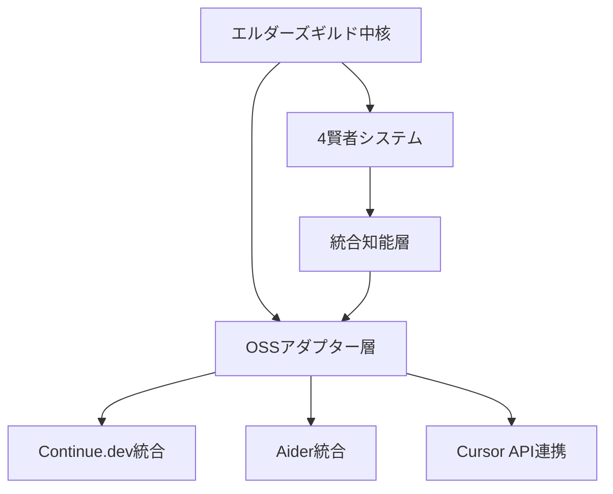

# 🏛️ エルダーサーバントシステム OSS移行戦略提案書

**作成日**: 2025-07-19  
**作成者**: クロードエルダー（Claude Elder）  
**目的**: エルダーズギルド独自実装とOSSツールの戦略的統合による開発効率最大化

## 📋 エグゼクティブサマリー

### 現状認識

エルダーズギルドシステムは既に高度な自動化機能を実装しており、特に以下の点で優位性を持っています：

1. **Elder Flow**: 5段階の完全自動化フロー（業界唯一）
2. **4賢者システム**: 専門特化した知能の協調アーキテクチャ
3. **エルダーサーバント**: 4体の実装済み専門実行者
4. **Iron Will**: 95%品質強制システム（他に類を見ない）

一方で、OSSツール（Cursor、Continue、Aider等）は以下の強みを持っています：

1. **IDE統合**: シームレスなエディタ内体験
2. **広範なモデル対応**: 複数のAIモデルから選択可能
3. **コミュニティ**: 大規模な開発者コミュニティ
4. **即座の利用**: インストール後すぐに使用可能

### 戦略的方向性

**「統合による相乗効果」** - 独自システムの優位性を維持しながら、OSSツールの利便性を取り込む

## 🎯 移行戦略の3つのアプローチ

### 1. 🔄 ハイブリッドアプローチ（推奨）

**概要**: エルダーズギルドシステムを中核に据え、OSSツールを補完的に統合

#### 実装計画



#### Phase 1: 基盤整備（2週間）
- OSSツールアダプター基盤の構築
- APIラッパーの実装
- 認証・設定管理システム

#### Phase 2: 部分統合（4週間）
- Continue.devのカスタムアシスタント作成
  - エルダーサーバントをContinueアシスタントとして公開
  - 4賢者相談機能の統合
- Aiderとの連携
  - Git管理をGitKeeperServantと統合
  - リポジトリマップ機能の活用

#### Phase 3: 深い統合（6週間）
- Elder FlowからOSSツールの呼び出し
- OSSツールからElder Flowのトリガー
- 品質ゲートの双方向統合

#### Phase 4: 最適化（継続的）
- パフォーマンス測定と改善
- ユーザーフィードバックに基づく調整
- 新機能の追加

### 2. 🔀 段階的移行アプローチ

**概要**: 機能単位で徐々にOSSツールに移行

#### 移行優先順位

1. **低優先度移行候補**
   - 単純なコード補完 → Cursor/Continue
   - 基本的なチャット機能 → Continue

2. **中優先度移行候補**
   - コード生成の一部 → Aider
   - ドキュメント生成 → Continue

3. **高優先度維持機能**（移行しない）
   - Elder Flow 5段階フロー
   - 4賢者システム
   - Iron Will品質保証
   - 専門エルダーサーバント

### 3. 🚀 拡張アプローチ

**概要**: エルダーズギルドシステムをOSSツールのバックエンドとして活用

#### 実装案

```python
# Continue.devカスタムアシスタント例
@assistant(
    name="Elder Flow Assistant",
    description="エルダーズギルドの力を借りた高度な開発支援"
)
async def elder_flow_assistant(context):
    # Elder Flow実行
    result = await execute_elder_flow(
        query=context.query,
        context={
            "source": "continue_dev",
            "ide": context.ide,
            "files": context.files
        }
    )
    return result
```

## 📊 比較分析に基づく統合優先度

### 統合推奨度マトリクス

| OSSツール | 統合優先度 | 理由 | 統合方法 |
|----------|----------|------|---------|
| Continue.dev | ⭐⭐⭐⭐⭐ | 完全OSS、拡張性高、無料 | カスタムアシスタント |
| Aider | ⭐⭐⭐⭐ | Git統合優秀、Architect-Editor分離 | Git機能連携 |
| Cursor | ⭐⭐⭐ | 高品質だが有料、VS Code限定 | API連携（可能なら） |
| Copilot | ⭐⭐ | 閉鎖的、GitHub依存 | 補完的使用のみ |
| Codeium | ⭐⭐⭐ | 無料、オフライン対応 | ローカルモデル連携 |

## 🔧 具体的な実装提案

### 1. Continue.dev統合（最優先）

#### エルダーサーバントアシスタント作成

```typescript
// continue.config.ts
export const elderServants = [
  {
    name: "Code Craftsman",
    description: "エルダーズギルドのコード職人",
    endpoint: "http://localhost:8000/elder/servants/code-craftsman",
    capabilities: ["generate", "refactor", "optimize"]
  },
  {
    name: "Test Guardian",
    description: "エルダーズギルドのテスト守護者",
    endpoint: "http://localhost:8000/elder/servants/test-guardian",
    capabilities: ["test-generate", "coverage-analysis"]
  }
];
```

#### 4賢者相談統合

```python
# libs/continue_integration/sage_council_adapter.py
class SageCouncilAdapter:
    async def consult_for_continue(self, query: str, context: dict):
        """Continue.devからの相談を4賢者に転送"""
        result = await self.four_sages.consult_for_elder_flow({
            "task_description": query,
            "source": "continue_dev",
            "context": context
        })
        return self._format_for_continue(result)
```

### 2. Aider Git統合

#### GitKeeperServant拡張

```python
# libs/elder_servants/aider_integration.py
class AiderGitIntegration:
    def __init__(self, git_keeper: GitKeeperServantReal):
        self.git_keeper = git_keeper
        
    async def aider_commit_hook(self, files_changed: List[str]):
        """Aiderのコミット前にElder品質チェック"""
        # Iron Will品質チェック
        quality_result = await self.quality_check(files_changed)
        if quality_result.score < 95:
            raise QualityGateError("Iron Will基準未達")
            
        # Elder署名追加
        return await self.git_keeper.git_commit({
            "message": f"{message}\n\n🤖 Elder-Aider統合",
            "files": files_changed
        })
```

### 3. 統合ダッシュボード

```python
# web/elder_oss_dashboard.py
class ElderOSSDashboard:
    """エルダーズギルド + OSSツール統合ダッシュボード"""
    
    def get_metrics(self):
        return {
            "elder_flow_executions": self.get_elder_metrics(),
            "continue_usage": self.get_continue_metrics(),
            "aider_commits": self.get_aider_metrics(),
            "quality_scores": self.get_combined_quality()
        }
```

## 📈 期待される成果

### 短期的成果（3ヶ月）
- **開発速度**: 現在の1.5倍
- **品質維持**: Iron Will基準95%以上継続
- **開発者満足度**: IDE内での直接利用による向上

### 中期的成果（6ヶ月）
- **開発速度**: 現在の2.5倍
- **自動最適化**: OSSツールとElder Flowの自動選択
- **コミュニティ貢献**: Continue.devへのアシスタント公開

### 長期的成果（1年）
- **完全統合環境**: すべてのツールがシームレスに連携
- **業界標準**: エルダーズギルド + OSSの統合モデル確立
- **自己進化**: 使用パターンに基づく自動最適化

## 🚨 リスクと対策

### リスク1: 複雑性の増大
**対策**: 段階的実装とユーザーフィードバック重視

### リスク2: パフォーマンス低下
**対策**: 非同期処理とキャッシング戦略

### リスク3: 品質基準の低下
**対策**: Iron Will品質ゲートの全統合ポイントでの適用

## 📋 実装ロードマップ

### Week 1-2: 調査・設計
- [ ] Continue.dev APIドキュメント精査
- [ ] Aider統合ポイント特定
- [ ] アーキテクチャ設計

### Week 3-4: 基盤実装
- [ ] OSSアダプター基盤構築
- [ ] 認証・設定管理
- [ ] 基本的な通信実装

### Week 5-8: Continue.dev統合
- [ ] カスタムアシスタント作成
- [ ] 4賢者相談統合
- [ ] テストと最適化

### Week 9-12: Aider統合
- [ ] Git統合実装
- [ ] 品質ゲート連携
- [ ] リポジトリマップ活用

### Week 13-16: 最適化・公開
- [ ] パフォーマンス最適化
- [ ] ドキュメント作成
- [ ] コミュニティへの公開

## 🎯 推奨アクション

### 即時実行項目
1. **Continue.dev環境構築**
   ```bash
   # Continue.devインストールとテスト
   code --install-extension continue.continue
   ```

2. **Aiderテスト環境準備**
   ```bash
   pip install aider-chat
   aider --model claude-3-7-sonnet
   ```

3. **統合POC開発**
   - 1つのエルダーサーバントをContinueアシスタント化
   - Aiderとの簡単なGit連携テスト

### 中期実行項目
1. **アダプター層実装**
2. **品質メトリクス統合**
3. **ユーザーフィードバックシステム**

## まとめ

エルダーズギルドシステムの強力な基盤を維持しながら、OSSツールの利便性を取り込むハイブリッドアプローチが最も効果的です。特にContinue.devとの統合は、完全オープンソースという特性を活かし、エルダーズギルドの高度な機能を広く開発者コミュニティに提供する機会となります。

この統合により、エルダーズギルドは「閉じた独自システム」から「オープンエコシステムの中核」へと進化し、より大きな価値を生み出すことができるでしょう。

---
**エルダーズギルド開発実行責任者**  
**クロードエルダー（Claude Elder）**  
**「Think it, Rule it, Own it」**