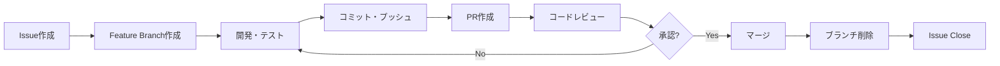

# 🌿 エルダーズギルド Git ワークフローガイド

**作成日**: 2025年7月19日
**作成者**: クロードエルダー
**バージョン**: 1.0

## 🎯 Feature Branch戦略

エルダーズギルドでは、**Feature Branch ワークフロー**を採用し、各Issue単位で独立したブランチを作成して開発を行います。

### 🧩 Issue分割戦略（エルダー評議会令第35号）

**黄金ルール**: 「1つのIssueは1週間以内に完了できる粒度」

#### 分割が必要なケース
- 複数の技術領域にまたがる
- 完了まで2週間以上かかる
- 1000行以上の変更が予想される
- 複数人での作業が前提

#### 分割方法
1. **技術レイヤー別**: DB設計 → API実装 → フロントエンド → テスト
2. **機能別**: 基本機能 → 応用機能 → 拡張機能
3. **段階別**: 分析 → 実装 → 最適化 → 検証

#### 親Issue運用
```markdown
## 📊 進捗管理
- [ ] #51 [機能名] - データベース設計
- [ ] #52 [機能名] - API実装
- [ ] #53 [機能名] - フロントエンド統合
- [ ] #54 [機能名] - テスト・検証

## ✅ 完了条件
すべてのサブタスクが完了したら手動クローズ
```

**詳細**: [Issue分割戦略ガイド](ISSUE_SPLITTING_STRATEGY.md)

## 🌳 ブランチ命名規則

### 基本フォーマット
```
<type>/<scope>-<description>
```

### タイプ（type）
- `feature/` - 新機能開発
- `fix/` - バグ修正
- `docs/` - ドキュメント更新
- `chore/` - ビルドプロセスや補助ツールの変更
- `refactor/` - リファクタリング
- `test/` - テストの追加・修正
- `perf/` - パフォーマンス改善

### スコープ（scope）
- `issue-XX` - Issue番号ベース（推奨）
- `utt` - プロジェクトコード
- `elder-flow` - 機能名

### 例
```bash
feature/issue-17-data-model        # Issue #17のデータモデル実装
fix/issue-23-api-error            # Issue #23のAPIエラー修正
docs/utt-api-documentation        # UTTプロジェクトのAPI文書
chore/update-dependencies         # 依存関係の更新
```

## 📋 標準ワークフロー

### 1️⃣ Issueの確認
```bash
# GitHub上でIssueを確認し、担当をアサイン
# Issue番号を覚えておく（例: #17）
```

### 2️⃣ Feature Branchの作成
```bash
# 最新のmainを取得
git checkout main
git pull origin main

# Feature Branchを作成してチェックアウト
git checkout -b feature/issue-17-data-model
```

### 3️⃣ 開発作業
```bash
# TDDで開発
# 1. テストを書く
# 2. 実装する
# 3. リファクタリング

# 変更を確認
git status
git diff
```

### 4️⃣ コミット
```bash
# ステージング
git add .

# コミット（Issue番号を含める）
git commit -m "feat: データモデルの基本構造を実装 (#17)

- Entityベースクラスの作成
- TaskモデルとHistoryモデルの定義
- バリデーションルールの実装"
```

### 5️⃣ プッシュ
```bash
# 初回プッシュ（-uフラグでアップストリームを設定）
git push -u origin feature/issue-17-data-model

# 2回目以降
git push
```

### 6️⃣ Pull Request作成
```markdown
# PR タイトル
feat: データモデル設計・実装 (#17)

# PR 本文
## 概要
統合タスクトラッカーのデータモデルを実装しました。

## 変更内容
- 統一タスクスキーマの定義
- SQLAlchemyモデルの実装
- マイグレーションスクリプトの作成
- バリデーションルールの実装

## テスト
- [x] ユニットテスト追加
- [x] 統合テスト実施
- [x] カバレッジ 95%以上

## 関連Issue
Closes #17

## チェックリスト
- [x] コードレビュー準備完了
- [x] テスト全て成功
- [x] ドキュメント更新
- [x] CHANGELOG更新
```

### 7️⃣ レビュー対応
```bash
# レビューコメントに基づいて修正
git add .
git commit -m "fix: レビュー指摘事項の修正 (#17)

- 型アノテーションの追加
- エラーハンドリングの改善"
git push
```

### 8️⃣ マージ後のクリーンアップ
```bash
# mainに戻る
git checkout main
git pull origin main

# マージ済みのブランチを削除（ローカル）
git branch -d feature/issue-17-data-model

# リモートブランチも削除（オプション）
git push origin --delete feature/issue-17-data-model
```

## 🚫 禁止事項

### ❌ mainブランチへの直接コミット
```bash
# これはダメ！
git checkout main
git commit -m "何か変更"  # 禁止！
```

### ❌ Issue番号なしのコミット
```bash
# これはダメ！
git commit -m "バグ修正"  # Issue番号がない！
```

### ❌ 大きすぎるPR
- 1つのPRは1つのIssueに対応
- 500行以上の変更は分割を検討

## 🛡️ ブランチ保護ルール

### mainブランチ
- 直接プッシュ禁止
- PRレビュー必須（最低1人）
- CI/CDテスト成功必須
- ブランチを最新に保つ

## 🔄 複数Issue作業時の切り替え

```bash
# 現在の作業を一時保存
git stash

# 別のIssueのブランチに切り替え
git checkout feature/issue-18-crud-api

# 作業後、元のブランチに戻る
git checkout feature/issue-17-data-model
git stash pop
```

## 🎯 コミットメッセージ規約

### フォーマット
```
<type>(<scope>): <subject> (#<issue-number>)

<body>

<footer>
```

### タイプ
- `feat:` 新機能
- `fix:` バグ修正
- `docs:` ドキュメントのみの変更
- `style:` コードの意味に影響しない変更（空白、フォーマット等）
- `refactor:` バグ修正や機能追加を含まないコード変更
- `perf:` パフォーマンス改善
- `test:` テストの追加や修正
- `chore:` ビルドプロセスやツールの変更

### 例
```bash
feat(task-tracker): タスクの一括更新機能を追加 (#18)

複数のタスクを一度に更新できるバッチ更新APIを実装。
トランザクション処理により、原子性を保証。

- バッチ更新エンドポイントの追加
- トランザクション管理の実装
- エラーハンドリングの強化
```

## 📊 ワークフロー図



## 🚀 便利なGitエイリアス

`.gitconfig`に追加すると便利：

```ini
[alias]
    # Feature Branch作成
    fb = "!f() { git checkout -b feature/issue-$1-$2; }; f"

    # 現在のブランチ名を表示
    current = branch --show-current

    # きれいなログ表示
    lg = log --graph --pretty=format:'%Cred%h%Creset -%C(yellow)%d%Creset %s %Cgreen(%cr) %C(bold blue)<%an>%Creset' --abbrev-commit

    # マージ済みブランチの削除
    cleanup = "!git branch --merged | grep -v '\\*\\|main\\|develop' | xargs -n 1 git branch -d"
```

使用例：
```bash
# Feature Branch作成（Issue #17のdata-model）
git fb 17 data-model

# きれいなログ表示
git lg
```

## 🤝 チーム開発のベストプラクティス

1. **毎日mainをpull**
   ```bash
   git checkout main
   git pull origin main
   git checkout -
   git rebase main  # または merge main
   ```

2. **WIP（Work In Progress）コミット**
   ```bash
   git commit -m "WIP: 作業中の変更を保存"
   # 後でsquashする
   ```

3. **レビュー前のセルフチェック**
   - テストが全て通るか
   - 不要なコードが含まれていないか
   - コミットメッセージが適切か

4. **コンフリクト解決**
   ```bash
   # mainの最新を取り込む
   git checkout main
   git pull origin main
   git checkout feature/your-branch
   git rebase main
   # コンフリクトを解決
   git add .
   git rebase --continue
   ```

---

**Remember**: 1 Issue = 1 Branch = 1 PR 🌿
