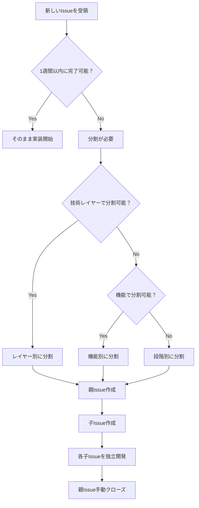

# 🎯 Issue分割戦略ガイド

**作成日**: 2025年7月19日
**作成者**: クロードエルダー
**バージョン**: 1.0
**エルダー評議会令第**: 35号

## 📋 基本原則

### 🎯 黄金ルール
**「1つのIssueは1週間以内に完了できる粒度」**

- **最大**: 1週間（5営業日）
- **推奨**: 2-3日
- **最小**: 半日

### 🔍 分割基準

#### ✅ 適切なIssue粒度
- [ ] 1人で完了可能
- [ ] 1週間以内に完了
- [ ] 明確な完了条件
- [ ] 独立してテスト可能
- [ ] レビューが容易（500行以下）

#### ❌ 分割が必要なIssue
- [ ] 複数の技術領域にまたがる
- [ ] 複数人での作業が前提
- [ ] 完了まで2週間以上
- [ ] 曖昧な完了条件
- [ ] 1000行以上の変更予想

## 🏗️ 分割戦略

### 1️⃣ 技術レイヤー別分割
```
❌ 大きなIssue: "ユーザー管理システム実装"

✅ 適切な分割:
├── Issue #51: "ユーザー管理 - データベース設計"
├── Issue #52: "ユーザー管理 - API実装"
├── Issue #53: "ユーザー管理 - フロントエンド"
└── Issue #54: "ユーザー管理 - テスト・検証"
```

### 2️⃣ 機能別分割
```
❌ 大きなIssue: "OAuth2.0認証システム"

✅ 適切な分割:
├── Issue #61: "OAuth2.0 - 基本認証フロー"
├── Issue #62: "OAuth2.0 - トークン管理"
├── Issue #63: "OAuth2.0 - リフレッシュ機能"
└── Issue #64: "OAuth2.0 - セキュリティ監査"
```

### 3️⃣ 段階別分割
```
❌ 大きなIssue: "パフォーマンス最適化"

✅ 適切な分割:
├── Issue #71: "パフォーマンス - 現状分析・ベンチマーク"
├── Issue #72: "パフォーマンス - データベースクエリ最適化"
├── Issue #73: "パフォーマンス - キャッシュ実装"
└── Issue #74: "パフォーマンス - 結果検証・レポート"
```

## 📝 親Issue運用

### 親Issueテンプレート
```markdown
# [機能名] - 親Issue

## 📋 概要
システム全体の概要説明

## 🎯 目標
明確な成功指標

## 📊 進捗管理
- [ ] #XX [サブタスク1の説明]
- [ ] #XX [サブタスク2の説明]
- [ ] #XX [サブタスク3の説明]
- [ ] #XX [サブタスク4の説明]

## ✅ 完了条件
- すべてのサブタスクが完了
- 統合テストが成功
- ドキュメント更新完了

## 📚 関連リソース
- 設計書: [リンク]
- 参考資料: [リンク]

---
**注意**: このIssueは親Issueです。実際の作業は各サブタスクで行ってください。
```

### 子Issueテンプレート
```markdown
# [機能名] - [具体的な作業]

## 📋 概要
この作業の具体的な説明

## 🎯 作業内容
- [ ] 実装項目1
- [ ] 実装項目2
- [ ] テスト作成
- [ ] ドキュメント更新

## ✅ 完了条件
明確な完了基準

## 🔗 関連Issue
親Issue: #XX

## 📝 技術仕様
実装に必要な技術詳細

## 🧪 テスト計画
- ユニットテスト
- 統合テスト
```

## 🔄 運用フロー

### ステップ1: 大機能の分析
```bash
# 大きなIssueを受け取った場合
1. 技術要素を洗い出し
2. 依存関係を整理
3. 適切な粒度に分割計画
```

### ステップ2: 親Issue作成
```bash
# 親Issueを作成
gh issue create --title "[機能名] - 実装" \
  --body "$(cat parent_issue_template.md)"
```

### ステップ3: 子Issue作成
```bash
# 各サブタスクをIssue化
gh issue create --title "[機能名] - データベース設計" \
  --body "親Issue: #XX"
```

### ステップ4: 親Issueの更新
```bash
# 作成した子IssueのリンクをTasklistに追加
```

### ステップ5: 個別開発
```bash
# 各子Issueを独立して開発
./scripts/git-feature 52 api-implementation
# 開発・PR・マージ → 自動クローズ
```

### ステップ6: 親Issue完了
```bash
# 全サブタスク完了後、親Issueを手動クローズ
```

## 🚦 判断フローチャート



## 📊 メトリクス

### 追跡指標
- **Issue完了時間**: 平均3日以内
- **PR size**: 平均300行以下
- **レビュー時間**: 平均1日以内
- **リワーク率**: 10%以下

### 監視ダッシュボード
```bash
# Issue分割効果の測定
python3 scripts/analyze_issue_metrics.py
```

## 🛠️ ツール

### 自動分割支援
```bash
# Issue分割支援ツール（今後実装予定）
./scripts/issue-splitter --analyze "大きなIssue説明"
```

### テンプレート活用
```bash
# テンプレートから親Issue作成
./scripts/create-parent-issue --template oauth_system
```

## 🚨 注意事項

### ❌ やってはいけないこと
- 1つのPRで複数のIssueをクローズ
- 親Issueで直接実装作業
- 子Issue間の強い依存関係作成
- 分割しすぎて管理コストが増大

### ✅ ベストプラクティス
- 各子Issueは独立してテスト可能
- 明確な完了条件を設定
- 適切な粒度を維持
- 定期的な分割効果の見直し

## 📚 関連ドキュメント

- [Git ワークフローガイド](GIT_WORKFLOW_GUIDE.md)
- [TDD開発ガイド](../knowledge_base/CLAUDE_TDD_GUIDE.md)
- [Issue テンプレート](../github/ISSUE_TEMPLATE/)

---

**エルダー評議会令第35号**: この分割戦略に従わない大きなIssueの作成・実装は禁止とする。違反者はエルダー評議会による是正指導の対象となる。

**Remember**: Think Small, Act Fast, Deliver Often 🎯
