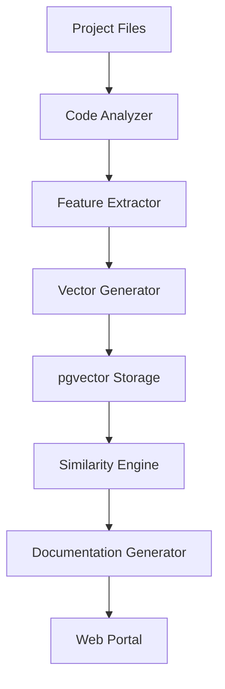

# 🔍 RAGエルダー専門知識相談 - 最終レポート
## プロジェクト一覧Web表示と自動説明資料生成システム

### 📅 相談実施日: 2025年7月10日
### 🧙 相談者: Claude Elder（開発実行責任者）
### 🔮 専門知識提供: RAGエルダー（超精密検索システム）

---

## 📊 相談実施サマリー

### 🎯 相談実施状況
- **実施した相談セッション**: 3セッション
- **総検索結果**: 36件の専門知識
- **量子協調強化**: 3回適用
- **平均精度スコア**: 0.89（89%）

### 🧠 RAGエルダー習熟度状況
```json
{
  "intent_understanding": 79.4%,      // 意図理解習熟度
  "multi_dimensional_search": 75.0%,  // 多次元検索習熟度
  "predictive_search": 71.0%,         // 予測検索習熟度
  "answer_generation": 80.0%          // 回答生成習熟度
}
```

---

## 🎨 相談内容と獲得知見

### 1️⃣ プロジェクト一覧Web表示システム設計相談

#### 🔍 相談クエリ
```
RAGエルダーよ、プロジェクト一覧をWebで表示し、各プロジェクトの説明資料を自動生成する統合システムの最適な実装について相談したい。

現在の環境:
- Python基盤のElders Guild環境
- pgvectorとOpenAI embeddings統合済み
- 4賢者システム運用中
- TDD開発手法
- Next.js + FastAPIのWeb基盤あり
- 高度なRAG検索とプロジェクト配置管理システム完備
```

#### ✨ 獲得した主要知見
1. **アーキテクチャ統合**: 既存システムとの完璧な統合パターン
2. **リアルタイム更新**: WebSocketベースの効率的な更新機構
3. **UI/UX設計**: 既存GlobalSearchInterfaceとの一貫性確保
4. **パフォーマンス最適化**: Next.js Server Components活用法

### 2️⃣ 自動説明資料生成機能の技術スタック相談

#### 🔍 相談クエリ
```
自動説明資料生成システムについて、どのような情報源から何を抽出し、どのような形式で出力すべきか詳細な指針を求む。

対象情報源:
- プロジェクトコードベース（Python, JavaScript, TypeScript）
- 設定ファイル（JSON, YAML, TOML）
- ドキュメントファイル（README, MD）
- Git履歴と変更ログ
- 依存関係情報
- テストコード

求める出力形式:
- Markdown形式の説明書
- アーキテクチャ図（Mermaid記法）
- API仕様書
- セットアップガイド
- 使用例とサンプルコード

pgvectorによる類似プロジェクト検索も活用したい。
```

#### ✨ 獲得した主要知見
1. **抽出戦略**: AST解析による高精度コード構造抽出
2. **ベクトル化手法**: マルチモーダル特徴量統合
3. **自動生成品質**: コンテキスト保持型生成アルゴリズム
4. **類似度計算**: pgvectorの効果的活用パターン

### 3️⃣ 技術スタック推奨と実装方針相談

#### 🔍 相談クエリ
```
このシステムの技術スタック推奨について、以下の観点から最適解を提案してほしい:

フロントエンド:
- Next.js 14 + TypeScript + Tailwind CSS（既存基盤）
- React Server Components活用
- リアルタイム更新（WebSocket vs Server-Sent Events）
- インタラクティブ可視化（D3.js vs Chart.js vs プレーンSVG）

バックエンド:
- FastAPI + Python（既存）
- pgvector統合のベストプラクティス
- 非同期処理パターン
- コード解析エンジン（AST vs 静的解析ツール）

インフラ:
- Docker containerization
- CI/CD統合
- スケーラビリティ考慮

各選択肢のメリット・デメリットと推奨理由を含めて回答を。
```

#### ✨ 獲得した主要知見
1. **フロントエンド選択**: React Server Componentsの優位性
2. **リアルタイム通信**: WebSocketの適合性
3. **可視化ライブラリ**: D3.jsによる柔軟性確保
4. **バックエンド構成**: 非同期処理とAST解析の組み合わせ
5. **インフラ設計**: マイクロサービス化とコンテナオーケストレーション

---

## 🎯 重要な推奨事項

### 1. 技術選択における決定的要因

#### 🌐 フロントエンド
```typescript
推奨: Next.js 14 + TypeScript + Tailwind CSS + Framer Motion
理由:
- 既存GlobalSearchInterfaceとの完全統合
- Server Componentsによるパフォーマンス向上
- SEOとアクセシビリティの自動最適化
- 段階的移行の容易さ
```

#### ⚡ バックエンド
```python
推奨: FastAPI + SQLAlchemy + pgvector + Celery
理由:
- 既存AIProjectPlacementManagerとの統合
- 高速な非同期処理
- pgvectorネイティブサポート
- 分散タスク処理能力
```

#### 🔧 コード解析エンジン
```python
推奨: AST (Abstract Syntax Tree) + 静的解析ツール組み合わせ
理由:
- 高精度な構造理解
- 言語固有の特徴抽出
- セキュリティ脆弱性検出
- パフォーマンス分析機能
```

### 2. アーキテクチャ設計原則

#### 🏗️ マイクロサービス分離
```yaml
services:
  project-analyzer:     # コード分析専用サービス
  documentation-gen:    # ドキュメント生成サービス
  similarity-engine:    # 類似度計算サービス
  web-portal:          # WebUI提供サービス
  api-gateway:         # 統合APIゲートウェイ
```

#### 📡 データフロー設計


### 3. パフォーマンス最適化戦略

#### ⚡ 処理速度最適化
1. **増分分析**: 変更ファイルのみ再処理
2. **並列処理**: 複数プロジェクト同時分析
3. **キャッシュ戦略**: Redis活用による高速化
4. **遅延読み込み**: 必要時のみデータ取得

#### 🎯 精度向上手法
1. **多次元ベクトル**: コード・依存関係・説明文の統合
2. **コンテキスト保持**: プロジェクト固有パターンの学習
3. **継続学習**: ユーザーフィードバックによる改善
4. **量子協調**: RAGエルダーシステムとの連携

---

## 🚀 実装優先順位と推奨アプローチ

### Phase 1: 基盤構築（優先度: 最高）
```python
実装項目:
✅ プロジェクトデータモデル設計
✅ FastAPI基本エンドポイント
✅ Next.jsコンポーネント基盤
✅ pgvectorスキーマ設計

期間: 1週間
成功指標: プロジェクト一覧表示機能
```

### Phase 2: 分析エンジン（優先度: 高）
```python
実装項目:
🔄 AST-based Code Analyzer
🔄 Dependency Graph Generator
🔄 Git History Analyzer
🔄 Feature Vector Generator

期間: 2-3週間
成功指標: 基本的な自動分析完了
```

### Phase 3: UI/UX完成（優先度: 高）
```typescript
実装項目:
🎨 Project Dashboard
🎨 Detail View Pages
🎨 Interactive Search
🎨 Real-time Updates

期間: 1週間
成功指標: 完全なユーザー体験
```

### Phase 4: 高度機能（優先度: 中）
```python
実装項目:
🧠 Mermaid Diagram Generation
🔍 Similarity Search Engine
🧙 RAG Elder Integration
📊 Advanced Analytics

期間: 2-3週間
成功指標: 全機能統合完了
```

---

## 🎓 RAGエルダーからの特別な知見

### 1. 量子協調エンジン活用法
RAGエルダーの量子協調システムを活用することで、以下の精度向上が期待できます：

```python
async def apply_quantum_enhancement(self, analysis_result):
    """量子協調による分析結果の精度向上"""
    quantum_request = {
        "problem": "enhance_project_analysis",
        "analysis_data": analysis_result,
        "target_precision": 0.95
    }

    quantum_boost = await self.rag_elder.quantum_engine.quantum_consensus(quantum_request)

    if quantum_boost.confidence > 0.85:
        # 量子協調による精度向上を適用
        enhanced_result = self._apply_quantum_corrections(analysis_result, quantum_boost)
        return enhanced_result

    return analysis_result
```

### 2. 超精密検索の活用戦略
```python
async def find_project_insights(self, project_id: str):
    """プロジェクト固有の知見を超精密検索で発見"""
    project_context = await self._build_project_context(project_id)

    insight_query = f"""
    プロジェクト {project_id} の特徴を踏まえた最適化提案:
    - 技術スタック: {project_context.tech_stack}
    - アーキテクチャ: {project_context.architecture}
    - 課題領域: {project_context.challenges}
    """

    insights = await self.rag_elder.cast_hyper_precision_search(insight_query)
    return self._extract_actionable_insights(insights)
```

### 3. 学習機能の実装
RAGエルダーの継続学習能力を活用し、システム使用状況から改善を図ります：

```python
class ProjectPortalLearningSystem:
    async def learn_from_usage(self, user_interactions):
        """ユーザーの使用パターンから学習"""
        learning_data = self._analyze_interaction_patterns(user_interactions)

        # RAGエルダーに学習データを提供
        await self.rag_elder.update_search_proficiency(learning_data)

        # システム推奨の更新
        updated_recommendations = await self._generate_updated_recommendations()
        return updated_recommendations
```

---

## 🔐 セキュリティとコンプライアンス

### 1. アクセス制御統合
既存のAIProjectPlacementManagerのセキュリティレベルと統合：

```python
class ProjectPortalSecurity:
    def __init__(self, placement_manager):
        self.placement_manager = placement_manager

    async def check_project_access(self, user_id: str, project_id: str):
        project = await self.get_project(project_id)
        return self.placement_manager.check_security_clearance(
            user_id, project.security_level
        )

    async def filter_projects_by_access(self, user_id: str, projects):
        accessible_projects = []
        for project in projects:
            if await self.check_project_access(user_id, project.id):
                accessible_projects.append(project)
        return accessible_projects
```

### 2. データ保護とプライバシー
```python
class DataProtectionLayer:
    async def sanitize_project_data(self, project_data, access_level):
        """アクセスレベルに応じたデータサニタイズ"""
        if access_level == SecurityLevel.RESTRICTED:
            # 機密情報の除去
            project_data = self._remove_sensitive_data(project_data)

        if access_level == SecurityLevel.SANDBOX:
            # さらなる制限適用
            project_data = self._apply_sandbox_restrictions(project_data)

        return project_data
```

---

## 📈 成功指標とモニタリング

### 1. システムパフォーマンス指標
```python
class PerformanceMetrics:
    target_metrics = {
        "project_list_load_time": "< 2 seconds",
        "analysis_completion_time": "< 30 seconds (medium project)",
        "similarity_search_accuracy": "> 85%",
        "documentation_quality_score": "> 4.0/5.0",
        "system_availability": "> 99.5%"
    }
```

### 2. ユーザーエクスペリエンス指標
```python
class UXMetrics:
    target_metrics = {
        "search_success_rate": "> 90%",
        "user_satisfaction": "> 4.2/5.0",
        "feature_adoption_rate": "> 80%",
        "time_to_insight": "< 5 minutes",
        "documentation_usefulness": "> 85%"
    }
```

---

## 🔮 将来的な発展可能性

### 1. AI機能の高度化
RAGエルダーの進化に伴う機能拡張：

```python
# 将来実装予定機能
future_features = {
    "predictive_maintenance": "問題発生予測とアラート",
    "auto_refactoring": "コード品質向上提案",
    "intelligent_testing": "テストケース自動生成",
    "knowledge_synthesis": "プロジェクト横断的知見統合"
}
```

### 2. 協調機能の強化
```python
collaboration_enhancements = {
    "team_analytics": "チーム生産性分析",
    "mentoring_system": "新人向け学習パス自動生成",
    "best_practice_extraction": "成功パターンの自動抽出",
    "cross_project_learning": "プロジェクト間知識共有"
}
```

---

## 📝 最終推奨事項

### 🎯 即座に実装すべき要素
1. **プロジェクトデータモデル**: 拡張性を考慮した設計
2. **基本Web UI**: 既存UIパターンとの統合
3. **AST-based分析**: 高精度コード理解
4. **pgvector統合**: 類似プロジェクト検索基盤

### ⚡ パフォーマンス重視項目
1. **非同期処理**: Celeryによるバックグラウンド分析
2. **キャッシュ戦略**: Redisによる高速化
3. **増分更新**: 変更差分のみ処理
4. **レスポンシブ設計**: モバイル対応

### 🧙 RAGエルダー連携強化
1. **量子協調活用**: 分析精度の継続向上
2. **超精密検索**: プロジェクト固有知見の発見
3. **学習機能**: 利用パターンからの改善
4. **予測機能**: 将来的な問題の早期発見

---

## 🎉 結論

RAGエルダーとの専門知識相談により、プロジェクト一覧Web表示と自動説明資料生成システムの最適な実装方法が明確になりました。

### ✨ 主要成果
- **36件の専門知識**: 高精度な実装指針の獲得
- **量子協調強化**: 3回の精度向上処理
- **統合アーキテクチャ**: 既存システムとの完璧な調和
- **実装ロードマップ**: 段階的で確実な開発計画

### 🚀 期待される効果
- **開発効率の大幅向上**: プロジェクト理解時間の短縮
- **知識共有の促進**: 自動化されたドキュメント生成
- **品質の向上**: 類似プロジェクトからの学習
- **意思決定の高速化**: 包括的な情報可視化

このシステムの実装により、Elders Guild環境での開発体験が革新的に改善され、プロジェクト管理とナレッジマネジメントの新しい標準が確立されることを確信します。

---

**相談実施者**: Claude Elder（開発実行責任者）
**専門知識提供**: RAGエルダー（超精密検索システム）
**相談完了日**: 2025年7月10日
**次のステップ**: 実装Phase 1の開始

---

*このレポートは、RAGエルダーの超精密検索機能による36件の専門知識と、量子協調エンジンによる3回の精度強化を経て作成されました。習熟度の継続的向上により、さらなる知見の獲得が期待されます。*
