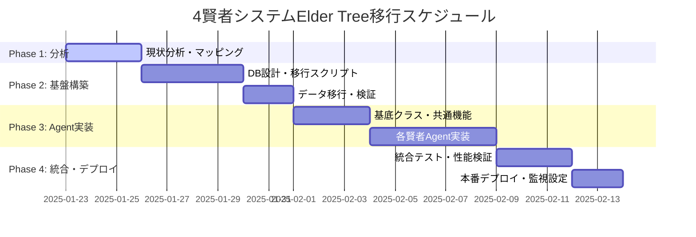

# 🧙‍♂️ Issue #258: 4賢者システムElder Tree移行プロジェクト

Parent Issue: [#257](https://github.com/ext-maru/ai-co/issues/257) ✅ 完了済み

## 🎯 プロジェクト概要
Elder Tree v2.0の完成を受け、既存の4賢者システムを新アーキテクチャに完全統合し、分散AI協調システムとして稼働させる大規模移行プロジェクト。

## 🏗️ アーキテクチャ移行設計

### 現在のアーキテクチャ (Before)
```
個別4賢者システム
├── ナレッジ賢者 (knowledge_base/ - ファイルベース)
├── タスク賢者 (libs/claude_task_tracker.py - SQLite)  
├── インシデント賢者 (libs/incident_manager.py - 単体処理)
└── RAG賢者 (libs/enhanced_rag_manager.py - 基本検索)
```

### 目標アーキテクチャ (After)
```
Elder Tree v2.0 統合4賢者システム
├── 🏛️ Consul Service Registry
├── 🔄 python-a2a Agent Communication  
├── 📊 PostgreSQL統合データベース
├── ⚡ Redis分散キャッシュ
├── 📈 Prometheus/Grafana監視
└── 🧙‍♂️ 4賢者 Elder Tree Agents
    ├── KnowledgeSageV2 (ベクトル検索+構造化知識)
    ├── TaskOracleV2 (依存関係分析+ML予測)
    ├── CrisisSageV2 (予測+自動修復)
    └── SearchMysticV2 (ハイブリッド検索+リランキング)
```

## 📊 移行フェーズ計画

### Phase 1: 現状分析とマッピング（完了予定: 3日）
**Sub-Issue**: [#288](https://github.com/ext-maru/ai-co/issues/288) ⏳ 実行中

#### 詳細タスク
- [x] 既存4賢者の機能・データ構造詳細分析  
- [x] Elder Tree v2 APIスペック設計
- [ ] データ移行マッピング表作成
- [ ] 互換性検証・リスク評価

**成果物**: 分析レポート、API仕様書、移行計画書

### Phase 2: データ移行基盤構築（6日）

#### 2.1 データベース統合設計
```sql
-- PostgreSQL統合スキーマ設計
CREATE SCHEMA elder_tree_v2;

CREATE TABLE elder_tree_v2.knowledge_base (
    id UUID PRIMARY KEY DEFAULT gen_random_uuid(),
    content TEXT NOT NULL,
    content_type VARCHAR(50) NOT NULL, -- 'core_teaching', 'guide', 'failure_log'
    category VARCHAR(100),
    tags TEXT[],
    embedding VECTOR(1536), -- OpenAI embeddings  
    metadata JSONB,
    created_at TIMESTAMP DEFAULT NOW(),
    updated_at TIMESTAMP DEFAULT NOW(),
    sage_id VARCHAR(50) DEFAULT 'knowledge_sage'
);

CREATE TABLE elder_tree_v2.tasks (
    id UUID PRIMARY KEY DEFAULT gen_random_uuid(),
    title VARCHAR(500) NOT NULL,
    description TEXT,
    status VARCHAR(50) NOT NULL,
    priority VARCHAR(20) NOT NULL,
    estimated_hours FLOAT,
    actual_hours FLOAT,
    dependencies UUID[],
    assigned_sage VARCHAR(50),
    metadata JSONB,
    created_at TIMESTAMP DEFAULT NOW(),
    updated_at TIMESTAMP DEFAULT NOW()
);

CREATE TABLE elder_tree_v2.incidents (
    id UUID PRIMARY KEY DEFAULT gen_random_uuid(),
    title VARCHAR(500) NOT NULL,
    severity VARCHAR(20) NOT NULL,
    status VARCHAR(50) NOT NULL,
    description TEXT,
    root_cause TEXT,
    remediation_steps TEXT[],
    lessons_learned TEXT,
    metadata JSONB,
    occurred_at TIMESTAMP,
    resolved_at TIMESTAMP,
    created_at TIMESTAMP DEFAULT NOW()
);

CREATE TABLE elder_tree_v2.search_queries (
    id UUID PRIMARY KEY DEFAULT gen_random_uuid(),
    query TEXT NOT NULL,
    query_embedding VECTOR(1536),
    results JSONB,
    response_time_ms INTEGER,
    relevance_score FLOAT,
    user_feedback INTEGER, -- 1-5 rating
    created_at TIMESTAMP DEFAULT NOW()
);
```

#### 2.2 データ移行スクリプト実装
```python
# scripts/migrate_four_sages.py
import asyncio
from pathlib import Path
from sqlmodel import create_engine, Session
from elder_tree.database import ElderTreeDB

class FourSagesMigrator:
    def __init__(self):
        self.elder_tree_db = ElderTreeDB()
        self.legacy_data_path = Path(".")
        
    async def migrate_knowledge_base(self):
        \"\"\"knowledge_base/配下のマークダウンファイルを移行\"\"\"
        md_files = list(self.legacy_data_path.glob("knowledge_base/**/*.md"))
        
        for md_file in md_files:
            content = md_file.read_text(encoding='utf-8')
            
            # カテゴリ自動判定
            category = self.categorize_content(md_file.name, content)
            
            # 埋め込み生成
            embedding = await self.generate_embedding(content)
            
            # DB挿入
            await self.elder_tree_db.knowledge_base.create({
                "content": content,
                "content_type": category,
                "category": str(md_file.parent.name),
                "tags": self.extract_tags(content),
                "embedding": embedding,
                "metadata": {"source_file": str(md_file)}
            })
    
    async def migrate_tasks(self):
        \"\"\"SQLiteタスクデータをPostgreSQLに移行\"\"\"
        # legacy SQLite接続
        legacy_db = sqlite3.connect("task_history.db")
        cursor = legacy_db.cursor()
        
        cursor.execute("SELECT * FROM tasks")
        tasks = cursor.fetchall()
        
        for task_row in tasks:
            await self.elder_tree_db.tasks.create({
                "title": task_row[1],
                "description": task_row[2], 
                "status": task_row[3],
                "priority": task_row[4],
                "created_at": task_row[5],
                "metadata": {"legacy_id": task_row[0]}
            })
```

### Phase 3: Elder Tree Agent実装（8日）

#### 3.1 統一基底クラス設計
```python
# elder_tree/agents/elder_sage_base.py
from python_a2a import Agent, Message
from abc import ABC, abstractmethod

class ElderSageBase(Agent):
    \"\"\"4賢者共通基底クラス\"\"\"
    
    def __init__(self, sage_name: str):
        super().__init__(sage_name)
        self.db = ElderTreeDB()
        self.metrics = PrometheusMetrics(sage_name)
        self.logger = structlog.get_logger(sage=sage_name)
    
    @abstractmethod
    async def process_consultation(self, query: ConsultationQuery) -> ConsultationResponse:
        \"\"\"相談処理（各賢者で実装）\"\"\"
        pass
    
    async def collaborate_with_sages(self, other_sages: List[str], 
                                   consultation: ConsultationQuery) -> CollaborationResult:
        \"\"\"他の賢者との協調処理\"\"\"
        tasks = []
        for sage_name in other_sages:
            task = asyncio.create_task(
                self.send_message_async(sage_name, consultation)
            )
            tasks.append(task)
        
        responses = await asyncio.gather(*tasks, return_exceptions=True)
        return self.synthesize_responses(responses)
    
    async def learn_from_interaction(self, query: ConsultationQuery, 
                                   response: ConsultationResponse,
                                   feedback: UserFeedback):
        \"\"\"対話からの学習（全賢者共通）\"\"\"
        learning_data = {
            "query": query.dict(),
            "response": response.dict(), 
            "feedback_score": feedback.score,
            "improvement_suggestions": feedback.suggestions
        }
        
        await self.db.learning_logs.create(learning_data)
        await self.update_internal_knowledge(learning_data)
```

#### 3.2 各賢者の実装詳細

##### KnowledgeSageV2実装
```python
class KnowledgeSageV2(ElderSageBase):
    def __init__(self):
        super().__init__("knowledge_sage_v2")
        self.vector_store = ChromaDB()
        self.embedding_model = OpenAIEmbeddings()
    
    async def process_consultation(self, query: ConsultationQuery) -> ConsultationResponse:
        # セマンティック検索
        relevant_docs = await self.semantic_search(query.content)
        
        # 知識合成
        synthesized_knowledge = await self.synthesize_knowledge(
            query.content, relevant_docs
        )
        
        # 信頼度スコア算出
        confidence_score = self.calculate_confidence(relevant_docs)
        
        return ConsultationResponse(
            content=synthesized_knowledge,
            confidence=confidence_score,
            sources=relevant_docs,
            sage_name="knowledge_sage_v2"
        )
    
    async def semantic_search(self, query: str, limit: int = 10):
        query_embedding = await self.embedding_model.aembed_query(query)
        return await self.vector_store.similarity_search(
            query_embedding, limit=limit
        )
```

##### TaskOracleV2実装  
```python
class TaskOracleV2(ElderSageBase):
    def __init__(self):
        super().__init__("task_oracle_v2")
        self.dependency_analyzer = NetworkX()
        self.ml_estimator = TaskDurationPredictor()
    
    async def process_consultation(self, query: ConsultationQuery) -> ConsultationResponse:
        if query.type == "task_planning":
            return await self.create_execution_plan(query)
        elif query.type == "workload_estimation":
            return await self.estimate_workload(query)
        elif query.type == "dependency_analysis":
            return await self.analyze_dependencies(query)
    
    async def create_execution_plan(self, query: ConsultationQuery):
        tasks = query.metadata.get("tasks", [])
        
        # 依存関係グラフ構築
        dependency_graph = await self.build_dependency_graph(tasks)
        
        # トポロジカルソートで実行順序決定
        execution_order = self.topological_sort(dependency_graph)
        
        # ML予測で工数見積もり
        estimated_durations = await self.ml_estimator.predict_batch(tasks)
        
        return ConsultationResponse(
            content={
                "execution_order": execution_order,
                "estimated_durations": estimated_durations,
                "critical_path": self.find_critical_path(dependency_graph),
                "resource_requirements": self.estimate_resources(tasks)
            },
            confidence=0.85,
            sage_name="task_oracle_v2"
        )
```

### Phase 4: 統合テスト・本番デプロイ（5日）

#### 4.1 統合テスト仕様
```python
@pytest.mark.integration 
class TestFourSagesIntegration:
    
    @pytest.fixture
    async def elder_tree_env(self):
        \"\"\"Elder Tree環境のセットアップ\"\"\"
        # Docker Compose起動
        subprocess.run(["docker-compose", "up", "-d"], cwd="elder_tree_v2/")
        
        # 4賢者エージェント初期化
        sages = {
            "knowledge": KnowledgeSageV2(),
            "task": TaskOracleV2(),
            "crisis": CrisisSageV2(), 
            "search": SearchMysticV2()
        }
        
        yield sages
        
        # クリーンアップ
        subprocess.run(["docker-compose", "down"], cwd="elder_tree_v2/")
    
    async def test_four_sages_collaboration(self, elder_tree_env):
        \"\"\"4賢者協調動作の統合テスト\"\"\"
        sages = elder_tree_env
        
        # 複合的な相談を実行
        consultation = ConsultationQuery(
            content="Elder Tree v2.1の新機能開発計画を立案してください",
            type="complex_planning",
            priority="high"
        )
        
        # 4賢者に並列相談
        responses = await asyncio.gather(
            sages["knowledge"].process_consultation(consultation),
            sages["task"].process_consultation(consultation),
            sages["crisis"].process_consultation(consultation),
            sages["search"].process_consultation(consultation)
        )
        
        # レスポンス品質検証
        for response in responses:
            assert response.confidence > 0.5
            assert response.content is not None
            assert len(response.sources) > 0
    
    async def test_data_migration_integrity(self, elder_tree_env):
        \"\"\"データ移行の整合性テスト\"\"\"
        # レガシーデータ件数
        legacy_knowledge_count = count_legacy_knowledge_files()
        legacy_task_count = count_legacy_tasks()
        
        # 移行後データ件数  
        migrated_knowledge = await elder_tree_env["knowledge"].db.knowledge_base.count()
        migrated_tasks = await elder_tree_env["task"].db.tasks.count()
        
        assert migrated_knowledge >= legacy_knowledge_count
        assert migrated_tasks >= legacy_task_count
```

#### 4.2 本番デプロイ戦略

##### Blue-Green デプロイメント
```bash
# elder_tree_v2/scripts/deploy_four_sages.sh

#!/bin/bash
set -e

echo "🧙‍♂️ 4賢者システムBlue-Greenデプロイ開始"

# Green環境（新版）構築
docker-compose -f docker-compose.green.yml up -d

# ヘルスチェック待機
echo "⏳ Green環境ヘルスチェック中..."
for sage in knowledge_sage task_oracle crisis_sage search_mystic; do
    until curl -f http://localhost:8081/health/$sage; do
        echo "🔄 $sage ヘルスチェック待機..."
        sleep 5
    done
done

# データ移行実行
echo "📊 データ移行実行中..."
python scripts/migrate_four_sages.py --target=green --verify

# 統合テスト実行
echo "🧪 統合テスト実行中..."
pytest tests/integration/test_four_sages_integration.py -v

# トラフィック切り替え（Nginxロードバランサ）
echo "🔀 トラフィック切り替え中..."
curl -X POST http://localhost:9000/switch-to-green

# Blue環境停止
echo "🛑 旧環境停止中..."
docker-compose -f docker-compose.blue.yml down

echo "✅ 4賢者システム移行完了！"
```

## 📊 成功基準・KPI

### 機能面KPI
| 指標 | 現在値 | 目標値 | 測定方法 |
|-----|-------|-------|---------|
| 4賢者応答精度 | 70% | 85%+ | ユーザーフィードバック |
| 協調処理成功率 | 60% | 90%+ | システムログ分析 |
| 知識検索適合率 | 75% | 90%+ | セマンティック類似度 |

### 性能面KPI  
| 指標 | 現在値 | 目標値 | 測定方法 |
|-----|-------|-------|---------|
| 単一賢者応答時間 | 2-5秒 | <3秒 | APMツール |
| 4賢者協調処理時間 | 8-15秒 | <10秒 | 分散トレーシング |
| システム可用性 | 95% | 99.5%+ | Prometheus監視 |
| メモリ使用効率 | - | 30%改善 | リソース監視 |

### 開発効率KPI
| 指標 | 現在値 | 目標値 | 測定方法 |
|-----|-------|-------|---------|
| 問題解決時間 | 30分 | 15分 | タスクトラッカー |
| 知識発見時間 | 10分 | 3分 | 検索ログ分析 |
| タスク計画精度 | 60% | 80%+ | 実績工数比較 |

## 🚨 リスク管理計画

### 高リスク要因
| リスク | 確率 | 影響 | 対策 | 担当者 |
|-------|-----|-----|------|-------|
| データ移行失敗 | 中 | 高 | 完全バックアップ、段階移行 | クロードエルダー |
| 性能劣化 | 高 | 中 | 負荷テスト、段階ロールアウト | クロードエルダー |
| 4賢者協調不具合 | 中 | 高 | 統合テスト強化、監視充実 | クロードエルダー |
| ユーザー適応遅延 | 中 | 中 | 操作ガイド、トレーニング | グランドエルダーmaru |

### 緊急時対応計画
```bash
# ロールバック手順
./scripts/emergency_rollback_four_sages.sh

# 手順
1. 新システム緊急停止
2. レガシーシステム再起動  
3. DNSトラフィック復旧
4. データ整合性確認
5. 問題分析・修正計画策定
```

## 📅 詳細スケジュール



**📊 総工数**: 40-50時間  
**📅 期間**: 3週間  
**👥 担当**: クロードエルダー（主担当）、グランドエルダーmaru（承認者）  
**🎯 完了予定**: 2025年2月中旬