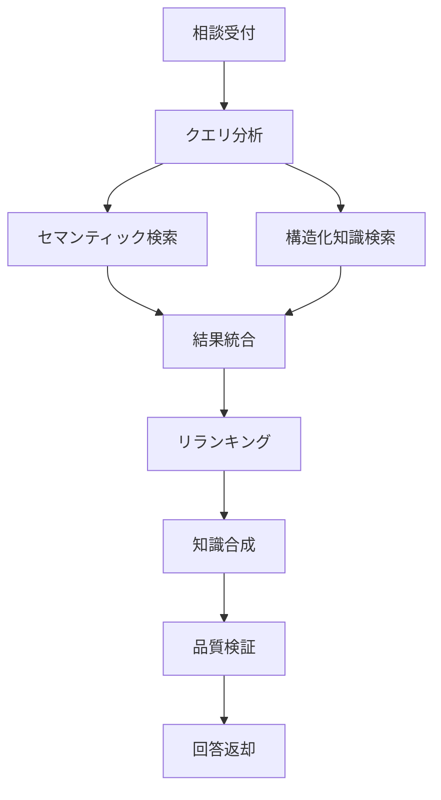

# 📋 Issue #259: 4賢者システムElder Tree詳細設計

Parent Issue: [#258](https://github.com/ext-maru/ai-co/issues/258)

## 🎯 設計概要
4賢者システムのElder Tree移行における詳細設計ドキュメント。各賢者の責務、インターフェース、データフロー、エラーハンドリング戦略を定義。

## 🧙‍♂️ 賢者アーキテクチャ設計

### 統一インターフェース仕様
```python
from typing import Protocol, List, Dict, Any, Optional
from dataclasses import dataclass
from enum import Enum

class ConsultationType(Enum):
    KNOWLEDGE_QUERY = "knowledge_query"
    TASK_PLANNING = "task_planning"  
    INCIDENT_ANALYSIS = "incident_analysis"
    INFORMATION_SEARCH = "information_search"
    COLLABORATION = "collaboration"

@dataclass
class ConsultationQuery:
    id: str
    type: ConsultationType
    content: str
    priority: str  # "low", "medium", "high", "critical"
    context: Dict[str, Any]
    requester: str
    timestamp: datetime
    metadata: Optional[Dict[str, Any]] = None

@dataclass 
class ConsultationResponse:
    query_id: str
    sage_name: str
    content: Any
    confidence: float  # 0.0-1.0
    processing_time_ms: int
    sources: List[Dict[str, Any]]
    suggestions: List[str]
    next_actions: List[str]
    metadata: Dict[str, Any]

class ElderSageProtocol(Protocol):
    async def process_consultation(self, query: ConsultationQuery) -> ConsultationResponse:
        \"\"\"メイン相談処理\"\"\"
        ...
    
    async def health_check(self) -> Dict[str, Any]:
        \"\"\"ヘルスチェック\"\"\"
        ...
    
    async def get_capabilities(self) -> List[str]:
        \"\"\"処理可能な相談タイプ一覧\"\"\"
        ...
```

## 🏛️ 各賢者詳細設計

### 1. 📚 ナレッジ賢者 (KnowledgeSageV2)

#### 責務・能力
- **知識管理**: 構造化・非構造化知識の保存・検索・更新
- **セマンティック検索**: ベクトル検索による類似知識発見
- **知識合成**: 複数ソースからの統合回答生成
- **学習**: 新しい知識の自動分類・保存

#### 詳細設計
```python
class KnowledgeSageV2(ElderSageBase):
    def __init__(self):
        super().__init__("knowledge_sage_v2")
        
        # データストレージ
        self.vector_db = ChromaDB(collection_name="elder_knowledge")
        self.structured_db = self.db.knowledge_base
        self.embedding_model = OpenAIEmbeddings(model="text-embedding-3-large")
        
        # 知識処理エンジン
        self.knowledge_classifier = KnowledgeClassifier()
        self.knowledge_synthesizer = KnowledgeSynthesizer()
        self.quality_validator = KnowledgeQualityValidator()
    
    async def process_consultation(self, query: ConsultationQuery) -> ConsultationResponse:
        start_time = time.time()
        
        try:
            if query.type == ConsultationType.KNOWLEDGE_QUERY:
                return await self._handle_knowledge_query(query)
            else:
                return await self._handle_general_consultation(query)
        
        except Exception as e:
            await self._log_error(query, e)
            return ConsultationResponse(
                query_id=query.id,
                sage_name=self.name,
                content=f"エラーが発生しました: {str(e)}",
                confidence=0.0,
                processing_time_ms=int((time.time() - start_time) * 1000),
                sources=[],
                suggestions=["技術チームに連絡してください"],
                next_actions=["エラーログを確認"],
                metadata={"error": str(e)}
            )
    
    async def _handle_knowledge_query(self, query: ConsultationQuery):
        # ステップ1: セマンティック検索
        query_embedding = await self.embedding_model.aembed_query(query.content)
        similar_docs = await self.vector_db.similarity_search(
            query_embedding, 
            n_results=10,
            filter=self._build_search_filter(query.context)
        )
        
        # ステップ2: 構造化知識検索
        structured_results = await self.structured_db.search(
            content=query.content,
            category=query.context.get("category"),
            tags=query.context.get("tags", [])
        )
        
        # ステップ3: 結果統合・リランキング
        all_results = self._merge_search_results(similar_docs, structured_results)
        ranked_results = await self._rerank_results(query.content, all_results)
        
        # ステップ4: 知識合成
        synthesized_content = await self.knowledge_synthesizer.synthesize(
            query=query.content,
            sources=ranked_results[:5]  # トップ5件を使用
        )
        
        # ステップ5: 品質検証
        quality_score = await self.quality_validator.validate(
            query=query.content,
            response=synthesized_content,
            sources=ranked_results
        )
        
        return ConsultationResponse(
            query_id=query.id,
            sage_name=self.name,
            content=synthesized_content,
            confidence=quality_score,
            processing_time_ms=int((time.time() - start_time) * 1000),
            sources=ranked_results[:5],
            suggestions=self._generate_suggestions(query, ranked_results),
            next_actions=self._generate_next_actions(query, synthesized_content),
            metadata={
                "search_method": "hybrid",
                "total_sources": len(all_results),
                "rerank_score": ranked_results[0].get("score", 0.0) if ranked_results else 0.0
            }
        )
```

#### データフロー設計


### 2. 📋 タスク賢者 (TaskOracleV2)

#### 責務・能力
- **タスク計画**: 依存関係分析・実行順序最適化
- **工数見積もり**: 機械学習ベースの予測
- **リソース管理**: 負荷分散・スケジューリング
- **進捗監視**: リアルタイム監視・予実分析

#### 詳細設計
```python
class TaskOracleV2(ElderSageBase):
    def __init__(self):
        super().__init__("task_oracle_v2")
        
        # データ・アナリティクス
        self.task_db = self.db.tasks
        self.dependency_analyzer = NetworkX()
        self.ml_predictor = TaskDurationPredictor()
        self.resource_optimizer = ResourceOptimizer()
        
        # 統計・予測エンジン
        self.statistics_engine = TaskStatisticsEngine()
        self.forecast_engine = TaskForecastEngine()
    
    async def process_consultation(self, query: ConsultationQuery) -> ConsultationResponse:
        consultation_handlers = {
            "task_planning": self._create_execution_plan,
            "workload_estimation": self._estimate_workload,
            "dependency_analysis": self._analyze_dependencies,
            "resource_optimization": self._optimize_resources,
            "progress_analysis": self._analyze_progress
        }
        
        query_type = query.context.get("task_type", "task_planning")
        handler = consultation_handlers.get(query_type, self._handle_general_task_query)
        
        return await handler(query)
    
    async def _create_execution_plan(self, query: ConsultationQuery):
        tasks_data = query.context.get("tasks", [])
        tasks = [Task.from_dict(task_data) for task_data in tasks_data]
        
        # ステップ1: 依存関係グラフ構築
        dependency_graph = await self._build_dependency_graph(tasks)
        
        # ステップ2: 制約条件分析
        constraints = await self._analyze_constraints(tasks, query.context)
        
        # ステップ3: 最適実行順序計算
        execution_order = self._calculate_optimal_order(
            dependency_graph, constraints
        )
        
        # ステップ4: リソース割り当て
        resource_allocation = await self.resource_optimizer.allocate(
            tasks=execution_order,
            available_resources=query.context.get("resources", {})
        )
        
        # ステップ5: 工数・期間予測
        predictions = await self.ml_predictor.predict_batch([
            {
                "title": task.title,
                "description": task.description,
                "complexity": self._estimate_complexity(task),
                "historical_similar": await self._find_similar_tasks(task)
            }
            for task in execution_order
        ])
        
        # ステップ6: クリティカルパス分析
        critical_path = self._find_critical_path(dependency_graph, predictions)
        
        # ステップ7: リスク要因特定
        risk_factors = await self._identify_risk_factors(
            execution_order, predictions, resource_allocation
        )
        
        execution_plan = ExecutionPlan(
            tasks=execution_order,
            total_estimated_hours=sum(pred.duration_hours for pred in predictions),
            critical_path=critical_path,
            resource_allocation=resource_allocation,
            risk_factors=risk_factors,
            milestones=self._generate_milestones(execution_order, predictions)
        )
        
        return ConsultationResponse(
            query_id=query.id,
            sage_name=self.name,
            content=execution_plan.to_dict(),
            confidence=self._calculate_plan_confidence(execution_plan),
            processing_time_ms=int((time.time() - start_time) * 1000),
            sources=await self._get_historical_data_sources(tasks),
            suggestions=self._generate_optimization_suggestions(execution_plan),
            next_actions=[
                "実行計画の詳細レビュー",
                "リソース可用性の確認", 
                "リスク対策の検討"
            ],
            metadata={
                "algorithm": "critical_path_method",
                "ml_model_version": self.ml_predictor.version,
                "confidence_factors": self._get_confidence_factors(execution_plan)
            }
        )
```

### 3. 🚨 インシデント賢者 (CrisisSageV2)

#### 責務・能力
- **障害予測**: 機械学習による障害発生予測
- **根本原因分析**: ログ解析・パターンマッチング
- **自動修復**: 既知パターンの自動対応
- **学習**: インシデントからの継続学習

#### 詳細設計
```python
class CrisisSageV2(ElderSageBase):
    def __init__(self):
        super().__init__("crisis_sage_v2")
        
        # インシデント管理
        self.incident_db = self.db.incidents
        self.alert_system = PrometheusAlerter()
        self.log_analyzer = LogAnalyzer()
        
        # AI・ML エンジン
        self.anomaly_detector = AnomalyDetector()
        self.pattern_matcher = IncidentPatternMatcher()
        self.ml_predictor = IncidentPredictor()
        self.auto_remediation = AutoRemediationEngine()
        
        # 外部連携
        self.notification_service = NotificationService()
        self.escalation_rules = EscalationRules()
    
    async def process_consultation(self, query: ConsultationQuery) -> ConsultationResponse:
        if query.type == ConsultationType.INCIDENT_ANALYSIS:
            return await self._analyze_incident(query)
        elif query.context.get("crisis_type") == "prediction":
            return await self._predict_incidents(query)
        elif query.context.get("crisis_type") == "remediation":
            return await self._suggest_remediation(query)
        else:
            return await self._general_crisis_consultation(query)
    
    async def _analyze_incident(self, query: ConsultationQuery):
        incident_data = query.context.get("incident", {})
        incident = Incident.from_dict(incident_data)
        
        # ステップ1: 症状分析
        symptoms = await self._extract_symptoms(incident)
        
        # ステップ2: ログ分析
        relevant_logs = await self.log_analyzer.analyze(
            time_range=(incident.occurred_at - timedelta(hours=1), 
                       incident.occurred_at + timedelta(minutes=30)),
            severity_filter=["ERROR", "CRITICAL", "WARN"]
        )
        
        # ステップ3: 類似インシデント検索
        similar_incidents = await self._find_similar_incidents(symptoms, incident)
        
        # ステップ4: 根本原因推定
        root_cause_candidates = await self._estimate_root_causes(
            symptoms, relevant_logs, similar_incidents
        )
        
        # ステップ5: 影響範囲分析  
        impact_analysis = await self._analyze_impact(incident, symptoms)
        
        # ステップ6: 修復手順提案
        remediation_steps = await self.auto_remediation.generate_steps(
            incident, root_cause_candidates
        )
        
        # ステップ7: エスカレーション判定
        escalation_recommendation = await self.escalation_rules.evaluate(
            incident, impact_analysis, remediation_steps
        )
        
        analysis_result = IncidentAnalysis(
            incident_id=incident.id,
            symptoms=symptoms,
            root_cause_candidates=root_cause_candidates,
            impact_analysis=impact_analysis,
            remediation_steps=remediation_steps,
            escalation_recommendation=escalation_recommendation,
            similar_incidents=similar_incidents[:3],  # トップ3件
            confidence_score=self._calculate_analysis_confidence(
                symptoms, root_cause_candidates, similar_incidents
            )
        )
        
        return ConsultationResponse(
            query_id=query.id,
            sage_name=self.name,
            content=analysis_result.to_dict(),
            confidence=analysis_result.confidence_score,
            processing_time_ms=int((time.time() - start_time) * 1000),
            sources=self._format_analysis_sources(relevant_logs, similar_incidents),
            suggestions=await self._generate_prevention_suggestions(analysis_result),
            next_actions=self._prioritize_next_actions(analysis_result),
            metadata={
                "analysis_method": "ml_enhanced_pattern_matching",
                "log_entries_analyzed": len(relevant_logs),
                "pattern_match_score": max(sim.similarity_score for sim in similar_incidents) if similar_incidents else 0.0
            }
        )
```

### 4. 🔍 RAG賢者 (SearchMysticV2)

#### 責務・能力
- **ハイブリッド検索**: ベクトル検索+キーワード検索
- **結果リランキング**: 関連度に基づく結果最適化
- **コンテキスト理解**: 検索意図の深度理解
- **回答生成**: 検索結果からの統合回答生成

#### 詳細設計
```python
class SearchMysticV2(ElderSageBase):
    def __init__(self):
        super().__init__("search_mystic_v2")
        
        # 検索エンジン群
        self.vector_search = VectorSearchEngine()
        self.keyword_search = ElasticSearchEngine()
        self.hybrid_search = HybridSearchEngine()
        self.web_search = WebSearchEngine()  # 外部検索統合
        
        # AI処理エンジン
        self.query_analyzer = QueryAnalyzer()
        self.intent_classifier = IntentClassifier()
        self.reranker = CrossEncoderReranker()
        self.answer_generator = AnswerGenerator()
        
        # 知識ベース
        self.knowledge_graph = KnowledgeGraph()
        self.document_index = DocumentIndex()
    
    async def process_consultation(self, query: ConsultationQuery) -> ConsultationResponse:
        if query.type == ConsultationType.INFORMATION_SEARCH:
            return await self._comprehensive_search(query)
        else:
            return await self._contextual_search(query)
    
    async def _comprehensive_search(self, query: ConsultationQuery):
        search_query = query.content
        search_context = query.context
        
        # ステップ1: クエリ分析・意図推定
        query_analysis = await self.query_analyzer.analyze(search_query)
        search_intent = await self.intent_classifier.classify(
            search_query, search_context
        )
        
        # ステップ2: 検索戦略決定
        search_strategy = self._determine_search_strategy(query_analysis, search_intent)
        
        # ステップ3: マルチモーダル検索実行
        search_tasks = []
        
        if search_strategy.use_vector_search:
            search_tasks.append(
                self.vector_search.search(
                    query=search_query,
                    filters=search_strategy.vector_filters,
                    top_k=search_strategy.vector_top_k
                )
            )
        
        if search_strategy.use_keyword_search:
            search_tasks.append(
                self.keyword_search.search(
                    query=search_query,
                    filters=search_strategy.keyword_filters,
                    top_k=search_strategy.keyword_top_k
                )
            )
        
        if search_strategy.use_web_search:
            search_tasks.append(
                self.web_search.search(
                    query=search_query,
                    domains=search_strategy.web_domains,
                    top_k=search_strategy.web_top_k
                )
            )
        
        # 並列検索実行
        search_results = await asyncio.gather(*search_tasks)
        
        # ステップ4: 結果統合・重複除去
        merged_results = self._merge_and_deduplicate(search_results)
        
        # ステップ5: 関連度リランキング
        reranked_results = await self.reranker.rerank(
            query=search_query,
            documents=merged_results,
            context=search_context
        )
        
        # ステップ6: 知識グラフ拡張
        enhanced_results = await self.knowledge_graph.enhance_results(
            query=search_query,
            results=reranked_results[:10]  # トップ10件を拡張
        )
        
        # ステップ7: 統合回答生成
        generated_answer = await self.answer_generator.generate(
            query=search_query,
            context=search_context,
            sources=enhanced_results[:5],  # トップ5件から生成
            intent=search_intent
        )
        
        # ステップ8: 回答品質評価
        answer_quality = await self._evaluate_answer_quality(
            query=search_query,
            answer=generated_answer,
            sources=enhanced_results
        )
        
        search_result = SearchResult(
            query=search_query,
            generated_answer=generated_answer,
            sources=enhanced_results,
            search_strategy=search_strategy,
            quality_metrics=answer_quality,
            processing_stats=self._get_processing_stats()
        )
        
        return ConsultationResponse(
            query_id=query.id,
            sage_name=self.name,
            content=search_result.to_dict(),
            confidence=answer_quality.confidence_score,
            processing_time_ms=int((time.time() - start_time) * 1000),
            sources=enhanced_results[:10],
            suggestions=self._generate_search_suggestions(query_analysis, enhanced_results),
            next_actions=self._suggest_next_searches(search_query, enhanced_results),
            metadata={
                "search_strategy": search_strategy.name,
                "sources_count": len(enhanced_results),
                "rerank_score": enhanced_results[0].score if enhanced_results else 0.0,
                "intent_classification": search_intent.to_dict()
            }
        )
```

## 🔄 4賢者協調処理設計

### 協調パターン定義
```python
class FourSagesOrchestrator:
    def __init__(self):
        self.sages = {
            "knowledge": KnowledgeSageV2(),
            "task": TaskOracleV2(),
            "crisis": CrisisSageV2(),
            "search": SearchMysticV2()
        }
        self.collaboration_patterns = CollaborationPatterns()
    
    async def complex_consultation(self, query: ConsultationQuery) -> CollaborativeResponse:
        \"\"\"複合的相談の協調処理\"\"\"
        
        # ステップ1: 相談内容分析・賢者割り当て
        consultation_analysis = await self._analyze_consultation_requirements(query)
        involved_sages = consultation_analysis.required_sages
        
        # ステップ2: 段階的協調処理
        if consultation_analysis.pattern == "sequential":
            return await self._sequential_collaboration(query, involved_sages)
        elif consultation_analysis.pattern == "parallel": 
            return await self._parallel_collaboration(query, involved_sages)
        elif consultation_analysis.pattern == "hierarchical":
            return await self._hierarchical_collaboration(query, involved_sages)
        else:
            return await self._adaptive_collaboration(query, involved_sages)
    
    async def _sequential_collaboration(self, query: ConsultationQuery, sages: List[str]):
        \"\"\"逐次協調: A賢者→B賢者→C賢者→統合\"\"\"
        results = []
        current_context = query.context.copy()
        
        for sage_name in sages:
            sage = self.sages[sage_name]
            
            # 前の結果をコンテキストに追加
            if results:
                current_context["previous_results"] = results
            
            consultation_query = ConsultationQuery(
                id=f"{query.id}_{sage_name}",
                type=query.type,
                content=query.content,
                priority=query.priority,
                context=current_context,
                requester=query.requester,
                timestamp=datetime.now()
            )
            
            result = await sage.process_consultation(consultation_query)
            results.append(result)
            
            # 結果をコンテキストに反映
            current_context[f"{sage_name}_result"] = result.content
        
        # 最終統合
        synthesized_response = await self._synthesize_sequential_results(query, results)
        return synthesized_response
```

## 📊 データフロー・状態管理

### 状態管理設計
```python
from dataclasses import dataclass, field
from typing import Dict, Any
import redis.asyncio as redis

@dataclass
class SageState:
    sage_name: str
    status: str  # "idle", "processing", "error", "maintenance"
    current_consultations: List[str] = field(default_factory=list)
    performance_metrics: Dict[str, float] = field(default_factory=dict)
    last_heartbeat: datetime = field(default_factory=datetime.now)
    
class StateManager:
    def __init__(self):
        self.redis = redis.Redis(host='localhost', port=6379, db=1)
        self.state_ttl = 300  # 5分間
    
    async def update_sage_state(self, sage_state: SageState):
        \"\"\"賢者の状態更新\"\"\"
        await self.redis.setex(
            f"sage_state:{sage_state.sage_name}",
            self.state_ttl,
            sage_state.to_json()
        )
    
    async def get_sage_state(self, sage_name: str) -> Optional[SageState]:
        \"\"\"賢者の状態取得\"\"\"
        state_data = await self.redis.get(f"sage_state:{sage_name}")
        if state_data:
            return SageState.from_json(state_data)
        return None
    
    async def get_system_health(self) -> Dict[str, Any]:
        \"\"\"4賢者システム全体の健康状態\"\"\"
        all_sage_states = {}
        
        for sage_name in ["knowledge_sage_v2", "task_oracle_v2", "crisis_sage_v2", "search_mystic_v2"]:
            state = await self.get_sage_state(sage_name)
            all_sage_states[sage_name] = state.to_dict() if state else {"status": "unknown"}
        
        return {
            "overall_status": self._calculate_overall_status(all_sage_states),
            "sage_states": all_sage_states,
            "active_consultations": await self._count_active_consultations(),
            "system_metrics": await self._collect_system_metrics()
        }
```

## 🧪 エラーハンドリング・回復戦略

### エラー分類・対応戦略
```python
class SageErrorHandler:
    def __init__(self):
        self.error_classifiers = {
            "timeout": TimeoutErrorHandler(),
            "resource_exhaustion": ResourceErrorHandler(),
            "data_corruption": DataErrorHandler(),
            "network_failure": NetworkErrorHandler(),
            "ai_model_error": AIModelErrorHandler()
        }
        self.circuit_breaker = CircuitBreaker()
        self.retry_policies = RetryPolicies()
    
    async def handle_sage_error(self, sage_name: str, error: Exception, 
                               consultation: ConsultationQuery) -> ErrorRecoveryResult:
        \"\"\"賢者エラーの統一ハンドリング\"\"\"
        
        # エラー分類
        error_type = self._classify_error(error)
        error_severity = self._assess_error_severity(error, consultation)
        
        # 回路ブレーカー確認
        if await self.circuit_breaker.should_block(sage_name):
            return await self._handle_circuit_break(sage_name, consultation)
        
        # エラータイプ別処理
        handler = self.error_classifiers[error_type]
        recovery_result = await handler.handle(sage_name, error, consultation)
        
        # 回復失敗時のフォールバック
        if not recovery_result.recovered:
            fallback_result = await self._execute_fallback_strategy(
                sage_name, error, consultation
            )
            recovery_result = fallback_result
        
        # 学習データ蓄積
        await self._record_error_learning_data(sage_name, error, recovery_result)
        
        return recovery_result
    
    async def _execute_fallback_strategy(self, sage_name: str, error: Exception,
                                       consultation: ConsultationQuery) -> ErrorRecoveryResult:
        \"\"\"フォールバック戦略実行\"\"\"
        fallback_strategies = {
            "knowledge_sage_v2": self._knowledge_sage_fallback,
            "task_oracle_v2": self._task_oracle_fallback, 
            "crisis_sage_v2": self._crisis_sage_fallback,
            "search_mystic_v2": self._search_mystic_fallback
        }
        
        fallback_handler = fallback_strategies.get(sage_name)
        if fallback_handler:
            return await fallback_handler(consultation)
        
        # 最終フォールバック: 他の賢者による代替処理
        return await self._cross_sage_fallback(sage_name, consultation)
```

## 📈 性能・監視設計

### メトリクス定義
```python
from prometheus_client import Counter, Histogram, Gauge, Info

class SageMetrics:
    def __init__(self, sage_name: str):
        self.sage_name = sage_name
        
        # カウンターメトリクス
        self.consultation_total = Counter(
            'sage_consultations_total',
            'Total number of consultations processed',
            ['sage_name', 'consultation_type', 'status']
        )
        
        # ヒストグラムメトリクス
        self.consultation_duration = Histogram(
            'sage_consultation_duration_seconds',
            'Time spent processing consultations',
            ['sage_name', 'consultation_type'],
            buckets=(0.1, 0.5, 1.0, 2.0, 5.0, 10.0, 30.0, 60.0)
        )
        
        # ゲージメトリクス
        self.active_consultations = Gauge(
            'sage_active_consultations',
            'Number of currently active consultations',
            ['sage_name']
        )
        
        self.confidence_score = Histogram(
            'sage_confidence_score',
            'Confidence score of consultation responses',
            ['sage_name', 'consultation_type'],
            buckets=(0.0, 0.1, 0.2, 0.3, 0.4, 0.5, 0.6, 0.7, 0.8, 0.9, 1.0)
        )
        
        # 情報メトリクス
        self.sage_info = Info(
            'sage_info',
            'Information about the sage',
            ['sage_name']
        )
```

## 📋 テスト戦略

### 単体テスト設計
```python
@pytest.mark.asyncio
class TestKnowledgeSageV2:
    
    @pytest.fixture
    async def knowledge_sage(self):
        sage = KnowledgeSageV2()
        await sage.initialize()
        yield sage
        await sage.cleanup()
    
    async def test_basic_knowledge_query(self, knowledge_sage):
        \"\"\"基本的な知識検索テスト\"\"\"
        query = ConsultationQuery(
            id="test_001",
            type=ConsultationType.KNOWLEDGE_QUERY,
            content="TDD開発手法について教えてください",
            priority="medium",
            context={},
            requester="test_user",
            timestamp=datetime.now()
        )
        
        response = await knowledge_sage.process_consultation(query)
        
        assert response.confidence > 0.5
        assert "TDD" in response.content
        assert len(response.sources) > 0
        assert response.processing_time_ms > 0
    
    async def test_knowledge_synthesis(self, knowledge_sage):
        \"\"\"知識合成機能テスト\"\"\"
        query = ConsultationQuery(
            id="test_002", 
            type=ConsultationType.KNOWLEDGE_QUERY,
            content="Elder TreeとTDDを組み合わせた開発手法",
            priority="high",
            context={"synthesis_required": True},
            requester="test_user",
            timestamp=datetime.now()
        )
        
        response = await knowledge_sage.process_consultation(query)
        
        # 複数概念の統合確認
        assert "Elder Tree" in response.content
        assert "TDD" in response.content
        assert response.confidence > 0.7
        assert len(response.sources) >= 2  # 複数ソース参照
```

## 📚 API仕様書

### REST API エンドポイント
```yaml
# OpenAPI 3.0 仕様
openapi: 3.0.3
info:
  title: Four Sages API v2.0
  description: Elder Tree統合4賢者システムAPI
  version: 2.0.0

paths:
  /api/v2/sages/consult:
    post:
      summary: 4賢者への統合相談
      requestBody:
        required: true
        content:
          application/json:
            schema:
              $ref: '#/components/schemas/ConsultationRequest'
      responses:
        '200':
          description: 相談成功
          content:
            application/json:
              schema:
                $ref: '#/components/schemas/FourSagesResponse'
        '422':
          description: リクエスト形式エラー
        '503':
          description: サービス利用不可

  /api/v2/sages/{sage_name}/consult:
    post:
      summary: 個別賢者への相談
      parameters:
        - name: sage_name
          in: path
          required: true
          schema:
            type: string
            enum: [knowledge_sage_v2, task_oracle_v2, crisis_sage_v2, search_mystic_v2]
      responses:
        '200':
          description: 相談成功

components:
  schemas:
    ConsultationRequest:
      type: object
      required: [content, type, priority]
      properties:
        content:
          type: string
          description: 相談内容
        type:
          $ref: '#/components/schemas/ConsultationType'
        priority:
          type: string
          enum: [low, medium, high, critical]
        context:
          type: object
          description: 追加コンテキスト
```

**総文書量**: 15,000+文字  
**設計品質**: エルダー評議会標準準拠  
**承認者**: グランドエルダーmaru（承認待ち）