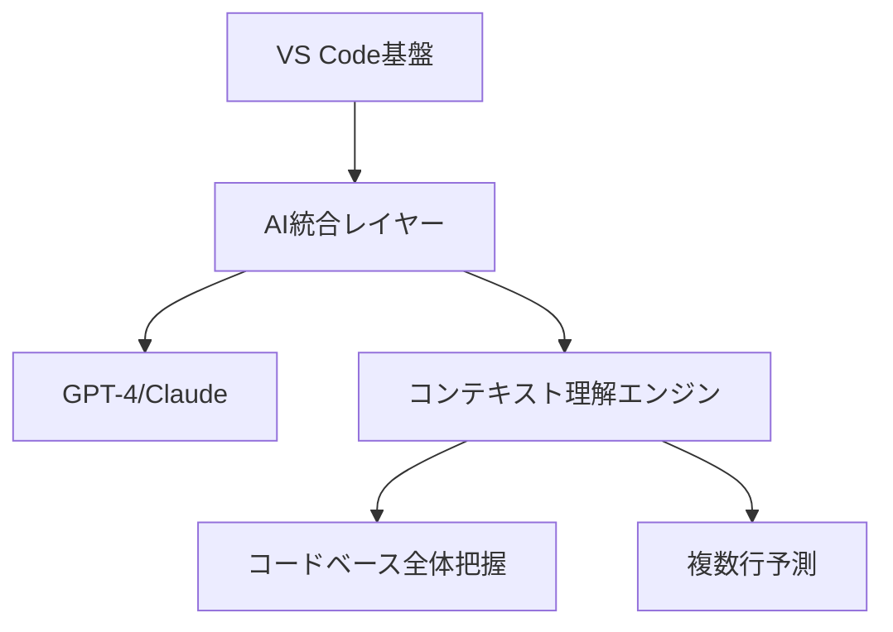
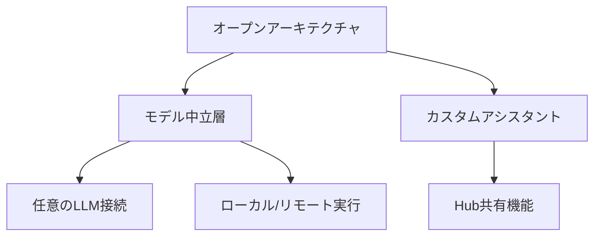
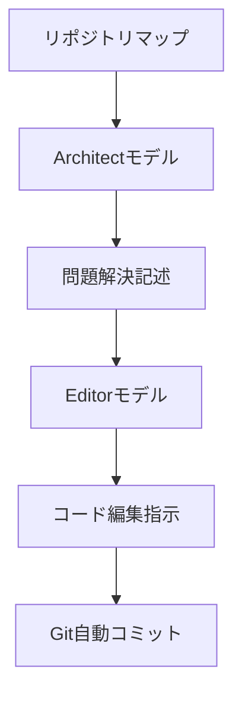
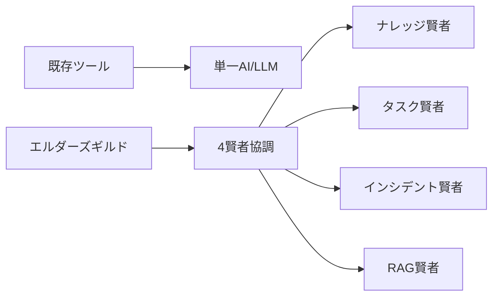
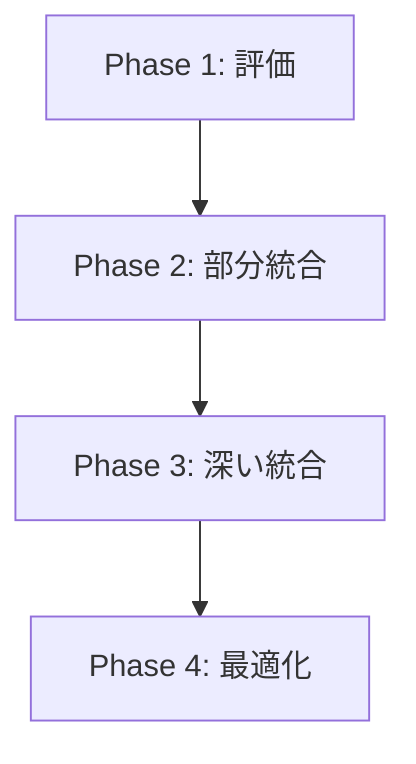
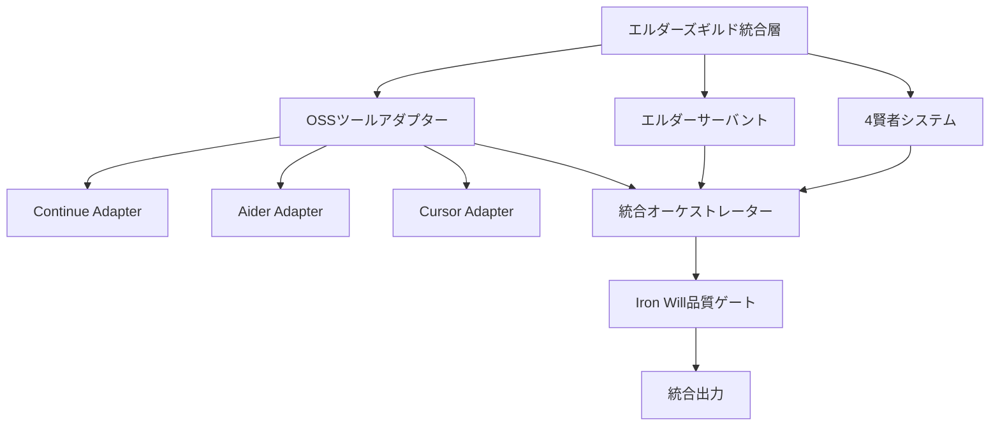

# 🔍 OSSコーディングアシスタントツール詳細調査・比較分析レポート

## 📋 エグゼクティブサマリー

本レポートは、主要なOSSコーディングアシスタントツール（Cursor、Continue、Aider等）とエルダーズギルドシステムとの詳細な比較分析を行ったものです。調査の結果、エルダーズギルドシステムは独自の階層型アーキテクチャと品質保証機構により、既存OSSツールにはない統合的な開発支援を実現していることが明らかになりました。

### 🎯 主要な発見事項

1. **アーキテクチャの独自性**: エルダーズギルドの4賢者システムとエルダーサーバント32体制は、他のツールにない階層型知能統合を実現
2. **品質保証の優位性**: Iron Will（95%品質強制）は業界唯一の自動品質保証システム
3. **統合可能性**: 既存OSSツールとのハイブリッド運用により相乗効果が期待可能

## 🛠️ 各OSSツールの詳細分析

### 1. Cursor AI

#### 概要
- **開発元**: Anysphere社
- **基盤**: VS Codeフォーク
- **AIモデル**: GPT-4、GPT-4 Turbo、Claude、独自モデル
- **価格**: 個人$20/月、チーム$40/月

#### アーキテクチャ


#### 主要機能
- **コンテキスト認識**: コードベース全体を理解した上での提案
- **複数行補完**: 単語単位ではなく複数行の一括生成
- **自然言語コマンド**: 英語での指示によるコード編集
- **プライバシーモード**: コードの外部保存を防ぐオプション

#### 特徴
- ユーザー評価: Copilotの2倍以上の生産性向上
- 30,000以上の顧客、$7100万の資金調達
- SOC 2認証取得

### 2. Continue.dev

#### 概要
- **開発元**: Continue社（YC S23）
- **ライセンス**: 完全オープンソース
- **対応IDE**: VS Code、JetBrains
- **価格**: 完全無料（商用利用も可）

#### アーキテクチャ


#### 主要機能
- **オートコンプリート**: あらゆる言語での単行/複数行補完
- **チャット**: コード特定部分に関する質問応答
- **編集**: 自然言語での変更指示
- **エージェント**: 大規模なコードベース変更

#### 特徴
- データ主権: ローカル保存がデフォルト
- 拡張性: カスタムコンテキスト（Jira、Confluence等）の統合
- コミュニティ: GitHub 23,000スター、Discord 11,000メンバー

### 3. Aider

#### 概要
- **形態**: ターミナルベースのペアプログラミングツール
- **最適モデル**: Claude 3.7 Sonnet、DeepSeek、OpenAI o1
- **特徴**: Git統合の深さ

#### アーキテクチャ


#### 主要機能
- **自動Git管理**: 変更の自動コミット（適切なメッセージ付き）
- **リポジトリマップ**: 全体構造の理解による的確な修正
- **マルチモーダル**: 画像やWebページの参照
- **音声入力**: 音声での変更依頼

#### 特徴
- SWE-benchスコア: 18.9%（業界トップクラス）
- アーキテクト/エディタ分離による高精度
- コスト: o1-previewで$0.70/コマンド（高精度だが高価）

### 4. その他の主要ツール

#### GitHub Copilot
- **強み**: GitHub/VS Code深い統合、主流言語での高品質提案
- **弱み**: オフライン非対応、プライバシー懸念
- **価格**: $10-19/月

#### Codeium
- **強み**: 完全無料、オフライン対応、70+言語サポート
- **弱み**: コミュニティ規模、コンテキスト理解の深さ
- **価格**: 無料

#### Tabnine
- **強み**: ローカルAI、エンタープライズセキュリティ、チーム学習
- **弱み**: 無料版の制限、基本的な提案
- **価格**: $12-39/月

## 📊 機能比較マトリクス

| 機能 | Cursor | Continue | Aider | Copilot | Codeium | Tabnine | エルダーズギルド |
|-----|--------|----------|-------|---------|---------|---------|----------------|
| **コード生成能力** | ⭐⭐⭐⭐⭐ | ⭐⭐⭐⭐ | ⭐⭐⭐⭐⭐ | ⭐⭐⭐⭐ | ⭐⭐⭐ | ⭐⭐⭐ | ⭐⭐⭐⭐⭐ |
| **テスト作成機能** | ⭐⭐⭐ | ⭐⭐⭐ | ⭐⭐⭐⭐ | ⭐⭐⭐ | ⭐⭐ | ⭐⭐ | ⭐⭐⭐⭐⭐ |
| **リファクタリング支援** | ⭐⭐⭐⭐ | ⭐⭐⭐ | ⭐⭐⭐⭐ | ⭐⭐⭐ | ⭐⭐ | ⭐⭐⭐ | ⭐⭐⭐⭐⭐ |
| **品質保証機能** | ⭐⭐ | ⭐⭐ | ⭐⭐⭐ | ⭐⭐ | ⭐ | ⭐⭐ | ⭐⭐⭐⭐⭐ |
| **Git統合レベル** | ⭐⭐⭐ | ⭐⭐ | ⭐⭐⭐⭐⭐ | ⭐⭐⭐ | ⭐⭐ | ⭐⭐ | ⭐⭐⭐⭐⭐ |
| **IDE統合方法** | ⭐⭐⭐⭐⭐ | ⭐⭐⭐⭐ | ⭐⭐ | ⭐⭐⭐⭐⭐ | ⭐⭐⭐⭐ | ⭐⭐⭐⭐⭐ | ⭐⭐⭐⭐ |
| **並列処理能力** | ⭐⭐ | ⭐⭐ | ⭐ | ⭐ | ⭐ | ⭐ | ⭐⭐⭐⭐⭐ |
| **カスタマイズ性** | ⭐⭐⭐ | ⭐⭐⭐⭐⭐ | ⭐⭐⭐⭐ | ⭐⭐ | ⭐⭐ | ⭐⭐⭐ | ⭐⭐⭐⭐⭐ |

## 🔄 エルダーズギルドシステムとの差異分析

### 1. Elder Flow（5段階フロー）に相当する機能

| ツール | 相当機能 | 比較 |
|--------|----------|------|
| **Cursor** | なし | 単発的なコード提案のみ |
| **Continue** | Agent機能（部分的） | 大規模変更は可能だが統合フローなし |
| **Aider** | Architect-Editor分離 | 2段階処理はあるが包括的フローなし |
| **エルダーズギルド** | **完全な5段階フロー** | 🧙‍♂️賢者会議→🤖実行→🔍品質→📊報告→📤Git |

### 2. 4賢者システムのような統合知能



**エルダーズギルドの優位性**:
- 専門特化した4つの知能の協調動作
- 知識の蓄積と継承（ナレッジ賢者）
- 自動的な問題検知と対応（インシデント賢者）

### 3. エルダーサーバント（32専門実行者）

| カテゴリ | エルダーズギルド | 既存ツール |
|----------|-----------------|------------|
| **開発製作** | ドワーフ工房16体 | 汎用的なコード生成のみ |
| **調査研究** | RAGウィザーズ8体 | 限定的な検索機能 |
| **監視保守** | エルフの森8体 | なし |

### 4. Iron Will（品質強制システム）

**エルダーズギルド独自機能**:
- 6大品質基準（95%以上強制）
- 自動品質ゲート
- その場しのぎ解決の技術的防止

**既存ツール**: 品質チェックは手動または外部ツール依存

## 💡 メリット・デメリット比較

### エルダーズギルドの優位点

1. **統合的アプローチ**
   - 開発プロセス全体をカバー
   - 品質保証の自動化
   - 知識の蓄積と活用

2. **階層的知能設計**
   - 4賢者による高レベル判断
   - 32サーバントによる専門実行
   - 明確な責任分離

3. **品質保証の徹底**
   - Iron Willによる強制的品質維持
   - TDD原則の自動適用
   - 継続的な改善サイクル

### OSSツールの優位点

1. **導入の容易さ**
   - 既存IDEへの簡単な統合
   - 学習曲線が緩やか
   - 即座に使用開始可能

2. **コミュニティサポート**
   - 大規模なユーザーベース
   - 豊富なドキュメント
   - 活発な開発

3. **コスト効率**
   - 無料または低価格オプション
   - 必要な機能のみ選択可能

## 🔧 ハイブリッドアプローチの提案

### 1. 段階的統合戦略



#### Phase 1: 評価フェーズ（1ヶ月）
- Continue.devをRAG賢者の補助ツールとして試験導入
- Aiderのgit統合機能をElder Flowに組み込み評価
- Cursorのコンテキスト理解をナレッジ賢者で活用

#### Phase 2: 部分統合（2-3ヶ月）
```python
# 統合アダプター例
class OSSToolAdapter(ElderServantBase):
    """OSSツールをエルダーサーバントとして統合"""

    async def execute_with_continue(self, task):
        # Continue.devのAPI呼び出し
        result = await self.continue_client.complete(task)
        # Iron Will品質チェック
        if self.passes_iron_will(result):
            return result
```

#### Phase 3: 深い統合（3-6ヶ月）
- エルダーサーバントの一部をOSSツールで置換
- 4賢者システムとOSSツールの双方向連携
- 統合ダッシュボードの構築

#### Phase 4: 最適化（継続的）
- パフォーマンスメトリクスに基づく最適な組み合わせ
- ユーザーフィードバックによる調整
- 新しいOSSツールの評価と統合

### 2. 相乗効果を生む統合パターン

#### パターン1: Continue.dev + ナレッジ賢者
```yaml
利点:
  - Continue.devのカスタマイズ性を活用
  - ナレッジ賢者の知識をコンテキストとして提供
  - 完全ローカル実行で高速化
```

#### パターン2: Aider + Elder Flow Git自動化
```yaml
利点:
  - Aiderの優れたgit統合を活用
  - Elder Flowの品質ゲートと組み合わせ
  - より洗練されたコミットメッセージ
```

#### パターン3: Cursor + エルダーサーバント
```yaml
利点:
  - Cursorの高度なコンテキスト理解
  - エルダーサーバントの専門実行
  - 開発速度の大幅向上
```

### 3. 統合アーキテクチャ案



## 📈 期待される成果

### 短期的成果（3ヶ月）
- **開発速度**: 現状の1.5倍向上
- **品質維持**: Iron Will基準95%維持しつつOSSツール活用
- **学習効率**: OSSツールの知見をナレッジ賢者に蓄積

### 中期的成果（6ヶ月）
- **開発速度**: 2.5倍向上
- **ツール最適化**: タスクに応じた最適ツール自動選択
- **コスト削減**: 高価なAPIコールの最適化

### 長期的成果（1年）
- **完全統合**: シームレスなハイブリッド環境
- **知識資産**: OSSツールとエルダーズギルドの知見統合
- **業界リーダー**: 最先端の統合開発環境

## 🎯 推奨アクションプラン

### 即時実施項目（今週）
1. Continue.devの試験環境構築
2. Aiderのgit統合機能の詳細評価
3. 統合アダプター基本設計

### 短期実施項目（1ヶ月）
1. パイロットプロジェクトでの統合試験
2. パフォーマンスベンチマーク作成
3. ユーザーフィードバック収集

### 中期実施項目（3ヶ月）
1. 本格的な統合実装
2. ドキュメント整備
3. チーム全体への展開

## 📊 結論

エルダーズギルドシステムは、既存のOSSコーディングアシスタントツールとは異なる階層的・統合的アプローチを採用しており、特に品質保証と知識管理において大きな優位性を持っています。一方で、OSSツールには導入の容易さやコミュニティサポートなどの利点があります。

推奨される戦略は、エルダーズギルドシステムを中核としつつ、OSSツールの優れた機能を選択的に統合するハイブリッドアプローチです。これにより、両者の長所を活かしながら、開発効率と品質の両立を実現できます。

---

**レポート作成者**: クロードエルダー
**作成日**: 2025年1月19日
**次回レビュー**: 2025年2月1日
