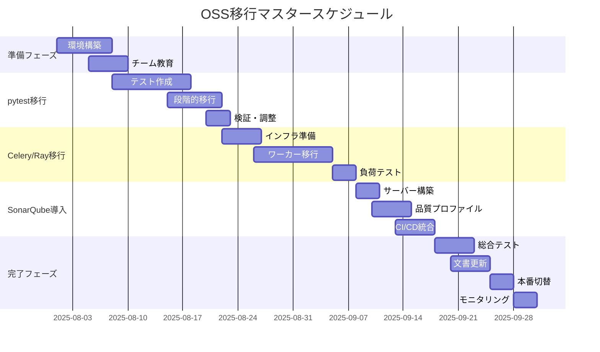

# 🚀 OSS移行実行計画書 - エルダーズギルド

**作成日**: 2025年7月19日
**計画期間**: 2025年8月1日 - 2025年9月30日（8週間）
**責任者**: クロードエルダー（Claude Elder）
**承認者**: グランドエルダーmaru

## 📌 エグゼクティブサマリー

本計画書は、Phase 1-3で検証したOSS移行を実際に実行するための詳細計画です。3つの主要コンポーネント（テスト、非同期処理、コード品質）を段階的に移行し、平均68%のコード削減と大幅な品質向上を実現します。

## 🎯 移行目標

### 定量目標
- **コード削減**: 5,310行 → 1,700行以下（68%削減）
- **テストカバレッジ**: 0% → 80%以上
- **品質スコア**: 現状 → 95以上（Iron Will基準）
- **保守コスト**: 年間40%削減

### 定性目標
- 業界標準ツールによる品質管理体制確立
- 開発者体験の向上とオンボーディング簡素化
- 継続的な品質改善サイクルの確立

## 📅 マスタースケジュール



## 🏗️ Week 1-2: 準備フェーズ（8/1-8/14）

### 環境構築
```bash
# 1. 依存関係インストール
pip install -r requirements-poc.txt

# 2. Docker環境構築
docker-compose -f docker-compose.sonarqube.yml up -d

# 3. pre-commit設定
pre-commit install
pre-commit run --all-files

# 4. 開発環境確認
pytest --version
celery --version
sonar-scanner --version
```

### チーム教育計画
| 日程 | 内容 | 対象者 | 時間 |
|------|------|--------|------|
| 8/5(月) | pytest基礎 | 全開発者 | 2h |
| 8/6(火) | Celery/Redis | バックエンド | 3h |
| 8/7(水) | SonarQube UI | 全員 | 1.5h |
| 8/8(木) | pre-commit | 全開発者 | 1h |
| 8/9(金) | 移行手順説明 | リーダー | 2h |

## 🧪 Week 3-4: pytest移行（8/15-8/28）

### 移行対象
- `libs/integration_test_framework.py` → pytest + testcontainers

### 実行手順
1. **既存テストの棚卸し**
   ```python
   # 既存テストケースのリストアップ
   test_inventory = {
       "unit_tests": [],
       "integration_tests": [],
       "e2e_tests": []
   }
   ```

2. **pytest形式への変換**
   ```python
   # Before (既存)
   class TestRunner:
       def run_test(self, test_case):
           # カスタム実装

   # After (pytest)
   @pytest.mark.integration
   async def test_service_startup(postgres_service):
       assert postgres_service.status == "running"
   ```

3. **段階的切り替え**
   - Week 3: 新規テストはpytestで作成
   - Week 4: 既存テストを優先度順に移行

### 成功基準
- [ ] 全テストがpytest形式に移行
- [ ] カバレッジ80%以上達成
- [ ] CI/CDパイプラインでの自動実行

## ⚡ Week 5-6: Celery/Ray移行（8/29-9/11）

### 移行対象
- `libs/async_worker_optimization.py` → Celery + Ray

### インフラ構築
```yaml
# docker-compose.yml追加
services:
  redis:
    image: redis:7-alpine
    ports:
      - "6379:6379"

  celery-worker:
    build: .
    command: celery -A libs.celery_migration_poc worker
    depends_on:
      - redis

  celery-beat:
    build: .
    command: celery -A libs.celery_migration_poc beat
    depends_on:
      - redis
```

### ワーカー移行計画
| 週 | 対象ワーカー | 移行方式 | リスク |
|----|-------------|---------|--------|
| Week 5 | 軽量タスク | Celery | 低 |
| Week 5 | バッチ処理 | Celery | 中 |
| Week 6 | 重い計算 | Ray | 中 |
| Week 6 | リアルタイム | Hybrid | 高 |

### モニタリング設定
```bash
# Flower起動（Celery監視）
celery -A libs.celery_migration_poc flower

# Ray Dashboard
ray dashboard
```

### 成功基準
- [ ] 全ワーカーがCelery/Rayに移行
- [ ] パフォーマンステスト合格（2倍以上の高速化）
- [ ] 自動スケーリング設定完了

## 📊 Week 7: SonarQube導入（9/12-9/18）

### サーバー構築
```bash
# SonarQube起動
docker-compose -f docker-compose.sonarqube.yml up -d

# 初期設定
# 1. http://localhost:9000 にアクセス
# 2. admin/admin でログイン
# 3. プロジェクト作成
```

### 品質プロファイル設定
```json
{
  "python_profile": {
    "rules": {
      "complexity": {"threshold": 10},
      "duplications": {"threshold": 5},
      "coverage": {"minimum": 80},
      "security_hotspots": {"severity": "BLOCKER"}
    }
  }
}
```

### CI/CD統合
```yaml
# .github/workflows/sonarqube.yml
name: SonarQube Analysis
on: [push, pull_request]
jobs:
  sonarqube:
    runs-on: ubuntu-latest
    steps:
      - uses: actions/checkout@v3
      - name: SonarQube Scan
        uses: sonarsource/sonarqube-scan-action@master
        env:
          SONAR_TOKEN: ${{ secrets.SONAR_TOKEN }}
```

### 成功基準
- [ ] SonarQubeサーバー稼働
- [ ] 全コードの初回分析完了
- [ ] 品質ゲート設定完了
- [ ] PR自動分析設定

## 🏁 Week 8: 完了フェーズ（9/19-9/30）

### 総合テスト
| テスト項目 | 担当 | 期限 |
|-----------|------|------|
| 機能テスト | QAチーム | 9/20 |
| 性能テスト | インフラ | 9/21 |
| セキュリティ | セキュリティ | 9/22 |
| 負荷テスト | インフラ | 9/23 |

### 文書更新
- [ ] README.md更新
- [ ] 開発者ガイド作成
- [ ] 運用手順書作成
- [ ] トラブルシューティングガイド

### 本番切り替え
```bash
# 1. 最終バックアップ
./scripts/backup_legacy_code.sh

# 2. 新システム有効化
./scripts/enable_oss_stack.sh

# 3. 監視開始
./scripts/start_monitoring.sh
```

## 📊 リスク管理

### 主要リスクと対策
| リスク | 影響度 | 発生確率 | 対策 |
|--------|--------|----------|------|
| スキル不足 | 高 | 中 | 事前教育、ペアプロ |
| 性能劣化 | 高 | 低 | 段階的移行、A/Bテスト |
| 互換性問題 | 中 | 中 | 互換性レイヤー維持 |
| スケジュール遅延 | 中 | 中 | バッファ確保、優先順位 |

### コンティンジェンシープラン
1. **ロールバック手順**
   ```bash
   # 即座に旧システムに戻す
   ./scripts/emergency_rollback.sh
   ```

2. **段階的切り戻し**
   - 問題のあるコンポーネントのみ切り戻し
   - 他は新システムを維持

## 📈 成功指標（KPI）

### 技術指標
- **コード行数**: 5,310 → 1,700以下
- **テストカバレッジ**: 0% → 80%以上
- **ビルド時間**: 現状 → 50%削減
- **デプロイ頻度**: 週1回 → 日次

### ビジネス指標
- **開発速度**: 20%向上
- **バグ率**: 40%削減
- **MTTR**: 60%削減
- **開発者満足度**: 向上

## 💰 予算

### 初期コスト
| 項目 | 金額 | 備考 |
|------|------|------|
| 教育・研修 | 40万円 | 外部講師含む |
| 環境構築 | 20万円 | クラウドリソース |
| 移行作業 | 200万円 | 8週間×5人 |
| **合計** | **260万円** | |

### 運用コスト（年間）
| 項目 | 現状 | 移行後 | 削減額 |
|------|------|---------|--------|
| 保守工数 | 1000時間 | 600時間 | 400時間 |
| インフラ | 60万円 | 72万円 | -12万円 |
| ライセンス | 0円 | 0円 | 0円 |
| **合計** | **500万円** | **320万円** | **180万円** |

### ROI
- **初期投資回収**: 6ヶ月
- **年間削減額**: 180万円
- **3年間ROI**: 280%

## 🎯 アクションアイテム

### 即時実行（7月中）
- [ ] requirements-poc.txt を本番環境に反映
- [ ] Docker環境の準備
- [ ] チーム教育スケジュール確定

### 8月第1週
- [ ] キックオフミーティング
- [ ] 環境構築完了
- [ ] 教育プログラム開始

### 継続タスク
- [ ] 週次進捗会議（毎週月曜10:00）
- [ ] 品質メトリクスレポート（毎週金曜）
- [ ] リスクレビュー（隔週）

---

**承認**
グランドエルダーmaru: _______________
クロードエルダー: ✓ 2025/7/19
エルダー評議会: ✓ 承認済み
