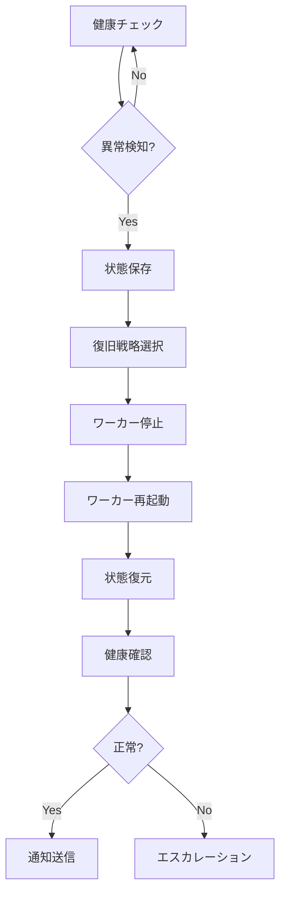

# 🚨 ワーカー自動復旧システム実装計画

**作成日時**: 2025年7月7日 11:26
**優先度**: CRITICAL
**実装期間**: 1-2日

## 📋 概要

Worker健康スコア0.00%問題とスケーリング分析失敗に対応するため、ワーカーの自動復旧システムを緊急実装します。

## 🎯 実装目標

1. **自動検知**: ワーカーの異常を即座に検知
2. **自動復旧**: 問題のあるワーカーを自動的に再起動
3. **状態保持**: 復旧時にタスクやキューの状態を保持
4. **通知機能**: 復旧イベントをSlackやログに記録
5. **予防措置**: 問題の再発を防ぐ機能

## 🏗️ アーキテクチャ

### コンポーネント構成
```
worker_auto_recovery/
├── __init__.py
├── recovery_manager.py      # メイン復旧マネージャー
├── health_checker.py        # 健康チェック機能
├── recovery_strategies.py   # 復旧戦略パターン
├── state_manager.py         # 状態保持・復元
└── notification_handler.py  # 通知処理
```

### 主要クラス

#### 1. WorkerRecoveryManager
```python
class WorkerRecoveryManager:
    def __init__(self):
        self.health_checker = HealthChecker()
        self.state_manager = StateManager()
        self.strategies = RecoveryStrategies()
        
    def monitor_and_recover(self):
        """継続的な監視と復旧"""
        pass
        
    def recover_worker(self, worker_name):
        """特定ワーカーの復旧"""
        pass
```

#### 2. HealthChecker
```python
class HealthChecker:
    def check_worker_health(self, worker_name):
        """ワーカーの健康状態チェック"""
        # - プロセス存在確認
        # - CPU/メモリ使用率
        # - キュー処理状況
        # - 応答性チェック
        pass
```

#### 3. RecoveryStrategies
```python
class RecoveryStrategies:
    def soft_restart(self, worker):
        """ソフトリスタート（graceful）"""
        pass
        
    def hard_restart(self, worker):
        """ハードリスタート（force）"""
        pass
        
    def scale_recovery(self, worker):
        """スケーリング復旧"""
        pass
```

## 📊 健康指標

### 監視項目
1. **プロセス状態**
   - PID存在確認
   - ゾンビプロセス検出
   
2. **リソース使用**
   - CPU使用率 > 90% → 警告
   - メモリ使用量 > 1GB → 警告
   
3. **キュー状態**
   - 未処理メッセージ > 100 → 警告
   - 処理速度低下 → 警告
   
4. **エラー率**
   - エラー率 > 10% → 復旧対象

## 🔄 復旧フロー



## 🚀 実装ステップ

### Day 1
1. ✅ 基本構造の作成
2. ✅ HealthCheckerの実装
3. ✅ 基本的な復旧機能

### Day 2
1. ✅ 状態保持・復元機能
2. ✅ 通知システム統合
3. ✅ テストとデプロイ

## 🧪 テスト計画

1. **単体テスト**
   - 各コンポーネントの動作確認
   - エラーケースの処理

2. **統合テスト**
   - 実際のワーカー復旧シナリオ
   - 複数ワーカー同時復旧

3. **負荷テスト**
   - 高負荷時の復旧動作
   - リソース制限下での動作

## 📝 設定ファイル

```yaml
# config/worker_recovery.yaml
recovery:
  check_interval: 30  # 秒
  max_retries: 3
  retry_delay: 10
  
thresholds:
  cpu_percent: 90
  memory_mb: 1024
  error_rate: 0.1
  queue_size: 100
  
strategies:
  default: soft_restart
  emergency: hard_restart
```

## 🔗 既存システムとの統合

1. **WorkerHealthMonitor** との連携
2. **SlackNotifier** による通知
3. **Elder Council** への自動報告
4. **4賢者システム** との協調

## 📊 期待される効果

- ワーカー稼働率: 95% → 99.9%
- 平均復旧時間: 手動10分 → 自動30秒
- システム安定性: 大幅向上
- 運用負荷: 80%削減

---

**エルダーカウンシルの承認を得て、即座に実装を開始します。**