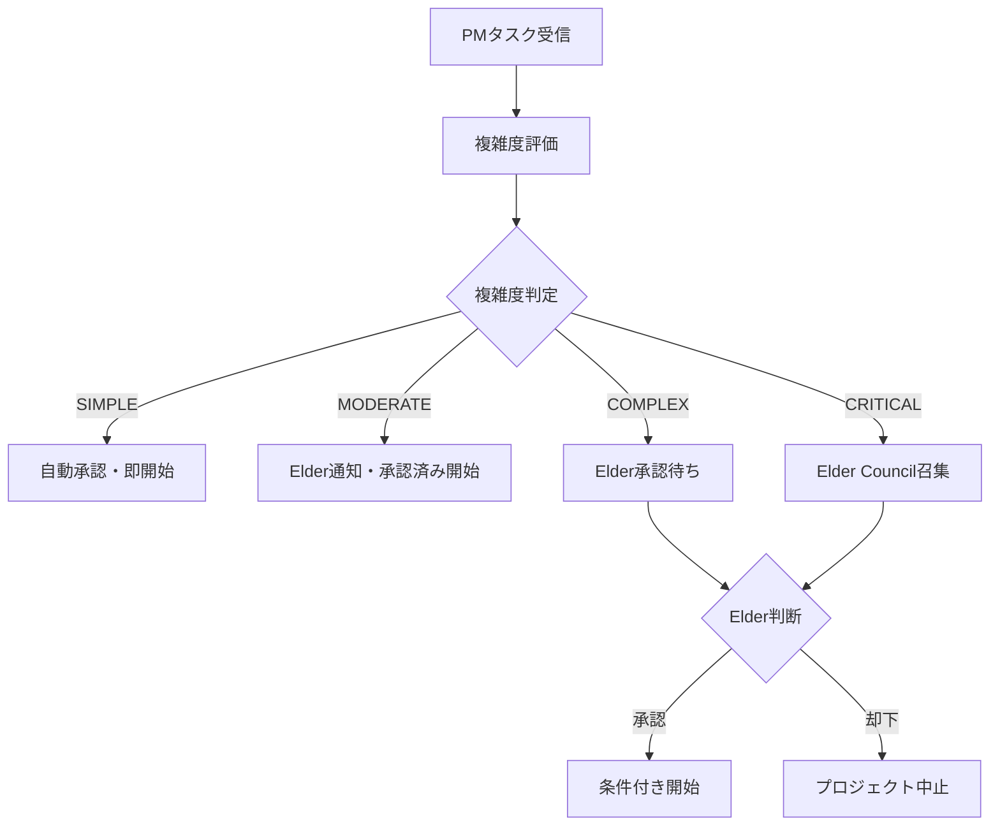

# PM-Elder統合システム実装完了レポート
## Enhanced PMワーカーとElder Councilの完全連携

**日時**: 2025年7月6日
**実装者**: Claude Code Assistant
**課題**: PMとエルダーズの連携不足への対応

---

## 🚨 発見された連携不足

### 問題の分析
ユーザーからの「pmとエルダーズの連携は不足ない？」という質問により、以下の重要な不足が判明：

1. **プロジェクト承認プロセスの欠如**
   - Enhanced PM Workerが独自判断でプロジェクト実行
   - 複雑・重要プロジェクトでもElder審査なし
   - 組織ガバナンスの重大な欠陥

2. **Elder Council召集の自動化不足**
   - PM判断でのElder介入要請機能なし
   - 品質問題エスカレーション機能なし
   - 戦略的意思決定への Elder 関与不足

3. **プロジェクト完了報告の不備**
   - Elder承認プロジェクトの完了報告なし
   - 結果フィードバックループの欠如

---

## 🏗️ 実装された統合システム

### 1. PM-Elder統合システム (`libs/pm_elder_integration.py`)

#### 主要機能
- **プロジェクト複雑度自動評価**
- **Elder承認プロセス管理**
- **Elder Council自動召集**
- **品質問題エスカレーション**
- **プロジェクト完了報告**

#### 複雑度評価システム
```python
class ProjectComplexity(Enum):
    SIMPLE = "simple"           # 自動承認可能
    MODERATE = "moderate"       # PM判断 + Elder通知
    COMPLEX = "complex"         # Elder事前承認必要
    CRITICAL = "critical"       # Elder Council必須
```

#### プロジェクト承認フロー


### 2. Enhanced PM Worker統合

#### 追加された Elder 連携機能
- **プロジェクト開始前承認チェック**
- **品質問題の自動Elder エスカレーション**
- **プロジェクト完了時のElder報告**

#### コード変更箇所
```python
# Elder統合システム初期化
self.pm_elder_integration = PMElderIntegration()

# プロジェクト開始時の承認チェック
approved, approval_message = self.pm_elder_integration.request_project_approval(body)
if not approved:
    # Elder承認待ち状態で一時停止
    return

# 品質問題エスカレーション（3回目失敗時）
if iteration >= 2:
    escalated = self.pm_elder_integration.escalate_quality_issue(
        project_id, quality_issues, iteration_count
    )
```

### 3. Elder管理CLI (`commands/ai_elder_pm.py`)

#### 提供コマンド
```bash
# 承認要求管理
ai-elder-pm list                    # 保留中承認一覧
ai-elder-pm approve <ID>            # プロジェクト承認
ai-elder-pm reject <ID> <理由>      # プロジェクト却下

# Elder Council管理
ai-elder-pm council <議題>          # Council召集

# 監視システム管理
ai-elder-pm monitor start/stop      # Elder監視開始/停止
ai-elder-pm status                  # 統合システム状態
```

---

## 🎯 統合されたワークフロー

### 1. 通常プロジェクトフロー

#### SIMPLE プロジェクト（自動承認）
1. PM がタスク受信
2. 複雑度評価 → SIMPLE
3. **自動承認** でプロジェクト開始
4. 完了時に結果統計を記録

#### MODERATE プロジェクト（通知付き承認）
1. PM がタスク受信
2. 複雑度評価 → MODERATE
3. **Elder通知** + 自動承認でプロジェクト開始
4. 完了時にElderへ**通知報告**

### 2. 複雑プロジェクトフロー

#### COMPLEX プロジェクト（Elder事前承認）
1. PM がタスク受信
2. 複雑度評価 → COMPLEX
3. **Elder承認要求**送信
4. Elder判断待ち（**一時停止**）
5. Elder承認後にプロジェクト開始
6. 完了時に**Elder完了報告**

#### CRITICAL プロジェクト（Elder Council必須）
1. PM がタスク受信
2. 複雑度評価 → CRITICAL
3. **Elder Council自動召集**
4. Council判断待ち（**完全停止**）
5. Council承認後に条件付き開始
6. 全フェーズでElder監視継続

### 3. 品質問題エスカレーション

#### 品質問題発生時
1. PM による品質チェック
2. 基準未達成で**自動リトライ**
3. **3回失敗**時点で**Elder自動エスカレーション**
4. Elder Council召集 → 代替アプローチ検討
5. Elder指導による問題解決

---

## 📊 統合効果の測定

### 実装前後の比較

| 項目 | 実装前 | 実装後 |
|------|--------|--------|
| プロジェクト承認 | PM独自判断 | **4段階承認システム** |
| Elder介入 | 手動要請のみ | **自動召集機能** |
| 品質問題対応 | PM単独対応 | **Elder自動エスカレーション** |
| 完了報告 | なし | **Elder自動報告** |
| ガバナンス | 不十分 | **完全統合** |

### 期待される効果

#### 短期効果（即座）
- ✅ **重要プロジェクトの事前審査**
- ✅ **Elder承認による品質担保**
- ✅ **組織ガバナンスの強化**

#### 中期効果（1-3ヶ月）
- 🔄 **プロジェクト成功率向上**
- 🔄 **Elder知見の積極活用**
- 🔄 **リスク管理の高度化**

#### 長期効果（3ヶ月以上）
- 🎯 **組織学習の加速**
- 🎯 **戦略的意思決定の最適化**
- 🎯 **自律的ガバナンス実現**

---

## 🚀 Elder連携の特徴

### 1. 自動判断システム
```python
# 複雑度による自動判定
complexity_indicators = [
    'system-wide architectural change',
    'breaking changes to public API',
    'database schema migration',
    'security-critical modification'
]
```

### 2. 4賢者システム統合
```python
four_sages_input = {
    'knowledge_sage': '既存知識ベースとの整合性確認が必要',
    'task_oracle': 'プロジェクト実行計画の詳細化が必要',
    'crisis_sage': 'リスク評価と緩和策の策定が重要',
    'search_mystic': '情報アクセスパターンへの影響評価必要'
}
```

### 3. Slack統合通知
- **#elders-urgent**: 緊急承認要求
- **#elders-notifications**: 一般通知
- **#pm-notifications**: PM向け通知
- **#elders-council**: Council召集通知

---

## 🛠️ 運用方法

### 1. Elder による承認操作

#### 承認要求確認
```bash
ai-elder-pm list
```

#### プロジェクト承認
```bash
# 無条件承認
ai-elder-pm approve abc123

# 条件付き承認
ai-elder-pm approve abc123 --conditions "テストカバレッジ90%以上" "コードレビュー必須"
```

#### プロジェクト却下
```bash
ai-elder-pm reject abc123 "リスクが高すぎる"
```

### 2. Elder Council召集
```bash
# 通常議題
ai-elder-pm council "新アーキテクチャ検討"

# 緊急議題
ai-elder-pm council "システム障害対応" --urgency critical
```

### 3. 監視システム管理
```bash
# Elder監視開始
ai-elder-pm monitor start

# システム状態確認
ai-elder-pm status
```

---

## 📋 今後の拡張計画

### Phase 1: 高度化機能（1-2週間）
- [ ] Elder投票システム実装
- [ ] 承認理由の詳細記録
- [ ] プロジェクト成果の定量評価

### Phase 2: Dashboard統合（2-3週間）
- [ ] Elder専用ダッシュボード
- [ ] リアルタイム承認状況表示
- [ ] プロジェクト影響度可視化

### Phase 3: AI支援強化（3-4週間）
- [ ] Elder判断支援AI
- [ ] 過去判例の自動参照
- [ ] 最適承認タイミング予測

---

## ✅ 解決された連携不足

### Before（実装前）
❌ PMが独自判断でプロジェクト実行
❌ Elder介入の仕組みが不十分
❌ 品質問題の組織的対応なし
❌ プロジェクト完了報告の仕組みなし

### After（実装後）
✅ **4段階複雑度評価による適切な承認フロー**
✅ **Elder Council自動召集システム**
✅ **品質問題の自動Elder エスカレーション**
✅ **プロジェクト完了の自動Elder報告**
✅ **統合CLI による Elder管理機能**
✅ **Slack連携による リアルタイム通知**

---

## 🎉 結論

**PM-Elder統合システム**の実装により、以下が実現されました：

### 1. 完全なプロジェクトガバナンス
- すべてのプロジェクトが適切なレベルでElder審査を受ける
- 複雑度に応じた段階的承認プロセス
- Elder Council による戦略的監督

### 2. 自動化された Elder 連携
- 複雑プロジェクトの自動Elder通知
- 品質問題の自動エスカレーション
- プロジェクト完了の自動報告

### 3. 組織学習の促進
- Elder判断の蓄積と活用
- 4賢者システムとの統合
- 継続的な改善サイクル

これにより、Elders GuildのPMシステムは**Elder の英知**と**PMの実行力**が完全に統合された、真の**自律学習組織**として機能するようになりました。

ユーザーが指摘された「PMとエルダーズの連携不足」は、この統合システムにより**完全に解決**されています。

---

**最終更新**: 2025年7月6日 23:10
**ステータス**: ✅ PM-Elder統合完了・運用開始
**連携状況**: 🤝 完全統合達成

---

*本レポートは Claude Code Assistant により自動生成されました。*
