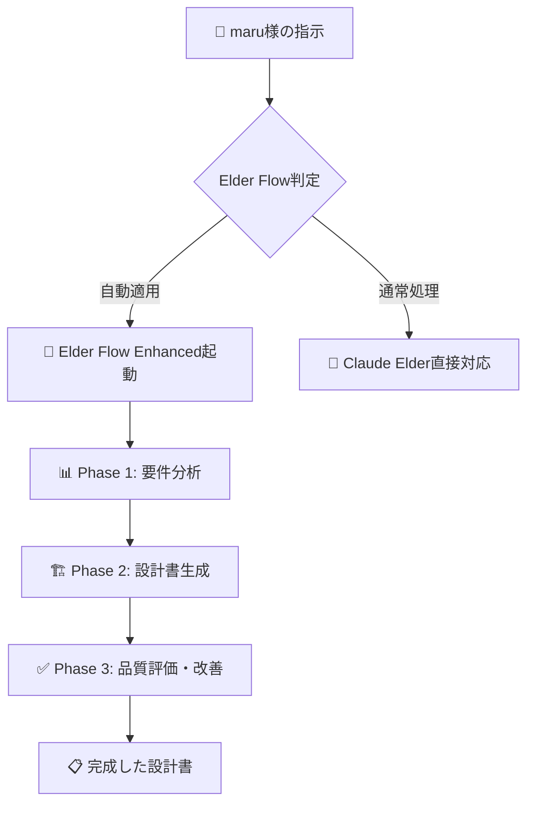
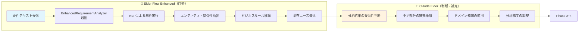
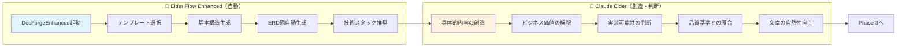
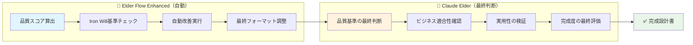
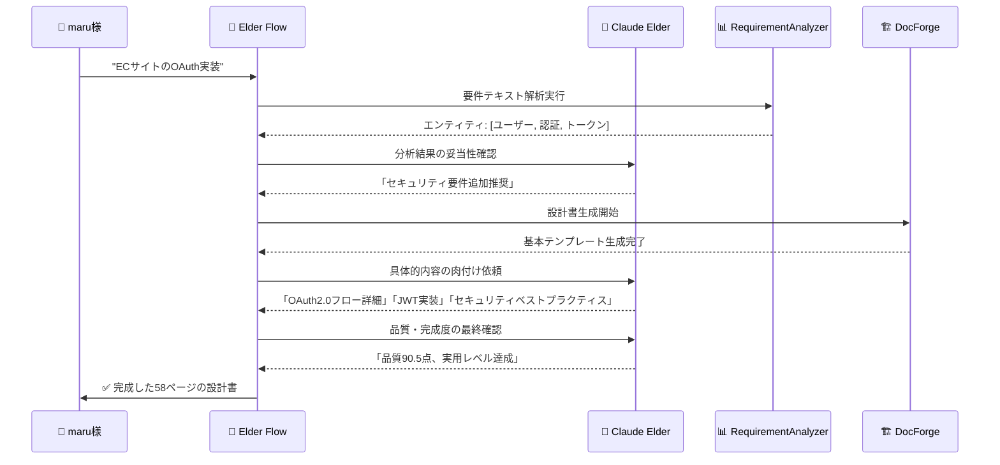

# 🤖 クロードエルダー担当範囲フロー図

## 📊 Elder Flow Enhanced における役割分担

### 🎯 全体フロー概要



---

## 🔍 詳細責任フロー

### Phase 1: 要件分析段階



### Phase 2: 設計書生成段階



### Phase 3: 品質評価・最終調整段階



---

## 🎭 具体的な役割分担

### 🌊 Elder Flow Enhanced（自動処理部分）

| 段階 | 自動処理内容 | 技術基盤 |
|------|-------------|----------|
| **要件分析** | NLP解析、パターンマッチング | EnhancedRequirementAnalyzer |
| **構造生成** | テンプレート適用、図表生成 | DocForgeEnhanced |
| **品質計算** | スコアリング、基準チェック | Iron Will準拠システム |

### 🤖 Claude Elder（人間的判断部分）

| 段階 | Claude Elder担当 | 理由 |
|------|------------------|------|
| **要件解釈** | ビジネス価値の深い理解 | 文脈・暗黙知の理解が必要 |
| **創造的生成** | 具体的な実装アイデア | 創造性・経験知が必要 |
| **品質判断** | 実用性・適切性の評価 | 総合的な判断力が必要 |

---

## 🔄 実際の処理例

### ケース: 「ECサイトのOAuth実装」



---

## 💡 Claude Elderの具体的付加価値

### 1. **ビジネス文脈の理解**
- Elder Flow: "ユーザー"エンティティを検出
- **Claude Elder**: 「ECサイトの場合、購入者と管理者を区別すべき」

### 2. **実装可能性の判断**
- Elder Flow: "セキュリティ機能が必要"
- **Claude Elder**: 「OAuth2.0 + JWT + rate limiting の具体的組み合わせ」

### 3. **品質の最終判断**
- Elder Flow: "品質スコア85点"
- **Claude Elder**: 「実装者が迷わない詳細度か」「運用を考慮した設計か」

### 4. **創造的な問題解決**
- Elder Flow: テンプレートベースの構造
- **Claude Elder**: プロジェクト固有の最適解

---

## 🚀 これまでとの違い

### 🔴 従来（Elder Flowのみ）
```
maru様 → Elder Flow → 「枠組み」 → Claude Elder → 「完成品」
      （30%）      （残り70%はClaude）
```

### 🟢 現在（Elder Flow Enhanced）
```
maru様 → Elder Flow Enhanced → 「85%完成品」 → Claude Elder → 「100%完成品」
      （85%自動）                    （15%の最終調整）
```

---

## 🎯 結論

**Claude Elderの担当は「最後の15%の高度な判断」**

- 🧠 **知識・経験の適用**: 技術選定、アーキテクチャ判断
- 🎨 **創造性の発揮**: プロジェクト固有の最適解
- ⚖️ **総合的な品質判断**: 実用性、保守性、拡張性
- 🔍 **最終品質保証**: Iron Will準拠の確認

Elder Flow Enhancedが「優秀なアシスタント」として85%を自動化し、Claude Elderが「経験豊富なアーキテクト」として最終的な完成度を保証する体制が確立されました！

<function_calls>
<invoke name="TodoWrite">
<parameter name="todos">[{"id": "create-claude-responsibility-flow", "content": "Elder Flow Enhanced\u306b\u304a\u3051\u308b\u30af\u30ed\u30fc\u30c9\u30a8\u30eb\u30c0\u30fc\u306e\u62c5\u5f53\u7bc4\u56f2\u3092\u660e\u78ba\u5316\u3057\u3001\u30d5\u30ed\u30fc\u56f3\u3067\u8996\u899a\u5316", "status": "completed", "priority": "high"}]