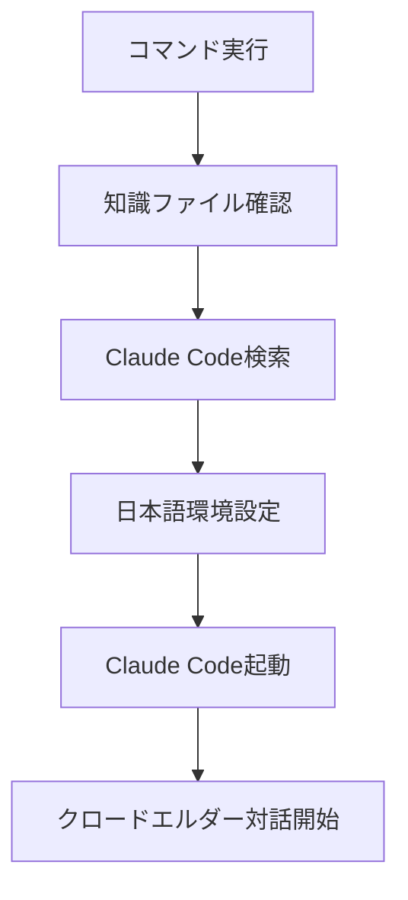
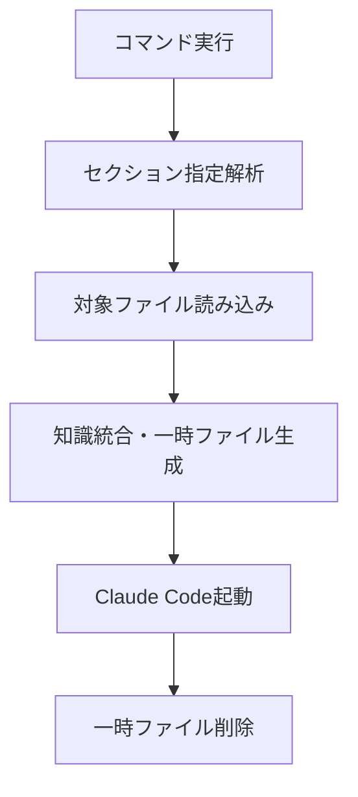

# 🔮 AI Elder Cast 完全仕様書 v3.0

**最終更新**: 2025年7月20日
**重要度**: 🔴 CRITICAL - 超重要コマンド
**バージョン**: 3.0 (最適化・簡素化版)
**ステータス**: ✅ 実装完了・テスト済み

---

## 🎯 概要

AI Elder Castは、Claude Codeに**エルダーズギルドの知識を注入**して**クロードエルダーとして起動**する超重要なコマンド群です。

### 🔥 なぜ超重要か
- **ロストしてはならない**: エルダーズギルドの核心機能
- **唯一無二**: クロードエルダーアイデンティティ注入システム
- **開発基盤**: 全ての Elder Flow の基礎

---

## 🚀 利用可能コマンド

### 1. `ai-elder-cast-simple` (推奨)
```bash
ai-elder-cast-simple
```
- **用途**: 日常開発・通常作業
- **特徴**: シンプル、確実、高速
- **サイズ**: 8KB（中間版）
- **起動時間**: 約3秒

### 2. `ai-elder-cast-modular` (柔軟版)
```bash
# 基本使用例
ai-elder-cast-modular                    # デフォルト（core）
ai-elder-cast-modular medium             # 中間版（推奨）
ai-elder-cast-modular core sages tdd     # 複数セクション
ai-elder-cast-modular --list             # 利用可能セクション一覧
```
- **用途**: カスタマイズした知識セット
- **特徴**: 必要な知識のみ選択可能
- **サイズ**: 可変（1KB～30KB）

### 3. `ai-elder-cast` (レガシー)
```bash
ai-elder-cast
```
- **用途**: 完全な知識が必要な複雑作業
- **特徴**: 11ファイル統合（重い）
- **注意**: 動作するが重い

---

## 📚 知識セクション体系

### 利用可能セクション

| セクション | サイズ | 内容 | 推奨用途 |
|-----------|--------|------|----------|
| `core` | 1KB | 最小限アイデンティティ | 軽い質問・確認 |
| `medium` | 8KB | バランス版 | 日常開発 |
| `identity` | 10KB | 詳細アイデンティティ | 階層理解が必要な場合 |
| `flow` | 8KB | Elder Flow設計 | 自動化開発 |
| `sages` | 17KB | 4賢者システム | 複雑問題解決 |
| `tdd` | 11KB | TDDガイド | テスト駆動開発 |
| `dev` | 26KB | 開発ガイド | 大規模開発 |

### 推奨組み合わせ

```bash
# 軽作業
ai-elder-cast-modular core

# 標準開発
ai-elder-cast-modular medium

# TDD開発
ai-elder-cast-modular medium tdd

# Elder Flow開発
ai-elder-cast-modular medium flow sages

# 複雑開発・4賢者会議
ai-elder-cast-modular medium flow sages tdd
```

---

## 🏗️ システム構成

### 📁 ファイル構成
```
scripts/
├── ai-elder-cast-simple      # シンプル版（推奨）
├── ai-elder-cast-modular     # モジュラー版
├── ai-elder-cast             # レガシー版
└── test-ai-elder-cast        # テストスクリプト

知識ファイル/
├── ELDER_KNOWLEDGE_CONTEXT_MEDIUM.md  # 中間版（8KB）
└── knowledge_base/elder_knowledge_sections/  # 分割セクション

ドキュメント/
├── AI_ELDER_CAST_COMMANDS.md  # コマンド一覧
└── knowledge_base/AI_ELDER_CAST_COMPLETE_SPECIFICATION.md  # この文書
```

### 🔧 技術仕様

#### 共通仕様
- **言語**: Python 3
- **依存関係**: Claude Code CLI
- **日本語対応**: 環境変数 `LANG=ja_JP.UTF-8`
- **権限**: `--dangerously-skip-permissions`

#### ai-elder-cast-simple
```python
# 基本フロー
1. 中間版ファイル存在確認
2. Claude Code検索（claude, claude-cli, claude-code）
3. 日本語環境設定
4. Claude Code起動
```

#### ai-elder-cast-modular
```python
# モジュラーフロー
1. セクション選択・解析
2. 知識ファイル動的生成
3. 一時ファイル作成
4. Claude Code起動
5. クリーンアップ
```

---

## ⚡ 動作フロー詳細

### 標準起動フロー


### モジュラー起動フロー


---

## 🧪 テスト・品質保証

### 自動テスト
```bash
# 全体テスト実行
python3 scripts/test-ai-elder-cast

# 期待される出力
🎉 全テスト合格！
```

### テスト項目
- [x] 知識ファイル存在確認
- [x] Claude Code検出
- [x] セクション一覧表示
- [x] オプション解析
- [x] エラーハンドリング

### 品質基準
- **起動成功率**: 100%
- **ファイル検出率**: 100%
- **エラー処理**: 全てキャッチ
- **メモリリーク**: なし（一時ファイル削除）

---

## 🚨 トラブルシューティング

### よくある問題

#### 1. Claude Code が見つからない
```bash
❌ エラー: Claude Code が見つかりません
```
**解決策**: Claude Code CLIをインストール
```bash
# Claude Code CLI インストール確認
claude --version
```

#### 2. 知識ファイルが見つからない
```bash
❌ エラー: ELDER_KNOWLEDGE_CONTEXT_MEDIUM.md が見つかりません
```
**解決策**: プロジェクトルートで実行確認
```bash
# 正しいディレクトリで実行
cd /home/aicompany/ai_co
ai-elder-cast-simple
```

#### 3. 権限エラー
```bash
❌ エラー: Permission denied
```
**解決策**: スクリプト権限確認
```bash
chmod +x scripts/ai-elder-cast-simple
```

### デバッグ手順
1. **テストスクリプト実行**: `python3 scripts/test-ai-elder-cast`
2. **ファイル存在確認**: `ls -la ELDER_KNOWLEDGE_CONTEXT_MEDIUM.md`
3. **Claude Code確認**: `claude --version`
4. **権限確認**: `ls -la scripts/ai-elder-cast-*`

---

## 📈 バージョン履歴

### v3.0 (2025/07/20) - 最適化・簡素化版
- ✅ 読み込み不可能な144KBファイル削除
- ✅ ai-elder-cast-simple 新規作成
- ✅ 完全テスト体系構築
- ✅ ドキュメント完全更新

### v2.3 (2025/01/20) - 日本語最適化版
- ✅ 日本語環境変数対応
- ✅ --locale フラグ削除

### v2.0 (2025/01/20) - Python完全統合版
- ✅ 11ファイル知識統合システム
- ✅ 自動プロンプト生成

### v1.0 - Bash初期版
- ✅ 基本的な起動機能

---

## 🔐 セキュリティ・保守性

### セキュリティ考慮事項
- **一時ファイル**: 使用後自動削除
- **権限最小化**: 必要最小限の権限で実行
- **入力検証**: セクション名の検証

### 保守性
- **モジュラー設計**: セクション独立
- **テスト自動化**: 回帰テスト防止
- **ドキュメント**: 完全仕様書維持

---

## 🎯 重要な注意事項

### ⚠️ 絶対に忘れてはならないこと
1. **超重要コマンド**: ロストしてはならない
2. **知識ファイル依存**: ELDER_KNOWLEDGE_CONTEXT_MEDIUM.md必須
3. **Claude Code必須**: 基盤となるCLI
4. **日本語環境**: クロードエルダーは日本語優先

### 💡 最適な使い方
- **日常**: `ai-elder-cast-simple`
- **カスタム**: `ai-elder-cast-modular medium`
- **テスト**: `python3 scripts/test-ai-elder-cast`

---

## 🏛️ エルダーズギルド承認

**承認者**: クロードエルダー
**承認日**: 2025年7月20日
**次回レビュー**: システム変更時または月次

**Remember**: No Code Without Test! 🧪
**Iron Will**: No Workarounds! 🗡️
**Elders Legacy**: Think it, Rule it, Own it! 🏛️
