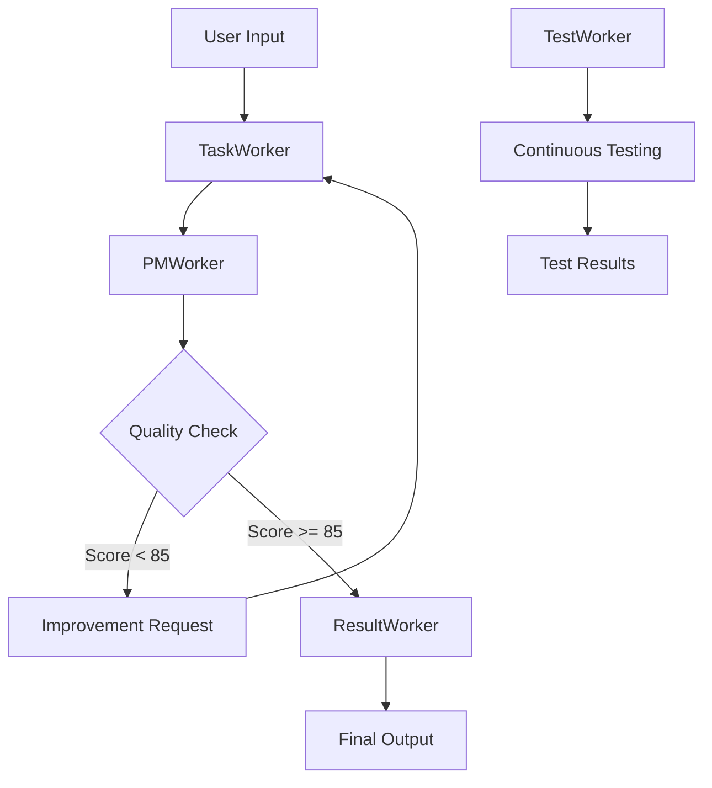

# ワーカー間通信仕様 - Code Review System

## 🏗️ アーキテクチャ概要



## 📨 メッセージフォーマット

### 基本メッセージ構造
```json
{
  "message_id": "msg_uuid_here",
  "task_id": "code_review_001",
  "timestamp": "2025-07-06T12:00:00Z",
  "worker_source": "task_worker",
  "worker_target": "pm_worker",
  "message_type": "code_analysis_result",
  "iteration": 1,
  "payload": { /* 具体的なデータ */ }
}
```

## 🔄 ワーカー間フロー詳細

### 1. User → TaskWorker (初回)
```json
{
  "message_type": "code_review_request",
  "payload": {
    "file_path": "/path/to/code.py",
    "code_content": "def hello():\n    print('world')",
    "language": "python",
    "review_options": {
      "check_syntax": true,
      "check_logic": true,
      "check_performance": true,
      "check_security": true
    }
  }
}
```

### 2. TaskWorker → PMWorker (解析結果)
```json
{
  "message_type": "code_analysis_result",
  "payload": {
    "analysis_results": {
      "syntax_issues": [
        {
          "line": 2,
          "type": "style",
          "severity": "warning",
          "message": "Missing docstring",
          "suggestion": "Add function docstring"
        }
      ],
      "logic_issues": [],
      "performance_issues": [
        {
          "line": 2,
          "type": "performance",
          "severity": "info",
          "message": "Could use f-string for better performance",
          "suggestion": "Use f'world' instead of 'world'"
        }
      ],
      "security_issues": []
    },
    "code_metrics": {
      "lines_of_code": 2,
      "complexity_score": 1,
      "maintainability_index": 85
    }
  }
}
```

### 3. PMWorker → TaskWorker (改善要求)
```json
{
  "message_type": "improvement_request",
  "payload": {
    "current_quality_score": 75,
    "target_quality_score": 85,
    "improvement_suggestions": [
      {
        "priority": "high",
        "category": "documentation",
        "suggestion": "Add comprehensive docstring with parameters and return value",
        "expected_improvement": 10
      },
      {
        "priority": "medium",
        "category": "performance",
        "suggestion": "Consider using f-strings for string formatting",
        "expected_improvement": 5
      }
    ],
    "revised_code": "def hello():\n    \"\"\"Print hello world message.\"\"\"\n    print('world')",
    "iteration_reason": "Documentation and style improvements needed"
  }
}
```

### 4. PMWorker → ResultWorker (最終結果)
```json
{
  "message_type": "review_completion",
  "payload": {
    "final_quality_score": 87,
    "total_iterations": 2,
    "improvement_summary": {
      "initial_score": 75,
      "final_score": 87,
      "improvements_made": [
        "Added function docstring",
        "Improved code formatting",
        "Enhanced readability"
      ]
    },
    "final_code": "def hello():\n    \"\"\"Print hello world message.\"\"\"\n    print('world')",
    "review_report": {
      "syntax_score": 95,
      "logic_score": 85,
      "performance_score": 80,
      "security_score": 90
    }
  }
}
```

### 5. ResultWorker → User (最終出力)
```json
{
  "message_type": "review_result",
  "payload": {
    "status": "completed",
    "quality_improvement": {
      "before": 75,
      "after": 87,
      "improvement_percentage": 16
    },
    "detailed_report": {
      "summary": "Code quality improved through 2 iterations",
      "improvements": ["Documentation", "Style", "Readability"],
      "final_recommendations": ["Consider adding type hints", "Add unit tests"]
    },
    "output_formats": {
      "markdown": "/path/to/report.md",
      "json": "/path/to/report.json",
      "html": "/path/to/report.html"
    }
  }
}
```

## 🔧 ワーカー固有仕様

### TaskWorker 拡張仕様
```python
class CodeReviewTaskWorker(AsyncTaskWorkerSimple):
    async def process_message(self, message: Dict[str, Any]) -> Dict[str, Any]:
        if message['message_type'] == 'code_review_request':
            return await self.analyze_code(message['payload'])
        elif message['message_type'] == 'improvement_request':
            return await self.re_analyze_improved_code(message['payload'])
```

### PMWorker 拡張仕様
```python
class CodeReviewPMWorker(AsyncPMWorkerSimple):
    async def process_message(self, message: Dict[str, Any]) -> Dict[str, Any]:
        if message['message_type'] == 'code_analysis_result':
            quality_score = self.calculate_quality_score(message['payload'])
            if quality_score < 85:
                return await self.generate_improvement_request(message)
            else:
                return await self.prepare_final_result(message)
```

### ResultWorker 拡張仕様
```python
class CodeReviewResultWorker(AsyncResultWorkerSimple):
    async def process_message(self, message: Dict[str, Any]) -> Dict[str, Any]:
        if message['message_type'] == 'review_completion':
            return await self.generate_final_report(message['payload'])
```

## 🕐 タイミング仕様

### 反復制御
- **最大反復回数**: 5回
- **品質しきい値**: 85点
- **タイムアウト**: 各反復最大60秒
- **全体タイムアウト**: 10分

### エラーハンドリング
- **リトライ回数**: 3回
- **エクスポネンシャルバックオフ**: 2^n秒 (n=retry回数)
- **デッドレター**: 3回失敗でデッドレターキューに移動

## 📊 メトリクス収集

### 通信メトリクス
```json
{
  "message_processing_time": "処理時間（ミリ秒）",
  "queue_depth": "キューの深さ",
  "iteration_count": "反復回数",
  "quality_improvement_rate": "品質改善率",
  "error_rate": "エラー率"
}
```

---
*作成日: 2025-07-06*
*バージョン: 1.0*
