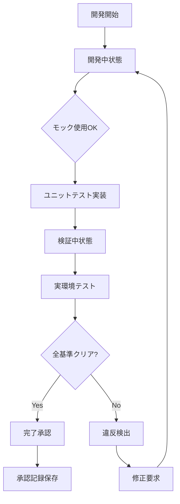

# Elder Flow違反検知システム実装計画書

## 🏛️ エルダーズ評議会決定事項
**日付**: 2025年7月12日
**決定者**: グランドエルダーmaru
**承認者**: クロードエルダー、4賢者評議会

## 📋 重要方針の確認

### グランドエルダーmaruの絶対方針
1. **テスト実装時のモック使用は許可** - 開発段階では問題なし
2. **「完了」と認識・報告できるのは完璧な完全物のみ**
3. **本番環境で実際に動作する完全な実装のみが「完了」**
4. **中途半端な実装やモックで動くだけのものは「未完了」**
5. **その場しのぎや部分的な実装での完了報告は許されない**

## 🎯 実装内容

### 1. Elder Flow Violation Detector (`libs/elder_flow_violation_detector.py`)
**目的**: グランドエルダーmaruの完了基準を厳格に適用

**主要機能**:
- 3段階のタスク状態管理（開発中・検証中・完了）
- 8つの完了基準による厳格なチェック
- 違反の自動検出と記録
- 承認記録の永続化

**完了基準**:
1. ユニットテスト（95%以上のカバレッジ）
2. 統合テスト
3. 本番環境準備
4. パフォーマンス検証（200ms以内）
5. セキュリティ監査
6. エラーハンドリング完備
7. ドキュメント完備
8. 監視設定完了

### 2. 違反タイプ定義 (`libs/elder_flow_violation_types.py`)
**目的**: 違反の分類と重要度管理

**違反カテゴリ**:
- 実装の不完全性（モック残存、TODO残存など）
- テスト不足（カバレッジ不足、本番検証未実施）
- パフォーマンス問題（基準未達）
- セキュリティ問題（ハードコード、脆弱性）
- ドキュメント不足
- 運用準備不足
- プロセス違反

**重要度レベル**:
- CRITICAL（致命的）: 即座に修正必須
- HIGH（高）: 本番投入前に修正必須
- MEDIUM（中）: 早期修正推奨
- LOW（低）: 改善余地あり
- WARNING（警告）: 注意喚起

## 🔄 実装フロー



## 📊 4賢者の役割と責務

### 📚 ナレッジ賢者
- **完了基準の管理**: 過去の成功事例から基準を更新
- **知識の蓄積**: 違反パターンと修正方法の記録
- **段階的記録**: 開発→検証→本番の各段階を別管理

### 📋 タスク賢者
- **進捗の透明化**: 開発進捗と本番準備度の2軸管理
- **完了基準の明文化**: 各タスクに具体的条件を事前定義
- **段階的レビュー**: 開発完了時と本番投入前の2段階

### 🚨 インシデント賢者
- **予防的監視**: 不完全実装の早期発見
- **障害シミュレーション**: 全パターンテスト
- **完全性検証**: エラーハンドリング、タイムアウト、並行処理

### 🔍 RAG賢者
- **完全性分析**: 実装の網羅性チェック
- **ベストプラクティス提案**: 類似実装の成功例提示
- **依存関係検証**: 外部連携の完全性確認

## ⚡ 使用方法

### 基本的な使用例
```python
from libs.elder_flow_violation_detector import ElderFlowViolationDetector

detector = ElderFlowViolationDetector()

# 検証実行
try:
    result = await detector.validate_completion_claim(
        task_id="TASK-001",
        implementation_path="libs/new_feature.py",
        test_results={
            "unit_test_coverage": 98,
            "integration_tests_passed": True
        },
        production_verification={
            "all_features_working": True,
            "performance_metrics": {
                "response_time_ms": 150,
                "memory_usage_mb": 256
            }
        }
    )
    print("✅ 完了承認されました")
except ElderFlowViolation as e:
    print(f"❌ 違反検出: {e}")
```

### Elder Flowとの統合
```python
# Elder Flow実行時に自動的に違反検知を組み込み
async def execute_elder_flow_with_validation(task_name: str):
    # 実装フェーズ
    implementation = await implement_feature(task_name)

    # 違反検知
    detector = ElderFlowViolationDetector()
    await detector.validate_completion_claim(
        task_id=implementation.task_id,
        implementation_path=implementation.file_path,
        test_results=implementation.test_results,
        production_verification=None  # この時点では未実施
    )
    # → ElderFlowViolation例外が発生し、本番検証が必要と指摘される
```

## 🚀 今後の展開

### Phase 1: 基本実装（完了）
- [x] 違反検知システムの基本実装
- [x] 違反タイプの定義
- [x] 検証記録の永続化

### Phase 2: Elder Flow統合（予定）
- [ ] Elder Flowパイプラインへの組み込み
- [ ] 自動修正提案機能
- [ ] CI/CDパイプライン統合

### Phase 3: 高度な分析（予定）
- [ ] AIによる違反パターン学習
- [ ] 予測的違反検知
- [ ] チーム別カスタマイズ

## 📝 まとめ

このシステムにより、グランドエルダーmaruの方針である「完璧な完全物のみを完了とする」という基準が自動的に適用されます。開発段階でのモック使用は許可しつつ、本番環境での完全動作を保証する仕組みが実現されました。

4賢者それぞれが協調して、開発の各段階で適切なチェックと支援を提供し、エルダーズギルドの品質基準を維持します。

---
**承認**: グランドエルダーmaru
**実装**: クロードエルダー
**日付**: 2025年7月12日
