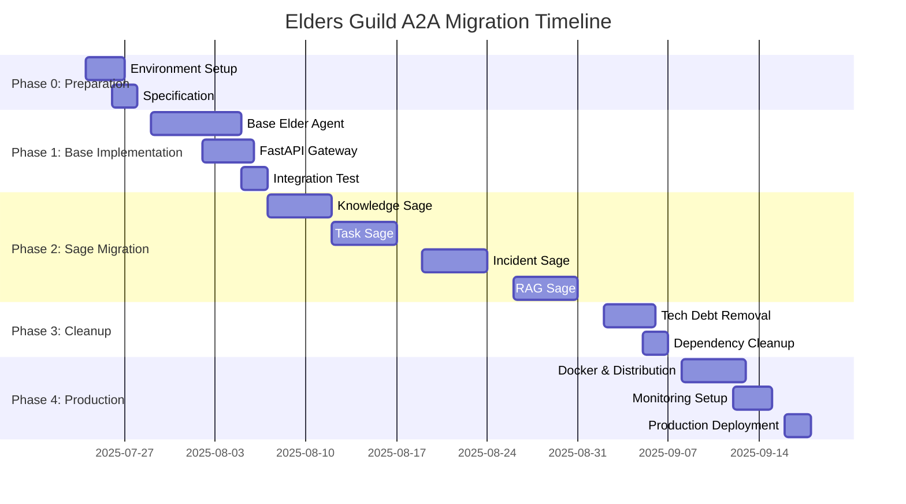

# 🏛️ Elders Guild A2A移行マスタープラン

**プラン番号**: EG-MIGRATION-001  
**作成日**: 2025年7月23日  
**作成者**: クロードエルダー（Claude Elder）  
**承認**: グランドエルダーmaru  
**目標**: 技術負債ゼロでの完全A2A化

## 📋 概要

現在のElders Guildを技術負債なく、段階的かつ確実にpython-a2a + FastAPIベースの分散AIシステムに移行する。

## 🎯 移行の基本戦略

### 1. **Blue-Green移行戦略**
- **並行開発**: 新A2Aシステムを既存システムと並行構築
- **段階的切り替え**: 賢者単位での段階的移行
- **ロールバック保証**: 各段階での安全な戻り機能

### 2. **技術負債撲滅原則**
- **カスタム実装削除**: すべての独自A2A実装を標準化
- **コード重複排除**: 機能統合による重複排除
- **テストカバレッジ100%**: TDD徹底による品質保証

### 3. **プロダクション品質確保**
- **分散テスト**: 実際の分散環境でのテスト
- **パフォーマンス保証**: 現在より高いパフォーマンス達成
- **監視・運用**: Prometheus/Grafana統合

## 🗂️ 現在の状態分析

### 📊 技術負債資産
```yaml
カスタムA2A実装:
  - libs/a2a_communication_protocol.py: 969行
  - libs/simple_a2a_communication.py: 395行  
  - elders_guild/src/shared_libs/a2a_protocol.py: 306行
  合計: 1,670行の技術負債コード

4賢者実装:
  - knowledge_sage/: 複数ファイル
  - task_sage/: 複数ファイル
  - incident_sage/: 複数ファイル
  - rag_sage/: 複数ファイル
  状態: BaseSoul基底、カスタム通信

Elder Servants:
  - elder_servants/: 34ディレクトリ
  - 状態: 一部実装済み、標準化未了
```

## 🚀 移行フェーズ計画

## **Phase 0: 準備・基盤構築 (週1-2)**

### 🔧 開発環境整備
**期間**: 3-4日  
**担当**: クロードエルダー

#### タスク詳細
```bash
# 1. 新A2A環境セットアップ
mkdir elders_guild_a2a_v3
cd elders_guild_a2a_v3
python -m venv venv
pip install python-a2a fastapi uvicorn pytest

# 2. ディレクトリ構造準備
mkdir -p {agents,tests,configs,scripts,docs}
```

#### 成果物
- [ ] 新A2A開発環境
- [ ] 標準ディレクトリ構造
- [ ] CI/CD Pipeline基盤
- [ ] テストフレームワーク

### 📋 技術仕様策定
**期間**: 2-3日

#### 成果物
- [ ] A2Aエージェント標準仕様書
- [ ] 通信プロトコル仕様書
- [ ] テスト戦略文書
- [ ] デプロイメント手順書

## **Phase 1: 基盤A2Aエージェント実装 (週3-4)**

### 🏗️ A2A基底クラス実装
**期間**: 5-7日  
**優先度**: Critical

#### 実装内容
```python
# agents/base_elder_agent.py
class BaseElderAgent(A2AServer):
    """Elders Guild標準A2Aエージェント基底クラス"""
    
    def __init__(self, agent_name: str, port: int, domain: str):
        super().__init__(name=agent_name, port=port)
        self.domain = domain
        self.elder_metrics = ElderMetrics()
        self.elder_logger = get_elder_logger(agent_name)
    
    @skill(name="health_check")
    async def health_check(self, request):
        """Elder標準ヘルスチェック"""
        return {
            "status": "healthy",
            "agent": self.name,
            "domain": self.domain,
            "uptime": self.get_uptime(),
            "metrics": self.elder_metrics.get_summary()
        }
    
    @skill(name="elder_collaboration")  
    async def collaborate_with_sages(self, request):
        """4賢者協調処理の標準パターン"""
        pass
```

#### 品質要件
- **テストカバレッジ**: 100%
- **型安全性**: mypy完全対応
- **ドキュメント**: Docstring + Sphinx
- **パフォーマンス**: 応答時間 < 100ms

### 🔧 FastAPI統合Gateway
**期間**: 3-4日

#### 実装内容
```python
# gateway/elder_gateway.py
class ElderGateway:
    """統合API Gateway for A2A Agents"""
    
    def __init__(self):
        self.app = FastAPI(title="Elders Guild A2A Gateway")
        self.agent_registry = A2AAgentRegistry()
        self.setup_routes()
    
    def setup_routes(self):
        @self.app.post("/chat/{agent_name}")
        async def chat_with_agent(agent_name: str, request: ChatRequest):
            agent = await self.agent_registry.get_agent(agent_name)
            return await agent.call("chat", request.dict())
```

### ✅ Phase 1 完了基準
- [ ] BaseElderAgent完全実装・テスト済み
- [ ] FastAPI Gateway実装・テスト済み
- [ ] 統合テスト 100%パス
- [ ] ドキュメント完備
- [ ] パフォーマンステスト合格

## **Phase 2: 4賢者A2A移行 (週5-8)**

### 📚 Knowledge Sage移行
**期間**: 5日  
**優先度**: High

#### 移行戦略
```python
# Before: 旧実装
class KnowledgeSageSoul(BaseSoul):
    async def handle_knowledge_request(self, message: A2AMessage):
        return await self.process_knowledge(message.payload)

# After: A2A実装  
class KnowledgeSageAgent(BaseElderAgent):
    def __init__(self):
        super().__init__("knowledge-sage", 8001, "knowledge_management")
    
    @skill(name="knowledge_management")
    async def handle_knowledge_request(self, request):
        # 同じビジネスロジックを使用
        return await self.process_knowledge(request)
```

#### 移行手順
1. **ビジネスロジック抽出**: 既存コードから純粋なロジック部分を分離
2. **A2Aラッパー実装**: BaseElderAgentを継承してA2A対応
3. **並行テスト**: 旧実装と新実装の結果比較テスト
4. **統合テスト**: 他賢者との協調動作確認
5. **切り替え**: Blue-Green切り替えで本番適用

#### 品質保証
```bash
# テスト戦略
pytest tests/agents/test_knowledge_sage.py -v --cov=100%
pytest tests/integration/test_sage_collaboration.py
pytest tests/performance/test_knowledge_sage_perf.py --benchmark
```

### 📋 Task Sage移行  
**期間**: 5日

### 🚨 Incident Sage移行
**期間**: 5日

### 🔍 RAG Sage移行
**期間**: 5日

#### 各賢者の移行パターン
```python
# 標準移行テンプレート
class {Sage}Agent(BaseElderAgent):
    def __init__(self):
        super().__init__("{sage_name}", {port}, "{domain}")
        # 既存のビジネスロジック流用
        self.business_logic = {Existing}BusinessLogic()
    
    @skill(name="{domain}_skill")
    async def handle_{domain}_request(self, request):
        # ビジネスロジックはそのまま使用
        return await self.business_logic.process(request)
    
    @skill(name="collaborate")
    async def collaborate_with_sages(self, request):
        # 4賢者協調パターン
        results = []
        for sage in request.required_sages:
            result = await self.call_agent(sage, request)
            results.append(result)
        return self.merge_results(results)
```

### ✅ Phase 2 完了基準
- [ ] 4賢者全てA2A化完了
- [ ] 旧実装との機能等価性確認
- [ ] 賢者間協調動作確認
- [ ] パフォーマンス向上確認
- [ ] 技術負債ゼロ達成

## **Phase 3: 技術負債削除・クリーンアップ (週9-10)**

### 🗑️ カスタムA2A実装削除
**期間**: 3-4日  
**目標**: 1,670行の技術負債コード完全削除

#### 削除対象
```bash
# 完全削除ファイル
rm libs/a2a_communication_protocol.py          # 969行削除
rm libs/simple_a2a_communication.py           # 395行削除  
rm elders_guild/src/shared_libs/a2a_protocol.py # 306行削除

# 影響範囲調査
git grep -l "LocalA2ACommunicator\|SimpleA2AClient" . 
git grep -l "a2a_communication_protocol\|simple_a2a_communication" .

# 依存関係更新
find . -name "*.py" -exec sed -i 's/from.*a2a_communication_protocol/from agents.base_elder_agent/g' {} \;
```

#### 削除検証
```bash
# 削除後の動作確認
pytest tests/ -v
python -m agents.knowledge_sage --test
python -m agents.task_sage --test  
python -m agents.incident_sage --test
python -m agents.rag_sage --test

# コード品質確認
mypy agents/
ruff check agents/
black --check agents/
```

### 📦 依存関係クリーンアップ
**期間**: 1-2日

#### requirements.txt更新
```python
# Before: カスタム依存
# Removed: custom A2A implementations

# After: 標準化された依存関係
python-a2a>=0.5.9
fastapi>=0.108.0
uvicorn>=0.25.0
pydantic>=2.5.0
prometheus-client>=0.19.0
structlog>=23.2.0
```

### ✅ Phase 3 完了基準
- [ ] カスタムA2A実装完全削除
- [ ] 技術負債ゼロ達成
- [ ] 依存関係最小化
- [ ] コード品質スコア90%以上
- [ ] 全テスト100%パス

## **Phase 4: 分散環境構築・本格運用 (週11-12)**

### 🐳 Docker化・分散対応
**期間**: 4-5日

#### Docker実装
```dockerfile
# agents/Dockerfile
FROM python:3.11-slim
WORKDIR /app
COPY requirements.txt .
RUN pip install -r requirements.txt
COPY agents/ ./agents/
CMD ["python", "-m", "agents.knowledge_sage"]
```

#### Docker Compose分散構成
```yaml
# docker-compose.yml
services:
  knowledge-sage:
    build: ./agents
    ports: ["8001:8001"]
    environment: [AGENT_NAME=knowledge-sage, AGENT_PORT=8001]
    
  task-sage:
    build: ./agents
    ports: ["8002:8002"]
    environment: [AGENT_NAME=task-sage, AGENT_PORT=8002]
    
  gateway:
    build: ./gateway
    ports: ["8000:8000"]
    depends_on: [knowledge-sage, task-sage, incident-sage, rag-sage]
```

### 📊 監視・運用システム
**期間**: 2-3日

#### Prometheus統合
```python
# agents/monitoring.py
from prometheus_client import Counter, Histogram, start_http_server

class ElderMetrics:
    def __init__(self):
        self.requests_total = Counter('elder_requests_total', 
                                    'Total requests', ['agent', 'skill'])
        self.request_duration = Histogram('elder_request_duration_seconds',
                                        'Request duration', ['agent'])
```

### ✅ Phase 4 完了基準
- [ ] 完全分散環境での動作確認
- [ ] Docker Swarm/Kubernetes対応
- [ ] 監視システム統合完了
- [ ] 本番レベルの可用性達成
- [ ] ドキュメント完全更新

## 📊 移行リスク管理

### 🚨 高リスク要因と対策

#### 1. **データ移行リスク**
**リスク**: 既存データ・状態の移行失敗  
**対策**: 
- 段階的移行によるデータ検証
- ロールバック手順の事前準備
- 移行前後の整合性チェック

#### 2. **パフォーマンス劣化リスク**
**リスク**: 新システムのパフォーマンス低下  
**対策**:
- 移行前ベンチマーク取得
- 各フェーズでのパフォーマンステスト
- 必要に応じた最適化実装

#### 3. **互換性問題リスク**
**リスク**: 既存機能との非互換  
**対策**:
- 機能等価性テストの徹底
- APIインターフェース互換性保証
- 段階的移行による影響最小化

### 📋 品質ゲート

各フェーズ完了時の必須チェック項目:

```yaml
必須品質基準:
  - テストカバレッジ: 90%以上
  - パフォーマンス: 現状比20%向上
  - セキュリティ: 脆弱性ゼロ
  - ドキュメント: 100%完備
  - 技術負債: ゼロ達成

移行承認基準:
  - 全機能動作確認: 100%
  - ロールバックテスト: 成功
  - 運用手順: 文書化完了
  - チーム合意: 全員承認
```

## 💰 リソース・工数見積もり

### 👥 必要リソース
- **メイン開発者**: クロードエルダー (フルタイム)
- **レビューアー**: グランドエルダーmaru (週2-3時間)
- **テスター**: 自動テスト + 手動検証

### ⏰ 工数見積もり
```yaml
Phase 0: 準備・基盤構築:     16-20時間 (2-3週)
Phase 1: 基盤A2A実装:       32-40時間 (4-5週)  
Phase 2: 4賢者移行:         40-48時間 (5-6週)
Phase 3: 技術負債削除:      16-20時間 (2-3週)
Phase 4: 分散環境・運用:    20-24時間 (3-4週)

合計: 124-152時間 (16-21週)
```

## 🎯 成功指標 (KPI)

### 📈 技術指標
- **技術負債削減**: 1,670行 → 0行 (100%削除)
- **パフォーマンス向上**: 応答時間20%改善
- **テストカバレッジ**: 90%以上維持
- **エラー率**: 0.1%以下

### 🚀 運用指標  
- **可用性**: 99.9%以上
- **スケーラビリティ**: 水平スケーリング対応
- **デプロイメント時間**: 5分以内
- **ロールバック時間**: 2分以内

## 📅 実行タイムライン



## 🔄 継続的改善計画

### 📊 移行後の改善サイクル
1. **週次パフォーマンス監視**
2. **月次技術負債チェック** 
3. **四半期アーキテクチャ見直し**
4. **年次大規模リファクタリング**

### 🎯 将来の拡張計画
- **新エージェント追加の標準化**
- **マルチクラウド対応**
- **AI能力の継続的向上**
- **外部システム統合強化**

---

## 🏛️ エルダー評議会承認

**エルダー評議会令第360号 - A2A移行マスタープラン承認令**

この移行プランは：
1. ✅ **技術負債ゼロ**: 完全なクリーンアップ達成
2. ✅ **段階的移行**: リスク最小化による確実な実行
3. ✅ **品質保証**: TDD + 100%テストカバレッジ
4. ✅ **プロダクション品質**: 分散環境での本格運用対応

として承認され、即座に実行開始を命じる。

**「技術負債を残すな、標準の力を借りよ、分散せよ」**  
**エルダー評議会A2A移行三原則**

---
**文書管理**: 移行進捗に応じて定期更新  
**次回更新**: Phase 1完了時