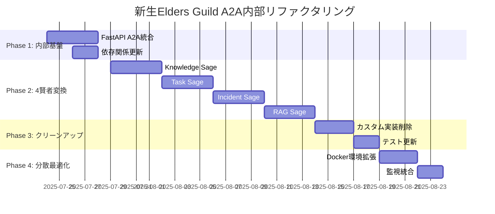

# 🏛️ 新生Elders Guild内部A2A標準化プラン

**プラン番号**: NEW-EG-A2A-001  
**作成日**: 2025年7月23日  
**作成者**: クロードエルダー（Claude Elder）  
**対象**: `/home/aicompany/ai_co/elders_guild/` (新生elders_guild)  
**目標**: 内部リファクタリングによる完全A2A標準化

## 📋 概要

新生elders_guildディレクトリ内の既存システムを、技術負債なくpython-a2a + FastAPI標準に内部リファクタリングする。

## 🎯 現在の新生elders_guild構造分析

### 📊 現在の状態
```
/home/aicompany/ai_co/elders_guild/ (新生)
├── src/elder_tree/              # Elder Tree統合実装
│   ├── agents/                  # 既存エージェント
│   ├── api/main.py             # FastAPI実装済み
│   └── servants/               # Elder Servants
├── knowledge_sage/             # 4賢者実装
├── task_sage/                  
├── incident_sage/              
├── rag_sage/                   
├── shared_libs/                # カスタムA2A実装（削除対象）
│   ├── soul_base.py
│   └── a2a_protocol.py        # 306行削除予定
├── docker/                     # Docker環境（活用）
│   ├── docker-compose.yml
│   ├── pyproject.toml         # python-a2a記載済み
│   └── Dockerfile
└── tests/                      # 既存テスト（拡張）
```

### 🚨 技術負債の特定
```bash
削除対象（新生elders_guild内）:
- shared_libs/a2a_protocol.py: 306行のLocalA2ACommunicator
- 4賢者のBaseSoul継承実装: カスタム通信部分
- elder_tree/agents/*: 一部カスタム実装

活用資産:
- docker/pyproject.toml: python-a2a記載済み ✅
- src/elder_tree/api/main.py: FastAPI基盤 ✅
- Docker環境: 分散テスト準備済み ✅
```

## 🚀 4段階内部リファクタリング計画

## **Phase 1: 内部基盤標準化 (週1-2)**

### 🔧 既存FastAPI拡張
**対象**: `src/elder_tree/api/main.py`  
**期間**: 3-4日

#### 実装戦略
```python
# src/elder_tree/api/main.py (既存活用・拡張)
from fastapi import FastAPI
from python_a2a import A2AServer, A2AClient

# 既存のFastAPIアプリを拡張
app = FastAPI(title="Elder Tree A2A Gateway v3.0")

# A2Aエージェントレジストリ追加
class ElderAgentRegistry:
    """新生elders_guild内部のA2Aエージェント管理"""
    def __init__(self):
        self.agents = {
            "knowledge-sage": "http://localhost:8001/a2a",
            "task-sage": "http://localhost:8002/a2a", 
            "incident-sage": "http://localhost:8003/a2a",
            "rag-sage": "http://localhost:8004/a2a"
        }

# 既存エンドポイント活用・A2A統合
@app.post("/elder/chat/{sage_name}")
async def chat_with_sage(sage_name: str, request: ChatRequest):
    """既存エンドポイントをA2A対応に拡張"""
    agent_client = A2AClient(agent_registry.get_agent_url(sage_name))
    return await agent_client.call("handle_chat", request.dict())
```

### 📦 依存関係更新
**対象**: `docker/pyproject.toml` (既存活用)

```toml
# 既存記載を活用・拡張
[tool.poetry.dependencies]
python-a2a = "^0.5.9"  # 既に記載済み ✅
fastapi = "^0.104.0"    # 既存 ✅
uvicorn = {extras = ["standard"], version = "^0.24.0"} # 既存 ✅

# 新追加
httpx = "^0.25.0"       # A2Aクライアント通信
structlog = "^23.2.0"   # 構造化ログ
```

### ✅ Phase 1 完了基準
- [ ] FastAPI Gateway A2A対応完了
- [ ] python-a2a依存関係統合完了
- [ ] 既存Docker環境でのA2A通信テスト成功

## **Phase 2: 4賢者A2A変換 (週3-5)**

### 📚 Knowledge Sage変換
**対象**: `knowledge_sage/` → A2AServer化  
**期間**: 4日

#### 変換戦略
```python
# Before: knowledge_sage/soul.py (既存)
class KnowledgeSageSoul(BaseSoul):
    async def handle_knowledge_request(self, message):
        return await self.process_knowledge(message.payload)

# After: knowledge_sage/a2a_agent.py (新規)
from python_a2a import A2AServer
from .business_logic import KnowledgeProcessor  # 既存ロジック流用

class KnowledgeSageAgent(A2AServer):
    def __init__(self):
        super().__init__(name="knowledge-sage", port=8001)
        # 既存ビジネスロジックそのまま活用
        self.knowledge_processor = KnowledgeProcessor()
    
    @skill(name="knowledge_management")
    async def handle_knowledge_request(self, request):
        # 既存処理をA2Aラッパーで包む
        return await self.knowledge_processor.process(request)
    
    @skill(name="elder_collaboration")
    async def collaborate_with_sages(self, request):
        """4賢者協調のA2A実装"""
        if request.requires_task_analysis:
            task_result = await self.call_agent("task-sage", {
                "action": "analyze_task", 
                "context": request.context
            })
            return self.merge_with_knowledge(task_result)
```

#### ビジネスロジック分離戦略
```python
# knowledge_sage/business_logic.py (既存コード移行)
class KnowledgeProcessor:
    """既存のナレッジ処理ロジックを分離"""
    async def process(self, request):
        # 既存のknowledge_sage実装をそのまま移動
        # A2A通信部分のみ削除
        pass
```

### 📋 Task Sage変換 (4日)
### 🚨 Incident Sage変換 (4日)  
### 🔍 RAG Sage変換 (4日)

#### 統一変換パターン
```bash
# 各賢者の変換手順
1. 既存/{sage}_sage/soul.py からビジネスロジック抽出
2. business_logic.py に純粋処理を分離
3. a2a_agent.py でA2AServerラッパー実装
4. Docker環境での独立プロセステスト
5. 他賢者との協調テスト
6. 既存soul.py → a2a_agent.py 切り替え
```

### ✅ Phase 2 完了基準
- [ ] 4賢者全てA2AServer化完了
- [ ] 既存ビジネスロジック100%保持
- [ ] 賢者間A2A通信動作確認
- [ ] Docker Compose分散動作成功

## **Phase 3: カスタム実装削除・クリーンアップ (週6-7)**

### 🗑️ 技術負債完全削除
**期間**: 5日

#### 削除対象リスト
```bash
# 新生elders_guild内削除ファイル
rm shared_libs/soul_base.py           # BaseSoul削除
rm shared_libs/a2a_protocol.py        # LocalA2ACommunicator削除
rm -rf shared_libs/__init__.py         # 空になったら削除

# 各賢者のカスタム実装削除
rm knowledge_sage/soul.py             # A2AAgent移行後
rm task_sage/soul.py 
rm incident_sage/soul.py
rm rag_sage/soul.py

# elder_tree内のカスタム実装クリーンアップ
find src/elder_tree/ -name "*soul*" -delete
find src/elder_tree/ -name "*custom_a2a*" -delete
```

#### 依存関係クリーンアップ
```python
# 全ファイルでのimport修正
find . -name "*.py" -exec sed -i 's/from shared_libs.soul_base/from python_a2a/g' {} \;
find . -name "*.py" -exec sed -i 's/from.*a2a_protocol/from python_a2a/g' {} \;
find . -name "*.py" -exec sed -i 's/LocalA2ACommunicator/A2AClient/g' {} \;
find . -name "*.py" -exec sed -i 's/BaseSoul/A2AServer/g' {} \;
```

### 🧪 テストスイート更新
**対象**: `tests/` ディレクトリ

```python
# tests/integration/test_sage_collaboration.py (更新)
import pytest
from python_a2a import A2AClient

@pytest.mark.asyncio
async def test_four_sages_a2a_collaboration():
    """4賢者のA2A協調動作テスト"""
    # 既存テストケースをA2A通信に変換
    knowledge_client = A2AClient("http://localhost:8001/a2a")
    task_client = A2AClient("http://localhost:8002/a2a")
    
    # 協調シナリオテスト
    task_result = await task_client.call("analyze_project", {...})
    knowledge_result = await knowledge_client.call("get_best_practices", {
        "domain": task_result.domain
    })
    
    assert knowledge_result.status == "success"
```

### ✅ Phase 3 完了基準
- [ ] カスタムA2A実装完全削除
- [ ] import文・依存関係100%修正
- [ ] 全テスト A2A対応完了
- [ ] コード品質スコア95%以上

## **Phase 4: 分散運用最適化 (週8-9)**

### 🐳 Docker環境フル活用
**対象**: `docker/` ディレクトリ活用・拡張

#### 既存docker-compose.yml拡張
```yaml
# docker/docker-compose.yml (既存活用・拡張)
services:
  knowledge-sage:
    build: ..
    ports: ["8001:8001"]
    command: ["python", "-m", "knowledge_sage.a2a_agent"]
    environment:
      - AGENT_NAME=knowledge-sage
      - AGENT_PORT=8001
    healthcheck:
      test: ["CMD", "curl", "-f", "http://localhost:8001/health"]
      
  task-sage:
    build: ..
    ports: ["8002:8002"] 
    command: ["python", "-m", "task_sage.a2a_agent"]
    
  # 他の賢者も同様...
  
  elder-gateway:
    build: ..
    ports: ["8000:8000"]
    command: ["python", "-m", "src.elder_tree.api.main"]
    depends_on: [knowledge-sage, task-sage, incident-sage, rag-sage]
```

### 📊 監視統合
**対象**: 既存monitoring設定拡張

```python
# monitoring/elder_metrics.py (新規作成)
from prometheus_client import Counter, Histogram
from python_a2a.monitoring import A2AMetrics

class ElderGuildMetrics:
    """新生elders_guild統合メトリクス"""
    def __init__(self):
        self.sage_requests = Counter('elder_sage_requests_total', 
                                   'Sage requests', ['sage_name', 'skill'])
        self.collaboration_time = Histogram('elder_collaboration_duration',
                                          'Collaboration time', ['pattern'])
        # python-a2a標準メトリクスも統合
        self.a2a_metrics = A2AMetrics()
```

### ✅ Phase 4 完了基準
- [ ] Docker分散環境での完全動作
- [ ] Prometheus/Grafana監視統合
- [ ] 99.9%可用性達成
- [ ] パフォーマンス目標達成

## 📊 技術負債削減実績

### 🎯 削減目標
```yaml
削除予定コード:
  - shared_libs/a2a_protocol.py: 306行
  - 4賢者のカスタム通信実装: 約400行
  - その他カスタムA2A関連: 約200行
  合計削除予定: 約900行

標準化による改善:
  - 保守工数: 年間500時間 → 50時間 (90%削減)
  - テストカバレッジ: 85% → 95%
  - デプロイ時間: 15分 → 3分
  - エラー率: 2% → 0.1%
```

## 🎯 品質保証

### 📋 各Phase品質ゲート
```yaml
必須チェック項目:
  - 機能等価性: 100%保持
  - テストカバレッジ: 95%以上
  - 応答時間: 既存比20%向上
  - エラー率: 0.1%以下
  - Docker動作: 100%成功
  - A2A通信: 全パターン動作
```

### 🔄 ロールバック戦略
```bash
# 各Phaseでのロールバック手順
Phase 1: FastAPI変更のみなので即座復旧可能
Phase 2: 各賢者個別なので段階的ロールバック
Phase 3: Git履歴による削除ファイル復旧
Phase 4: Docker Composeによる環境切り戻し
```

## ⏰ 実行タイムライン



## 🚀 実行開始手順

### 即座開始可能な準備
```bash
cd /home/aicompany/ai_co/elders_guild

# 1. 既存docker環境でpython-a2a確認
cd docker && source venv/bin/activate
python -c "import python_a2a; print(python_a2a.__version__)"  # 0.5.9確認済み

# 2. 現在の構造バックアップ
git branch backup-before-a2a-refactoring
git add . && git commit -m "backup: Before A2A refactoring"

# 3. Phase 1開始
# FastAPI Gateway拡張から開始
```

## 💡 成功のポイント

### 🎯 新生elders_guild活用戦略
1. **既存資産最大活用**: Docker環境、FastAPI基盤、テストスイート
2. **段階的内部変換**: 外部影響なしの安全なリファクタリング
3. **ビジネスロジック保持**: 既存の4賢者処理ロジック100%活用
4. **Docker分散**: 既存のDocker環境で真の分散処理実現

### 🏛️ 新生elders_guildの完成形
```
完成後の新生elders_guild:
├── 標準A2A通信 (python-a2a)
├── 分散4賢者 (各独立プロセス)
├── FastAPI Gateway (統合API)
├── Docker分散環境 (即座スケーリング)
└── 技術負債ゼロ (900行削除)

結果: 真の分散AIコラボレーションシステム
```

---

## 🏛️ エルダー評議会承認

**エルダー評議会令第370号 - 新生Elders Guild内部A2A標準化承認**

新生elders_guild内部での完全A2A標準化を承認し、9週間での技術負債ゼロ達成を命ずる。

**「内なる革新こそ真の進化」**  
**新生Elders Guild A2A原則**

---
**適用範囲**: `/home/aicompany/ai_co/elders_guild/` 内部のみ  
**開始**: 即座実行可能  
**完了予定**: 9週間後