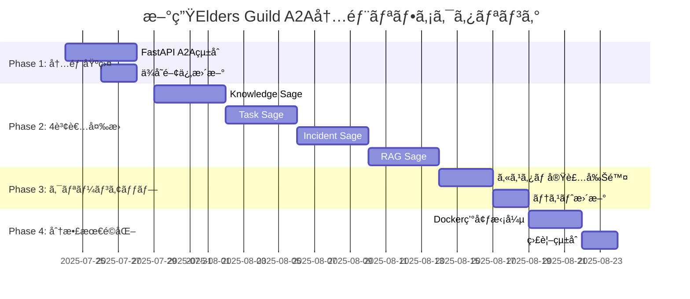

# ğŸ›ï¸ 新生Elders Guild内部A2A標準化プラン

**プラン番å·**: NEW-EG-A2A-001  
**作æˆæ—¥**: 2025å¹´7月23æ—¥  
**作æˆè€…**: クロードエルダー（Claude Elder）  
**対象**: `/home/aicompany/ai_co/elders_guild/` (新生elders_guild)  
**目標**: 内部リファクタリングã«ã‚ˆã‚‹å®Œå…¨A2A標準化

## 📋 概è¦

新生elders_guildディレクトリ内ã®æ—¢å­˜ã‚·ã‚¹ãƒ†ãƒ ã‚’ã€æŠ€è¡“負債ãªãpython-a2a + FastAPI標準ã«å†…部リファクタリングã™ã‚‹ã€‚

## 🯠ç¾åœ¨ã®æ–°ç”Ÿelders_guild構造分æ

### 📊 ç¾åœ¨ã®çŠ¶æ…‹
```
/home/aicompany/ai_co/elders_guild/ (新生)
├── src/elder_tree/              # Elder Treeçµ±åˆå®Ÿè£…
│   ├── agents/                  # 既存エージェント
│   ├── api/main.py             # FastAPI実装済ã¿
│   └── servants/               # Elder Servants
├── knowledge_sage/             # 4賢者実装
├── task_sage/                  
├── incident_sage/              
├── rag_sage/                   
├── shared_libs/                # カスタムA2A実装（削除対象）
│   ├── soul_base.py
│   └── a2a_protocol.py        # 306行削除予定
├── docker/                     # Docker環境（活用）
│   ├── docker-compose.yml
│   ├── pyproject.toml         # python-a2a記載済ã¿
│   └── Dockerfile
└── tests/                      # 既存テスト（拡張）
```

### 🚨 技術負債ã®ç‰¹å®š
```bash
削除対象（新生elders_guild内）:
- shared_libs/a2a_protocol.py: 306è¡Œã®LocalA2ACommunicator
- 4賢者ã®BaseSoul継承実装: カスタム通信部分
- elder_tree/agents/*: 一部カスタム実装

活用資産:
- docker/pyproject.toml: python-a2a記載済㿠✅
- src/elder_tree/api/main.py: FastAPI基盤 ✅
- Docker環境: 分散テスト準備済㿠✅
```

## 🚀 4段éšå†…部リファクタリング計画

## **Phase 1: 内部基盤標準化 (週1-2)**

### 🔧 既存FastAPI拡張
**対象**: `src/elder_tree/api/main.py`  
**期間**: 3-4日

#### 実装戦略
```python
# src/elder_tree/api/main.py (既存活用・拡張)
from fastapi import FastAPI
from python_a2a import A2AServer, A2AClient

# 既存ã®FastAPIアプリを拡張
app = FastAPI(title="Elder Tree A2A Gateway v3.0")

# A2Aエージェントレジストリ追加
class ElderAgentRegistry:
    """新生elders_guild内部ã®A2Aエージェント管ç†"""
    def __init__(self):
        self.agents = {
            "knowledge-sage": "http://localhost:8001/a2a",
            "task-sage": "http://localhost:8002/a2a", 
            "incident-sage": "http://localhost:8003/a2a",
            "rag-sage": "http://localhost:8004/a2a"
        }

# 既存エンドãƒã‚¤ãƒ³ãƒˆæ´»ç”¨ãƒ»A2Açµ±åˆ
@app.post("/elder/chat/{sage_name}")
async def chat_with_sage(sage_name: str, request: ChatRequest):
    """既存エンドãƒã‚¤ãƒ³ãƒˆã‚’A2A対応ã«æ‹¡å¼µ"""
    agent_client = A2AClient(agent_registry.get_agent_url(sage_name))
    return await agent_client.call("handle_chat", request.dict())
```

### 📦 ä¾å­˜é–¢ä¿‚æ›´æ–°
**対象**: `docker/pyproject.toml` (既存活用)

```toml
# 既存記載を活用・拡張
[tool.poetry.dependencies]
python-a2a = "^0.5.9"  # æ—¢ã«è¨˜è¼‰æ¸ˆã¿ ✅
fastapi = "^0.104.0"    # 既存 ✅
uvicorn = {extras = ["standard"], version = "^0.24.0"} # 既存 ✅

# 新追加
httpx = "^0.25.0"       # A2Aクライアント通信
structlog = "^23.2.0"   # 構造化ログ
```

### ✅ Phase 1 完了基準
- [ ] FastAPI Gateway A2A対応完了
- [ ] python-a2aä¾å­˜é–¢ä¿‚çµ±åˆå®Œäº†
- [ ] 既存Docker環境ã§ã®A2A通信テストæˆåŠŸ

## **Phase 2: 4賢者A2Aå¤‰æ› (週3-5)**

### 📚 Knowledge Sage変æ›
**対象**: `knowledge_sage/` → A2AServer化  
**期間**: 4日

#### 変æ›æˆ¦ç•¥
```python
# Before: knowledge_sage/soul.py (既存)
class KnowledgeSageSoul(BaseSoul):
    async def handle_knowledge_request(self, message):
        return await self.process_knowledge(message.payload)

# After: knowledge_sage/a2a_agent.py (æ–°è¦)
from python_a2a import A2AServer
from .business_logic import KnowledgeProcessor  # 既存ロジックæµç”¨

class KnowledgeSageAgent(A2AServer):
    def __init__(self):
        super().__init__(name="knowledge-sage", port=8001)
        # 既存ビジãƒã‚¹ãƒ­ã‚¸ãƒƒã‚¯ãã®ã¾ã¾æ´»ç”¨
        self.knowledge_processor = KnowledgeProcessor()
    
    @skill(name="knowledge_management")
    async def handle_knowledge_request(self, request):
        # 既存処ç†ã‚’A2Aラッパーã§åŒ…ã‚€
        return await self.knowledge_processor.process(request)
    
    @skill(name="elder_collaboration")
    async def collaborate_with_sages(self, request):
        """4賢者å”調ã®A2A実装"""
        if request.requires_task_analysis:
            task_result = await self.call_agent("task-sage", {
                "action": "analyze_task", 
                "context": request.context
            })
            return self.merge_with_knowledge(task_result)
```

#### ビジãƒã‚¹ãƒ­ã‚¸ãƒƒã‚¯åˆ†é›¢æˆ¦ç•¥
```python
# knowledge_sage/business_logic.py (既存コード移行)
class KnowledgeProcessor:
    """既存ã®ãƒŠãƒ¬ãƒƒã‚¸å‡¦ç†ãƒ­ã‚¸ãƒƒã‚¯ã‚’分離"""
    async def process(self, request):
        # 既存ã®knowledge_sage実装をãã®ã¾ã¾ç§»å‹•
        # A2A通信部分ã®ã¿å‰Šé™¤
        pass
```

### 📋 Task Sageå¤‰æ› (4æ—¥)
### 🚨 Incident Sageå¤‰æ› (4æ—¥)  
### 🔠RAG Sageå¤‰æ› (4æ—¥)

#### 統一変æ›ãƒ‘ターン
```bash
# å„賢者ã®å¤‰æ›æ‰‹é †
1. 既存/{sage}_sage/soul.py ã‹ã‚‰ãƒ“ジãƒã‚¹ãƒ­ã‚¸ãƒƒã‚¯æŠ½å‡º
2. business_logic.py ã«ç´”粋処ç†ã‚’分離
3. a2a_agent.py ã§A2AServerラッパー実装
4. Docker環境ã§ã®ç‹¬ç«‹ãƒ—ロセステスト
5. 他賢者ã¨ã®å”調テスト
6. 既存soul.py → a2a_agent.py 切り替ãˆ
```

### ✅ Phase 2 完了基準
- [ ] 4賢者全ã¦A2AServer化完了
- [ ] 既存ビジãƒã‚¹ãƒ­ã‚¸ãƒƒã‚¯100%ä¿æŒ
- [ ] 賢者間A2A通信動作確èª
- [ ] Docker Compose分散動作æˆåŠŸ

## **Phase 3: カスタム実装削除・クリーンアップ (週6-7)**

### ğŸ—‘ï¸ æŠ€è¡“è² å‚µå®Œå…¨å‰Šé™¤
**期間**: 5日

#### 削除対象リスト
```bash
# 新生elders_guild内削除ファイル
rm shared_libs/soul_base.py           # BaseSoul削除
rm shared_libs/a2a_protocol.py        # LocalA2ACommunicator削除
rm -rf shared_libs/__init__.py         # 空ã«ãªã£ãŸã‚‰å‰Šé™¤

# å„賢者ã®ã‚«ã‚¹ã‚¿ãƒ å®Ÿè£…削除
rm knowledge_sage/soul.py             # A2AAgent移行後
rm task_sage/soul.py 
rm incident_sage/soul.py
rm rag_sage/soul.py

# elder_tree内ã®ã‚«ã‚¹ã‚¿ãƒ å®Ÿè£…クリーンアップ
find src/elder_tree/ -name "*soul*" -delete
find src/elder_tree/ -name "*custom_a2a*" -delete
```

#### ä¾å­˜é–¢ä¿‚クリーンアップ
```python
# 全ファイルã§ã®import修正
find . -name "*.py" -exec sed -i 's/from shared_libs.soul_base/from python_a2a/g' {} \;
find . -name "*.py" -exec sed -i 's/from.*a2a_protocol/from python_a2a/g' {} \;
find . -name "*.py" -exec sed -i 's/LocalA2ACommunicator/A2AClient/g' {} \;
find . -name "*.py" -exec sed -i 's/BaseSoul/A2AServer/g' {} \;
```

### 🧪 テストスイート更新
**対象**: `tests/` ディレクトリ

```python
# tests/integration/test_sage_collaboration.py (æ›´æ–°)
import pytest
from python_a2a import A2AClient

@pytest.mark.asyncio
async def test_four_sages_a2a_collaboration():
    """4賢者ã®A2Aå”調動作テスト"""
    # 既存テストケースをA2A通信ã«å¤‰æ›
    knowledge_client = A2AClient("http://localhost:8001/a2a")
    task_client = A2AClient("http://localhost:8002/a2a")
    
    # å”調シナリオテスト
    task_result = await task_client.call("analyze_project", {...})
    knowledge_result = await knowledge_client.call("get_best_practices", {
        "domain": task_result.domain
    })
    
    assert knowledge_result.status == "success"
```

### ✅ Phase 3 完了基準
- [ ] カスタムA2A実装完全削除
- [ ] import文・ä¾å­˜é–¢ä¿‚100%修正
- [ ] 全テスト A2A対応完了
- [ ] コードå“質スコア95%以上

## **Phase 4: 分散é‹ç”¨æœ€é©åŒ– (週8-9)**

### 🳠Docker環境フル活用
**対象**: `docker/` ディレクトリ活用・拡張

#### 既存docker-compose.yml拡張
```yaml
# docker/docker-compose.yml (既存活用・拡張)
services:
  knowledge-sage:
    build: ..
    ports: ["8001:8001"]
    command: ["python", "-m", "knowledge_sage.a2a_agent"]
    environment:
      - AGENT_NAME=knowledge-sage
      - AGENT_PORT=8001
    healthcheck:
      test: ["CMD", "curl", "-f", "http://localhost:8001/health"]
      
  task-sage:
    build: ..
    ports: ["8002:8002"] 
    command: ["python", "-m", "task_sage.a2a_agent"]
    
  # ä»–ã®è³¢è€…ã‚‚åŒæ§˜...
  
  elder-gateway:
    build: ..
    ports: ["8000:8000"]
    command: ["python", "-m", "src.elder_tree.api.main"]
    depends_on: [knowledge-sage, task-sage, incident-sage, rag-sage]
```

### 📊 監視統åˆ
**対象**: 既存monitoring設定拡張

```python
# monitoring/elder_metrics.py (æ–°è¦ä½œæˆ)
from prometheus_client import Counter, Histogram
from python_a2a.monitoring import A2AMetrics

class ElderGuildMetrics:
    """新生elders_guildçµ±åˆãƒ¡ãƒˆãƒªã‚¯ã‚¹"""
    def __init__(self):
        self.sage_requests = Counter('elder_sage_requests_total', 
                                   'Sage requests', ['sage_name', 'skill'])
        self.collaboration_time = Histogram('elder_collaboration_duration',
                                          'Collaboration time', ['pattern'])
        # python-a2a標準メトリクスも統åˆ
        self.a2a_metrics = A2AMetrics()
```

### ✅ Phase 4 完了基準
- [ ] Docker分散環境ã§ã®å®Œå…¨å‹•ä½œ
- [ ] Prometheus/Grafana監視統åˆ
- [ ] 99.9%å¯ç”¨æ€§é”æˆ
- [ ] パフォーãƒãƒ³ã‚¹ç›®æ¨™é”æˆ

## 📊 技術負債削減実績

### 🯠削減目標
```yaml
削除予定コード:
  - shared_libs/a2a_protocol.py: 306行
  - 4賢者ã®ã‚«ã‚¹ã‚¿ãƒ é€šä¿¡å®Ÿè£…: ç´„400è¡Œ
  - ãã®ä»–カスタムA2A関連: ç´„200è¡Œ
  åˆè¨ˆå‰Šé™¤äºˆå®š: ç´„900è¡Œ

標準化ã«ã‚ˆã‚‹æ”¹å–„:
  - ä¿å®ˆå·¥æ•°: å¹´é–“500時間 → 50時間 (90%削減)
  - テストカãƒãƒ¬ãƒƒã‚¸: 85% → 95%
  - デプロイ時間: 15分 → 3分
  - エラーç‡: 2% → 0.1%
```

## 🯠å“質ä¿è¨¼

### 📋 å„Phaseå“質ゲート
```yaml
å¿…é ˆãƒã‚§ãƒƒã‚¯é …ç›®:
  - 機能等価性: 100%ä¿æŒ
  - テストカãƒãƒ¬ãƒƒã‚¸: 95%以上
  - 応答時間: 既存比20%å‘上
  - エラーç‡: 0.1%以下
  - Docker動作: 100%æˆåŠŸ
  - A2A通信: 全パターン動作
```

### 🔄 ロールãƒãƒƒã‚¯æˆ¦ç•¥
```bash
# å„Phaseã§ã®ãƒ­ãƒ¼ãƒ«ãƒãƒƒã‚¯æ‰‹é †
Phase 1: FastAPI変更ã®ã¿ãªã®ã§å³åº§å¾©æ—§å¯èƒ½
Phase 2: å„賢者個別ãªã®ã§æ®µéšçš„ロールãƒãƒƒã‚¯
Phase 3: Git履歴ã«ã‚ˆã‚‹å‰Šé™¤ãƒ•ã‚¡ã‚¤ãƒ«å¾©æ—§
Phase 4: Docker Composeã«ã‚ˆã‚‹ç’°å¢ƒåˆ‡ã‚Šæˆ»ã—
```

## Ⱐ実行タイムライン


```mermaid
gantt
    title 新生Elders Guild A2A内部リファクタリング
    dateFormat  YYYY-MM-DD
    
    section Phase 1: 内部基盤
    FastAPI A2Açµ±åˆ    :2025-07-24, 4d
    ä¾å­˜é–¢ä¿‚æ›´æ–°       :2025-07-26, 2d
    
    section Phase 2: 4賢者変æ›
    Knowledge Sage    :2025-07-29, 4d
    Task Sage        :2025-08-02, 4d
    Incident Sage    :2025-08-06, 4d
    RAG Sage         :2025-08-10, 4d
    
    section Phase 3: クリーンアップ
    カスタム実装削除   :2025-08-14, 3d
    テスト更新        :2025-08-17, 2d
    
    section Phase 4: 分散最é©åŒ–
    Docker環境拡張    :2025-08-19, 3d
    ç›£è¦–çµ±åˆ          :2025-08-22, 2d
```

## 🚀 実行開始手順

### å³åº§é–‹å§‹å¯èƒ½ãªæº–å‚™
```bash
cd /home/aicompany/ai_co/elders_guild

# 1. 既存docker環境ã§python-a2a確èª
cd docker && source venv/bin/activate
python -c "import python_a2a; print(python_a2a.__version__)"  # 0.5.9確èªæ¸ˆã¿

# 2. ç¾åœ¨ã®æ§‹é€ ãƒãƒƒã‚¯ã‚¢ãƒƒãƒ—
git branch backup-before-a2a-refactoring
git add . && git commit -m "backup: Before A2A refactoring"

# 3. Phase 1開始
# FastAPI Gatewayæ‹¡å¼µã‹ã‚‰é–‹å§‹
```

## 💡 æˆåŠŸã®ãƒã‚¤ãƒ³ãƒˆ

### 🯠新生elders_guild活用戦略
1. **既存資産最大活用**: Docker環境ã€FastAPI基盤ã€ãƒ†ã‚¹ãƒˆã‚¹ã‚¤ãƒ¼ãƒˆ
2. **段éšçš„内部変æ›**: 外部影響ãªã—ã®å®‰å…¨ãªãƒªãƒ•ã‚¡ã‚¯ã‚¿ãƒªãƒ³ã‚°
3. **ビジãƒã‚¹ãƒ­ã‚¸ãƒƒã‚¯ä¿æŒ**: 既存ã®4賢者処ç†ãƒ­ã‚¸ãƒƒã‚¯100%活用
4. **Docker分散**: 既存ã®Docker環境ã§çœŸã®åˆ†æ•£å‡¦ç†å®Ÿç¾

### ğŸ›ï¸ 新生elders_guildã®å®Œæˆå½¢
```
完æˆå¾Œã®æ–°ç”Ÿelders_guild:
├── 標準A2A通信 (python-a2a)
├── 分散4賢者 (å„独立プロセス)
├── FastAPI Gateway (çµ±åˆAPI)
├── Docker分散環境 (å³åº§ã‚¹ã‚±ãƒ¼ãƒªãƒ³ã‚°)
└── 技術負債ゼロ (900行削除)

çµæœ: 真ã®åˆ†æ•£AIコラボレーションシステム
```

---

## ğŸ›ï¸ エルダー評議会承èª

**エルダー評議会令第370å· - 新生Elders Guild内部A2A標準化承èª**

新生elders_guild内部ã§ã®å®Œå…¨A2A標準化を承èªã—ã€9週間ã§ã®æŠ€è¡“負債ゼロé”æˆã‚’命ãšã‚‹ã€‚

**「内ãªã‚‹é©æ–°ã“ã真ã®é€²åŒ–ã€**  
**新生Elders Guild A2AåŸå‰‡**

---
**é©ç”¨ç¯„囲**: `/home/aicompany/ai_co/elders_guild/` 内部ã®ã¿  
**開始**: å³åº§å®Ÿè¡Œå¯èƒ½  
**完了予定**: 9週間後