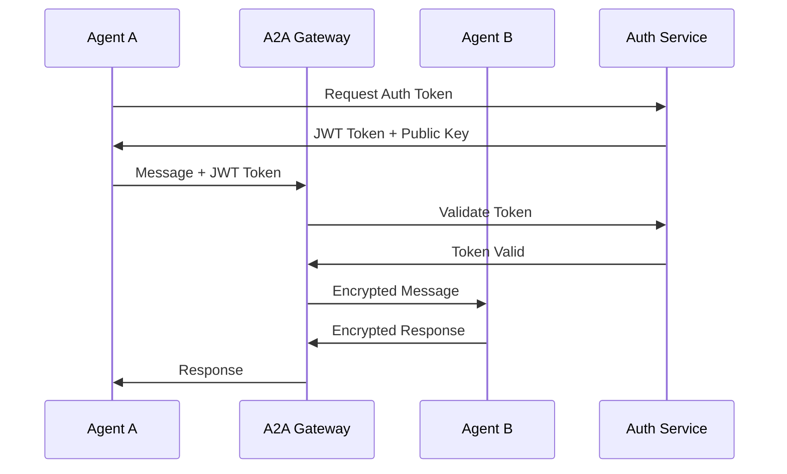

# A2A通信プロトコル仕様書 v1.0

## 📋 プロトコル概要

A2A（Agent to Agent）通信プロトコルは、Elders Guild内のエージェント間通信を標準化し、セキュアで効率的な情報交換を実現するためのプロトコル仕様です。

### 🎯 設計原則

1. **互換性**: 既存システムとの下位互換性
2. **拡張性**: 将来的な機能拡張への対応
3. **効率性**: 最小限のオーバーヘッド
4. **安全性**: エンドツーエンド暗号化
5. **監査性**: すべての通信の追跡可能性

## 🔌 通信レイヤー

### 1. Physical Layer (物理層)
- **Transport**: TCP/IP over Ethernet
- **Security**: TLS 1.3 encryption
- **Port Range**: 5000-5999 (A2A専用)

### 2. Transport Layer (トランスポート層)
- **Primary**: RabbitMQ (AMQP 0.9.1)
- **Fallback**: HTTP/2 + WebSocket
- **Message Format**: JSON with compression

### 3. Session Layer (セッション層)
- **Authentication**: JWT + mTLS
- **Session Management**: Redis-based
- **Heartbeat**: 30秒間隔

### 4. Application Layer (アプリケーション層)
- **Protocol**: A2A-Protocol v1.0
- **Message Structure**: Structured JSON
- **Error Handling**: Standardized error codes

## 📡 メッセージ仕様

### メッセージヘッダー構造

```json
{
  "header": {
    "version": "1.0",
    "message_id": "uuid-v4",
    "correlation_id": "uuid-v4-optional",
    "timestamp": "ISO-8601-datetime",
    "source": {
      "agent_id": "knowledge_sage",
      "agent_type": "four_sages",
      "instance_id": "ks-001"
    },
    "target": {
      "agent_id": "task_sage",
      "agent_type": "four_sages",
      "instance_id": "ts-001"
    },
    "routing": {
      "message_type": "query_request",
      "priority": "normal",
      "ttl": 3600,
      "delivery_mode": "persistent"
    },
    "security": {
      "auth_token": "jwt-token",
      "encryption": "AES-256-GCM",
      "signature": "RSA-SHA256"
    }
  }
}
```

### メッセージボディ構造

```json
{
  "payload": {
    "method": "string",
    "params": "object",
    "data": "any",
    "context": {
      "session_id": "uuid",
      "user_context": "object",
      "trace_context": "object"
    }
  },
  "metadata": {
    "content_type": "application/json",
    "encoding": "utf-8",
    "compression": "gzip",
    "size_bytes": 1024,
    "checksum": "sha256-hash"
  }
}
```

## 🎭 エージェントタイプ定義

### Four Sages (4賢者)
```json
{
  "knowledge_sage": {
    "id": "knowledge_sage",
    "type": "four_sages",
    "capabilities": ["knowledge_query", "pattern_analysis", "learning_coordination"],
    "endpoints": ["query", "update", "analyze"],
    "priority": "high"
  },
  "task_sage": {
    "id": "task_sage",
    "type": "four_sages",
    "capabilities": ["task_management", "resource_allocation", "scheduling"],
    "endpoints": ["assign", "status", "optimize"],
    "priority": "high"
  },
  "rag_sage": {
    "id": "rag_sage",
    "type": "four_sages",
    "capabilities": ["document_retrieval", "context_enhancement", "semantic_search"],
    "endpoints": ["search", "enhance", "index"],
    "priority": "high"
  },
  "incident_sage": {
    "id": "incident_sage",
    "type": "four_sages",
    "capabilities": ["anomaly_detection", "risk_assessment", "recovery_planning"],
    "endpoints": ["detect", "assess", "recover"],
    "priority": "critical"
  }
}
```

### Elder Council (エルダー評議会)
```json
{
  "elder_council": {
    "id": "elder_council",
    "type": "governance",
    "capabilities": ["decision_making", "consensus_building", "strategic_planning"],
    "endpoints": ["summon", "decide", "delegate"],
    "priority": "highest"
  }
}
```

### Elder Servants (エルダーサーバント)
```json
{
  "elder_servant": {
    "id": "elder_servant_*",
    "type": "executor",
    "capabilities": ["task_execution", "reporting", "monitoring"],
    "endpoints": ["execute", "report", "monitor"],
    "priority": "medium"
  }
}
```

## 🔄 メッセージタイプとメソッド

### 1. Query Messages (照会メッセージ)

#### Knowledge Query
```json
{
  "message_type": "knowledge_query",
  "method": "search_knowledge",
  "params": {
    "query": "A2A protocol implementation",
    "filters": ["category:protocol", "type:technical"],
    "max_results": 10,
    "include_context": true
  }
}
```

#### Task Query
```json
{
  "message_type": "task_query",
  "method": "get_task_status",
  "params": {
    "task_id": "uuid",
    "include_history": true,
    "include_dependencies": false
  }
}
```

### 2. Command Messages (コマンドメッセージ)

#### Task Assignment
```json
{
  "message_type": "task_command",
  "method": "assign_task",
  "params": {
    "task_definition": {
      "id": "uuid",
      "type": "implementation",
      "priority": "high",
      "estimated_effort": "4h",
      "deadline": "2025-07-10T18:00:00Z"
    },
    "assignee": "elder_servant_001",
    "constraints": ["cpu_limit: 2", "memory_limit: 4GB"]
  }
}
```

#### System Command
```json
{
  "message_type": "system_command",
  "method": "restart_service",
  "params": {
    "service_name": "worker_monitor",
    "restart_type": "graceful",
    "timeout": 30
  }
}
```

### 3. Event Messages (イベントメッセージ)

#### Status Update
```json
{
  "message_type": "status_event",
  "method": "agent_status_changed",
  "params": {
    "agent_id": "task_sage",
    "previous_status": "busy",
    "current_status": "idle",
    "timestamp": "2025-07-09T12:00:00Z",
    "context": {
      "completed_tasks": 5,
      "pending_tasks": 2
    }
  }
}
```

#### Incident Alert
```json
{
  "message_type": "incident_event",
  "method": "incident_detected",
  "params": {
    "incident_id": "uuid",
    "severity": "critical",
    "type": "service_failure",
    "affected_components": ["worker_monitor", "task_queue"],
    "detection_time": "2025-07-09T12:00:00Z",
    "auto_recovery_attempted": true
  }
}
```

## 🛡️ セキュリティプロトコル

### 認証フロー



### 暗号化仕様

#### Message Encryption
- **Algorithm**: AES-256-GCM
- **Key Exchange**: ECDH-P256
- **Key Rotation**: 24時間毎
- **IV**: Random 96-bit per message

#### Signature
- **Algorithm**: RSA-SHA256 (2048-bit keys)
- **Scope**: Header + Payload
- **Verification**: Required for all messages

### Authorization Matrix

| エージェントタイプ | Knowledge | Task | RAG | Incident | Council |
|---|---|---|---|---|---|
| Four Sages | READ/WRITE | READ/WRITE | READ/WRITE | READ/WRITE | READ |
| Elder Council | READ/WRITE | READ/WRITE | READ/WRITE | READ/WRITE | READ/WRITE |
| Elder Servants | READ | READ/WRITE | READ | READ | READ |

## 📊 QoS (Quality of Service)

### Priority Levels

```python
class MessagePriority(Enum):
    CRITICAL = 1    # Incidents, emergencies
    HIGH = 2        # Four Sages communication
    NORMAL = 3      # Regular operations
    LOW = 4         # Background tasks
    BULK = 5        # Batch operations
```

### Delivery Guarantees

| Priority | Delivery | Latency SLA | Retry Count |
|---|---|---|---|
| CRITICAL | Exactly Once | < 100ms | 5 |
| HIGH | At Least Once | < 500ms | 3 |
| NORMAL | At Least Once | < 2s | 2 |
| LOW | Best Effort | < 10s | 1 |
| BULK | Best Effort | < 60s | 0 |

### Rate Limiting

```yaml
rate_limits:
  four_sages:
    requests_per_second: 100
    burst_size: 200
  elder_servants:
    requests_per_second: 50
    burst_size: 100
  system_commands:
    requests_per_minute: 10
    burst_size: 20
```

## 🔧 Error Handling

### Error Code System

```python
class A2AErrorCode(Enum):
    # 1000-1999: Protocol Errors
    INVALID_MESSAGE_FORMAT = 1001
    UNSUPPORTED_VERSION = 1002
    MISSING_REQUIRED_FIELD = 1003

    # 2000-2999: Authentication Errors
    INVALID_TOKEN = 2001
    TOKEN_EXPIRED = 2002
    INSUFFICIENT_PERMISSIONS = 2003

    # 3000-3999: Routing Errors
    AGENT_NOT_FOUND = 3001
    AGENT_UNAVAILABLE = 3002
    DELIVERY_TIMEOUT = 3003

    # 4000-4999: Application Errors
    METHOD_NOT_SUPPORTED = 4001
    INVALID_PARAMETERS = 4002
    RESOURCE_NOT_FOUND = 4003

    # 5000-5999: System Errors
    INTERNAL_ERROR = 5001
    SERVICE_UNAVAILABLE = 5002
    RATE_LIMIT_EXCEEDED = 5003
```

### Error Response Format

```json
{
  "header": {
    "message_id": "uuid",
    "correlation_id": "original-message-id",
    "timestamp": "2025-07-09T12:00:00Z",
    "source": "a2a_gateway",
    "target": "original_sender",
    "message_type": "error_response"
  },
  "error": {
    "code": 4001,
    "name": "METHOD_NOT_SUPPORTED",
    "message": "Method 'invalid_method' is not supported by agent 'task_sage'",
    "details": {
      "supported_methods": ["assign_task", "get_status", "update_priority"],
      "request_id": "original-request-id"
    },
    "retry_after": 0
  }
}
```

## 🚀 Performance Specifications

### Latency Targets

| Message Type | P50 | P95 | P99 |
|---|---|---|---|
| Sync Query | 50ms | 200ms | 500ms |
| Async Command | 100ms | 500ms | 1s |
| Event Broadcast | 200ms | 1s | 2s |

### Throughput Targets

- **Peak Load**: 10,000 messages/second
- **Sustained Load**: 5,000 messages/second
- **Per-Agent**: 1,000 messages/second

### Resource Limits

```yaml
resource_limits:
  message_size:
    max_header_size: 8KB
    max_payload_size: 10MB
    max_total_size: 10MB

  connection_limits:
    max_connections_per_agent: 100
    connection_timeout: 30s
    idle_timeout: 300s

  queue_limits:
    max_queue_depth: 10000
    message_ttl: 3600s
    dead_letter_retention: 7d
```

## 📈 Monitoring & Observability

### Required Metrics

```python
# Communication Metrics
a2a_messages_total = Counter('a2a_messages_total', ['source', 'target', 'type'])
a2a_message_duration = Histogram('a2a_message_duration_seconds', ['type'])
a2a_errors_total = Counter('a2a_errors_total', ['code', 'source', 'target'])

# Performance Metrics
a2a_queue_depth = Gauge('a2a_queue_depth', ['queue_name'])
a2a_connection_count = Gauge('a2a_connections_active', ['agent_type'])
a2a_bandwidth_bytes = Counter('a2a_bandwidth_bytes_total', ['direction'])
```

### Distributed Tracing

```json
{
  "trace_context": {
    "trace_id": "uuid",
    "span_id": "uuid",
    "parent_span_id": "uuid",
    "operation_name": "a2a_message_send",
    "start_time": "2025-07-09T12:00:00.000Z",
    "tags": {
      "message_type": "query_request",
      "source_agent": "knowledge_sage",
      "target_agent": "task_sage"
    }
  }
}
```

## 🔄 Version Management

### Protocol Versioning

- **Major Version**: Breaking changes (1.x.x)
- **Minor Version**: New features, backward compatible (x.1.x)
- **Patch Version**: Bug fixes (x.x.1)

### Compatibility Matrix

| Client Version | Server Version | Compatibility |
|---|---|---|
| 1.0.x | 1.0.x | Full |
| 1.0.x | 1.1.x | Read-only new features |
| 1.1.x | 1.0.x | Graceful degradation |
| 2.x.x | 1.x.x | Not supported |

### Migration Strategy

1. **Dual Protocol Support**: 30日間の移行期間
2. **Feature Flags**: 新機能の段階的ロールアウト
3. **Backward Compatibility**: 1メジャーバージョンまで保証

---

**策定日**: 2025年7月9日
**策定者**: Claude Elder
**バージョン**: 1.0
**次回レビュー**: Phase 1実装完了後
