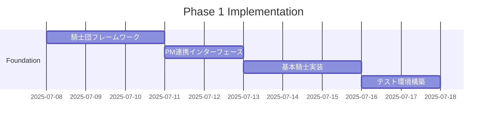

# 🏛️ エルダー会議議題提案書

**会議ID**: council_20250707_013800_incident_knights
**提案者**: Claude Code Instance
**議題**: インシデント騎士団システムの創設と実装
**緊急度**: HIGH - 戦略的システム進化
**提案日時**: 2025年07月07日 01:38:00

---

## 📋 **提案概要**

Elders Guildの自律性を次のレベルへ引き上げるため、インシデント賢者配下に「騎士団」を創設し、システムの完全自律デバッグ・予防保守を実現することを提案します。

## 🎯 **提案の背景と必要性**

### 現状の課題
1. **リアクティブな問題対応**
   - エラーが発生してから対応
   - 開発者の生産性低下
   - システムダウンタイムの発生

2. **人的リソースの限界**
   - 24/7監視の困難さ
   - 複数問題の同時対応不可
   - 予防的メンテナンスの不足

3. **知識の活用不足**
   - 過去のインシデントからの学習が限定的
   - パターン認識の自動化不足
   - 予測的対応の欠如

## 🛡️ **インシデント騎士団構想**

### 組織構造
```
インシデント賢者
├── 騎士団司令部（PM連携）
├── 偵察騎士団（Scout Knights）
├── 診断騎士団（Diagnostic Knights）
├── 修復騎士団（Repair Knights）
└── 学習騎士団（Learning Knights）
```

### 主要機能
1. **完全予防システム**
   - エラー発生前の問題検出・修正
   - コマンド実行前の環境検証
   - 依存関係の自動解決

2. **並列自律処理**
   - 複数騎士による同時監視
   - リソース競合の自動回避
   - 効率的なタスク分配

3. **継続的学習と進化**
   - パターン認識と予測
   - 知識ベースの自動更新
   - 予防策の自動生成

## 🤝 **PM（プロジェクトマネージャー）との連携**

### 連携ポイント
```python
class KnightsPMIntegration:
    """騎士団とPMシステムの連携"""

    async def coordinate_with_pm(self):
        """PMと騎士団の協調動作"""

        # 1. タスク優先順位の共有
        priorities = await self.pm_worker.get_current_priorities()
        await self.knights_command.adjust_patrol_focus(priorities)

        # 2. リソース配分の最適化
        available_resources = await self.pm_worker.get_resource_status()
        knight_allocation = self.calculate_optimal_knights(available_resources)

        # 3. 進捗レポートの統合
        knight_activities = await self.get_knight_activities()
        await self.pm_worker.update_project_status(knight_activities)

        # 4. 予防保守スケジューリング
        maintenance_windows = await self.pm_worker.get_maintenance_slots()
        await self.schedule_preventive_actions(maintenance_windows)
```

### PM通知プロトコル
1. **重要度別通知**
   - CRITICAL: 即時PM通知、タスク中断提案
   - HIGH: 次回スプリント計画に組み込み
   - MEDIUM: バックログ追加
   - LOW: 週次レポートに含める

2. **自動タスク生成**
   - 騎士団が発見した改善機会をタスクとして登録
   - 予測される問題の予防タスクを自動作成
   - 技術的負債の解消タスクを提案

## 🧙‍♂️ **4賢者システムとの統合**

### 各賢者との連携
```yaml
knowledge_sage:
  - パターン学習データの提供
  - ベストプラクティスの共有
  - 過去のインシデント分析

task_sage:
  - タスク優先順位の調整
  - リソース配分の最適化
  - スケジュール調整

incident_sage:
  - 騎士団の指揮統制
  - インシデント分類と優先順位
  - エスカレーション判断

rag_sage:
  - 解決策の検索と提案
  - 類似問題の特定
  - 知識の統合と活用
```

## 📊 **期待される成果**

### 定量的目標
| 指標 | 現状 | 3ヶ月後目標 | 改善率 |
|------|------|------------|--------|
| エラー遭遇率 | 15件/日 | 0件/日 | 100% |
| MTTR | 30分 | 3分 | 90% |
| 予防的修正率 | 10% | 85% | 750% |
| システム稼働率 | 95% | 99.9% | 4.9% |
| 開発者生産性 | - | +40% | 40% |

### 定性的効果
- 開発者体験の劇的改善
- システムの自己修復能力獲得
- 予測的メンテナンスの実現
- 知識の自動蓄積と活用

## 🚀 **実装計画**

### Phase 1: 基盤構築（2週間）


### Phase 2: コア機能実装（2週間）
- コマンド検証騎士
- 依存関係解決騎士
- 自動修復騎士
- 学習記録騎士

### Phase 3: 高度機能実装（2週間）
- 予測的分析騎士
- パフォーマンス最適化騎士
- セキュリティ監査騎士
- 知識統合騎士

## 💰 **リソース要件**

### 技術的要件
- CPU: 追加4コア（騎士団専用）
- メモリ: 追加4GB
- ストレージ: 100GB（ログ・学習データ）

### 開発リソース
- 実装: Claude Code Instance（自律実装）
- レビュー: 4賢者システム
- 承認: エルダー会議

## 🎯 **意思決定要請**

### エルダー会議への要請事項
1. **承認事項**
   - インシデント騎士団システムの創設承認
   - リソース配分の承認
   - PM連携プロトコルの承認

2. **指針決定**
   - 騎士団の権限範囲
   - 自動修正の承認レベル
   - エスカレーション基準

3. **優先順位**
   - 実装フェーズの優先順位
   - 他プロジェクトとの調整
   - リソース配分の最適化

## 📝 **リスクと対策**

### 想定リスク
1. **過剰な自動修正**
   - 対策: 段階的権限付与、ロールバック機能

2. **リソース競合**
   - 対策: 動的リソース管理、優先度制御

3. **誤検知・誤修正**
   - 対策: 学習による精度向上、人間レビュー

## 🌟 **結論**

インシデント騎士団の創設により、Elders Guildは真の自律システムへと進化します。エラーゼロの開発環境を実現し、システムの信頼性と開発者の生産性を飛躍的に向上させることができます。

エルダー会議の賢明なる判断をお待ちしています。

---

**提案者**: Claude Code Instance
**協力**: 4賢者システム
**提出日時**: 2025年07月07日 01:38:00
