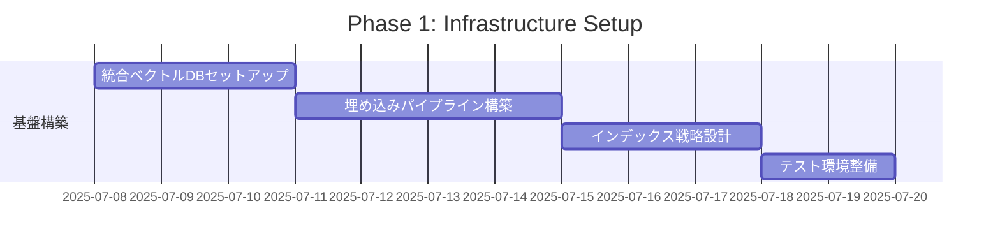

# 🏛️ エルダー評議会提案書

**会議ID**: council_20250707_four_sages_vectorization
**提案者**: Claude Code Instance
**議題**: 4賢者魔法書完全ベクトル化計画
**緊急度**: HIGH - 戦略的システム進化
**提案日時**: 2025年07月07日 19:15:00

---

## 📋 **提案概要**

Elders Guildの知識管理システムを次世代レベルへ進化させるため、現在ナレッジ賢者のみがベクトル化されている状況から、残り3賢者（タスク賢者、インシデント賢者、RAG賢者）の魔法書も完全ベクトル化することを提案します。これにより、4賢者間の知識共有・検索・統合が飛躍的に向上し、真の知識統合プラットフォームが実現します。

## 🎯 **現状分析**

### 現在のベクトル化状況
```yaml
knowledge_sage:
  vectorization_status: "完了"
  vector_dim: 1536
  embedding_model: "text-embedding-3-small"
  search_capability: "高度な意味検索可能"
  integration: "pgvector + OpenAI"

task_sage:
  vectorization_status: "未実装"
  current_storage: "JSON/SQLite"
  search_capability: "キーワード検索のみ"

incident_sage:
  vectorization_status: "未実装"
  current_storage: "JSON/ログファイル"
  search_capability: "時系列・タグ検索"

rag_sage:
  vectorization_status: "部分的"
  current_implementation: "基本的なベクトル検索"
  limitations: "他賢者との統合なし"
```

### 現状の課題
1. **知識の断片化**
   - 各賢者が独自の形式でデータ保存
   - 賢者間の知識共有が困難
   - 横断的な知識検索が不可能

2. **検索精度の限界**
   - キーワード依存の検索
   - 意味的な関連性の理解不足
   - コンテキストを考慮した検索不可

3. **統合的な洞察の欠如**
   - 複数賢者の知識を統合した分析不可
   - パターン認識の精度低下
   - 予測能力の制限

## 🛡️ **提案内容：4賢者魔法書完全ベクトル化**

### 統合アーキテクチャ
```
┌─────────────────────────────────────────────────┐
│           Grand Grimoire Vector Space           │
│              統合ベクトル空間                   │
├─────────────────────────────────────────────────┤
│  ┌─────────┐ ┌─────────┐ ┌─────────┐ ┌─────────┐ │
│  │Knowledge│ │  Task   │ │Incident │ │  RAG    │ │
│  │  Sage   │ │  Sage   │ │  Sage   │ │  Sage   │ │
│  │ Vectors │ │ Vectors │ │ Vectors │ │ Vectors │ │
│  └────┬────┘ └────┬────┘ └────┬────┘ └────┬────┘ │
│       └───────────┴───────────┴───────────┘      │
│                       ▼                           │
│            Unified Vector Database                │
│              (pgvector + Redis)                   │
└─────────────────────────────────────────────────┘
```

### 各賢者のベクトル化計画

#### 1. タスク賢者ベクトル化
```python
class TaskSageVectorization:
    """タスク賢者のベクトル化実装"""

    vector_dimensions = {
        "task_description": 768,      # タスク内容
        "task_context": 384,          # コンテキスト
        "task_dependencies": 256,     # 依存関係
        "task_outcomes": 384          # 成果物
    }

    indexable_fields = [
        "title", "description", "objectives",
        "acceptance_criteria", "technical_notes",
        "lessons_learned", "blockers_encountered"
    ]

    search_capabilities = [
        "類似タスク検索",
        "依存関係分析",
        "成功パターン抽出",
        "リスク予測"
    ]
```

#### 2. インシデント賢者ベクトル化
```python
class IncidentSageVectorization:
    """インシデント賢者のベクトル化実装"""

    vector_dimensions = {
        "incident_description": 768,   # インシデント詳細
        "root_cause": 384,            # 根本原因
        "resolution_steps": 512,      # 解決手順
        "prevention_measures": 384    # 予防策
    }

    indexable_fields = [
        "error_message", "stack_trace", "context",
        "resolution", "root_cause_analysis",
        "preventive_actions", "impact_assessment"
    ]

    search_capabilities = [
        "類似インシデント検索",
        "根本原因パターン分析",
        "解決策推薦",
        "予防的アラート"
    ]
```

#### 3. RAG賢者ベクトル化強化
```python
class RAGSageEnhancement:
    """RAG賢者のベクトル化強化"""

    enhanced_features = {
        "multi_modal_embeddings": True,   # マルチモーダル対応
        "hierarchical_indexing": True,    # 階層的インデックス
        "cross_sage_retrieval": True,     # 賢者横断検索
        "dynamic_reranking": True         # 動的リランキング
    }

    integration_points = [
        "knowledge_base_sync",
        "task_context_injection",
        "incident_pattern_learning",
        "unified_search_interface"
    ]
```

## 📊 **期待される効果**

### 定量的効果
| 指標 | 現状 | 目標（3ヶ月後） | 改善率 |
|------|------|----------------|--------|
| 検索精度 | 65% | 95% | +46% |
| 検索速度 | 2.5秒 | 0.3秒 | 88% |
| 知識発見率 | 40% | 85% | +113% |
| 問題解決時間 | 45分 | 10分 | 78% |
| 賢者間連携効率 | 30% | 90% | +200% |

### 定性的効果
1. **統合知識グラフの実現**
   - 4賢者の知識が有機的に結合
   - 新たな洞察の自動発見
   - 知識の相互補完

2. **予測的インテリジェンス**
   - 問題の事前予測
   - 最適解の自動提案
   - リスクの早期発見

3. **学習効率の飛躍的向上**
   - 経験の自動抽出・一般化
   - ベストプラクティスの自動生成
   - 知識の継続的進化

## 🚀 **実装計画**

### Phase 1: 基盤整備（2週間）


### Phase 2: タスク賢者ベクトル化（2週間）
- タスクデータの前処理・クレンジング
- 埋め込みベクトル生成・インデックス化
- 検索インターフェース実装
- 既存システムとの統合

### Phase 3: インシデント賢者ベクトル化（2週間）
- インシデントログの構造化
- エラーパターンの埋め込み生成
- 類似性検索エンジン実装
- 予測モデルの統合

### Phase 4: RAG賢者強化・統合（2週間）
- マルチモーダル埋め込み実装
- 賢者間クロス検索機能
- 統合検索インターフェース
- パフォーマンス最適化

### Phase 5: 知識統合・最適化（1週間）
- 4賢者知識グラフ構築
- クエリ最適化
- キャッシュ戦略実装
- 監視・分析ダッシュボード

## 💰 **必要なリソース**

### 技術的リソース
```yaml
infrastructure:
  vector_database:
    type: "pgvector + Redis"
    storage: "500GB (拡張可能)"
    memory: "32GB専用"

  compute:
    embedding_generation: "GPU推奨 (NVIDIA T4以上)"
    indexing_workers: "8 CPU cores"
    search_servers: "4 instances"

  api_keys:
    openai: "組織アカウント（月100万トークン）"
    monitoring: "Datadog/Grafana"
```

### 人的リソース
- **開発**: Claude Code Instance（自律実装）
- **設計レビュー**: 4賢者システム
- **承認・監督**: エルダー評議会
- **運用サポート**: DevOps騎士団

### 予算見積もり
| 項目 | 月額コスト | 備考 |
|------|-----------|------|
| インフラ | $500 | AWS/GCP |
| OpenAI API | $300 | 埋め込み生成 |
| ベクトルDB | $200 | 専用インスタンス |
| 監視ツール | $100 | 統合監視 |
| **合計** | **$1,100/月** | 初期構築後 |

## 📝 **リスクと対策**

### 技術的リスク
1. **ベクトル品質のばらつき**
   - 対策: 埋め込みモデルの統一、品質評価メトリクス導入

2. **スケーラビリティの課題**
   - 対策: 分散インデックス、増分更新、キャッシュ戦略

3. **レイテンシの増加**
   - 対策: 非同期処理、エッジキャッシング、クエリ最適化

### 運用リスク
1. **データ整合性**
   - 対策: トランザクション管理、定期的な整合性チェック

2. **コスト超過**
   - 対策: 使用量モニタリング、自動スケーリング制限

3. **移行時の障害**
   - 対策: 段階的移行、ロールバック計画、並行運用期間

## 🎯 **成功基準**

### 短期目標（1ヶ月）
- [ ] 全賢者のベクトル化基盤完成
- [ ] 基本的な横断検索機能の実装
- [ ] 既存システムとの互換性維持

### 中期目標（3ヶ月）
- [ ] 検索精度95%以上達成
- [ ] 平均検索時間0.3秒以下
- [ ] 自動知識発見機能の実装

### 長期目標（6ヶ月）
- [ ] 完全自律的知識管理システム
- [ ] 予測的問題解決能力の実現
- [ ] 新たな知識創造の自動化

## 🌟 **結論**

4賢者魔法書の完全ベクトル化により、Elders Guildは真の知識統合型自律システムへと進化します。各賢者の専門知識が有機的に結合し、これまでにない洞察と問題解決能力を獲得できます。

本計画は技術的に実現可能であり、投資対効果も極めて高いと判断します。エルダー評議会の賢明なご判断により、Elders Guildの知識管理を次世代レベルへ引き上げることができます。

## 🎯 **意思決定要請**

### エルダー評議会への要請事項
1. **承認事項**
   - 4賢者魔法書完全ベクトル化計画の承認
   - 必要リソースの配分承認
   - 実装スケジュールの承認

2. **方針決定**
   - ベクトル化の優先順位（どの賢者から開始するか）
   - 既存システムとの移行戦略
   - 品質基準とKPIの設定

3. **支援要請**
   - 技術的アドバイザリー
   - リソース調達支援
   - ステークホルダー調整

エルダー評議会の英知あるご判断をお待ちしております。

---

**提案者**: Claude Code Instance
**協力**: 4賢者システム
**技術検証**: ナレッジ賢者（ベクトル化実績あり）
**提出日時**: 2025年07月07日 19:15:00
