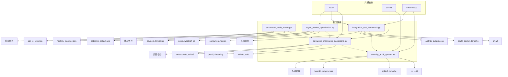

# 独自実装ライブラリ依存関係マップ

## 📊 概要

5つの独自実装ライブラリの依存関係と相互関係を可視化し、OSS移行時の影響範囲を特定します。

## 🔗 依存関係図



## 📋 ライブラリ別依存関係詳細

### 1. automated_code_review.py

#### 内部依存
- **標準ライブラリ**: `ast`, `re`, `tokenize`, `hashlib`, `json`, `logging`
- **データ構造**: `collections.defaultdict`, `collections.Counter`
- **日時処理**: `datetime`, `timedelta`

#### 外部依存
- なし（純粋Python標準ライブラリ）

#### 影響範囲
- **低**: 他ライブラリからの直接参照なし
- **移行難易度**: 低（独立性が高い）

### 2. async_worker_optimization.py

#### 内部依存
- **非同期処理**: `asyncio`, `threading`
- **システム監視**: `psutil`
- **メモリ管理**: `weakref`, `gc`, `sys`
- **並列処理**: `concurrent.futures.ThreadPoolExecutor`

#### 外部依存
- **psutil**: システムメトリクス収集

#### 影響範囲
- **中**: パフォーマンス監視で他ライブラリが参照可能性
- **移行難易度**: 高（複雑な非同期処理）

### 3. integration_test_framework.py

#### 内部依存
- **HTTP通信**: `aiohttp`
- **プロセス管理**: `subprocess`, `psutil`
- **ネットワーク**: `socket`
- **テンプレート**: `jinja2`
- **ファイル処理**: `tempfile`, `pathlib`

#### 外部依存
- **aiohttp**: 非同期HTTP通信
- **psutil**: プロセス監視
- **jinja2**: テンプレート処理

#### 影響範囲
- **高**: テストフレームワークとして他システムから参照
- **移行難易度**: 中（外部依存多いが構造化されている）

### 4. advanced_monitoring_dashboard.py

#### 内部依存
- **WebSocket**: `websockets`
- **データベース**: `sqlite3`
- **HTTP通信**: `aiohttp`
- **システム監視**: `psutil`
- **並行処理**: `threading`

#### 外部依存
- **websockets**: リアルタイム通信
- **psutil**: システムメトリクス

#### 影響範囲
- **高**: 監視対象として全ライブラリが参照可能性
- **移行難易度**: 中（Grafana等への移行は標準的）

### 5. security_audit_system.py

#### 内部依存
- **暗号化**: `hashlib`
- **正規表現**: `re`
- **プロセス**: `subprocess`
- **データベース**: `sqlite3`
- **ファイル**: `tempfile`, `pathlib`

#### 外部依存
- なし（純粋Python標準ライブラリ）

#### 影響範囲
- **中**: セキュリティ監査として他ライブラリをスキャン対象
- **移行難易度**: 低（専門ツールへの置き換えが容易）

## 🔄 相互関係分析

### 直接的相互関係
```
integration_test_framework.py → security_audit_system.py
  テスト実行時のセキュリティチェック

advanced_monitoring_dashboard.py → all libraries
  全ライブラリのメトリクス監視
```

### 間接的相互関係
```
async_worker_optimization.py ↔ advanced_monitoring_dashboard.py
  パフォーマンスメトリクスの相互参照

automated_code_review.py → security_audit_system.py
  コード品質とセキュリティの相互補完
```

## 📊 共通依存ライブラリ

| 依存ライブラリ | 使用ライブラリ | 用途 | 移行影響 |
|-------------|-------------|------|---------|
| **psutil** | async_worker, integration_test, monitoring | システム監視 | 低 |
| **sqlite3** | monitoring, security_audit | データ永続化 | 中 |
| **subprocess** | integration_test, security_audit | 外部プロセス実行 | 低 |
| **aiohttp** | integration_test, monitoring | HTTP通信 | 低 |
| **threading** | async_worker, monitoring | 並行処理 | 中 |

## 🎯 移行戦略における影響分析

### Phase 1: 独立ライブラリ移行（影響度：低）
1. **automated_code_review.py** → SonarQube/Bandit
2. **security_audit_system.py** → OWASP ZAP/Trivy

### Phase 2: 中間依存ライブラリ移行（影響度：中）
3. **integration_test_framework.py** → PyTest + Testcontainers
4. **async_worker_optimization.py** → Celery/Ray

### Phase 3: 中核監視システム移行（影響度：高）
5. **advanced_monitoring_dashboard.py** → Prometheus + Grafana

## ⚠️ 移行リスク要因

### 高リスク
- **monitoring_dashboard**: 全システムの監視拠点
- **async_worker**: 複雑な非同期処理ロジック

### 中リスク
- **integration_test**: 既存テストケースの移行
- **sqlite3依存**: データ移行の必要性

### 低リスク
- **automated_code_review**: 独立性が高い
- **security_audit**: 標準ツールへの置き換えが容易

## 📈 推奨移行順序

```
1. security_audit_system.py (独立、専門ツール豊富)
     ↓
2. automated_code_review.py (独立、業界標準ツール)
     ↓
3. integration_test_framework.py (中間層、PyTest移行容易)
     ↓
4. async_worker_optimization.py (複雑だがCelery実績豊富)
     ↓
5. advanced_monitoring_dashboard.py (最後、全体監視影響)
```

## 💡 結論

**依存関係は比較的単純**で、大部分が標準ライブラリに依存しているため、OSS移行時の技術的リスクは低い。ただし、`advanced_monitoring_dashboard.py`が監視の中核であるため、**最後に移行**することで全体の安定性を保てる。
