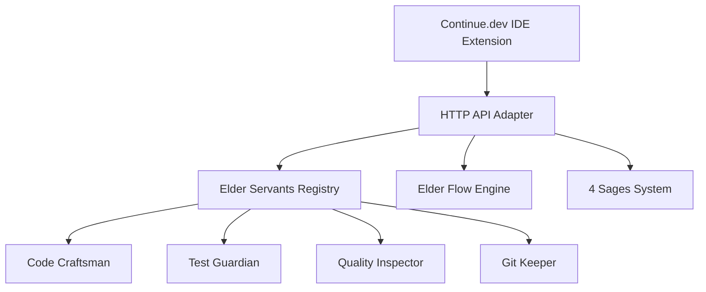

# 🔌 Elder Servants - Continue.dev Integration

## 📋 概要

このディレクトリには、Elder ServantsシステムとContinue.devを統合するためのアダプター実装が含まれています。Continue.devのカスタムプロバイダー機能を使用して、Elder Servantsを自然言語AIアシスタントとして利用できるようにします。

## 🏗️ アーキテクチャ



## 🚀 セットアップ手順

### 1. 依存関係のインストール

```bash
# FastAPIとuvicornのインストール
pip install fastapi uvicorn pydantic

# Continue.devのインストール（VS Code）
code --install-extension continue.continue
```

### 2. Elder Servant Adapterの起動

```bash
# アダプターサーバーの起動
cd /home/aicompany/ai_co/libs/elder_servants/integrations/continue_dev
python elder_servant_adapter.py

# または、開発モードで起動（自動リロード付き）
uvicorn elder_servant_adapter:app --reload --host 0.0.0.0 --port 8000
```

### 3. Continue.devの設定

1. VS Codeで `Cmd/Ctrl + Shift + P` を押して `Continue: Open config.json` を選択
2. `continue_config_template.ts` の内容をコピーして設定

または、以下のコマンドで自動設定：

```bash
# Continue設定ディレクトリにコピー
cp continue_config_template.ts ~/.continue/config.ts
```

## 📡 利用可能なエンドポイント

### Elder Servants実行
- `POST /elder/servants/{servant_id}/execute`
  - `code-craftsman`: コード生成・編集
  - `test-guardian`: テスト作成・実行
  - `quality-inspector`: 品質チェック
  - `git-keeper`: Git操作

### Elder Flow実行
- `POST /elder/flow/execute` - 5段階フローの完全実行

### 4賢者相談
- `POST /elder/sages/consult` - 4賢者への統合相談

### 品質チェック
- `POST /elder/quality/iron-will` - Iron Will基準での品質検証

### 知識検索
- `POST /elder/knowledge/search` - ナレッジベース検索

### タスク管理
- `GET /elder/tasks/active` - アクティブタスク一覧

## 🎯 使用例

### Continue.dev内でのスラッシュコマンド

```
/elder-flow ユーザー認証システムを実装してください

/sage-consult このアーキテクチャの改善点を教えてください

/iron-will-check
```

### 自然言語での指示

```
Elder Code Craftsmanモデルを選択して：
「Pythonでファイルアップロード機能を実装してください」

Elder Test Guardianモデルを選択して：
「現在のコードに対するユニットテストを作成してください」
```

## 🔧 カスタマイズ

### 新しいServantの追加

1. `elder_servant_adapter.py` の `servant_mapping` に追加
2. `continue_config_template.ts` に新しいモデルを追加
3. 必要に応じて新しいエンドポイントを作成

### カスタムコマンドの追加

`continue_config_template.ts` の `slashCommands` セクションに追加：

```typescript
{
  name: "your-command",
  description: "Your command description",
  run: async function* (sdk) {
    // 実装
  }
}
```

## 📊 パフォーマンス最適化

### キャッシング
- よく使用される結果はメモリにキャッシュ
- Redis統合も可能

### 非同期処理
- すべてのServant実行は非同期
- 並列実行サポート

### 接続プール
- HTTP接続の再利用
- WebSocketによるリアルタイム通信

## 🐛 トラブルシューティング

### アダプターが起動しない
```bash
# ポートが使用中の場合
lsof -i :8000
kill -9 <PID>

# 別のポートで起動
uvicorn elder_servant_adapter:app --port 8001
```

### Continue.devが接続できない
1. アダプターが起動していることを確認
2. ファイアウォール設定を確認
3. Continue.dev設定のURLを確認

### エラーログの確認
```bash
# アダプターのログ
tail -f logs/elder_servant_adapter.log

# Continue.devのログ（VS Code）
View > Output > Continue
```

## 📚 関連ドキュメント

- [Elder Servants設計書](../../docs/ELDER_SERVANTS_32_SYSTEM_DESIGN.md)
- [Continue.dev公式ドキュメント](https://continue.dev/docs)
- [FastAPI公式ドキュメント](https://fastapi.tiangolo.com)

## 🚀 今後の拡張計画

1. **Continue.dev Hubへの公開**
   - Elder Servantsをコミュニティアシスタントとして公開
   - 他の開発者が利用可能に

2. **より深い統合**
   - Continue.devのコンテキストプロバイダー拡張
   - カスタムUIコンポーネント

3. **パフォーマンス向上**
   - gRPC通信への移行
   - ローカルモデルサポート

---
**エルダーズギルド開発実行責任者**
**クロードエルダー（Claude Elder）**
