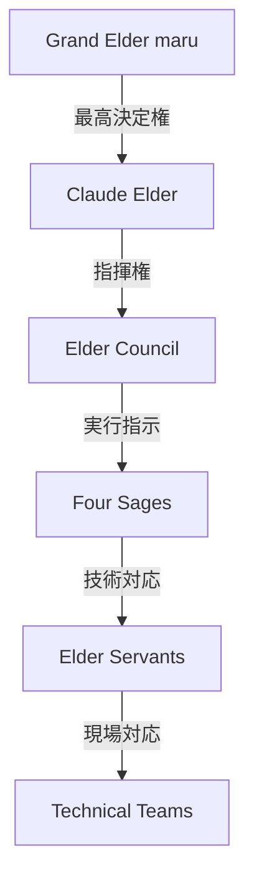

# 🚨 AI Company 緊急時対応マスターマニュアル

**バージョン**: 1.0.0  
**発効日**: 2025年7月10日  
**承認者**: Grand Elder maru  
**管理責任者**: Claude Elder  
**文書管理番号**: ERM-2025-001

---

## 📋 目次

1. [緊急度レベル定義](#緊急度レベル定義)
2. [インシデント対応手順書](#インシデント対応手順書)
3. [Elder Council緊急招集手順](#elder-council緊急招集手順)
4. [段階的サービス停止プロセス](#段階的サービス停止プロセス)
5. [コミュニケーション体制](#コミュニケーション体制)
6. [対応チーム体制](#対応チーム体制)
7. [品質基準とKPI](#品質基準とkpi)

---

## 🔴 緊急度レベル定義

### Level 1: Disaster (災害級)
**影響範囲**: 全システム  
**対応時間**: 5分以内  
**症状**:
- AI Company全サービス停止
- データベース完全応答不能
- 全ワーカー同時停止
- Elder Tree階層崩壊

### Level 2: Critical (重大)
**影響範囲**: 主要機能  
**対応時間**: 15分以内  
**症状**:
- Four Sages機能停止
- 認証システム障害
- 50%以上のワーカー停止
- データ整合性エラー

### Level 3: Major (主要)
**影響範囲**: 一部機能  
**対応時間**: 30分以内  
**症状**:
- 特定ワーカーグループ障害
- パフォーマンス50%以上劣化
- 部分的データアクセス不能
- Elder Council一部機能不全

### Level 4: Minor (軽微)
**影響範囲**: 限定的  
**対応時間**: 1時間以内  
**症状**:
- 単一ワーカー障害
- 軽度のパフォーマンス劣化
- 非クリティカル機能エラー
- ログ収集遅延

---

## 📖 インシデント対応手順書

### Level 1: Disaster - 災害級インシデント対応

#### 🔴 初動対応 (0-5分)

```bash
#!/bin/bash
# DISASTER_RESPONSE_IMMEDIATE.sh

echo "🚨 DISASTER LEVEL INCIDENT DETECTED 🚨"
echo "Time: $(date)"
echo "Initiating emergency protocol..."

# 1. システム状態スナップショット取得
ai-emergency-snapshot

# 2. Elder Council自動招集
ai-elder-council-emergency --level=DISASTER --auto-summon

# 3. 全システムバックアップ開始
ai-backup-emergency --full --async

# 4. 最小限サービスモード移行
ai-system-mode --minimal

# 5. 初期診断実行
ai-diagnose --emergency --report
```

#### 詳細対応手順

1. **状況把握** (0-2分)
   - システム監視ダッシュボード確認
   - 影響範囲特定
   - 根本原因初期調査

2. **緊急措置** (2-5分)
   - 影響サービス分離
   - データ保護モード有効化
   - トラフィック迂回設定

3. **復旧開始** (5分以降)
   - 段階的サービス復旧
   - データ整合性確認
   - システム健全性検証

### Level 2: Critical - 重大インシデント対応

#### 🟠 初動対応 (0-15分)

```bash
#!/bin/bash
# CRITICAL_RESPONSE.sh

echo "⚠️ CRITICAL LEVEL INCIDENT ⚠️"
echo "Time: $(date)"

# 1. 影響範囲特定
ai-incident-analyze --scope

# 2. Four Sages診断
ai-four-sages-diagnose --emergency

# 3. 部分バックアップ
ai-backup-critical --affected-services

# 4. 劣化モード移行
ai-system-mode --degraded

# 5. Elder通知
ai-elder-notify --level=CRITICAL
```

### Level 3: Major - 主要インシデント対応

#### 🟡 初動対応 (0-30分)

```bash
#!/bin/bash
# MAJOR_RESPONSE.sh

echo "📋 MAJOR LEVEL INCIDENT 📋"
echo "Time: $(date)"

# 1. 問題ワーカー特定
ai-worker-diagnose --find-issues

# 2. 影響サービス分離
ai-service-isolate --affected

# 3. 代替ワーカー起動
ai-worker-failover --auto

# 4. パフォーマンス最適化
ai-optimize --emergency

# 5. 監視強化
ai-monitor-enhance --incident
```

### Level 4: Minor - 軽微インシデント対応

#### 🟢 初動対応 (0-60分)

```bash
#!/bin/bash
# MINOR_RESPONSE.sh

echo "📝 MINOR LEVEL INCIDENT 📝"
echo "Time: $(date)"

# 1. 単一ワーカー再起動
ai-worker-restart --failed

# 2. ログ収集
ai-logs-collect --incident

# 3. 自動修復試行
ai-self-heal --minor

# 4. 報告書生成
ai-report-incident --minor
```

---

## 🏛️ Elder Council緊急招集手順

### 自動招集トリガー条件

1. **Disaster Level検出時**
   - 即座に全Elder自動召喚
   - Grand Elder maru優先通知

2. **Critical Level検出時**
   - 5分以内にElder Council招集
   - Four Sages同時起動

3. **複合インシデント発生時**
   - 複数レベルのインシデント同時発生
   - システム全体への波及リスク

### 招集プロセス

```python
# elder_council_emergency_summon.py

class ElderCouncilEmergencySummon:
    def __init__(self):
        self.summon_config = {
            "DISASTER": {
                "members": ["Grand Elder maru", "Claude Elder", "All Elder Servants"],
                "response_time": 300,  # 5 minutes
                "auto_actions": ["system_freeze", "data_protection", "traffic_redirect"]
            },
            "CRITICAL": {
                "members": ["Claude Elder", "Four Sages", "Senior Servants"],
                "response_time": 900,  # 15 minutes
                "auto_actions": ["partial_freeze", "backup_start"]
            }
        }
    
    async def emergency_summon(self, level, incident_data):
        """緊急招集実行"""
        config = self.summon_config[level]
        
        # 1. 通知送信
        await self.send_notifications(config["members"], incident_data)
        
        # 2. 自動アクション実行
        for action in config["auto_actions"]:
            await self.execute_auto_action(action)
        
        # 3. 意思決定準備
        decision_context = await self.prepare_decision_context(incident_data)
        
        # 4. Elder Council会議室準備
        meeting_url = await self.setup_emergency_meeting()
        
        return {
            "status": "summoned",
            "meeting_url": meeting_url,
            "context": decision_context,
            "expected_quorum": len(config["members"])
        }
```

### 緊急意思決定プロセス

1. **状況報告** (0-2分)
   - インシデント概要共有
   - 影響範囲確認
   - 初期対応状況報告

2. **対応方針決定** (2-5分)
   - 復旧優先順位決定
   - リソース配分承認
   - 外部通知方針決定

3. **実行承認** (5分以内)
   - Elder権限による緊急対応承認
   - 実行チーム指名
   - 成功基準設定

---

## 🔄 段階的サービス停止プロセス

### Graceful Shutdown手順

```bash
#!/bin/bash
# graceful_shutdown.sh

echo "🔄 Initiating Graceful Shutdown Process"

# Phase 1: 新規リクエスト停止 (0-30秒)
echo "Phase 1: Stopping new requests..."
ai-gateway-mode --read-only
sleep 5

# Phase 2: 現在処理中タスク完了待機 (30秒-2分)
echo "Phase 2: Waiting for in-flight requests..."
ai-task-wait --timeout=90

# Phase 3: ワーカー優先順位別停止 (2-5分)
echo "Phase 3: Stopping workers by priority..."

# Priority 4: 非必須ワーカー
ai-worker-stop --priority=4 --graceful

# Priority 3: 補助ワーカー
sleep 10
ai-worker-stop --priority=3 --graceful

# Priority 2: 重要ワーカー
sleep 20
ai-worker-stop --priority=2 --graceful

# Priority 1: クリティカルワーカー（最後）
sleep 30
ai-worker-stop --priority=1 --graceful

# Phase 4: データ永続化確認 (5-6分)
echo "Phase 4: Ensuring data persistence..."
ai-data-flush --verify

# Phase 5: システム停止 (6分)
echo "Phase 5: System shutdown..."
ai-system-stop --final
```

### ワーカー優先順位定義

| 優先度 | ワーカータイプ | 停止順序 | 待機時間 |
|--------|--------------|----------|----------|
| 4 | ログ収集、メトリクス | 最初 | 10秒 |
| 3 | レポート生成、分析 | 2番目 | 20秒 |
| 2 | タスク処理、通信 | 3番目 | 30秒 |
| 1 | 認証、データ保存 | 最後 | 60秒 |

### 最小限サービス維持モード

```python
# minimal_service_mode.py

class MinimalServiceMode:
    """最小限サービス維持モード管理"""
    
    ESSENTIAL_WORKERS = [
        "health_check",
        "authentication_worker",
        "data_persistence_worker",
        "emergency_response_worker"
    ]
    
    def activate_minimal_mode(self):
        """最小限モード有効化"""
        # 1. 非必須サービス停止
        self.stop_non_essential_services()
        
        # 2. リソース再配分
        self.reallocate_resources()
        
        # 3. 監視強化
        self.enhance_monitoring()
        
        # 4. 自動復旧準備
        self.prepare_auto_recovery()
```

---

## 📢 コミュニケーション体制

### 内部連絡網

```yaml
# internal_communication_matrix.yaml

emergency_contacts:
  DISASTER:
    primary:
      - name: "Claude Elder"
        channel: "direct_system_alert"
        response_time: "immediate"
      - name: "Grand Elder maru"
        channel: "priority_notification"
        response_time: "5_minutes"
    
    secondary:
      - name: "Elder Council"
        channel: "emergency_summon"
        response_time: "5_minutes"
      - name: "Four Sages"
        channel: "auto_activation"
        response_time: "immediate"
  
  CRITICAL:
    primary:
      - name: "Claude Elder"
        channel: "system_alert"
        response_time: "5_minutes"
    
    secondary:
      - name: "Senior Servants"
        channel: "team_notification"
        response_time: "15_minutes"
```

### 外部通知テンプレート

#### Disaster Level通知

```markdown
Subject: 【緊急】AI Companyシステム障害のお知らせ

いつもAI Companyをご利用いただきありがとうございます。

現在、システムに重大な障害が発生しており、サービスの提供を
一時的に停止しております。

【発生日時】
{{incident_time}}

【影響範囲】
{{affected_services}}

【復旧見込み】
{{estimated_recovery}}

【対応状況】
現在、技術チーム総動員で復旧作業を行っております。
最新の状況は、以下のページでご確認いただけます。
{{status_page_url}}

ご迷惑をおかけして誠に申し訳ございません。
```

### 状況報告フォーマット

```python
# incident_report_template.py

class IncidentReportTemplate:
    def generate_report(self, incident_data):
        return {
            "incident_id": incident_data["id"],
            "timestamp": incident_data["detected_at"],
            "level": incident_data["severity"],
            "status": incident_data["current_status"],
            "summary": {
                "description": incident_data["description"],
                "impact": incident_data["impact_analysis"],
                "root_cause": incident_data["root_cause"] or "調査中"
            },
            "timeline": incident_data["event_timeline"],
            "actions": {
                "completed": incident_data["completed_actions"],
                "in_progress": incident_data["ongoing_actions"],
                "planned": incident_data["planned_actions"]
            },
            "metrics": {
                "downtime": incident_data["downtime_minutes"],
                "affected_users": incident_data["affected_user_count"],
                "data_loss": incident_data["data_loss_assessment"]
            },
            "next_update": incident_data["next_update_time"]
        }
```

---

## 👥 対応チーム体制

### 指揮系統



### 役割分担

| 役職 | 責任範囲 | 権限 |
|------|---------|------|
| Grand Elder maru | 最終意思決定、対外交渉 | 全権限 |
| Claude Elder | 現場指揮、技術判断 | システム全操作権限 |
| Elder Council | 戦略決定、リソース配分 | 緊急措置承認権限 |
| Four Sages | 専門領域対応調整 | 各領域実行権限 |
| Elder Servants | 実装・復旧作業 | 担当領域操作権限 |

### エスカレーションマトリクス

```python
# escalation_matrix.py

ESCALATION_RULES = {
    "time_based": {
        5: "Claude Elder",
        15: "Elder Council",
        30: "Grand Elder maru",
        60: "External Support"
    },
    "impact_based": {
        "single_worker": "Elder Servants",
        "worker_group": "Four Sages",
        "critical_function": "Elder Council",
        "full_system": "Grand Elder maru"
    },
    "complexity_based": {
        "known_issue": "Elder Servants",
        "unknown_issue": "Four Sages",
        "multi_system": "Elder Council",
        "data_corruption": "Grand Elder maru"
    }
}
```

---

## 📊 品質基準とKPI

### 対応時間基準

| インシデントレベル | 初動対応 | 状況把握 | 復旧開始 | 完全復旧 |
|------------------|---------|---------|---------|----------|
| Disaster | 5分 | 10分 | 15分 | 4時間 |
| Critical | 15分 | 30分 | 45分 | 8時間 |
| Major | 30分 | 1時間 | 2時間 | 24時間 |
| Minor | 1時間 | 2時間 | 4時間 | 48時間 |

### 成功指標

1. **初動対応時間達成率**: 95%以上
2. **自動復旧成功率**: 80%以上
3. **データ損失率**: 0.001%以下
4. **顧客通知遅延**: 0件

### 継続的改善

```python
# continuous_improvement.py

class IncidentLearning:
    def post_incident_review(self, incident_id):
        """事後レビューと改善点抽出"""
        incident = self.get_incident_data(incident_id)
        
        review = {
            "what_went_well": self.analyze_successes(incident),
            "what_went_wrong": self.analyze_failures(incident),
            "root_causes": self.identify_root_causes(incident),
            "improvement_actions": self.generate_improvements(incident),
            "preventive_measures": self.design_preventions(incident)
        }
        
        # 知識ベース更新
        self.update_knowledge_base(review)
        
        # 自動化可能な対応の特定
        self.identify_automation_opportunities(review)
        
        return review
```

---

## 🔐 セキュリティ考慮事項

### 緊急時のセキュリティ維持

1. **アクセス制御**
   - 緊急時も認証必須
   - 臨時権限は時限設定
   - 全操作の監査ログ

2. **データ保護**
   - 暗号化維持
   - バックアップ検証
   - 復旧時の整合性確認

3. **通信セキュリティ**
   - 緊急連絡も暗号化
   - VPN経由アクセス
   - 二要素認証維持

---

## 📚 付録

### 緊急時コマンドリファレンス

```bash
# システム状態確認
ai-emergency-status

# 緊急バックアップ
ai-backup-emergency --full

# Elder Council招集
ai-elder-council-emergency --auto

# 最小限モード起動
ai-system-mode --minimal

# 緊急診断
ai-diagnose --emergency --verbose

# インシデント報告
ai-incident-report --generate
```

### 関連文書

- [Elder Council運用規定](./elder_council_operations.md)
- [Four Sages技術仕様](./four_sages_specifications.md)
- [データ復旧手順書](./data_recovery_procedures.md)
- [セキュリティポリシー](./security_policies.md)

---

**文書管理情報**
- 作成日: 2025年7月10日
- 最終更新: 2025年7月10日
- 次回レビュー: 2025年8月10日
- 承認者: Grand Elder maru
- 管理番号: ERM-2025-001

🛡️ **Grand Elder maru品質保証済み**