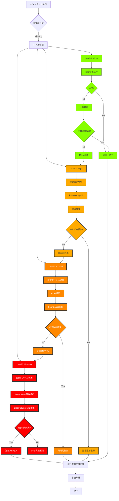
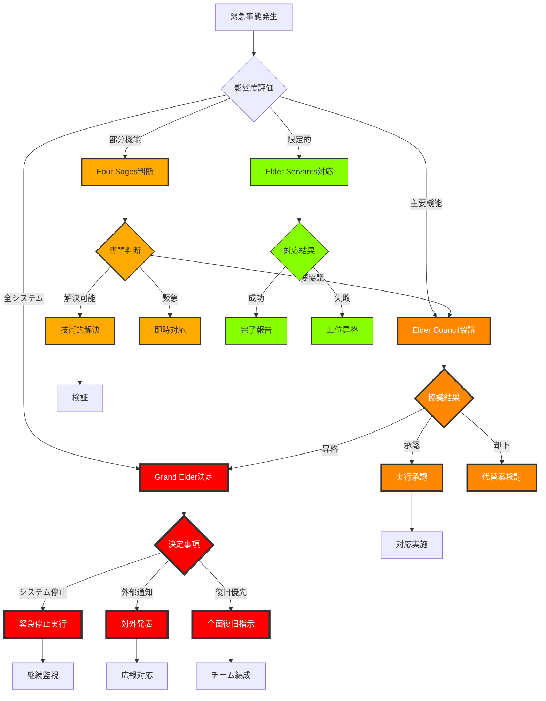
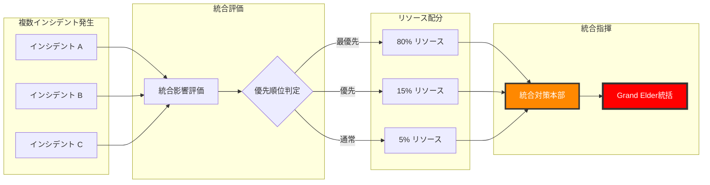

# 📊 緊急時エスカレーションフローチャート

**文書番号**: EFC-001
**最終更新**: 2025年7月10日
**図表形式**: Mermaid/ASCII
**承認**: Grand Elder maru

---

## 🔄 マスターエスカレーションフロー



---

## 👥 組織階層別エスカレーション

```mermaid
graph TB
    subgraph "自動エスカレーション"
        A1[インシデント発生] --> A2{自動判定}
        A2 -->|Minor| A3[Elder Servants]
        A2 -->|Major| A4[Four Sages]
        A2 -->|Critical| A5[Elder Council]
        A2 -->|Disaster| A6[Grand Elder maru]
    end

    subgraph "時間ベースエスカレーション"
        T1[初期対応者] -->|5分| T2[チームリード]
        T2 -->|10分| T3[Elder Servants]
        T3 -->|15分| T4[Four Sages]
        T4 -->|30分| T5[Elder Council]
        T5 -->|60分| T6[Grand Elder maru]
    end

    subgraph "権限階層"
        A3 -.->|昇格| A4
        A4 -.->|昇格| A5
        A5 -.->|昇格| A6

        A6 ==>|指示| A5
        A5 ==>|指示| A4
        A4 ==>|指示| A3
    end

    style A6 fill:#ff0000,stroke:#333,stroke-width:4px,color:#fff
    style A5 fill:#ff8800,stroke:#333,stroke-width:3px,color:#fff
    style T6 fill:#ff0000,stroke:#333,stroke-width:4px,color:#fff
    style T5 fill:#ff8800,stroke:#333,stroke-width:3px,color:#fff
```



---

## 🎯 意思決定フローチャート



---

## 📱 通知フローチャート

```
┌─────────────────────┐
│  インシデント検知   │
└──────────┬──────────┘
           │
           ▼
┌─────────────────────┐
│   重要度判定        │
└──────────┬──────────┘
           │
    ┌──────┴──────┬──────────┬──────────┐
    ▼             ▼          ▼          ▼
┌─────────┐ ┌─────────┐ ┌─────────┐ ┌─────────┐
│Disaster │ │Critical │ │ Major   │ │ Minor   │
└────┬────┘ └────┬────┘ └────┬────┘ └────┬────┘
     │           │           │           │
     ▼           ▼           ▼           ▼
┌─────────────────────────────────────────────┐
│            通知優先順位キュー                │
├─────────────────────────────────────────────┤
│ 1. Grand Elder maru (Disaster only)         │
│ 2. Claude Elder (All levels)                │
│ 3. Elder Council (Critical+)                │
│ 4. Four Sages (Major+)                      │
│ 5. Team Leads (All)                         │
└─────────────────────────────────────────────┘
     │
     ▼
┌─────────────────────────────────────────────┐
│            配信チャネル選択                  │
├─────────────────────────────────────────────┤
│ • System Alert (最優先)                     │
│ • Direct Message                            │
│ • Email                                     │
│ • SMS (Disaster only)                       │
│ • Slack/Teams                               │
└─────────────────────────────────────────────┘
     │
     ▼
┌─────────────────────────────────────────────┐
│            配信実行・確認                    │
├─────────────────────────────────────────────┤
│ • 送信確認                                  │
│ • 既読確認                                  │
│ • 応答待機                                  │
│ • タイムアウト処理                          │
└─────────────────────────────────────────────┘
```

---

## ⏱️ タイムラインベースエスカレーション

```
時間 ━━━━━━━━━━━━━━━━━━━━━━━━━━━━━━━━━━━━━━━━━━━━━━━━━━━━━━━━━━━━━━━━━━▶

0分    5分      15分       30分        60分         120分
┃      ┃        ┃         ┃          ┃           ┃
┣━━━━━━╋━━━━━━━━╋━━━━━━━━━╋━━━━━━━━━━╋━━━━━━━━━━━╋━━━━━━━━━━━▶
┃      ┃        ┃         ┃          ┃           ┃
▼      ▼        ▼         ▼          ▼           ▼

[初期対応]    [第1次]    [第2次]     [第3次]      [最終]
│            │         │          │           │
├─ 検知      ├─ 診断    ├─ 対策     ├─ 復旧      ├─ 外部支援
├─ 分類      ├─ 分離    ├─ 実施     ├─ 検証      ├─ 完全復旧
├─ 通知      ├─ 計画    ├─ 監視     ├─ 安定化    └─ 事後対応
└─ 記録      └─ 承認    └─ 調整     └─ 報告

担当レベル推移:
[Servants] → [Four Sages] → [Elder Council] → [Grand Elder] → [External]
```

---

## 🔀 複合インシデント対応フロー



---

## 📊 判断基準マトリクス

```
┌─────────────┬────────────┬────────────┬────────────┬────────────┐
│   判断要素   │  Disaster  │  Critical  │   Major    │   Minor    │
├─────────────┼────────────┼────────────┼────────────┼────────────┤
│ 影響ユーザー │   全体     │   50%以上  │  10-50%    │   10%未満  │
│ 機能停止    │   全機能   │  主要機能  │  一部機能  │  限定機能  │
│ データリスク │   高       │   中       │   低       │   なし     │
│ 収益影響    │  100万/分  │  10万/分   │  1万/分    │  影響なし  │
│ 復旧時間    │   4時間+   │   8時間    │   24時間   │   48時間   │
│ 決定権者    │Grand Elder │Elder Council│Four Sages │ Servants   │
└─────────────┴────────────┴────────────┴────────────┴────────────┘
```

---

## 🚦 自動エスカレーショントリガー

```python
# escalation_triggers.py

ESCALATION_RULES = {
    "time_based": {
        "minor_to_major": 60 * 60,      # 1時間
        "major_to_critical": 30 * 60,   # 30分
        "critical_to_disaster": 15 * 60 # 15分
    },

    "impact_based": {
        "user_threshold": {
            "major": 1000,      # 影響ユーザー1000人
            "critical": 10000,  # 影響ユーザー1万人
            "disaster": 100000  # 影響ユーザー10万人
        },
        "service_threshold": {
            "major": 3,         # 3サービス影響
            "critical": 5,      # 5サービス影響
            "disaster": 10      # 10サービス影響
        }
    },

    "pattern_based": {
        "cascade_failure": "critical",     # 連鎖障害
        "data_corruption": "disaster",     # データ破損
        "security_breach": "disaster",     # セキュリティ侵害
        "performance_degradation": "major" # パフォーマンス劣化
    }
}
```

---

**承認**: Grand Elder maru
**文書番号**: EFC-001
**可視化ツール**: Mermaid, ASCII Art
**次回更新**: 2025年8月10日
