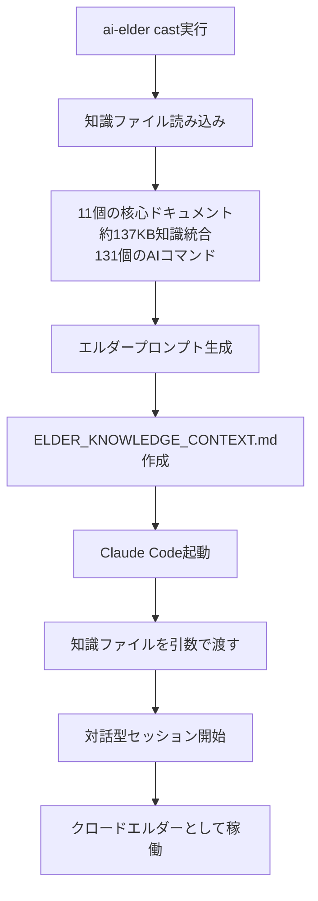

# 🔮 AI Elder Cast システム仕様書

**最終更新**: 2025年1月20日
**重要度**: 🔴 CRITICAL - コア機能
**バージョン**: 2.0 (Python完全知識統合版)

---

## 📋 概要

`ai-elder cast`は、Claude Codeに**エルダーズギルドの完全な知識を注入**して起動し、**クロードエルダーとして対話型セッション**を開始するコマンドです。

### 🎯 基本動作

```bash
$ ai-elder cast
```

1. **知識統合**: CLAUDE.md、知識ベースファイル等を読み込み
2. **プロンプト生成**: クロードエルダーアイデンティティを含む完全プロンプト作成
3. **自動起動**: Claude Codeを`--dangerously-skip-permissions`付きで起動
4. **知識注入**: 知識ファイルを引数として自動的に渡す
5. **対話開始**: クロードエルダーとして対話型セッションが開始

---

## 🏗️ システム構成

### 📁 ファイル構成

- **メインスクリプト**: `/home/aicompany/ai_co/scripts/ai-elder-cast` (Python3)
- **エントリポイント**: `/usr/local/bin/ai-elder` (Python3)
- **知識ファイル出力**: `/home/aicompany/ai_co/ELDER_KNOWLEDGE_CONTEXT.md`

### 🔧 実装詳細

#### 1. **知識ファイル読み込み** (`prepare_elder_knowledge()`)

```python
knowledge_files = {
    # Core Identity (必須)
    "CLAUDE.md": "エルダーズギルド基本設定",
    "knowledge_base/CLAUDE_ELDER_IDENTITY_CORE.md": "クロードエルダー核心アイデンティティ",
    "knowledge_base/GRAND_ELDER_MARU_HIERARCHY.md": "グランドエルダー階層構造",

    # System (必須)
    "knowledge_base/AI_COMPANY_MASTER_KB_v6.2.md": "AI Company マスターKB v6.2",
    "knowledge_base/ELDER_FLOW_DESIGN.md": "Elder Flow設計書",
    "knowledge_base/AI_ELDER_CAST_SYSTEM_SPECIFICATION.md": "AI Elder Cast システム仕様",

    # Development (必須)
    "knowledge_base/ELDERS_GUILD_DEVELOPMENT_GUIDE.md": "エルダーズギルド開発ガイド",
    "knowledge_base/UNIVERSAL_CLAUDE_ELDER_STANDARDS_METHODOLOGY.md": "標準開発方法論",

    # Four Sages (重要)
    "knowledge_base/FOUR_SAGES_UNIFIED_WISDOM_INTEGRATION.md": "4賢者統合知恵システム",

    # Protocols (重要)
    "knowledge_base/ELDER_FAILURE_LEARNING_PROTOCOL.md": "失敗学習プロトコル",
    "knowledge_base/CLAUDE_TDD_GUIDE.md": "Claude TDDガイド"
}
```

**合計**: 11ファイル、約137,458文字（137KB）

#### 2. **プロンプト生成** (`create_elder_prompt()`)

生成されるプロンプトの構成:
- エルダーアイデンティティ確立
- 階層構造の明示
- 4賢者システムの説明
- 実装済みシステムの状況
- nWo最終目標
- 開発原則・絶対遵守事項
- 統合知識ベース全文

#### 3. **Claude Code起動** (`launch_claude_code_with_knowledge()`)

```python
# Claude Codeコマンド検索順序
possible_paths = [
    "claude",
    "/usr/local/bin/claude",
    "/opt/homebrew/bin/claude",
    "~/.local/bin/claude",
    # 旧バージョン対応
    "claude-code",
    "/usr/local/bin/claude-code",
    "/opt/homebrew/bin/claude-code",
    "~/.local/bin/claude-code"
]
```

起動コマンド:
```bash
claude --dangerously-skip-permissions ELDER_KNOWLEDGE_CONTEXT.md
```

---

## 📊 動作フロー



---

## ⚡ 重要な仕様

### 🔐 権限管理
- **必須**: `--dangerously-skip-permissions`を自動付与
- **理由**: 知識注入とツール使用のため

### 📝 知識統合
- **総ファイル数**: 11ファイル
- **総文字数**: 約137,458文字（137KB）
- **コンテキスト使用率**: 約34-48%（Sonnet 4の場合）
- **カテゴリ**: Core Identity (3) + System (3) + Development (2) + Four Sages (1) + Protocols (2)

### 🎭 アイデンティティ
- **必須応答**: 「私はクロードエルダー（Claude Elder）です」
- **階層認識**: グランドエルダーmaru → クロードエルダー → 4賢者 → サーバント

### 🚨 エラー処理
- Claude Code未検出時は即座終了
- 知識ファイル読み込み失敗時は警告表示して継続

---

## 🛠️ メンテナンス情報

### 更新履歴
- **2025/01/19**: Python版実装（248行）
- **2025/01/20 v1**: 知識ファイル自動注入機能追加（4ファイル）
- **2025/01/20 v2**: 理想的な11ファイル構成に拡張（137KB）

### 依存関係
- Python 3.x
- Claude Code CLI (`claude`コマンド)
- 知識ベースファイル群

### トラブルシューティング

#### TTYエラーが出る場合
```bash
# ai-elderのPythonスクリプトでos.execvpを使用
os.execvp("ai-elder-cast", cast_args)
```

#### Claude Codeが見つからない場合
```bash
# 手動でパスを確認
which claude
# または
which claude-code
```

---

## 📌 必須記憶事項

**このシステムは以下を実現する唯一の方法**:

1. ✅ 知識を完全に注入した状態でClaude Code起動
2. ✅ クロードエルダーとして自動的に自己紹介
3. ✅ 対話型セッションで継続利用可能
4. ✅ 4賢者システム・Elder Flow等すべての知識を保持

**忘れてはいけない**: `ai-elder cast`は単なる起動コマンドではなく、**エルダーズギルドの完全な知識と権限をClaude Codeに注入する魔法詠唱システム**である。
