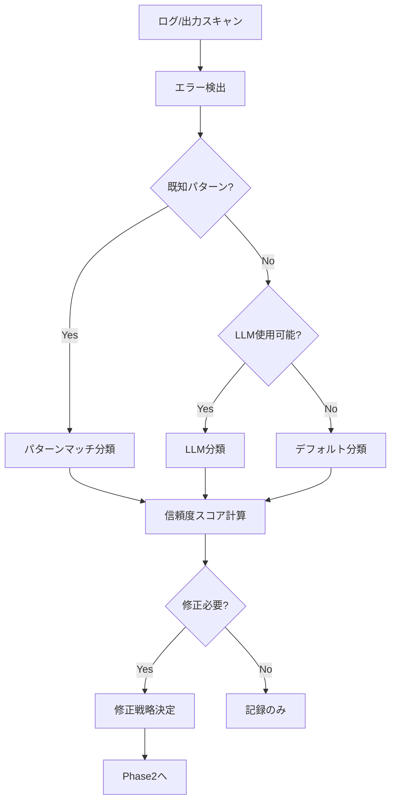
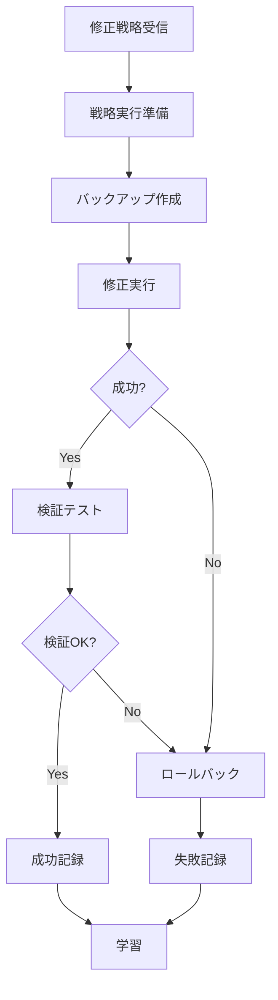

# 🤖 Elders Guild エラー智能判断・自動修正・自己修復システム 設計書 v1.0

## 📋 目次

1. [システム概要](#システム概要)
2. [アーキテクチャ](#アーキテクチャ)
3. [コンポーネント設計](#コンポーネント設計)
4. [データ構造](#データ構造)
5. [処理フロー](#処理フロー)
6. [API仕様](#api仕様)
7. [実装計画](#実装計画)
8. [テスト戦略](#テスト戦略)
9. [将来の拡張](#将来の拡張)

---

## 🎯 システム概要

### **ビジョン**
Elders Guildが自律的にエラーを判断し、修正し、経験から学習して自己修復能力を獲得するシステム

### **目的**
1. **エラーの智能判断** - 本当に修正が必要なエラーかを自動判断
2. **パターン学習** - 頻出パターンを学習してLLM呼び出しを最小化
3. **自動修正** - 判断したエラーを適切な戦略で自動修正
4. **自己修復** - 過去の経験から最適な修正方法を選択

### **段階的実装**
- **Phase 1**: エラー判断・分類システム（初回実装）
- **Phase 2**: 自動修正システム
- **Phase 3**: 自己修復・予防システム

---

## 🏗️ アーキテクチャ

### **システム構成図**

```
┌─────────────────────────────────────────────────────────────┐
│                    Error Intelligence System                  │
├─────────────────────────────────────────────────────────────┤
│                                                               │
│  ┌─────────────┐    ┌──────────────┐    ┌───────────────┐  │
│  │   Error     │    │   Pattern    │    │  Knowledge    │  │
│  │  Detector   │───▶│  Classifier  │───▶│    Base       │  │
│  └─────────────┘    └──────────────┘    └───────────────┘  │
│         │                    │                    │          │
│         ▼                    ▼                    ▼          │
│  ┌─────────────┐    ┌──────────────┐    ┌───────────────┐  │
│  │   Error     │    │   Pattern    │    │     Fix       │  │
│  │ Aggregator  │    │   Learner    │    │   History     │  │
│  └─────────────┘    └──────────────┘    └───────────────┘  │
│                              │                    │          │
│                              ▼                    ▼          │
│                     ┌──────────────┐    ┌───────────────┐  │
│                     │  Auto Fixer  │───▶│ Self Healing  │  │
│                     └──────────────┘    └───────────────┘  │
│                                                               │
└─────────────────────────────────────────────────────────────┘
```

### **ディレクトリ構造**

```
/home/aicompany/ai_co/
├── error_intelligence/
│   ├── __init__.py
│   ├── detector.py          # エラー検出
│   ├── classifier.py        # エラー分類
│   ├── learner.py          # パターン学習
│   ├── fixer.py            # 自動修正
│   └── healer.py           # 自己修復
├── knowledge_base/
│   ├── error_patterns/
│   │   ├── known_patterns.json
│   │   ├── learned_patterns.jsonl
│   │   └── fix_strategies.json
│   ├── fix_history/
│   │   └── successful_fixes.jsonl
│   └── statistics/
│       └── error_stats.json
└── tests/
    └── test_error_intelligence/
```

---

## 🔧 コンポーネント設計

### 1. **ErrorDetector（エラー検出器）**

```python
class ErrorDetector:
    """ログやプロセス出力からエラーを検出"""

    def __init__(self):
        self.error_patterns = [
            r"ERROR:.*",
            r"CRITICAL:.*",
            r"Traceback \(most recent call last\):",
            r".*Error:.*",
            r".*Exception:.*",
            r"Failed to.*",
            r"Could not.*"
        ]
        self.ignore_patterns = [
            r".*test.*error.*",  # テスト関連は無視
            r".*example.*"       # サンプルコードは無視
        ]

    def detect_errors(self, text: str) -> List[ErrorInfo]:
        """テキストからエラーを検出"""
        errors = []
        for line_no, line in enumerate(text.split('\n')):
            if self._is_error(line) and not self._should_ignore(line):
                error = self._extract_error_info(line, line_no, text)
                errors.append(error)
        return errors
```

### 2. **ErrorClassifier（エラー分類器）**

```python
class ErrorClassifier:
    """エラーを重要度とタイプで分類"""

    def __init__(self):
        self.known_patterns = self._load_known_patterns()
        self.llm_quota = LLMQuotaManager()  # LLM使用量管理

    def classify(self, error: ErrorInfo) -> Classification:
        # 1. 既知パターンマッチング（高速）
        for pattern in self.known_patterns:
            if pattern.matches(error.message):
                return Classification(
                    category=pattern.category,
                    priority=pattern.priority,
                    fix_strategy=pattern.fix_strategy,
                    confidence=pattern.confidence,
                    source="pattern_match"
                )

        # 2. コンテキスト分析（中速）
        context_result = self._analyze_context(error)
        if context_result.confidence > 0.7:
            return context_result

        # 3. LLM判定（低速・高精度）
        if self.llm_quota.can_use():
            return self._llm_classify(error)

        # 4. デフォルト分類
        return Classification(
            category="unknown",
            priority="low",
            fix_strategy="none",
            confidence=0.3,
            source="default"
        )
```

### 3. **PatternLearner（パターン学習器）**

```python
class PatternLearner:
    """エラーパターンを学習して知識ベースを更新"""

    def __init__(self):
        self.learning_threshold = 5  # 5回以上出現で学習
        self.confidence_threshold = 0.8
        self.pattern_cache = {}

    def learn_from_classification(self, error: ErrorInfo, classification: Classification):
        """分類結果から学習"""
        pattern_key = self._extract_pattern_key(error)

        # キャッシュに追加
        if pattern_key not in self.pattern_cache:
            self.pattern_cache[pattern_key] = {
                "occurrences": 0,
                "classifications": [],
                "fixes": []
            }

        cache = self.pattern_cache[pattern_key]
        cache["occurrences"] += 1
        cache["classifications"].append(classification)

        # 学習条件を満たしたら既知パターンに昇格
        if cache["occurrences"] >= self.learning_threshold:
            confidence = self._calculate_confidence(cache)
            if confidence >= self.confidence_threshold:
                self._promote_to_known_pattern(pattern_key, cache, confidence)
```

### 4. **AutoFixer（自動修正器）**

```python
class AutoFixer:
    """エラーを自動的に修正"""

    def __init__(self):
        self.fix_strategies = {
            "pip_install": PipInstallStrategy(),
            "create_file": CreateFileStrategy(),
            "fix_permission": FixPermissionStrategy(),
            "fix_import": FixImportStrategy(),
            "restart_service": RestartServiceStrategy(),
            "retry_operation": RetryOperationStrategy()
        }

    def fix(self, error: ErrorInfo, classification: Classification) -> FixResult:
        """エラーを修正"""
        strategy_name = classification.fix_strategy

        if strategy_name not in self.fix_strategies:
            return FixResult(success=False, reason="Unknown strategy")

        strategy = self.fix_strategies[strategy_name]

        # 修正前の状態を保存（ロールバック用）
        backup = self._create_backup(error.context)

        try:
            # 修正実行
            result = strategy.execute(error, classification)

            # 検証
            if self._verify_fix(error, result):
                return FixResult(
                    success=True,
                    strategy=strategy_name,
                    changes=result.changes
                )
            else:
                self._rollback(backup)
                return FixResult(success=False, reason="Verification failed")

        except Exception as e:
            self._rollback(backup)
            return FixResult(success=False, reason=str(e))
```

### 5. **SelfHealingOrchestrator（自己修復オーケストレータ）**

```python
class SelfHealingOrchestrator:
    """全体を統括する自己修復システム"""

    def __init__(self):
        self.detector = ErrorDetector()
        self.classifier = ErrorClassifier()
        self.learner = PatternLearner()
        self.fixer = AutoFixer()
        self.history = FixHistory()

    def heal_system(self):
        """システム全体の自己修復を実行"""
        # 1. エラー検出
        errors = self.detector.scan_all_logs()

        # 2. エラー集約（ノイズ除去）
        aggregated_errors = self._aggregate_errors(errors)

        # 3. 優先順位付け
        prioritized_errors = self._prioritize_errors(aggregated_errors)

        # 4. 修復実行
        for error in prioritized_errors:
            # 分類
            classification = self.classifier.classify(error)

            # 修正必要性判断
            if self._should_fix(error, classification):
                # 過去の成功パターンを参照
                best_strategy = self._find_best_strategy(error, classification)

                # 修正実行
                result = self.fixer.fix(error, classification)

                # 結果記録
                self.history.record(error, classification, result)

                # 学習
                if result.success:
                    self.learner.learn_from_success(error, classification, result)
                else:
                    self.learner.learn_from_failure(error, classification, result)
```

---

## 📊 データ構造

### **known_patterns.json**
```json
{
  "version": "1.0",
  "patterns": [
    {
      "id": "pat_001",
      "name": "missing_module",
      "regex": "ModuleNotFoundError: No module named '([^']+)'",
      "category": "dependency",
      "priority": "medium",
      "fix_strategy": "pip_install",
      "confidence": 0.95,
      "capture_groups": {
        "module_name": 1
      },
      "metadata": {
        "learned_at": "2025-07-03T14:00:00Z",
        "occurrences": 156,
        "success_rate": 0.98
      }
    }
  ]
}
```

### **error_classification.json**
```json
{
  "error_id": "err_20250703_140000",
  "timestamp": "2025-07-03T14:00:00Z",
  "error": {
    "message": "ModuleNotFoundError: No module named 'pandas'",
    "file": "/home/aicompany/ai_co/scripts/analysis.py",
    "line": 15,
    "context": "import pandas as pd"
  },
  "classification": {
    "category": "dependency",
    "priority": "medium",
    "fix_strategy": "pip_install",
    "confidence": 0.95,
    "source": "pattern_match"
  },
  "suggested_fixes": [
    {
      "strategy": "pip_install",
      "command": "pip install pandas",
      "confidence": 0.95
    },
    {
      "strategy": "conda_install",
      "command": "conda install pandas",
      "confidence": 0.70
    }
  ]
}
```

### **fix_history.jsonl**
```json
{"timestamp": "2025-07-03T14:00:00Z", "error_id": "err_001", "strategy": "pip_install", "success": true, "duration": 15.2, "changes": ["Installed pandas==2.0.0"]}
{"timestamp": "2025-07-03T14:01:00Z", "error_id": "err_002", "strategy": "create_file", "success": true, "duration": 0.1, "changes": ["Created /tmp/missing_file.txt"]}
```

---

## 🔄 処理フロー

### **Phase 1: エラー判断フロー**



### **Phase 2: 自動修正フロー**



---

## 🔌 API仕様

### **ErrorIntelligenceAPI**

```python
class ErrorIntelligenceAPI:
    """外部からの利用インターフェース"""

    def analyze_error(self, error_text: str) -> AnalysisResult:
        """エラーを分析して結果を返す"""
        pass

    def fix_error(self, error_id: str) -> FixResult:
        """エラーIDを指定して修正を実行"""
        pass

    def get_statistics(self, time_range: str = "24h") -> Statistics:
        """エラー統計を取得"""
        pass

    def get_known_patterns(self) -> List[Pattern]:
        """既知のパターン一覧を取得"""
        pass
```

### **CLI インターフェース**

```bash
# エラー分析
ai-error analyze "ModuleNotFoundError: No module named 'pandas'"

# 自動修正
ai-error fix --id err_001

# 統計表示
ai-error stats --range 7d

# パターン管理
ai-error patterns list
ai-error patterns add --file custom_pattern.json
```

---

## 📅 実装計画

### **Phase 1: エラー判断システム（2日）**

```yaml
Day 1:
  - ErrorDetector実装
  - ErrorClassifier基本実装
  - known_patterns.json作成
  - 基本的なパターンマッチング

Day 2:
  - PatternLearner実装
  - LLM統合（オプション）
  - ログ統合
  - テスト作成
```

### **Phase 2: 自動修正システム（3日）**

```yaml
Day 3-4:
  - AutoFixer基盤実装
  - 修正戦略実装（pip_install, create_file等）
  - バックアップ・ロールバック機能

Day 5:
  - 検証システム
  - 修正履歴管理
  - 統合テスト
```

### **Phase 3: 自己修復システム（2日）**

```yaml
Day 6-7:
  - SelfHealingOrchestrator実装
  - 過去の成功パターン活用
  - 予防的修正
  - パフォーマンス最適化
```

---

## 🧪 テスト戦略

### **ユニットテスト**

```python
class TestErrorClassifier:
    def test_known_pattern_matching(self):
        """既知パターンの正確なマッチング"""
        pass

    def test_confidence_calculation(self):
        """信頼度計算の妥当性"""
        pass

    def test_llm_fallback(self):
        """LLMフォールバックの動作"""
        pass
```

### **統合テスト**

```python
class TestEndToEnd:
    def test_error_detection_to_classification(self):
        """エラー検出から分類までの流れ"""
        pass

    def test_classification_to_fix(self):
        """分類から修正までの流れ"""
        pass

    def test_learning_cycle(self):
        """学習サイクルの検証"""
        pass
```

### **パフォーマンステスト**

- パターンマッチング速度: < 10ms/エラー
- LLM呼び出し削減率: > 90%
- 修正成功率: > 80%

---

## 🚀 将来の拡張

### **短期的拡張（1-3ヶ月）**

1. **予防的エラー検出**
   - エラーが起きる前に予兆を検出
   - リソース枯渇の予測

2. **依存関係分析**
   - エラーの連鎖を理解
   - 根本原因の特定

3. **自動リファクタリング**
   - エラーが起きやすいコードの改善
   - ベストプラクティスの自動適用

### **長期的ビジョン（6-12ヶ月）**

1. **分散システム対応**
   - マイクロサービス間のエラー追跡
   - 分散トレーシング統合

2. **機械学習モデル**
   - 時系列分析によるエラー予測
   - 異常検知アルゴリズム

3. **自己進化**
   - 新しい修正戦略の自動生成
   - コード生成による修正

---

## 📝 実装チェックリスト

### **Phase 1 チェックリスト**

- [ ] プロジェクト構造作成
- [ ] ErrorDetector実装
- [ ] ErrorClassifier実装
- [ ] known_patterns.json初期データ作成
- [ ] PatternLearner基本実装
- [ ] ログ統合
- [ ] CLIツール作成
- [ ] ユニットテスト
- [ ] ドキュメント作成

### **必要な依存関係**

```txt
# requirements.txt追加分
jsonschema>=4.0.0  # パターン検証
redis>=4.0.0       # キャッシュ（オプション）
```

---

## 🎯 成功指標

### **Phase 1 完了基準**

- エラー検出率: > 95%
- 誤検出率: < 5%
- パターンマッチング速度: < 10ms
- 既知パターンカバー率: > 70%

### **全体完了時の目標**

- 自動修正成功率: > 80%
- 平均修正時間: < 30秒
- 人間の介入削減: > 90%
- システム稼働率向上: > 99.5%

---

**📚 この設計書に従って、Elders Guildの自己修復能力を実装していきます**
