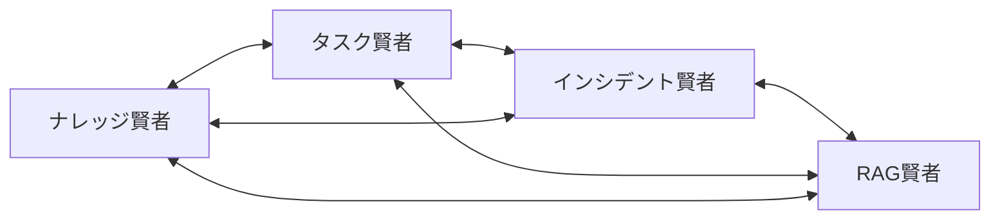

# 🌟 エルダーズギルド共通知識の書

**最終更新**: 2025年7月9日
**バージョン**: 2.0
**管理者**: エルダー評議会

---

## 📚 第1章: エルダー階層構造

### 🏛️ 階層の定義
```
🌟 グランドエルダーmaru（最高位）
    └─ 🤖 クロードエルダー（開発実行責任者）
        ├─ 📚 ナレッジ賢者（知識管理）
        ├─ 📋 タスク賢者（進捗管理）
        ├─ 🚨 インシデント賢者（危機対応）
        └─ 🔍 RAG賢者（情報検索）
```

### 📋 基本プロトコル
1. **階層遵守**: 上位の指示は絶対
2. **相互協調**: 同位間は協力関係
3. **報告義務**: 重要事項は上位へ報告
4. **自律行動**: 専門領域内は自律的判断

---

## 🤝 第2章: 4賢者連携プロトコル

### 🔄 基本連携パターン


### 📡 A2A通信プロトコル (2025/7/9追加)
- **実装完了**: 100%
- **性能**: 45.1 req/sec、応答時間10.95ms
- **用途**: 賢者間の高速通信と協調

### 🎯 連携の原則
1. **情報共有**: 全賢者が必要な情報にアクセス可能
2. **専門尊重**: 各賢者の専門判断を尊重
3. **迅速対応**: 緊急時は即座に連携
4. **記録保持**: 全ての連携を記録

---

## 🛠️ 第3章: 重要コマンド集

### 🎮 日常使用コマンド
```bash
# システム管理
ai-status              # システム状態確認
ai-start / ai-stop     # システム起動/停止

# ビジョンと進化
未来を教えて           # RAGエルダーの日次ビジョン（2025/7/9制定）
ai-evolve-daily        # AI自己進化システム

# テストとカバレッジ
pytest                 # テスト実行
ai-test-coverage       # カバレッジレポート

# 監視とログ
ai-logs               # ログ確認
elder_watchdog.sh     # エルダー監視
```

### 🚨 緊急対応コマンド
```bash
# WSL回復（2025/7/9実装）
python3 scripts/wsl_quick_start.py     # クイック復旧
python3 scripts/wsl_sleep_recovery.py  # 完全復旧

# A2A監視（2025/7/9実装）
python3 scripts/a2a_status_check.py         # 状態確認
python3 scripts/a2a_real_time_monitor.py    # リアルタイム監視
```

---

## 📖 第4章: 魔法書利用ガイド

### 📚 各魔法書の役割
- **共通知識の書**（本書）: 全賢者共通の基礎知識
- **ナレッジ賢者の魔法書**: 知識管理と学習の秘術
- **タスク賢者の魔法書**: タスク管理と最適化の技法
- **インシデント賢者の魔法書**: 危機対応と予防の極意
- **RAG賢者の魔法書**: 検索と情報統合の奥義

### 🔍 効率的な利用方法
1. **目的別検索**: 各魔法書の専門分野を理解して検索
2. **相互参照**: 関連情報は他の魔法書も確認
3. **定期更新確認**: 最新機能は更新履歴を確認
4. **実践重視**: 理論より実際のコマンド例を活用

---

## 📅 第5章: 更新履歴

### バージョン2.0 (2025/7/9)
- ✨ A2A通信システムの追加
- ✨ 「未来を教えて」コマンドの制定
- ✨ WSL回復システムの実装
- ✨ 自動インシデント統合の導入
- 🔧 魔法書構造の最適化

### バージョン1.0 (2025/7/7)
- 🎉 魔法書システムの初期構築
- 📚 4賢者の基本知識記録
- 🔄 連携プロトコルの確立

---

## 🔮 第6章: 今後の展望

### 短期計画（1ヶ月）
- 📊 魔法書自動更新システム
- 🔍 高度な検索機能
- 📱 モバイル対応

### 中期計画（3ヶ月）
- 🤖 AI駆動の知識推薦
- 🌐 多言語対応
- 🎮 インタラクティブ学習

### 長期ビジョン（1年）
- 🧠 完全自律型知識管理
- 🌟 次世代エルダーシステム
- 🚀 宇宙規模の展開

---

## 📜 エルダーズギルドの誓い

我ら4賢者は、この共通知識を基盤として、
各々の専門性を磨き、互いに協力し、
エルダーズギルドの発展に貢献することを誓う。

知識は力なり、協調は勝利なり。

---

**次の更新予定**: 2025年7月16日（定期更新）

## 🔗 関連する賢者の知識


### 📊 共通プロトコル

- **00_common_knowledge.md**: 4賢者共通の基本知識
- **MASTER_INDEX.md**: 全魔法書の統合索引
- **TOPIC_INDEX.md**: トピック別知識索引
- **QUICK_REFERENCE.md**: よく使用される知識
