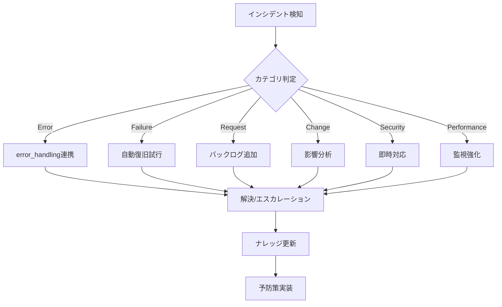

# 📋 インシデントパターン・ナレッジベース

インシデント管理システムの標準パターンと対応手順を定義します。

## 🎯 インシデントカテゴリ定義

### 1. Error（エラー）
- **定義**: システムエラー、例外、プログラム障害
- **例**: ModuleNotFoundError, PermissionError, ConnectionError
- **優先度**: 通常High-Critical
- **対応**: 既存のerror_handling機構と連携

### 2. Failure（障害）
- **定義**: サービス停止、機能不全、システムダウン
- **例**: ワーカー停止、RabbitMQ接続断、DB接続エラー
- **優先度**: Critical-High
- **対応**: 即時対応、自動復旧試行

### 3. Request（要求）
- **定義**: 新機能要求、サービス要求、ユーザー要望
- **例**: 新ワーカー作成、機能追加、設定変更依頼
- **優先度**: Low-Medium
- **対応**: 計画的実装、優先度順

### 4. Change（変更）
- **定義**: 設定変更、構成変更、アップデート
- **例**: config.json更新、ライブラリ更新、環境変更
- **優先度**: Medium
- **対応**: 影響分析後、計画的実施

### 5. Security（セキュリティ）
- **定義**: セキュリティ脆弱性、不正アクセス、権限問題
- **例**: 認証エラー、権限昇格、不正アクセス検知
- **優先度**: Critical
- **対応**: 即時対応、セキュリティチーム連携

### 6. Performance（パフォーマンス）
- **定義**: 処理遅延、メモリリーク、リソース枯渇
- **例**: 処理時間超過、メモリ使用量過大、CPU高負荷
- **優先度**: Medium-High
- **対応**: 監視強化、最適化実施

## 📊 優先度マトリックス

| 優先度 | 応答時間 | 解決時間 | エスカレーション |
|--------|----------|----------|------------------|
| Critical | 即時 | 4時間以内 | 即時通知 |
| High | 30分以内 | 24時間以内 | 1時間後 |
| Medium | 4時間以内 | 3日以内 | 24時間後 |
| Low | 24時間以内 | 1週間以内 | 3日後 |

## 🔄 インシデント対応フロー



## 📝 標準インシデントテンプレート

### インシデント記録フォーマット
```json
{
  "incident_id": "INC-YYYYMMDD-XXXX",
  "timestamp": "2025-01-04T10:00:00Z",
  "category": "error|failure|request|change|security|performance",
  "priority": "critical|high|medium|low",
  "title": "簡潔な問題説明",
  "description": "詳細な問題説明",
  "affected_components": ["component1", "component2"],
  "impact": "影響範囲の説明",
  "status": "open|in_progress|resolved|closed",
  "assignee": "担当者またはworker",
  "resolution": {
    "actions_taken": ["対応アクション1", "対応アクション2"],
    "root_cause": "根本原因",
    "preventive_measures": ["予防策1", "予防策2"],
    "knowledge_updates": ["更新したKBファイル"]
  },
  "timeline": [
    {"timestamp": "2025-01-04T10:00:00Z", "action": "検知"},
    {"timestamp": "2025-01-04T10:05:00Z", "action": "対応開始"}
  ]
}
```

## 🚨 既知のパターン

### INCIDENT_001: ワーカー起動失敗
- **カテゴリ**: Failure
- **症状**: worker.pyが起動しない
- **原因**: PYTHONPATH設定不足、依存関係エラー
- **対応**: 
  1. error_handling/PATTERN_001を参照
  2. 自動修正スクリプト実行
  3. systemd設定確認

### INCIDENT_002: RabbitMQ接続断
- **カテゴリ**: Failure
- **症状**: Connection refused to RabbitMQ
- **原因**: サービス停止、ネットワーク問題
- **対応**:
  1. systemctl status rabbitmq-server
  2. サービス再起動
  3. 接続設定確認

### INCIDENT_003: Slack通知失敗
- **カテゴリ**: Error
- **症状**: Slack notification failed
- **原因**: Webhook無効、ネットワークエラー
- **対応**:
  1. Webhook URL確認
  2. ネットワーク接続確認
  3. フォールバック通知

### INCIDENT_004: 処理時間超過
- **カテゴリ**: Performance
- **症状**: Task timeout exceeded
- **原因**: 大量データ、非効率な処理
- **対応**:
  1. 処理分割
  2. 並列化検討
  3. タイムアウト値調整

### INCIDENT_005: 設定ファイル不整合
- **カテゴリ**: Change
- **症状**: Configuration mismatch
- **原因**: 手動編集、バージョン不整合
- **対応**:
  1. 設定バリデーション
  2. デフォルト値復元
  3. 変更管理プロセス確立

## 🔧 自動対応スクリプト

各パターンに対応する自動修正スクリプトは`incident_management/auto_fix/`に配置されます。

## 📈 メトリクス追跡

- **MTTR (Mean Time To Resolve)**: 平均解決時間
- **MTBF (Mean Time Between Failures)**: 平均故障間隔
- **再発率**: 同一パターンの再発頻度
- **自動解決率**: 人的介入なしの解決割合

## 🔄 継続的改善

1. **週次レビュー**: インシデント傾向分析
2. **月次更新**: パターンDB更新
3. **四半期評価**: プロセス改善
4. **年次監査**: システム全体評価
