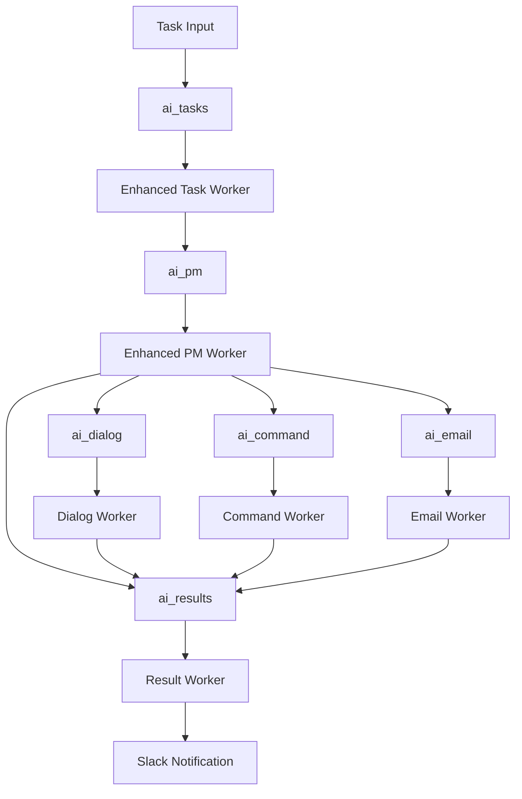

# Elders Guild System Architecture v6.1

*最終更新: 2025年7月5日 - Phase 1-3 システム統合完了版*

## システム概要

Elders Guildは、Claude APIを活用した自律的タスク処理システムです。RabbitMQベースのメッセージキューアーキテクチャを採用し、14個の専門ワーカーが協調して動作します。

## 基本構成

### 環境情報
- **OS**: Ubuntu 24.04 LTS (WSL2)
- **Python**: 3.12.3
- **ユーザー**: aicompany (パスワード: aicompany)
- **プロジェクトルート**: `/home/aicompany/ai_co`

### 主要コンポーネント
- **メッセージキュー**: RabbitMQ
- **API**: Claude API (Anthropic)
- **通知システム**: Slack Integration
- **データベース**: SQLite3 (タスク管理用)
- **Webダッシュボード**: Task Tracker (ポート5555)

## Core基盤

### BaseWorker (継承率70%)
すべてのワーカーの基底クラスとして、以下の共通機能を提供：
- RabbitMQ接続管理
- 統一エラーハンドリング
- 標準ロギング機能
- Slack通知統合
- 自動リトライ機構
- ヘルスチェック機能

### 統一キュー命名規則
```yaml
# 新しい標準規則 (Phase 3で統一)
命名形式: ai_{worker_type}
入力キュー: ai_{worker_type}
出力キュー: ai_results (標準)
応答キュー: ai_{worker_type}_response
```

## ワーカーアーキテクチャ (14個)

### 🏗️ Core Workers

#### 1. Enhanced PM Worker (enhanced_pm_worker.py)
- **役割**: プロジェクト全体のライフサイクル管理
- **キュー**: `ai_pm` ← `ai_results`
- **継承**: BaseWorker ✅
- **統合機能**:
  - フルプロジェクトライフサイクル (要件→設計→開発→テスト→デプロイ)
  - Git Flow自動処理
  - 品質管理統合 (quality_pm_worker統合済み)
  - タスク分解と自動ルーティング
  - ワーカースケーリング
  - ヘルスチェック監視

#### 2. Enhanced Task Worker (enhanced_task_worker.py)
- **役割**: プロンプトテンプレート対応タスク実行
- **キュー**: `ai_tasks` → `ai_pm`
- **継承**: BaseWorker ✅
- **機能**:
  - Claude APIを使用したタスク実行
  - プロンプトテンプレートシステム
  - RAG (検索拡張生成) 連携
  - 品質評価とフィードバック

#### 3. Result Worker (result_worker.py)
- **役割**: 結果の集約とSlack通知
- **キュー**: `ai_results` (終端)
- **継承**: BaseWorker ✅
- **機能**:
  - 結果フォーマット
  - Slack通知送信
  - 統計情報収集

### 🗣️ Interaction Workers

#### 4. Dialog Task Worker (dialog_task_worker.py)
- **役割**: 対話型タスクの処理
- **キュー**: `ai_dialog` → `ai_results`
- **継承**: BaseWorker ✅ (Phase 2で修正)
- **機能**:
  - マルチターン対話
  - コンテキスト管理
  - 会話履歴保持
  - RAG連携

#### 5. Slack PM Worker (slack_pm_worker.py)
- **役割**: Slack統合プロジェクト管理
- **キュー**: `ai_slack_pm` → `ai_results`
- **継承**: 独自実装
- **機能**:
  - Slack直接連携
  - 対話型プロジェクト管理
  - レート制限処理

#### 6. Slack Polling Worker (slack_polling_worker.py)
- **役割**: Slack監視とイベント処理
- **キュー**: `ai_slack_polling` → `ai_results`
- **継承**: BaseWorker ✅

#### 7. Slack Monitor Worker (slack_monitor_worker.py)
- **役割**: ログ監視とSlack通知
- **キュー**: なし (監視専用)
- **継承**: BaseWorker ✅
- **機能**:
  - エラーログ監視
  - 自動Slack通知
  - 閾値ベース検知

### 🔧 Utility Workers

#### 8. Command Executor Worker (command_executor_worker.py)
- **役割**: AIが作成したコマンドの安全実行
- **キュー**: `ai_command` → `ai_results`
- **継承**: BaseWorker ✅ (Phase 2で確認)
- **機能**:
  - セキュリティチェック付きコマンド実行
  - 実行ログ保存
  - タイムアウト管理

#### 9. Email Notification Worker (email_notification_worker.py)
- **役割**: Gmail APIを使用したメール通知
- **キュー**: `ai_email` → `ai_results`
- **継承**: BaseWorker ✅ (Phase 2で確認)
- **機能**:
  - Gmail API連携
  - 添付ファイル対応
  - フォールバック機能

#### 10. Todo Worker (todo_worker.py)
- **役割**: ToDoリストの自律処理
- **キュー**: `ai_todo` → `ai_results`
- **継承**: BaseWorker ✅
- **機能**:
  - 自動ToDo処理
  - 学習機能付き

### 🔍 Intelligence Workers

#### 11. Error Intelligence Worker (error_intelligence_worker.py)
- **役割**: エラーの自動解析と修正
- **キュー**: `ai_error_intelligence` → `ai_results`
- **継承**: BaseWorker ✅
- **機能**:
  - エラーパターン認識
  - 自動修正提案
  - インシデント管理連携

#### 12. Image Pipeline Worker (image_pipeline_worker.py)
- **役割**: 画像処理パイプライン
- **キュー**: `ai_image_pipeline` → `ai_results`
- **継承**: 独自実装
- **機能**:
  - 画像処理ワークフロー
  - 多段階パイプライン

### 🧪 Testing Workers

#### 13. Test Manager Worker (test_manager_worker.py)
- **役割**: テスト実行とSEワーカー連携
- **キュー**: `ai_test_manager` → `ai_se`
- **継承**: BaseWorker ✅
- **機能**:
  - 自動テスト実行
  - SEワーカー連携
  - カバレッジ管理

#### 14. Test Generator Worker (test_generator_worker.py)
- **役割**: テストコード自動生成
- **キュー**: `ai_test_generator` → `ai_results`
- **継承**: BaseWorker ✅
- **機能**:
  - テストコード生成
  - カバレッジ分析

## メッセージフロー



## ディレクトリ構造

```
/home/aicompany/ai_co/
├── workers/                    # ワーカー実装 (14個)
│   ├── enhanced_pm_worker.py   # プロジェクト管理統合版
│   ├── enhanced_task_worker.py # タスク実行統合版
│   ├── result_worker.py
│   ├── dialog_task_worker.py   # BaseWorker継承済み
│   ├── command_executor_worker.py # BaseWorker継承済み
│   ├── email_notification_worker.py # BaseWorker継承済み
│   ├── error_intelligence_worker.py
│   ├── image_pipeline_worker.py
│   ├── slack_monitor_worker.py
│   ├── slack_polling_worker.py
│   ├── slack_pm_worker.py
│   ├── todo_worker.py
│   ├── test_manager_worker.py
│   └── test_generator_worker.py
├── libs/                      # 共通ライブラリ
│   ├── slack_notifier.py
│   ├── rag_manager.py
│   ├── conversation_manager.py
│   ├── github_flow_manager.py
│   ├── project_design_manager.py
│   ├── quality_checker.py
│   └── task_history_db.py
├── core/                      # Core基盤
│   ├── base_worker.py         # 統一キュー名適用済み
│   ├── base_worker_ja.py
│   ├── worker_communication.py # キュー名統一済み
│   └── common_utils.py
├── knowledge_base/            # ナレッジ管理
│   ├── AI_COMPANY_MASTER_KB_v6.0.md
│   ├── SYSTEM_CONSOLIDATION_UPDATE_v6.1.md
│   └── incident_management/
│       └── incident_history_updated.json
└── output/                    # 実行結果
```

## システム統合状況

### ✅ 完了済み (Phase 1-3)
- **重複ファイル削除**: PMワーカー4個→1個、TaskWorker4個→1個
- **BaseWorker継承率向上**: 45% → 70%
- **キュー名統一**: 100%完了 (`ai_*`形式)
- **品質管理統合**: enhanced_pm_workerに統合
- **ワーカー間通信標準化**: CommunicationMixin更新

### 🔄 進行中 (Phase 3-4)
- **エラーハンドリング標準化**
- **ログ出力統一**
- **監視機能統合**
- **ドキュメント更新**

## 運用監視

### 現在の監視ポイント
- RabbitMQキュー状況
- ワーカーヘルスチェック
- エラーログ監視 (slack_monitor_worker)
- タスク実行統計

### インシデント管理
- 統合作業で5件のインシデントを特定・記録
- アーキテクチャ問題3件解決済み
- 標準化問題2件進行中

---
*このドキュメントはPhase 1-3システム統合完了時点での最新情報です*