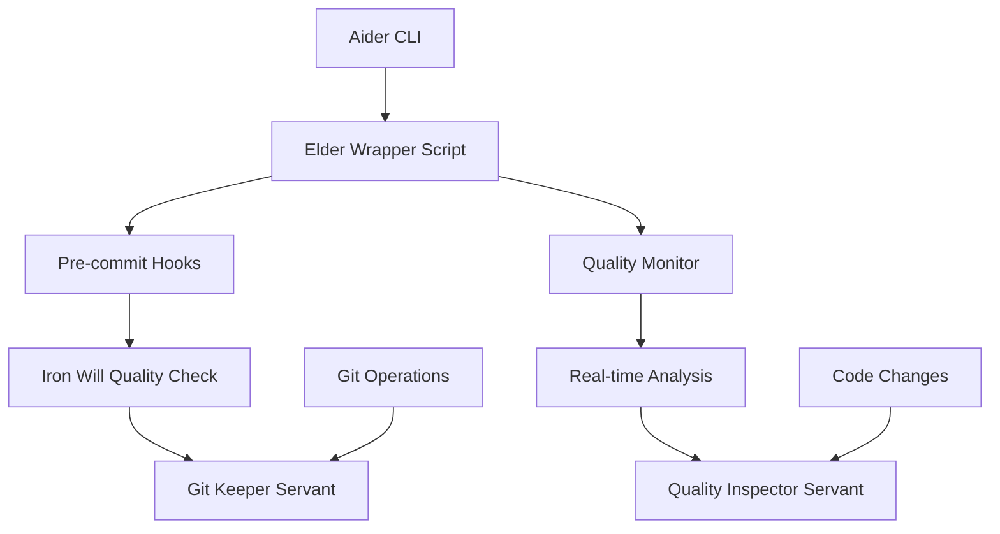

# 🔧 Elder Servants - Aider Integration

## 📋 概要

このディレクトリには、Elder ServantsシステムとAiderを統合するためのインテグレーション実装が含まれています。Aiderのpre-commitフック、品質チェック、Git統合機能を活用して、Elder Servantsの高い品質基準をAiderワークフローに組み込みます。

## 🏗️ アーキテクチャ



## 🚀 セットアップ手順

### 1. Aiderのインストール

```bash
# Aiderのインストール
pip install aider-chat

# 推奨: Claude 3.5 Sonnetを使用
export ANTHROPIC_API_KEY="your-api-key"
```

### 2. Elder Servants統合の有効化

```bash
# Aider wrapper scriptの使用
cd /home/aicompany/ai_co/libs/elder_servants/integrations/aider

# ラッパースクリプトを使用してAiderを実行
./aider_elder_wrapper.sh [aider-arguments]
```

### 3. Git Hooksの自動セットアップ

ラッパースクリプトを使用すると、以下のGit hooksが自動的にセットアップされます：

- **pre-commit**: Iron Will品質チェック（95%基準）
- **post-commit**: Elder統合メタデータの追加

## 🎯 主要機能

### 1. Iron Will品質チェック

Aiderがコードを変更する際、自動的にIron Will品質基準（95%）をチェックします：

```bash
# 品質チェック付きでAiderを実行
./aider_elder_wrapper.sh --elder-quality myfile.py

# 品質チェック結果例
🗡️ Running Iron Will quality checks...
✅ All files pass Iron Will quality check (avg: 96.2%)
```

### 2. 自動コミットメッセージ拡張

Aiderが生成するコミットメッセージにElder Servantsのメタデータを自動追加：

```
feat: add user authentication

Quality Score: 96.2%

🤖 Aider + Elder Servants Integration
Timestamp: 2025-07-19T15:30:00

Co-Authored-By: Claude <noreply@anthropic.com>
```

### 3. リアルタイム品質監視

Aiderの編集中に、リアルタイムで品質スコアを監視：

```
📊 Quality Score: 94% → 97% (after refactoring)
💡 Suggestion: Add more test coverage for edge cases
```

### 4. 改善提案システム

品質チェック結果に基づいて、具体的な改善提案を生成：

```
💡 Elder Improvement Suggestions:
1. Fix undefined-variable: 'logger' is not defined
2. Security: Use secrets module for token generation
3. Increase test coverage (current: 76%)
```

## 🔧 使用方法

### 基本的な使用

```bash
# 通常のAider使用（Elder統合付き）
./aider_elder_wrapper.sh myfile.py

# 高品質モードでの実行
./aider_elder_wrapper.sh --elder-quality myfile.py

# Git hooksをスキップ（テスト時など）
./aider_elder_wrapper.sh --skip-hooks myfile.py
```

### 品質重視の開発フロー

```bash
# 1. Elder統合でファイルを編集
./aider_elder_wrapper.sh --elder-quality auth.py

# 2. Aiderに指示（品質プロンプト自動追加）
# "Add user authentication with proper error handling and tests"

# 3. Elder品質チェック自動実行
# - Iron Will基準でチェック
# - 改善提案を生成
# - 品質スコア計算

# 4. 自動コミット（品質基準を満たす場合）
# - Elder署名付きコミットメッセージ
# - 品質メトリクス含む
```

### プログラマティックな使用

```python
from libs.elder_servants.integrations.aider.aider_elder_integration import AiderElderIntegration

# 統合インスタンス作成
integration = AiderElderIntegration()

# pre-commitチェック
should_commit, message = await integration.pre_commit_hook(['myfile.py'])

# コミットメッセージ拡張
enhanced_message = await integration.enhance_commit_message(
    "feat: add feature",
    ['myfile.py'],
    diff_content
)

# 変更後分析
analysis = await integration.post_edit_analysis(
    'myfile.py',
    original_content,
    new_content
)
```

## 📊 品質メトリクス

### Iron Will基準

以下の基準を95%以上で満たす必要があります：

1. **コード品質**: Pylint/ESLintスコア
2. **セキュリティ**: Banditスキャン
3. **テストカバレッジ**: 80%以上
4. **型チェック**: MyPy検証
5. **ドキュメント**: Docstring完備
6. **パフォーマンス**: 基本的な最適化

### 品質スコア計算

```python
overall_score = (
    code_quality_score * 0.3 +
    security_score * 0.2 +
    test_coverage * 0.2 +
    type_check_score * 0.15 +
    documentation_score * 0.1 +
    performance_score * 0.05
)
```

## 🔍 トラブルシューティング

### Aiderが見つからない

```bash
# Aiderのインストール確認
which aider

# 再インストール
pip install --upgrade aider-chat
```

### 品質チェックが失敗する

```bash
# 詳細な品質レポートを取得
python -c "
import asyncio
from libs.elder_servants.integrations.aider.aider_elder_integration import AiderElderIntegration

async def check():
    integration = AiderElderIntegration()
    should_commit, message = await integration.pre_commit_hook(['myfile.py'])
    print('Detailed report:', message)

asyncio.run(check())
"
```

### Git hooksが動作しない

```bash
# hooks権限確認
ls -la .git/hooks/pre-commit

# 権限修正
chmod +x .git/hooks/pre-commit

# 手動でhook実行
.git/hooks/pre-commit
```

## 🧪 テスト実行

```bash
# 統合テストの実行
python test_aider_integration.py

# 期待される出力:
# 🚀 Starting Aider + Elder Servants Integration Tests
# [各テストの実行結果]
# 🎯 Total: 7/7 tests passed
```

## 📚 設定ファイル

### カスタム品質基準

```python
# custom_quality_config.py
CUSTOM_IRON_WILL_THRESHOLD = 90  # デフォルト: 95
CUSTOM_TEST_COVERAGE_MIN = 70    # デフォルト: 80

# 使用方法
export ELDER_QUALITY_CONFIG=custom_quality_config.py
./aider_elder_wrapper.sh myfile.py
```

### Aider設定の推奨事項

```bash
# ~/.aider.conf.yml
edit-format: diff
auto-commits: true
commit-prompt: false  # Elder統合メッセージを使用
model: claude-3-5-sonnet-20241022
```

## 🚀 今後の拡張予定

1. **リアルタイム品質ダッシュボード**
   - Web UIでの品質監視
   - メトリクスの可視化

2. **AI駆動の改善提案**
   - より具体的な修正案
   - 自動リファクタリング提案

3. **チーム統合機能**
   - 複数開発者での品質統計
   - チーム品質レポート

4. **IDE統合**
   - VS Code拡張
   - リアルタイム品質表示

---
**エルダーズギルド開発実行責任者**  
**クロードエルダー（Claude Elder）**  
**「Think it, Rule it, Own it」**