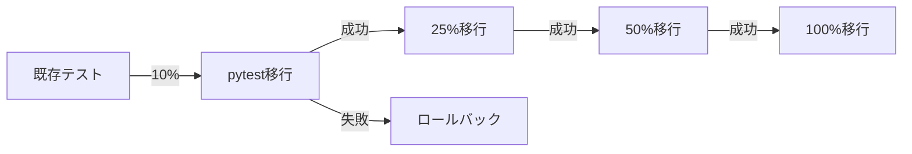

# 🔄 OSS移行プロジェクト ロールバック計画書
**Issue #93: OSS移行実装プロジェクト**
**作成日**: 2025年7月19日
**文書ID**: ROLLBACK-OSS-2025-001

## 📋 目次
1. [概要](#概要)
2. [ロールバックトリガー](#ロールバックトリガー)
3. [段階的移行戦略](#段階的移行戦略)
4. [ロールバック手順](#ロールバック手順)
5. [緊急対応プロトコル](#緊急対応プロトコル)

---

## 📖 概要

このドキュメントは、OSS移行プロジェクトにおける安全なロールバック手順を定義します。段階的移行アプローチにより、リスクを最小限に抑えながら、必要に応じて迅速に以前の状態に戻すことができます。

### 基本原則
- **段階的移行**: 一度にすべてを変更せず、小さな単位で移行
- **並行運用**: 新旧システムの並行稼働期間を設ける
- **即座復旧**: 15分以内に前の状態に戻せる設計
- **データ保全**: ロールバック時のデータ整合性を保証

---

## 🚨 ロールバックトリガー

### レベル1: 軽微な問題（監視継続）
- テストカバレッジが5%以上低下
- パフォーマンスが10%未満の劣化
- 非クリティカルな機能の軽微なバグ

### レベル2: 中程度の問題（部分ロールバック検討）
- テストカバレッジが10%以上低下
- パフォーマンスが20%以上劣化
- 重要機能に影響する複数のバグ
- CI/CDパイプラインの部分的な故障

### レベル3: 重大な問題（即座ロールバック）
- 本番環境でのクリティカルエラー
- データ整合性の問題
- セキュリティ脆弱性の発見
- システム全体の30%以上のテスト失敗

---

## 🎯 段階的移行戦略

### Phase 1: pytest移行（Week 3-4）


#### 移行ステップ
1. **Canary Deployment (10%)**
   - 新規テストのみpytestで作成
   - 既存テストは維持
   - 1週間の評価期間

2. **段階的拡大 (25% → 50% → 100%)**
   - ユニットテスト → 統合テスト → E2Eテストの順
   - 各段階で3日間の評価期間
   - メトリクス監視継続

### Phase 2: Celery/Ray移行（Week 5-6）
1. **読み取り専用タスクから開始**
2. **非同期処理の段階的移行**
3. **クリティカルパスは最後に移行**

### Phase 3: SonarQube導入（Week 7）
1. **情報収集モードで開始**
2. **品質ゲートは警告のみ**
3. **段階的に強制力を強化**

---

## 🔧 ロールバック手順

### 1. pytest → 既存テストフレームワーク

#### 即座対応（5分以内）
```bash
# 1. CI/CD設定を元に戻す
git checkout main -- .github/workflows/tests.yml

# 2. pytest設定を無効化
mv pytest-oss.ini pytest-oss.ini.disabled

# 3. 環境変数の切り替え
export USE_LEGACY_TESTS=true

# 4. 既存テストの実行確認
python -m pytest tests/legacy/
```

#### 完全ロールバック（15分以内）
```bash
# 1. Feature Branchの作業を退避
git stash
git checkout main

# 2. 依存関係を元に戻す
pip install -r requirements.txt
pip uninstall -y pytest pytest-asyncio pytest-cov pytest-xdist

# 3. テスト実行
python libs/integration_test_framework.py

# 4. 確認
./scripts/run_all_tests.sh
```

### 2. Celery/Ray → 既存ワーカーシステム

```bash
# 1. ワーカー設定の切り替え
export WORKER_MODE=legacy

# 2. Celery/Rayワーカーの停止
celery -A tasks control shutdown
ray stop

# 3. 既存ワーカーの起動
supervisorctl start all

# 4. ヘルスチェック
curl http://localhost:8080/health
```

### 3. SonarQube → 既存品質チェック

```bash
# 1. CI/CD設定から除外
# .github/workflows/oss-tests.yml から sonarqube ジョブをコメントアウト

# 2. 既存の品質チェックスクリプト実行
./scripts/quality_check.sh
```

---

## 🚑 緊急対応プロトコル

### インシデント発生時の対応フロー

1. **検知** (0-5分)
   - アラート受信
   - 影響範囲の特定
   - インシデントレベル判定

2. **初期対応** (5-10分)
   - インシデント賢者への報告
   - ステークホルダーへの通知
   - ロールバック判断

3. **ロールバック実行** (10-15分)
   - 上記手順に従い実行
   - 動作確認
   - モニタリング強化

4. **事後対応** (15分以降)
   - 根本原因分析
   - 再発防止策の策定
   - ドキュメント更新

### 連絡体制
```
インシデント発生
    ↓
クロードエルダー
    ↓
4賢者会議招集
    ↓
グランドエルダーmaru（重大インシデントのみ）
```

---

## 📊 ロールバック判断基準

### 自動ロールバックトリガー
```yaml
triggers:
  - name: "テスト成功率低下"
    condition: "success_rate < 70%"
    action: "automatic_rollback"

  - name: "パフォーマンス劣化"
    condition: "response_time > baseline * 1.5"
    action: "alert_and_manual_review"

  - name: "エラー率上昇"
    condition: "error_rate > 5%"
    action: "automatic_rollback"
```

### 手動ロールバック判断
- ビジネス影響の評価
- 技術的リスクの評価
- 修正時間 vs ロールバック時間の比較

---

## 🔍 ロールバック後の対応

### 1. 影響分析
- ロールバックの原因特定
- 影響を受けたコンポーネントの洗い出し
- データ整合性の確認

### 2. 改善計画
- 問題の根本原因解決
- テストケースの追加
- 移行計画の見直し

### 3. 再移行準備
- 修正版の開発
- 追加テストの実施
- ステークホルダーとの調整

---

## 📝 チェックリスト

### ロールバック前
- [ ] インシデントレベルの確認
- [ ] 影響範囲の特定
- [ ] バックアップの確認
- [ ] ステークホルダーへの通知

### ロールバック中
- [ ] 手順書に従った実行
- [ ] 各ステップでの動作確認
- [ ] ログの記録
- [ ] モニタリング継続

### ロールバック後
- [ ] システム正常性の確認
- [ ] パフォーマンス測定
- [ ] インシデントレポート作成
- [ ] 改善計画の策定

---

## 🔗 関連ドキュメント

- [OSS_MIGRATION_PROGRESS.md](./OSS_MIGRATION_PROGRESS.md)
- [OSS_MIGRATION_TRAINING_GUIDE.md](./OSS_MIGRATION_TRAINING_GUIDE.md)
- [INCIDENT_RESPONSE_GUIDE.md](../knowledge_base/incident_management/INCIDENT_RESPONSE_GUIDE.md)

---

**作成者**: クロードエルダー（Claude Elder）
**レビュー者**: インシデント賢者
**承認者**: グランドエルダーmaru
**次回レビュー**: 2025年8月1日
