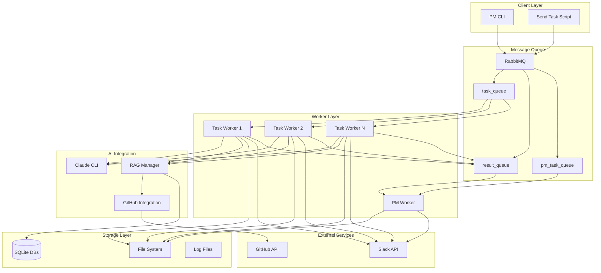

# AI Company システム 技術ドキュメント

## 📋 目次
1. [システム概要](#システム概要)
2. [アーキテクチャ](#アーキテクチャ)
3. [主要コンポーネント](#主要コンポーネント)
4. [API仕様](#api仕様)
5. [データフロー](#データフロー)
6. [設定](#設定)
7. [運用](#運用)

---

## システム概要

AI CompanyはClaude AIを活用した分散タスク処理システムです。RabbitMQを使用したメッセージキューイングシステムを基盤とし、自己進化機能、RAG（Retrieval-Augmented Generation）、GitHub統合、Slack通知などの高度な機能を提供します。

### 主要機能
- **分散タスク処理**: 複数のワーカーによる並列処理
- **自己進化**: AIが生成したコードの自動配置・統合
- **RAG統合**: 過去の履歴を活用した文脈的応答生成
- **GitHub統合**: リポジトリ情報を活用したコード生成
- **Slack通知**: リアルタイムでの作業状況通知
- **動的スケーリング**: 負荷に応じたワーカー数の自動調整
- **ヘルスモニタリング**: システム状態の監視と自動復旧

---

## アーキテクチャ



### アーキテクチャの特徴

1. **分散メッセージングアーキテクチャ**
   - RabbitMQによる非同期メッセージ処理
   - 複数のキューによる処理の分離

2. **マイクロサービス型ワーカー**
   - 独立したワーカープロセス
   - 水平スケーリング対応

3. **AI統合レイヤー**
   - Claude CLIとの統合
   - RAGによる文脈的応答生成

4. **自己進化システム**
   - AIが生成したコードの自動配置
   - 機械学習による最適化

---

## 主要コンポーネント

### 1. ワーカーシステム

#### Task Worker (`workers/task_worker.py`)
**役割**: メインのタスク処理を担当
- Claude CLIを実行してタスクを処理
- RAGを活用した文脈的応答生成
- 自己進化機能による生成コードの自動配置
- Slack通知の送信

**主要メソッド**:
```python
def process_task(self, ch, method, properties, body)
def handle_evolution(self, claude_output, task_id, original_prompt)
def extract_code_blocks(self, text)
def is_significant_code(self, content)
```

#### PM Worker (`workers/pm_worker.py`)
**役割**: プロジェクト管理とシステム監視
- Git自動コミット・プッシュ
- ワーカーの動的スケーリング
- ヘルスモニタリング
- システム状態の監視

**主要機能**:
- 新規ファイル検出・Git処理
- スケーリング監視
- ヘルスチェック
- 自動復旧

### 2. AIシステム統合

#### Self Evolution Manager (`libs/self_evolution_manager.py`)
**役割**: AI生成コードの自動配置・統合
- 複数のアルゴリズムによる配置先決定
- 機械学習による最適化
- 配置履歴の学習・分析

**主要機能**:
- **ルールベース配置**: ファイル名・内容パターンマッチング
- **類似度分析**: 既存ファイルとの類似度計算
- **機械学習予測**: 履歴データによる予測
- **統計的分析**: パターン頻度分析
- **依存関係分析**: インポート文による配置決定
- **意味的類似度**: セマンティッククラスタリング

#### RAG Manager (`libs/rag_manager.py`)
**役割**: 文脈的応答生成のための履歴管理
- タスク履歴の保存・検索
- 要約生成
- 関連情報の抽出

#### GitHub Aware RAG (`libs/github_aware_rag.py`)
**役割**: GitHubリポジトリ情報を活用したRAG
- リポジトリ情報の取得
- 関連ファイルの推測
- コミット履歴の活用

### 3. 外部サービス統合

#### Slack Notifier (`libs/slack_notifier.py`)
**役割**: Slackへの通知送信
- タスク完了通知
- システム状態通知
- エラー通知

#### GitHub Integration (`libs/github_integration.py`)
**役割**: GitHubリポジトリとの統合
- リポジトリ情報取得
- コード検索
- コミット履歴取得

### 4. 監視・制御システム

#### Worker Monitor (`libs/worker_monitor.py`)
**役割**: ワーカーの監視
- アクティブワーカー数監視
- キュー長監視
- パフォーマンスメトリクス収集

#### Worker Controller (`libs/worker_controller.py`)
**役割**: ワーカーの制御
- ワーカー起動・停止
- スケーリング実行

#### Scaling Policy (`libs/scaling_policy.py`)
**役割**: スケーリング判定
- 負荷ベーススケーリング
- スケーリング履歴管理

#### Health Checker (`libs/health_checker.py`)
**役割**: ヘルスチェック
- ワーカー健康状態監視
- 自動復旧判定

---

## API仕様

### タスク送信API

#### 基本タスク送信
```python
# scripts/send_task.py
def send_task(prompt: str, task_type: str = "general") -> None
```

**パラメータ**:
- `prompt`: 実行するタスクの内容
- `task_type`: タスクの種類（`general`, `code`等）

**使用例**:
```bash
python scripts/send_task.py "Pythonでフィボナッチ数列を生成して" code
```

#### PM専用コマンド
```python
# PM Worker専用のコマンド
{
    "task_id": "pm_task_id",
    "command": "git_commit",
    "params": {
        "files": ["path/to/file1.py", "path/to/file2.py"]
    }
}
```

### メッセージキュー仕様

#### タスクキュー (`task_queue`)
```json
{
    "task_id": "task_20250701_123456",
    "type": "code",
    "prompt": "タスク内容",
    "created_at": "2025-07-01T12:34:56"
}
```

#### 結果キュー (`result_queue`)
```json
{
    "task_id": "task_20250701_123456",
    "worker": "worker-1",
    "status": "completed",
    "output_file": "/path/to/result.txt",
    "evolution_result": {
        "success": true,
        "evolved_files": [...]
    },
    "timestamp": "2025-07-01T12:35:30"
}
```

### 自己進化API

#### 配置プレビュー
```python
def get_placement_preview(self, content: str, filename: str = None) -> Dict
```

#### 自動配置実行
```python
def auto_place_file(self, source_content: str, suggested_filename: str = None, task_id: str = None) -> Dict
```

**戻り値**:
```json
{
    "success": true,
    "file_path": "/absolute/path/to/file.py",
    "relative_path": "relative/path/to/file.py",
    "target_dir": "libs/",
    "filename": "new_manager.py",
    "placement_confidence": 0.85,
    "alternatives": [
        {"dir": "workers/", "score": 0.75},
        {"dir": "scripts/", "score": 0.65}
    ]
}
```

---

## データフロー

### 1. 標準タスク処理フロー

```
[Client] → [RabbitMQ] → [Task Worker] → [Claude CLI] → [RAG] → [Self Evolution] → [File System] → [Slack] → [Result Queue] → [PM Worker] → [Git]
```

1. **タスク送信**: クライアントがタスクをキューに送信
2. **ワーカー処理**: Task Workerがタスクを受信
3. **RAG処理**: 過去履歴を含めたプロンプト生成
4. **AI処理**: Claude CLIでタスク実行
5. **自己進化**: 生成されたコードの自動配置
6. **通知**: Slackに結果通知
7. **Git処理**: PM Workerが自動コミット・プッシュ

### 2. 自己進化フロー

```
[Generated Code] → [Code Block Extraction] → [Significance Check] → [Filename Suggestion] → [Placement Analysis] → [Auto Placement] → [Learning Update]
```

1. **コード抽出**: Claude出力からコードブロックを抽出
2. **有意性判定**: 配置対象となる有意なコードかチェック
3. **ファイル名推測**: 内容とプロンプトからファイル名を推測
4. **配置分析**: 複数手法で最適な配置先を決定
5. **自動配置**: ファイルを適切な場所に配置
6. **学習更新**: 配置結果を学習データベースに記録

### 3. スケーリングフロー

```
[Metrics Collection] → [Scaling Policy] → [Worker Controller] → [Process Management] → [Notification]
```

1. **メトリクス収集**: ワーカー数・キュー長の監視
2. **スケーリング判定**: ポリシーに基づく判定
3. **ワーカー制御**: 必要に応じてワーカー起動・停止
4. **通知**: スケーリング結果をSlackに通知

---

## 設定

### システム設定 (`config/system.conf`)
```bash
PROJECT_NAME=ai_co
PROJECT_DIR=/root/ai_co
VENV_DIR=/root/ai_co/venv
OUTPUT_DIR=/root/ai_co/output
LOG_DIR=/root/ai_co/logs
CLAUDE_MODEL=claude-sonnet-4-20250514

# RabbitMQ設定
RABBITMQ_HOST=localhost
RABBITMQ_PORT=5672
RABBITMQ_USER=ai_admin
RABBITMQ_PASS=ai_password

# tmux設定
TMUX_SESSION=ai_company
```

### データベース設定 (`config/database.conf`)
- SQLite データベースの設定
- タスク履歴、配置学習データの管理

### GitHub設定 (`config/github.conf`)
- GitHub API認証情報
- リポジトリ設定

### Slack設定 (`config/slack.conf`)
- Slack Bot Token
- 通知チャンネル設定

---

## 運用

### システム起動
```bash
# 全システム起動
./scripts/start_company.sh

# 個別コンポーネント起動
python workers/task_worker.py worker-1
python workers/pm_worker.py
```

### システム状態確認
```bash
# 全体状況確認
./scripts/status.sh

# ワーカー状況確認
python scripts/scaling_status.py

# ヘルスチェック
python scripts/check_all_systems.py
```

### タスク送信
```bash
# 一般タスク
python scripts/send_task.py "タスク内容" general

# コードタスク
python scripts/send_task.py "Python関数を作成して" code
```

### ログ監視
```bash
# 各ワーカーのログ
tail -f logs/task_worker.log
tail -f logs/pm_worker.log
tail -f logs/result_worker.log
```

### 自己進化状況確認
```python
from libs.self_evolution_manager import SelfEvolutionManager
manager = SelfEvolutionManager()
analytics = manager.get_placement_analytics()
print(analytics)
```

### トラブルシューティング

#### よくある問題と解決方法

1. **RabbitMQ接続エラー**
   - RabbitMQサービスの起動状態確認
   - 認証情報の確認

2. **Claude CLI実行エラー**
   - Claude CLIのインストール確認
   - APIキーの設定確認

3. **自己進化配置失敗**
   - ファイル権限の確認
   - ディスク容量の確認

4. **Slack通知失敗**
   - Bot Tokenの確認
   - チャンネル権限の確認

---

## まとめ

AI Companyシステムは、Claude AIを中核とした高度な分散処理システムです。自己進化機能により継続的な改善を行い、RAGによる文脈的応答、GitHub統合による開発効率向上、動的スケーリングによる可用性確保を実現しています。

システムの拡張性と保守性を重視した設計により、新機能の追加や既存機能の改善が容易に行えます。